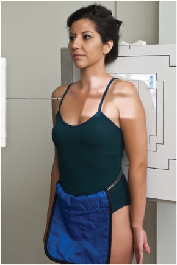
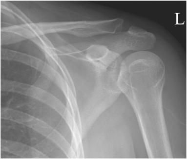
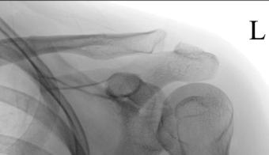
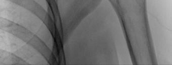

# Rx INTERNAL ROTATION AP (Antero-Posterior) (Umăr (NONtraumatism acut) - LATERAL PROXIMAL Humerus)

  📷 Radiografie Convențională (Rx)
  <strong>Actualizat:</strong> 2026-09-15
  <strong>Autor:</strong> Departamentul de Radiologie / Referință Bontrager

---

-   __1. Rezumat Clinic & Indicații__

    ---

    === "Indicații Clinice"

        - suspiciune de fractură sau luxație / subluxație articulară de proximal Humerus și Umăr girdle
        - Calcium deposits în muscles, tendons, sau bursal structures
        - Degenerative conditions, including osteoporosis și artroză / modificări degenerative articulare

    === "Ghid Național IRIS"

        !!! info "Referință Primară: Ghidul Național IRIS (Ordinul MS 1342/2012)"
            - **Capitol Ghid IRIS:** *Ghidul Național IRIS*
            - **Grad de Recomandare:** **De verificat pe indicație; fără grad atribuit automat**
            - **Nivel de Iradiere Estimată:** `De verificat pentru examinarea și populația selectate`

            [:octicons-search-16: Deschide Ghidul IRIS](../../iris.md){ .md-button .md-button--primary } [:material-open-in-new: Aplicația Oficială PWA](https://radiologie-pediatrica.ro/iris/){ .md-button target="_blank" rel="noopener" }
-   __2. Poziționare & Centrare Fascicul__

    ---

    - **Poziție Pacient:** Pacient: Perform radiografie cu pacient în Ortostatism sau Decubit dorsal poziție. (Ortostatism poziție este usually less painful pentru pacient, if condition allows.) Rotate corp slightly spre affected side, if necessary, la place Umăr în contact cu receptorul de imagine sau tabletop (Fig. 5.43).; Regiune anatomică: poziție pacient la center scapulohumeral articulație la center de receptorul de imagine. Abduct extins braț slightly; internally rotate braț (pronate Mână) until epicondyles de distal Humerus sunt perpendicular pe receptorul de imagine.
    - **Punct de Centrare Fascicul:** perpendicular pe receptorul de imagine, orientat la 1 inch (2.5 cm) inferior la proces coracoid (see NOTE pe p. 189)
    - **Distanță Focar-Film (DFF / SID):** 100 cm
    - **Comandă Respiratorie:** Apnee pe durata expunerii. Umăr (Nontraumatism acut) ROUTINE AP extern rotație (AP) AP intern rotație (lateral) Fig. 5.43 intern rotație—lateral.

-   __3. Parametri Tehnici Expunere__

    ---

    | Parametru Tehnic | Valoare Configurare Generator / Tub |
    |:-----------------|:-------------------------------------|
    | **Tensiune Tub (kV)** | 70-85 kV |
    | **Sarcină / Produs Curent-Timp (mAs)** | DE CONFIGURAT PE APARAT |
    | **Distanță Focar-Film (DFF / SID)** | 100 cm |
    | **Grilă Antidifuzoare (Bucky)** | Cu grilă antidifuzoare Bucky |
    | **Dimensiune Focar** | Focar Mic (0.6 mm) |
    | **Camere de Ionizare AEC** | Camerele laterale (sau camera centrală funcție de regiune) |
    | **Colimare Fascicul** | Field Size Collimate pe four sides, cu lateral și upper margini ajustat la părți moi margins. |
    | **Filtrare Tub** | Totală ≥ 2.5 mm Al echivalent |

-   __4. Criterii de Calitate & Reușită Imagine__

    ---

    - lateral incidență de proximal Humerus și lateral twothirds de Claviculă și upper Omoplat (Scapulă) sunt vizualizat, including relationship de cap humeral la cavitate glenoidă (Figs. 5.44 și 5.45). poziție:
    - Full intern rotație poziție este evidenced prin mică tuberozitate humerală (trohin) visualized în full profile pe medial aspect de cap humeral.
    - outline de mare tuberozitate humerală (trohiter) trebuie să fie visualized superimposed over cap humeral.
    - Collimation field size la aria de interes diagnostic. expunere:
    - optim receptorul de imagine expunere și contrast cu fără mișcare evidențiază clear, Contururi osoase și travee trabeculare nete, fără artefacte de mișcare cu părți moi detail vizibil pentru possible calcium deposits. Fig. 5.44 intern rotație—lateral. (Courtesy Joss Wertz, DO.) acromion proximal Humerus proces coracoid mare tuberozitate humerală (trohiter) Scapulohumeral articulație mică tuberozitate humerală (trohin) Fig. 5.45 intern rotație—lateral. (Courtesy Joss Wertz, DO.)

-   __5. Protecție Radiologică (ALARA)__

    ---

    - Ecranare gonadică și a organelor radiosensibile conform procedurilor locale de radioprotecție ALARA.
    - Colimare strictă la aria de interes pentru limitarea radiației difuze.
    - Verificarea posibilității unei sarcini la pacientele de vârstă fertilă înainte de expunere.

### 🖼️ Imagini

<figure class="protocol-image-card" markdown>

<figcaption><strong>Fig. 5.43 intern rotație—lateral.</strong> — Poziționare pacient conform Ghidului Bontrager (Fig. 5.43 intern rotație—lateral.)</figcaption>

</figure>

<figure class="protocol-image-card" markdown>

<figcaption><strong>Fig. 5.44 intern rotație—lateral. (Courtesy Joss Wertz, DO.)</strong> — Aspect radiografic de referință conform Ghidului Bontrager (Fig. 5.44 intern rotație—lateral. (Courtesy Joss Wertz, DO.))</figcaption>

</figure>

<figure class="protocol-image-card" markdown>

<figcaption><strong>Fig. 5.45 intern rotație—lateral. (Courtesy Joss Wertz, DO.)</strong> — Aspect radiografic de referință conform Ghidului Bontrager (Fig. 5.45 intern rotație—lateral. (Courtesy Joss Wertz, DO.))</figcaption>

</figure>

<figure class="protocol-image-card" markdown>

<figcaption><strong>Figura 4</strong> — Aspect radiografic de referință conform Ghidului Bontrager (Figura 4)</figcaption>

</figure>

=== "Ghid Rapid de Execuție"

    1. **Identificarea și verificarea pacientului:** verificare identitate, zonă de examinat, consimțământ conform procedurii și evaluarea posibilității unei sarcini, când este relevantă.
    2. **Pregătire:** îndepărtarea oricăror obiecte radiopace (bijuterii, agrafe, fermoare, proteze, pansamente dense).
    3. **Poziționare precisă:** alinierea receptorului de imagine și a tubului la distanța prescrisă (100 cm).
    4. **Colimare strictă:** adaptarea fasciculului strict la regiunea de diagnostic pentru scăderea iradierii și reducerea radiației difuze.
    5. **Radioprotecție:** verificarea [politicii RX](../radioprotectie.md), cu măsuri distincte pentru pacient, personal și însoțitor.

## Surse de documentare

- [Bontrager's Textbook of Radiographic Positioning (Ed. 9/10), Pagina 204](https://www.elsevier.com/books/textbook-of-radiographic-positioning-and-related-anatomy/lampignano/978-0-323-65367-1)
