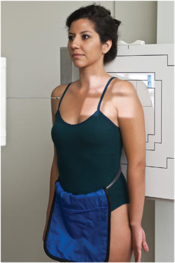
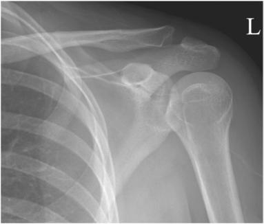
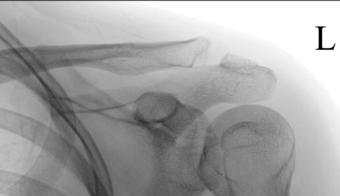
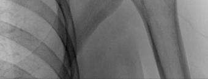

# Rx rotație internă AP (anteroposterioară) (Umăr (nontraumatism acut) - humerus proximal lateral)

  📷 Radiografie Convențională (Rx)
  <strong>Actualizat:</strong> 2026-09-15
  <strong>Autor:</strong> Departamentul de Radiologie / Referință Bontrager

---

-   __1. Rezumat Clinic & Indicații__

    ---

    === "Indicații Clinice"

        - Suspiciune de fractură sau luxație/subluxație articulară a humerusului proximal și a centurii scapulare
        - Depozite de calciu în mușchi, tendoane sau structuri bursale
        - Afecțiuni degenerative, inclusiv osteoporoză și artroză/modificări degenerative articulare

    === "Ghid Național IRIS"

        !!! info "Referință Primară: Ghidul Național IRIS (Ordinul MS 1342/2012)"
            - **Capitol Ghid IRIS:** *Aparat locomotor & Membru superior*
            - **Grad de Recomandare:** **Grad A**
            - **Nivel de Iradiere Estimată:** `Clasa 1 (Minimă < 0.05 mSv)`

            [:octicons-search-16: Deschide Ghidul IRIS](../../iris.md){ .md-button .md-button--primary } [:material-open-in-new: Aplicația Oficială PWA](https://radiologie-pediatrica.ro/iris/){ .md-button target="_blank" rel="noopener" }

-   __2. Poziționare & Centrare Fascicul__

    ---

    - **Poziție Pacient:** Pacient: Se efectuează radiografia cu pacientul în ortostatism sau în decubit dorsal. (Poziția în ortostatism este de obicei mai puțin dureroasă pentru pacient, dacă starea permite.) Se rotește ușor corpul spre partea afectată, dacă este necesar, pentru a plasa umărul în contact cu receptorul de imagine sau cu masa radiologică (Fig. 5.43).; Regiune anatomică: Se poziționează pacientul astfel încât articulația scapulohumerală să fie centrată la centrul receptorului de imagine. Se abduce ușor brațul extins; se rotește intern brațul (se pronează mâna) până când epicondilii humerusului distal sunt perpendiculari pe receptorul de imagine.
    - **Punct de Centrare Fascicul:** Perpendiculară pe receptorul de imagine, orientată la 1 țol (2.5 cm) inferior față de procesul coracoid (vezi NOTA de la p. 189)
    - **Distanță Focar-Film (DFF / SID):** 100 cm
    - **Comandă Respiratorie:** Apnee pe durata expunerii. Umăr (nontraumatism acut) AP DE RUTINĂ rotație externă (AP) AP rotație internă (laterală) Fig. 5.43 rotație internă—laterală.

-   __3. Parametri Tehnici Expunere__

    ---

    | Parametru Tehnic | Valoare Configurare Generator / Tub |
    |:-----------------|:-------------------------------------|
    | **Tensiune Tub (kV)** | 70-85 kV |
    | **Sarcină / Produs Curent-Timp (mAs)** | DE CONFIGURAT PE APARAT |
    | **Distanță Focar-Film (DFF / SID)** | 100 cm |
    | **Grilă Antidifuzoare (Bucky)** | Cu grilă antidifuzoare Bucky |
    | **Dimensiune Focar** | Focar Mic (0.6 mm) |
    | **Camere de Ionizare AEC** | Camerele laterale (sau camera centrală, în funcție de regiune) |
    | **Colimare Fascicul** | Dimensiunea câmpului. Se colimează pe patru laturi, cu marginile laterală și superioară ajustate la marginile părților moi. |
    | **Filtrare Tub** | Totală ≥ 2.5 mm Al echivalent |

-   __4. Criterii de Calitate & Reușită Imagine__

    ---

    - Sunt vizualizate incidența de profil a humerusului proximal și cele două treimi laterale ale claviculei și omoplatului (scapulei), inclusiv relația capului humeral cu cavitatea glenoidă (Figs. 5.44 și 5.45). Poziție:
    - Poziția de rotație internă completă este evidențiată prin vizualizarea în profil complet a tuberozității mici a humerusului (trohinului) pe aspectul medial al capului humeral.
    - Conturul tuberozității mari a humerusului (trohiterului) trebuie să fie vizualizat suprapus peste capul humeral.
    - Dimensiunea câmpului de colimare până la aria de interes diagnostic. Expunere:
    - Expunerea optimă a receptorului de imagine și contrastul adecvat, fără mișcare, evidențiază contururi osoase clare și travee trabeculare nete, fără artefacte de mișcare, cu detalii vizibile ale părților moi pentru posibile depozite de calciu. Fig. 5.44 rotație internă—profil. (Cu amabilitatea lui Joss Wertz, DO.) Acromion proces coracoid humerus proximal tuberozitate mare a humerusului (trohiter) articulație scapulohumerală tuberozitate mică a humerusului (trohin) Fig. 5.45 rotație internă—profil. (Cu amabilitatea lui Joss Wertz, DO.)

-   __5. Protecție Radiologică (ALARA)__

    ---

    - Ecranare gonadică și a organelor radiosensibile conform procedurilor locale de radioprotecție ALARA.
    - Colimare strictă la aria de interes pentru limitarea radiației difuze.
    - Verificarea posibilității unei sarcini la pacientele de vârstă fertilă înainte de expunere.

### 🖼️ Imagini

<figure class="protocol-image-card" markdown>

<figcaption><strong>Fig. 5.43 rotație internă—profil.</strong> — Poziționarea pacientului conform Ghidului Bontrager (Fig. 5.43 rotație internă—profil.)</figcaption>

</figure>

<figure class="protocol-image-card" markdown>

<figcaption><strong>Fig. 5.44 rotație internă—profil. (Cu amabilitatea lui Joss Wertz, DO.)</strong> — Aspect radiografic de referință conform Ghidului Bontrager (Fig. 5.44 rotație internă—profil. (Cu amabilitatea lui Joss Wertz, DO.))</figcaption>

</figure>

<figure class="protocol-image-card" markdown>

<figcaption><strong>Fig. 5.45 rotație internă—profil. (Cu amabilitatea lui Joss Wertz, DO.)</strong> — Aspect radiografic de referință conform Ghidului Bontrager (Fig. 5.45 rotație internă—profil. (Cu amabilitatea lui Joss Wertz, DO.))</figcaption>

</figure>

<figure class="protocol-image-card" markdown>

<figcaption><strong>Figura 4</strong> — Aspect radiografic de referință conform Ghidului Bontrager (Figura 4)</figcaption>

</figure>

=== "Ghid Rapid de Execuție"

    1. **Identificarea și verificarea pacientului:** verificare identitate, zonă de examinat, consimțământ conform procedurii și evaluarea posibilității unei sarcini, când este relevantă.
    2. **Pregătire:** îndepărtarea oricăror obiecte radiopace (bijuterii, agrafe, fermoare, proteze, pansamente dense).
    3. **Poziționare precisă:** alinierea receptorului de imagine și a tubului la distanța prescrisă (100 cm).
    4. **Colimare strictă:** adaptarea fasciculului strict la regiunea de diagnostic pentru scăderea iradierii și reducerea radiației difuze.
    5. **Radioprotecție:** verificarea [politicii RX](../radioprotectie.md), cu măsuri distincte pentru pacient, personal și însoțitor.

## Surse de documentare

- [Bontrager's Textbook of Radiographic Positioning (Ed. 9/10), Pagina 204](https://www.elsevier.com/books/textbook-of-radiographic-positioning-and-related-anatomy/lampignano/978-0-323-65367-1)
