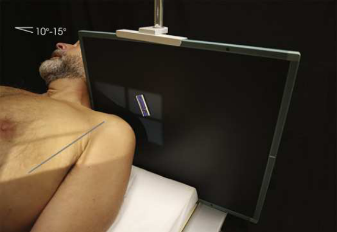
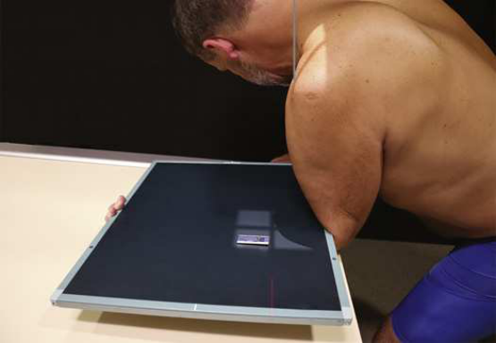

# Rx Intertubercular (Bicipital) Groove — Tangential Incidență — Modificarea Fisk (Merrill)

  📷 Radiografie Convențională (Rx)
  <strong>Actualizat:</strong> 2026-09-16
  <strong>Autor:</strong> Referință Merrill

---

-   __1. Rezumat Clinic & Indicații__

    ---

    === "Indicații Clinice"

        - Conform reperelor anatomice standard din tratat

    === "Ghid Național IRIS"

        !!! info "Referință Primară: Ghidul Național IRIS (Ordinul MS 1342/2012)"
            - **Capitol Ghid IRIS:** *Ghidul Național IRIS*
            - **Grad de Recomandare:** **De verificat pe indicație; fără grad atribuit automat**
            - **Nivel de Iradiere Estimată:** `De verificat pentru examinarea și populația selectate`

            [:octicons-search-16: Deschide Ghidul IRIS](../../iris.md){ .md-button .md-button--primary } [:material-open-in-new: Aplicația Oficială PWA](https://radiologie-pediatrica.ro/iris/){ .md-button target="_blank" rel="noopener" }
-   __2. Poziționare & Centrare Fascicul__

    ---

    - **Poziție Pacient:** se așază pacientul în Decubit dorsal, Poziție Șezândă, sau în ortostatism poziție. la improve centering, se extinde chin sau se rotește cap away de la afected side.; cu pacientul Decubit dorsal, palpate anterior surface de Umăr la locate intertubercular (bicipital) groove. cu pacientul’s Mână în supinație poziție, place receptorul de imagine pe / sprijinit de superior surface de Umăr și se imobilizează receptorul de imagine ca vizualizat în Fig. 6.50. se efectuează ecranarea gonadelor cu șorț plumbat.
    - **Punct de Centrare Fascicul:** înclinat 10 la 15 grade posterior (downward de la orizontal) la axa longitudinală de Humerus pentru Decubit dorsal poziție (see Fig. 6.50) Modificarea Fisk perpendicular pe receptorul de imagine (RI) when pacientul este leaning forward și vertical Humerus este poziționat 10 la 15 grade (see Fig. 6.51)
    - **Distanță Focar-Film (DFF / SID):** Nespecificat în fragmentul extras; de verificat în sursă
    - **Comandă Respiratorie:** apnee (oprirea respirației). Modificarea Fisk Fisk first described this poziție cu pacientul în ortostatism la end de masa radiologică. This uses greater object-la-receptorul de imagine distance (OID). following steps sunt then taken cu Fisk technique: Se instruiește pacientul să se flectează Cot și lean forward far enough la place posterior surface de Antebraț pe masa de examinare. pacientul supports și grasps receptorul de imagine ca depicted în Fig. 6.51. pentru radiation protection și pentru reduction de backscatter la receptorul de imagine de la Antebraț, place lead shielding între receptorul de imagine back și Antebraț. Place săculeți cu nisip under Mână la place receptorul de imagine orizontal. Se instruiește pacientul să lean forward sau backward ca required la place vertical Humerus la un unghi de 10 la 15 grade.

-   __3. Parametri Tehnici Expunere__

    ---

    | Parametru Tehnic | Valoare Configurare Generator / Tub |
    |:-----------------|:-------------------------------------|
    | **Tensiune Tub (kV)** | DE CONFIGURAT PE APARAT |
    | **Sarcină / Produs Curent-Timp (mAs)** | DE CONFIGURAT PE APARAT |
    | **Distanță Focar-Film (DFF / SID)** | Nespecificat în fragmentul extras; de verificat în sursă |
    | **Grilă Antidifuzoare (Bucky)** | DE CONFIGURAT PE APARAT |
    | **Dimensiune Focar** | DE CONFIGURAT PE APARAT |
    | **Camere de Ionizare AEC** | DE CONFIGURAT PE APARAT |
    | **Colimare Fascicul** | Se ajustează câmpul de iradiere la formatul 10 × 10 cm pe colimator. Adjust ca needed la include 1 inch beyond superior și lateral Umăr shadow. Se plasează markerul de lateralitate în câmpul colimat. |
    | **Filtrare Tub** | DE CONFIGURAT PE APARAT |

-   __4. Criterii de Calitate & Reușită Imagine__

    ---

    - Criterii radiologice de calitate imaginii:
    - Colimare adecvată vizibilă și prezența markerului de lateralitate (D/S) plasat clear de anatomy de interest
    - Intertubercular (bicipital) groove în profile
    - Bony detalii trabeculare osoase și surrounding soft tissues

-   __5. Protecție Radiologică (ALARA)__

    ---

    - Nespecificat în fragmentul extras; de verificat în sursă

!!! note "Observații Clinice & Tehnice"
    Conform reperelor anatomice standard din tratat

### 🖼️ Imagini

<figure class="protocol-image-card" markdown>

<figcaption><strong>Merrill — pagina PDF 412, imaginea 1</strong> — Imagine din fragmentul sursă; asocierea necesită revizie.</figcaption>

</figure>

<figure class="protocol-image-card" markdown>

<figcaption><strong>Merrill — pagina PDF 413, imaginea 2</strong> — Imagine din fragmentul sursă; asocierea necesită revizie.</figcaption>

</figure>

=== "Ghid Rapid de Execuție"

    1. **Identificarea și verificarea pacientului:** verificare identitate, zonă de examinat, consimțământ conform procedurii și evaluarea posibilității unei sarcini, când este relevantă.
    2. **Pregătire:** îndepărtarea oricăror obiecte radiopace (bijuterii, agrafe, fermoare, proteze, pansamente dense).
    3. **Poziționare precisă:** alinierea receptorului de imagine și a tubului la distanța prescrisă (Nespecificat în fragmentul extras; de verificat în sursă).
    4. **Colimare strictă:** adaptarea fasciculului strict la regiunea de diagnostic pentru scăderea iradierii și reducerea radiației difuze.
    5. **Radioprotecție:** verificarea [politicii RX](../radioprotectie.md), cu măsuri distincte pentru pacient, personal și însoțitor.

## Surse de documentare

- [Merrill’s Atlas, 6. Shoulder Girdle, pagini PDF 411–413](../../assets/protocols/sources/a56d45c16829_Merrills_Atlas_of_Radiographic_Positioning__Procedures_3Vol_Set.pdf#page=411)

## Fragmente sursă traduse (referință tehnică)

### anatomy

tangențial imagine profiles intertubercular (bicipital) groove liber de la superimposition de surrounding umăr structures (Figs. 6.52
și 6.53).

### collimation

• Se ajustează câmpul de iradiere la formatul 10 × 10 cm pe colimator. Adjust ca needed la include 1 inch beyond superior și lateral
umăr shadow. Se plasează markerul de lateralitate în câmpul colimat.

### cr

• înclinat 10 la 15 grade posterior (downward de la orizontal) la axa longitudinală de humerus pentru decubit dorsal (see Fig. 6.50)
Fisk modification
• perpendicular pe receptorul de imagine (RI) when pacientul este leaning forward și vertical humerus este poziționat 10 la 15 grade (see Fig. 6.51)

### criteria

Criterii radiologice de calitate imaginii:
• Colimare adecvată vizibilă și prezența markerului de lateralitate (D/S) plasat clear de anatomy de interest
• Intertubercular (bicipital) groove în profile
• Bony detalii trabeculare osoase și surrounding soft tissues

### part_pos

• cu pacientul în decubit dorsal, palpate anterior surface de umăr la locate intertubercular (bicipital) groove.
• cu pacientul’s mână în supinație poziție, place receptorul de imagine pe / sprijinit de superior surface de umăr și se imobilizează receptorul de imagine ca
vizualizat în Fig. 6.50.
• se efectuează ecranarea gonadelor cu șorț plumbat.

### patient_pos

• se așază pacientul în decubit dorsal, așezat pe scaun, sau în ortostatism poziție.
• la improve centering, se extinde chin sau se rotește cap away de la afected side.

### respiration

apnee (oprirea respirației).
Fisk modification
Fisk first described this poziție cu pacientul în ortostatism la end de masa radiologică. This uses greater object-la-receptorul de imagine
distance (OID). following steps sunt then taken cu Fisk technique:
• Se instruiește pacientul să se flectează cot și lean forward far enough la place posterior surface de forearm pe masa de examinare. pacient supports și grasps receptorul de imagine ca depicted în Fig. 6.51.
• pentru radiation protection și pentru reduction de backscatter la receptorul de imagine de la forearm, place lead shielding între receptorul de imagine back și
forearm.
• Place săculeți cu nisip under mână la place receptorul de imagine orizontal.
• Se instruiește pacientul să lean forward sau backward ca required la place vertical humerus la un unghi de 10 la 15 grade.

### tech

poziționat prin manufacturer sau department protocol pentru corect anatomy display orientation; raza centrală plate: 10 × 12 inches (24 × 30 cm) transversal.

