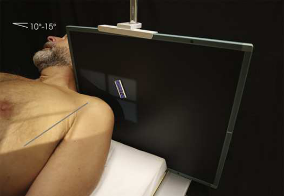
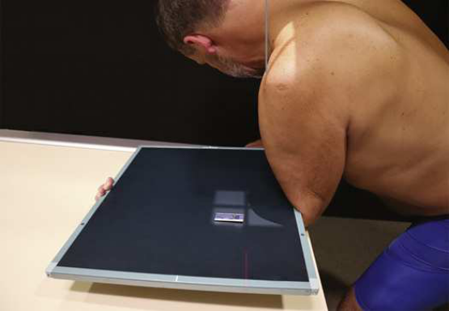

# Rx șanț intertubercular (bicipital) — incidență tangențială — modificarea Fisk (Merrill)

  📷 Radiografie Convențională (Rx)
  <strong>Actualizat:</strong> 2026-09-16
  <strong>Autor:</strong> Referință Merrill

---

-   __1. Rezumat Clinic & Indicații__

    ---

    === "Indicații Clinice"

        - Conform reperelor anatomice standard din tratat

    === "Ghid Național IRIS"

        !!! info "Referință Primară: Ghidul Național IRIS (Ordinul MS 1342/2012)"
            - **Capitol Ghid IRIS:** *Aparat locomotor & Membru superior*
            - **Grad de Recomandare:** **Grad A**
            - **Nivel de Iradiere Estimată:** `Clasa 1 (Minimă < 0.01 mSv)`

            [:octicons-search-16: Deschide Ghidul IRIS](../../iris.md){ .md-button .md-button--primary } [:material-open-in-new: Aplicația Oficială PWA](https://radiologie-pediatrica.ro/iris/){ .md-button target="_blank" rel="noopener" }

-   __2. Poziționare & Centrare Fascicul__

    ---

    - **Poziție Pacient:** Se așază pacientul în decubit dorsal, în poziție șezândă sau în ortostatism. Pentru îmbunătățirea centrării, se extinde bărbia sau se rotește capul în partea opusă celei afectate.; Cu pacientul în decubit dorsal, se palpează suprafața anterioară a umărului pentru localizarea șanțului intertubercular (bicipital). Cu mâna pacientului în poziție de supinație, se plasează receptorul de imagine pe sau sprijinit de suprafața superioară a umărului și se imobilizează receptorul de imagine, conform Fig. 6.50. Se efectuează ecranarea gonadelor cu șorț plumbat.
    - **Punct de Centrare Fascicul:** Înclinat cu 10 la 15 grade posterior (în jos față de orizontală) față de axa longitudinală a humerusului pentru poziția în decubit dorsal (vezi Fig. 6.50). Modificarea Fisk: perpendicular pe receptorul de imagine (RI) când pacientul se apleacă înainte, iar humerusul vertical este poziționat la 10 la 15 grade (vezi Fig. 6.51).
    - **Distanță Focar-Film (DFF / SID):** Nespecificat în fragmentul extras; de verificat în sursă
    - **Comandă Respiratorie:** Apnee (oprirea respirației). Modificarea Fisk Fisk a descris pentru prima dată această poziție cu pacientul în ortostatism la capătul mesei radiologice. Aceasta utilizează o distanță mai mare obiect–receptor de imagine (OID). Cu tehnica Fisk se parcurg apoi următorii pași: Se instruiește pacientul să flecteze cotul și să se aplece înainte suficient pentru a plasa suprafața posterioară a antebrațului pe masa de examinare. Pacientul susține și prinde receptorul de imagine, conform Fig. 6.51. Pentru protecția împotriva radiațiilor și reducerea radiației retroîmprăștiate la receptorul de imagine de la antebraț, se plasează ecranare plumbată între partea posterioară a receptorului de imagine și antebraț. Se plasează săculeți cu nisip sub mână pentru a menține receptorul de imagine orizontal. Se instruiește pacientul să se aplece înainte sau înapoi, după cum este necesar, pentru a plasa humerusul vertical la un unghi de 10 la 15 grade.

-   __3. Parametri Tehnici Expunere__

    ---

    | Parametru Tehnic | Valoare Configurare Generator / Tub |
    |:-----------------|:-------------------------------------|
    | **Tensiune Tub (kV)** | DE CONFIGURAT PE APARAT |
    | **Sarcină / Produs Curent-Timp (mAs)** | DE CONFIGURAT PE APARAT |
    | **Distanță Focar-Film (DFF / SID)** | Nespecificat în fragmentul extras; de verificat în sursă |
    | **Grilă Antidifuzoare (Bucky)** | DE CONFIGURAT PE APARAT |
    | **Dimensiune Focar** | DE CONFIGURAT PE APARAT |
    | **Camere de Ionizare AEC** | DE CONFIGURAT PE APARAT |
    | **Colimare Fascicul** | Se ajustează câmpul de iradiere la formatul 10 × 10 cm pe colimator. Se ajustează după necesitate pentru a include 1 țol dincolo de umbra superioară și laterală a umărului. Se plasează markerul de lateralitate în câmpul colimat. |
    | **Filtrare Tub** | DE CONFIGURAT PE APARAT |

-   __4. Criterii de Calitate & Reușită Imagine__

    ---

    - Criterii radiologice de calitate a imaginii:
    - Colimare adecvată vizibilă și prezența markerului de lateralitate (D/S) plasat în afara structurilor anatomice de interes
    - Șanțul intertubercular (bicipital) în profil
    - Detalii trabeculare osoase și țesuturile moi înconjurătoare

-   __5. Protecție Radiologică (ALARA)__

    ---

    - Nespecificat în fragmentul extras; de verificat în sursă

!!! note "Observații Clinice & Tehnice"
    Conform reperelor anatomice standard din tratat

### 🖼️ Imagini

<figure class="protocol-image-card" markdown>

<figcaption><strong>Merrill — pagina 412, imaginea 1</strong> — Imagine din fragmentul sursă; asocierea necesită revizie.</figcaption>

</figure>

<figure class="protocol-image-card" markdown>

<figcaption><strong>Merrill — pagina 413, imaginea 2</strong> — Imagine din fragmentul sursă; asocierea necesită revizie.</figcaption>

</figure>

=== "Ghid Rapid de Execuție"

    1. **Identificarea și verificarea pacientului:** verificare identitate, zonă de examinat, consimțământ conform procedurii și evaluarea posibilității unei sarcini, când este relevantă.
    2. **Pregătire:** îndepărtarea oricăror obiecte radiopace (bijuterii, agrafe, fermoare, proteze, pansamente dense).
    3. **Poziționare precisă:** alinierea receptorului de imagine și a tubului la distanța prescrisă (Nespecificat în fragmentul extras; de verificat în sursă).
    4. **Colimare strictă:** adaptarea fasciculului strict la regiunea de diagnostic pentru scăderea iradierii și reducerea radiației difuze.
    5. **Radioprotecție:** verificarea [politicii RX](../radioprotectie.md), cu măsuri distincte pentru pacient, personal și însoțitor.

## Surse de documentare

- [Merrill’s Atlas, 6. Shoulder Girdle, pagini 411–413](https://books.google.com/books/about/Merrill_s_Atlas_of_Radiographic_Position.html?id=BM0lEQAAQBAJ)
