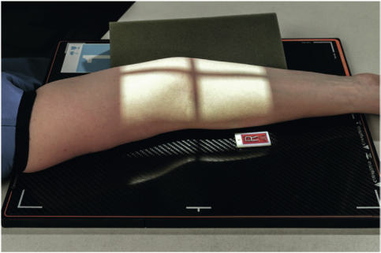
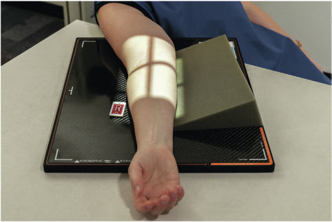

# Rx LATERAL (EXTERNAL) ROTATION AP Oblică (Cot)

  📷 Radiografie Convențională (Rx)
  <strong>Actualizat:</strong> 2026-09-15
  <strong>Autor:</strong> Departamentul de Radiologie / Referință Bontrager

---

-   __1. Rezumat Clinic & Indicații__

    ---

    === "Indicații Clinice"

        - suspiciune de fractură și luxație / subluxație articulară de Cot, primarily cap radial și neck
        - Certain pathologic processes, such ca osteomielită / leziuni inflamatorii osoase și arthritis lateral (extern rotație) oblic Best visualizes cap radial și neck de radius și capitulum de Humerus

    === "Ghid Național IRIS"

        !!! info "Referință Primară: Ghidul Național IRIS (Ordinul MS 1342/2012)"
            - **Capitol Ghid IRIS:** *Ghidul Național IRIS*
            - **Grad de Recomandare:** **De verificat pe indicație; fără grad atribuit automat**
            - **Nivel de Iradiere Estimată:** `De verificat pentru examinarea și populația selectate`

            [:octicons-search-16: Deschide Ghidul IRIS](../../iris.md){ .md-button .md-button--primary } [:material-open-in-new: Aplicația Oficială PWA](https://radiologie-pediatrica.ro/iris/){ .md-button target="_blank" rel="noopener" }
-   __2. Poziționare & Centrare Fascicul__

    ---

    - **Poziție Pacient:** Pacient: Seat pacient la end de table, cu braț fully extins și Umăr și Cot pe same plan orizontal (lowering Umăr ca needed).; Regiune anatomică: Align braț și Antebraț cu axa longitudinală de receptorul de imagine (Fig. 4.135). Center Cot articulație la raza centrală și la receptorul de imagine. Supinate Mână și rotate laterally entire braț astfel încât distal Humerus și anterior surface de Cot articulație sunt approximately 45° la receptorul de imagine. (pacient trebuie să lean laterally pentru sufficient rotație externă (laterală).) Place interepicondylar plane approximately 45° la receptorul de imagine (Fig. 4.136).
    - **Punct de Centrare Fascicul:** perpendicular pe receptorul de imagine, orientat la midelbow articulație (point approximately ¾ inch [2 cm] distal la midpoint de line între epicondyles ca viewed de la xray tube)
    - **Distanță Focar-Film (DFF / SID):** 100 cm
    - **Comandă Respiratorie:** Apnee pe durata expunerii (sau conform cooperării pacientului)

-   __3. Parametri Tehnici Expunere__

    ---

    | Parametru Tehnic | Valoare Configurare Generator / Tub |
    |:-----------------|:-------------------------------------|
    | **Tensiune Tub (kV)** | 65 kV |
    | **Sarcină / Produs Curent-Timp (mAs)** | DE CONFIGURAT PE APARAT |
    | **Distanță Focar-Film (DFF / SID)** | 100 cm |
    | **Grilă Antidifuzoare (Bucky)** | Fără grilă (expunere directă) |
    | **Dimensiune Focar** | Focar Mic (0.6 mm) |
    | **Camere de Ionizare AEC** | DE CONFIGURAT PE APARAT |
    | **Colimare Fascicul** | Field Size Collimate pe four sides la anatomy de interest. Cot ROUTINE AP Alternate AP—partial flexion Alternate AP—acute flexion oblic lateral (extern) medial (intern) lateral Fig. 4.135 45° lateral (extern) oblic. Fig. 4.136 End incidență, evidențiind 45° extern rotație. |
    | **Filtrare Tub** | Totală ≥ 2.5 mm Al echivalent |

-   __4. Criterii de Calitate & Reușită Imagine__

    ---

    - Vizualizarea completă regiunii anatomice explorate
    - Absența artefactelor de mișcare sau suprapunerilor neadecvate
    - Contrast și penetrare optime pentru decelarea structurilor osoase și părților moi

-   __5. Protecție Radiologică (ALARA)__

    ---

    - Ecranare gonadică și a organelor radiosensibile conform procedurilor locale de radioprotecție ALARA.
    - Colimare strictă la aria de interes pentru limitarea radiației difuze.
    - Verificarea posibilității unei sarcini la pacientele de vârstă fertilă înainte de expunere.

### 🖼️ Imagini

<figure class="protocol-image-card" markdown>

<figcaption><strong>Fig. 4.135 45° lateral (extern) oblic.</strong> — Poziționare pacient conform Ghidului Bontrager (Fig. 4.135 45° lateral (extern) oblic.)</figcaption>

</figure>

<figure class="protocol-image-card" markdown>

<figcaption><strong>Fig. 4.136 End incidență, evidențiind 45° extern rotație.</strong> — Aspect radiografic de referință conform Ghidului Bontrager (Fig. 4.136 End incidență, evidențiind 45° extern rotație.)</figcaption>

</figure>

=== "Ghid Rapid de Execuție"

    1. **Identificarea și verificarea pacientului:** verificare identitate, zonă de examinat, consimțământ conform procedurii și evaluarea posibilității unei sarcini, când este relevantă.
    2. **Pregătire:** îndepărtarea oricăror obiecte radiopace (bijuterii, agrafe, fermoare, proteze, pansamente dense).
    3. **Poziționare precisă:** alinierea receptorului de imagine și a tubului la distanța prescrisă (100 cm).
    4. **Colimare strictă:** adaptarea fasciculului strict la regiunea de diagnostic pentru scăderea iradierii și reducerea radiației difuze.
    5. **Radioprotecție:** verificarea [politicii RX](../radioprotectie.md), cu măsuri distincte pentru pacient, personal și însoțitor.

## Surse de documentare

- [Bontrager's Textbook of Radiographic Positioning (Ed. 9/10), Pagina 180](https://www.elsevier.com/books/textbook-of-radiographic-positioning-and-related-anatomy/lampignano/978-0-323-65367-1)
