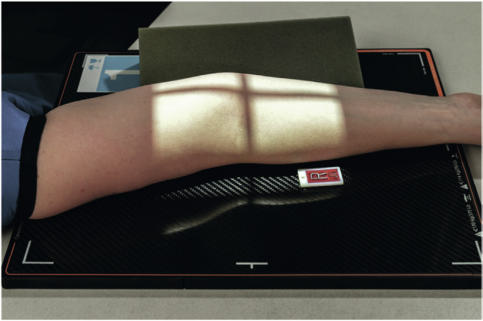
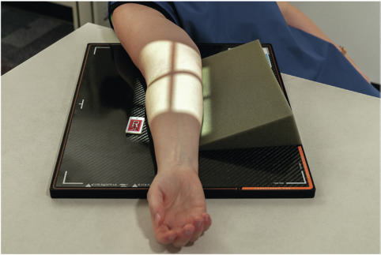

# Rx rotație laterală (externă) AP oblică (Cot)

  📷 Radiografie Convențională (Rx)
  <strong>Actualizat:</strong> 2026-09-15
  <strong>Autor:</strong> Departamentul de Radiologie / Referință Bontrager

---

-   __1. Rezumat Clinic & Indicații__

    ---

    === "Indicații Clinice"

        - Suspiciune de fractură și luxație/subluxație articulară a cotului, în principal a capului și colului radial
        - Anumite procese patologice, precum osteomielita/leziunile inflamatorii osoase și artrita. Incidența oblică laterală (rotație externă) evidențiază cel mai bine capul și colul radiusului și capitulul humerusului

    === "Ghid Național IRIS"

        !!! info "Referință Primară: Ghidul Național IRIS (Ordinul MS 1342/2012)"
            - **Capitol Ghid IRIS:** *Aparat locomotor & Membru superior*
            - **Grad de Recomandare:** **Grad A**
            - **Nivel de Iradiere Estimată:** `Clasa 1 (Minimă < 0.02 mSv)`

            [:octicons-search-16: Deschide Ghidul IRIS](../../iris.md){ .md-button .md-button--primary } [:material-open-in-new: Aplicația Oficială PWA](https://radiologie-pediatrica.ro/iris/){ .md-button target="_blank" rel="noopener" }

-   __2. Poziționare & Centrare Fascicul__

    ---

    - **Poziție Pacient:** Pacient: Se așază pacientul la capătul mesei, cu brațul complet extins și umărul și cotul în același plan orizontal (se coboară umărul după necesitate).; Regiune anatomică: Se aliniază brațul și antebrațul cu axa longitudinală a receptorului de imagine (Fig. 4.135). Se centrează articulația cotului la raza centrală și la receptorul de imagine. Se supinează mâna și se rotește lateral întregul braț astfel încât humerusul distal și suprafața anterioară a articulației cotului să fie la aproximativ 45° față de receptorul de imagine. (Pacientul trebuie să se aplece lateral pentru o rotație externă (laterală) suficientă.) Se plasează planul interepicondilar la aproximativ 45° față de receptorul de imagine (Fig. 4.136).
    - **Punct de Centrare Fascicul:** Perpendicular pe receptorul de imagine, orientat spre articulația cotului, la aproximativ ¾ țol [2 cm] distal față de punctul de mijloc al liniei dintre epicondili, văzută dinspre tubul de raze X
    - **Distanță Focar-Film (DFF / SID):** 100 cm
    - **Comandă Respiratorie:** Apnee pe durata expunerii (sau conform cooperării pacientului)

-   __3. Parametri Tehnici Expunere__

    ---

    | Parametru Tehnic | Valoare Configurare Generator / Tub |
    |:-----------------|:-------------------------------------|
    | **Tensiune Tub (kV)** | 65 kV |
    | **Sarcină / Produs Curent-Timp (mAs)** | DE CONFIGURAT PE APARAT |
    | **Distanță Focar-Film (DFF / SID)** | 100 cm |
    | **Grilă Antidifuzoare (Bucky)** | Fără grilă (expunere directă) |
    | **Dimensiune Focar** | Focar Mic (0.6 mm) |
    | **Camere de Ionizare AEC** | DE CONFIGURAT PE APARAT |
    | **Colimare Fascicul** | Dimensiunea câmpului Se colimează pe cele patru laturi la nivelul anatomiei de interes. Cot AP DE RUTINĂ AP alternativă—flexie parțială AP alternativă—flexie acută oblic lateral (extern) medial (intern) lateral Fig. 4.135 oblic lateral (extern) la 45°. Fig. 4.136 Incidență finală, evidențiind rotația externă la 45°. |
    | **Filtrare Tub** | Totală ≥ 2.5 mm Al echivalent |

-   __4. Criterii de Calitate & Reușită Imagine__

    ---

    - Vizualizarea completă a regiunii anatomice explorate
    - Absența artefactelor de mișcare sau a suprapunerilor neadecvate
    - Contrast și penetrare optime pentru decelarea structurilor osoase și a părților moi

-   __5. Protecție Radiologică (ALARA)__

    ---

    - Ecranare gonadică și a organelor radiosensibile conform procedurilor locale de radioprotecție ALARA.
    - Colimare strictă la aria de interes pentru limitarea radiației difuze.
    - Verificarea posibilității unei sarcini la pacientele de vârstă fertilă înainte de expunere.

### 🖼️ Imagini

<figure class="protocol-image-card" markdown>

<figcaption><strong>Fig. 4.135 oblic lateral (extern) la 45°.</strong> — Poziționarea pacientului conform Ghidului Bontrager (Fig. 4.135 oblic lateral (extern) la 45°.)</figcaption>

</figure>

<figure class="protocol-image-card" markdown>

<figcaption><strong>Fig. 4.136 Incidență finală, evidențiind rotația externă la 45°.</strong> — Aspect radiografic de referință conform Ghidului Bontrager (Fig. 4.136 Incidență finală, evidențiind rotația externă la 45°.)</figcaption>

</figure>

=== "Ghid Rapid de Execuție"

    1. **Identificarea și verificarea pacientului:** verificare identitate, zonă de examinat, consimțământ conform procedurii și evaluarea posibilității unei sarcini, când este relevantă.
    2. **Pregătire:** îndepărtarea oricăror obiecte radiopace (bijuterii, agrafe, fermoare, proteze, pansamente dense).
    3. **Poziționare precisă:** alinierea receptorului de imagine și a tubului la distanța prescrisă (100 cm).
    4. **Colimare strictă:** adaptarea fasciculului strict la regiunea de diagnostic pentru scăderea iradierii și reducerea radiației difuze.
    5. **Radioprotecție:** verificarea [politicii RX](../radioprotectie.md), cu măsuri distincte pentru pacient, personal și însoțitor.

## Surse de documentare

- [Bontrager's Textbook of Radiographic Positioning (Ed. 9/10), Pagina 180](https://www.elsevier.com/books/textbook-of-radiographic-positioning-and-related-anatomy/lampignano/978-0-323-65367-1)
