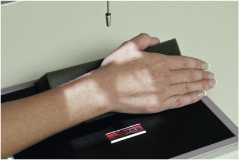
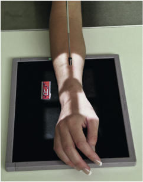
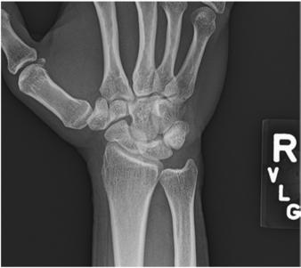
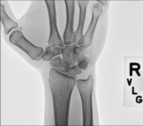

# Rx Rotație Externă (Laterală) PA Oblică (Pumn (Articulație Radiocarpiană))

  📷 Radiografie Convențională (Rx)
  <strong>Actualizat:</strong> 2026-09-15
  <strong>Autor:</strong> Departamentul de Radiologie / Referință Bontrager

---

-   __1. Rezumat Clinic & Indicații__

    ---

    === "Indicații Clinice"

        - suspiciune de fractură de distal radius sau ulna, isolated suspiciune de fractură de radial sau ulnar styloid processes, și suspiciune de fractură de individual oase carpiene
        - Pathologic processes, such ca osteomielită / leziuni inflamatorii osoase și arthritis

    === "Ghid Național IRIS"

        !!! info "Referință Primară: Ghidul Național IRIS (Ordinul MS 1342/2012)"
            - **Capitol Ghid IRIS:** *Ghidul Național IRIS*
            - **Grad de Recomandare:** **De verificat pe indicație; fără grad atribuit automat**
            - **Nivel de Iradiere Estimată:** `De verificat pentru examinarea și populația selectate`

            [:octicons-search-16: Deschide Ghidul IRIS](../../iris.md){ .md-button .md-button--primary } [:material-open-in-new: Aplicația Oficială PWA](https://radiologie-pediatrica.ro/iris/){ .md-button target="_blank" rel="noopener" }
-   __2. Poziționare & Centrare Fascicul__

    ---

    - **Poziție Pacient:** Pacient: Seat pacient la end de table cu Mână și Antebraț extins. Drop Umăr so that Umăr, Cot, și Pumn (Articulație Radiocarpiană) sunt pe same plan orizontal.; Regiune anatomică: Align și center Mână și Pumn (Articulație Radiocarpiană) la receptorul de imagine. de la în pronație poziție, rotate Pumn (Articulație Radiocarpiană) și Mână laterally 45°. pentru stability, place a 45° support under Police side de Mână la support Mână și Pumn (Articulație Radiocarpiană) în a 45° Incidență Oblică (Fig. 4.90) sau partially flex Degete Mână la arch Mână so that fingertips rest lightly pe receptorul de imagine fără support (Fig. 4.91).
    - **Punct de Centrare Fascicul:** perpendicular pe receptorul de imagine, orientat la aria medio-carpiană
    - **Distanță Focar-Film (DFF / SID):** 100 cm
    - **Comandă Respiratorie:** Apnee pe durata expunerii (sau conform cooperării pacientului)

-   __3. Parametri Tehnici Expunere__

    ---

    | Parametru Tehnic | Valoare Configurare Generator / Tub |
    |:-----------------|:-------------------------------------|
    | **Tensiune Tub (kV)** | 60 kV |
    | **Sarcină / Produs Curent-Timp (mAs)** | DE CONFIGURAT PE APARAT |
    | **Distanță Focar-Film (DFF / SID)** | 100 cm |
    | **Grilă Antidifuzoare (Bucky)** | Fără grilă (expunere directă) |
    | **Dimensiune Focar** | Focar Mic (0.6 mm) |
    | **Camere de Ionizare AEC** | DE CONFIGURAT PE APARAT |
    | **Colimare Fascicul** | Field Size Collimate la Pumn (Articulație Radiocarpiană) pe four sides; include distal radius și ulna și midmetacarpal area. Pumn (Articulație Radiocarpiană) ROUTINE PA PA oblic lateral Fig. 4.90 PA oblic Pumn (Articulație Radiocarpiană) (cu 45° support). Fig. 4.91 PA oblic Pumn (Articulație Radiocarpiană) fără support. |
    | **Filtrare Tub** | Totală ≥ 2.5 mm Al echivalent |

-   __4. Criterii de Calitate & Reușită Imagine__

    ---

    - distal radius, ulna, oase carpiene, și la least la midmetacarpal area sunt vizibil.
    - Trapezium și scaphoid trebuie să fie well visualized, cu only slight superimposition de other oase carpiene pe their medial aspects (Figs. 4.92 și 4.93). poziție:
    - axa longitudinală de Mână, Pumn (Articulație Radiocarpiană), și Antebraț trebuie să fie aliniat cu receptorul de imagine.
    - True 45° oblic de Pumn (Articulație Radiocarpiană) este evidenced prin: ulnar cap partially superimposed prin distal radius; proximal third through fifth oase metacarpiene (metacarpal bases) trebuie să appear mostly superimposed.
    - raza centrală și center de collimation field size trebuie să fie la aria medio-carpiană. expunere:
    - optim receptorul de imagine expunere și contrast cu fără mișcare evidențiază oase carpiene și their overlapping margini; părți moi margins; și clear, Contururi osoase și travee trabeculare nete, fără artefacte de mișcare. Fig. 4.92 PA oblic Pumn (Articulație Radiocarpiană). Trapezoid Trapezium Scaphoid Radius Hamate Capitate Triquetrum Pisiform Lunate Ulna Fig. 4.93 PA oblic de drept Pumn (Articulație Radiocarpiană).

-   __5. Protecție Radiologică (ALARA)__

    ---

    - Ecranare gonadică și a organelor radiosensibile conform procedurilor locale de radioprotecție ALARA.
    - Colimare strictă la aria de interes pentru limitarea radiației difuze.
    - Verificarea posibilității unei sarcini la pacientele de vârstă fertilă înainte de expunere.

### 🖼️ Imagini

<figure class="protocol-image-card" markdown>

<figcaption><strong>Fig. 4.90 PA oblic Pumn (Articulație Radiocarpiană) (cu 45° support).</strong> — Poziționare pacient conform Ghidului Bontrager (Fig. 4.90 PA oblic wrist (cu 45° support).)</figcaption>

</figure>

<figure class="protocol-image-card" markdown>

<figcaption><strong>Fig. 4.91 PA oblic Pumn (Articulație Radiocarpiană) fără support.</strong> — Aspect radiografic de referință conform Ghidului Bontrager (Fig. 4.91 PA oblic wrist fără support.)</figcaption>

</figure>

<figure class="protocol-image-card" markdown>

<figcaption><strong>Fig. 4.92 PA oblic Pumn (Articulație Radiocarpiană).</strong> — Aspect radiografic de referință conform Ghidului Bontrager (Fig. 4.92 PA oblic wrist.)</figcaption>

</figure>

<figure class="protocol-image-card" markdown>

<figcaption><strong>Fig. 4.93 PA oblic de drept Pumn (Articulație Radiocarpiană).</strong> — Aspect radiografic de referință conform Ghidului Bontrager (Fig. 4.93 PA oblic de drept wrist.)</figcaption>

</figure>

=== "Ghid Rapid de Execuție"

    1. **Identificarea și verificarea pacientului:** verificare identitate, zonă de examinat, consimțământ conform procedurii și evaluarea posibilității unei sarcini, când este relevantă.
    2. **Pregătire:** îndepărtarea oricăror obiecte radiopace (bijuterii, agrafe, fermoare, proteze, pansamente dense).
    3. **Poziționare precisă:** alinierea receptorului de imagine și a tubului la distanța prescrisă (100 cm).
    4. **Colimare strictă:** adaptarea fasciculului strict la regiunea de diagnostic pentru scăderea iradierii și reducerea radiației difuze.
    5. **Radioprotecție:** verificarea [politicii RX](../radioprotectie.md), cu măsuri distincte pentru pacient, personal și însoțitor.

## Surse de documentare

- [Bontrager's Textbook of Radiographic Positioning (Ed. 9/10), Pagina 166](https://www.elsevier.com/books/textbook-of-radiographic-positioning-and-related-anatomy/lampignano/978-0-323-65367-1)
