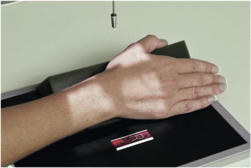
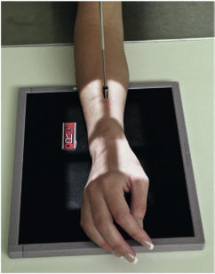
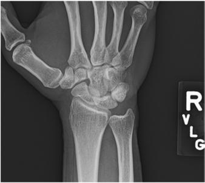
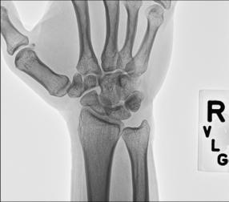

# Rx rotație externă (laterală) PA oblică (Pumn (articulație radiocarpiană))

  📷 Radiografie Convențională (Rx)
  <strong>Actualizat:</strong> 2026-09-15
  <strong>Autor:</strong> Departamentul de Radiologie / Referință Bontrager

---

-   __1. Rezumat Clinic & Indicații__

    ---

    === "Indicații Clinice"

        - Suspiciune de fractură a radiusului sau ulnei distale, suspiciune izolată de fractură a proceselor stiloide radial sau ulnar și suspiciune de fractură a oaselor carpiene individuale
        - Procese patologice, cum ar fi osteomielita / leziuni inflamatorii osoase și artrita

    === "Ghid Național IRIS"

        !!! info "Referință Primară: Ghidul Național IRIS (Ordinul MS 1342/2012)"
            - **Capitol Ghid IRIS:** *Aparat locomotor & Membru superior*
            - **Grad de Recomandare:** **Grad A**
            - **Nivel de Iradiere Estimată:** `Clasa 1 (Minimă < 0.01 mSv)`

            [:octicons-search-16: Deschide Ghidul IRIS](../../iris.md){ .md-button .md-button--primary } [:material-open-in-new: Aplicația Oficială PWA](https://radiologie-pediatrica.ro/iris/){ .md-button target="_blank" rel="noopener" }

-   __2. Poziționare & Centrare Fascicul__

    ---

    - **Poziție Pacient:** Pacient: Se așază pacientul la capătul mesei, cu mâna și antebrațul extinse. Se coboară umărul astfel încât umărul, cotul și pumnul (articulația radiocarpiană) să fie în același plan orizontal.; Regiune anatomică: Se aliniază și se centrează mâna și pumnul (articulația radiocarpiană) la receptorul de imagine. Din poziția de pronație, se rotesc pumnul (articulația radiocarpiană) și mâna lateral la 45°. Pentru stabilitate, se plasează un suport la 45° sub partea policelui a mâinii pentru a susține mâna și pumnul (articulația radiocarpiană) într-o incidență oblică la 45° (Fig. 4.90) sau se flectează parțial degetele mâinii pentru a arcui mâna, astfel încât vârfurile degetelor să se sprijine ușor pe receptorul de imagine fără suport (Fig. 4.91).
    - **Punct de Centrare Fascicul:** Perpendicular pe receptorul de imagine, orientat spre aria mediocarpiană
    - **Distanță Focar-Film (DFF / SID):** 100 cm
    - **Comandă Respiratorie:** Apnee pe durata expunerii (sau conform cooperării pacientului)

-   __3. Parametri Tehnici Expunere__

    ---

    | Parametru Tehnic | Valoare Configurare Generator / Tub |
    |:-----------------|:-------------------------------------|
    | **Tensiune Tub (kV)** | 60 kV |
    | **Sarcină / Produs Curent-Timp (mAs)** | DE CONFIGURAT PE APARAT |
    | **Distanță Focar-Film (DFF / SID)** | 100 cm |
    | **Grilă Antidifuzoare (Bucky)** | Fără grilă (expunere directă) |
    | **Dimensiune Focar** | Focar Mic (0.6 mm) |
    | **Camere de Ionizare AEC** | DE CONFIGURAT PE APARAT |
    | **Colimare Fascicul** | Dimensiunea câmpului Se colimează pumnul (articulația radiocarpiană) pe cele patru laturi; se includ radiusul și ulna distale și regiunea metacarpiană mijlocie. Pumn (articulație radiocarpiană) PA DE RUTINĂ PA oblică laterală Fig. 4.90 PA oblică a pumnului (articulației radiocarpiene) (cu suport la 45°). Fig. 4.91 PA oblică a pumnului (articulației radiocarpiene) fără suport. |
    | **Filtrare Tub** | Totală ≥ 2.5 mm Al echivalent |

-   __4. Criterii de Calitate & Reușită Imagine__

    ---

    - Radiusul distal, ulna, oasele carpiene și cel puțin regiunea metacarpiană mijlocie sunt vizibile.
    - Trapezul și scafoidul trebuie să fie bine vizualizate, cu doar o ușoară suprapunere a celorlalte oase carpiene pe aspectele lor mediale (Figs. 4.92 și 4.93). Poziție:
    - Axa longitudinală a mâinii, pumnului (articulației radiocarpiene) și antebrațului trebuie să fie aliniată cu receptorul de imagine.
    - Incidența oblică adevărată la 45° a pumnului (articulației radiocarpiene) este evidențiată prin: capul ulnar parțial suprapus peste radiusul distal; treimea proximală a oaselor metacarpiene doi până la cinci (bazele metacarpienelor) trebuie să apară în cea mai mare parte suprapuse.
    - Raza centrală și centrul câmpului de colimare trebuie să fie la nivelul regiunii mediocarpiene. Expunere:
    - Expunerea optimă a receptorului de imagine și contrastul adecvat, fără mișcare, evidențiază oasele carpiene și marginile lor suprapuse; marginile părților moi; precum și contururi osoase clare și travee trabeculare nete, fără artefacte de mișcare. Fig. 4.92 PA oblică a pumnului (articulației radiocarpiene). Trapezoid Trapez Scafoid Radius Hamatus Capitat Triquetrum Pisiform Semilunar Ulna Fig. 4.93 PA oblică a pumnului (articulației radiocarpiene) drept.

-   __5. Protecție Radiologică (ALARA)__

    ---

    - Ecranare gonadică și a organelor radiosensibile conform procedurilor locale de radioprotecție ALARA.
    - Colimare strictă la aria de interes pentru limitarea radiației difuze.
    - Verificarea posibilității unei sarcini la pacientele de vârstă fertilă înainte de expunere.

### 🖼️ Imagini

<figure class="protocol-image-card" markdown>

<figcaption><strong>Fig. 4.90 PA oblică a pumnului (articulației radiocarpiene) (cu suport la 45°).</strong> — Poziționarea pacientului conform Ghidului Bontrager (Fig. 4.90 PA oblică a pumnului (cu suport la 45°).)</figcaption>

</figure>

<figure class="protocol-image-card" markdown>

<figcaption><strong>Fig. 4.91 PA oblică a pumnului (articulației radiocarpiene) fără suport.</strong> — Aspect radiografic de referință conform Ghidului Bontrager (Fig. 4.91 PA oblică a pumnului fără suport.)</figcaption>

</figure>

<figure class="protocol-image-card" markdown>

<figcaption><strong>Fig. 4.92 PA oblică a pumnului (articulației radiocarpiene).</strong> — Aspect radiografic de referință conform Ghidului Bontrager (Fig. 4.92 PA oblică a pumnului.)</figcaption>

</figure>

<figure class="protocol-image-card" markdown>

<figcaption><strong>Fig. 4.93 PA oblică a pumnului (articulației radiocarpiene) drept.</strong> — Aspect radiografic de referință conform Ghidului Bontrager (Fig. 4.93 PA oblică a pumnului drept.)</figcaption>

</figure>

=== "Ghid Rapid de Execuție"

    1. **Identificarea și verificarea pacientului:** verificare identitate, zonă de examinat, consimțământ conform procedurii și evaluarea posibilității unei sarcini, când este relevantă.
    2. **Pregătire:** îndepărtarea oricăror obiecte radiopace (bijuterii, agrafe, fermoare, proteze, pansamente dense).
    3. **Poziționare precisă:** alinierea receptorului de imagine și a tubului la distanța prescrisă (100 cm).
    4. **Colimare strictă:** adaptarea fasciculului strict la regiunea de diagnostic pentru scăderea iradierii și reducerea radiației difuze.
    5. **Radioprotecție:** verificarea [politicii RX](../radioprotectie.md), cu măsuri distincte pentru pacient, personal și însoțitor.

## Surse de documentare

- [Bontrager's Textbook of Radiographic Positioning (Ed. 9/10), Pagina 166](https://www.elsevier.com/books/textbook-of-radiographic-positioning-and-related-anatomy/lampignano/978-0-323-65367-1)
