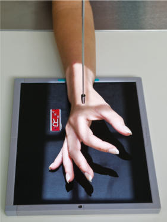
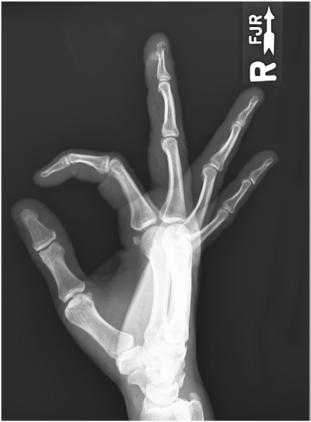
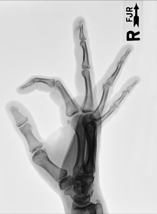

# Rx Incidență Latero-Medială “FAN” LATERAL (Mână)

  📷 Radiografie Convențională (Rx)
  <strong>Actualizat:</strong> 2026-09-15
  <strong>Autor:</strong> Departamentul de Radiologie / Referință Bontrager

---

-   __1. Rezumat Clinic & Indicații__

    ---

    === "Indicații Clinice"

        - suspiciune de fractură și luxație / subluxație articulară de falange, anterior/posterior displaced suspiciune de fractură, și luxație / subluxație articulară de oase metacarpiene
        - Pathologic processes, such ca osteoporosis și artroză / modificări degenerative articulare especially în falange

    === "Ghid Național IRIS"

        !!! info "Referință Primară: Ghidul Național IRIS (Ordinul MS 1342/2012)"
            - **Capitol Ghid IRIS:** *Ghidul Național IRIS*
            - **Grad de Recomandare:** **De verificat pe indicație; fără grad atribuit automat**
            - **Nivel de Iradiere Estimată:** `De verificat pentru examinarea și populația selectate`

            [:octicons-search-16: Deschide Ghidul IRIS](../../iris.md){ .md-button .md-button--primary } [:material-open-in-new: Aplicația Oficială PWA](https://radiologie-pediatrica.ro/iris/){ .md-button target="_blank" rel="noopener" }
-   __2. Poziționare & Centrare Fascicul__

    ---

    - **Poziție Pacient:** Pacient: Seat pacient la end de table cu Mână și Antebraț extins.; Regiune anatomică: Align axa longitudinală de Mână cu axa longitudinală de receptorul de imagine. Rotate Mână și Pumn (Articulație Radiocarpiană) into Incidență de Profil (lateral) cu Police side up. Spread Degete Mână și Police into a “fan” poziție, și support fiecare falange pe radiolucent block ca vizualizat. Ensure that toate falange, including Police, sunt separated și paralel cu receptorul de imagine și that oase metacarpiene sunt nu rotit but remain în true Incidență de Profil (lateral) (Fig. 4.75).
    - **Punct de Centrare Fascicul:** perpendicular pe receptorul de imagine, orientat la second articulații metacarpofalangiene (MCF)
    - **Distanță Focar-Film (DFF / SID):** 100 cm
    - **Comandă Respiratorie:** Apnee pe durata expunerii (sau conform cooperării pacientului)

-   __3. Parametri Tehnici Expunere__

    ---

    | Parametru Tehnic | Valoare Configurare Generator / Tub |
    |:-----------------|:-------------------------------------|
    | **Tensiune Tub (kV)** | 55 kV |
    | **Sarcină / Produs Curent-Timp (mAs)** | DE CONFIGURAT PE APARAT |
    | **Distanță Focar-Film (DFF / SID)** | 100 cm |
    | **Grilă Antidifuzoare (Bucky)** | Fără grilă (expunere directă) |
    | **Dimensiune Focar** | Focar Mic (0.6 mm) |
    | **Camere de Ionizare AEC** | DE CONFIGURAT PE APARAT |
    | **Colimare Fascicul** | Field Size Collimate pe four sides la outer margins de Mână și Pumn (Articulație Radiocarpiană). |
    | **Filtrare Tub** | Totală ≥ 2.5 mm Al echivalent |

-   __4. Criterii de Calitate & Reușită Imagine__

    ---

    - Entire Mână și Pumn (Articulație Radiocarpiană) și about 1 inch (2.5 cm) de distal Antebraț sunt vizibil (Figs. 4.76 și 4.77). poziție:
    - axa longitudinală de Mână și Pumn (Articulație Radiocarpiană) trebuie să fie aliniat cu axa longitudinală de receptorul de imagine.
    - Degete Mână trebuie să appear equally separated, cu falange în Incidență de Profil (lateral) și spații articulare open, indicating that Degete Mână were paralel cu receptorul de imagine.
    - Police trebuie să appear în slightly Incidență Oblică completely liber de superimposition, cu spații articulare open.
    - Mână și Pumn (Articulație Radiocarpiană) trebuie să fie în true Incidență de Profil (lateral), ca evidenced prin: distal radius și ulna sunt superimposed; oase metacarpiene sunt superimposed.
    - raza centrală și center de collimation field size trebuie să fie la second articulații metacarpofalangiene (MCF). expunere:
    - optim receptorul de imagine expunere și contrast cu fără mișcare evidențiază părți moi margins și clear, Contururi osoase și travee trabeculare nete, fără artefacte de mișcare.
    - Outlines de individual oase metacarpiene evidențiat sunt superimposed.
    - Midphalanges și distal falange de Police și Degete Mână trebuie să appear net but poate fie slightly overexposed. Mână ROUTINE
    - PA
    - PA oblic
    - lateral Fig. 4.76 Fan Incidență de Profil (lateral). falange oase metacarpiene 2nd 1st falange (Police) 3rd 4th 5th Fig. 4.77 Fan Incidență de Profil (lateral) de drept Mână.

-   __5. Protecție Radiologică (ALARA)__

    ---

    - Ecranare gonadică și a organelor radiosensibile conform procedurilor locale de radioprotecție ALARA.
    - Colimare strictă la aria de interes pentru limitarea radiației difuze.
    - Verificarea posibilității unei sarcini la pacientele de vârstă fertilă înainte de expunere.

!!! note "Observații Clinice & Tehnice"
    “fan” Incidență de Profil (lateral) este preferred lateral pentru Mână if falange sunt aria de interes diagnostic. (See next page pentru alternative incidențe.) Fig. 4.75 pacient poziție—fan lateral Mână (falange kept separated și paralel cu receptorul de imagine); raza centrală la second articulații metacarpofalangiene (MCF).

### 🖼️ Imagini

<figure class="protocol-image-card" markdown>

<figcaption><strong>Fig. 4.75 pacient poziție—fan lateral Mână (falange kept separated și</strong> — Poziționare pacient conform Ghidului Bontrager (Fig. 4.75 pacient poziție—fan lateral mână (falange kept separated și)</figcaption>

</figure>

<figure class="protocol-image-card" markdown>

<figcaption><strong>Fig. 4.76 Fan Incidență de Profil (lateral).</strong> — Aspect radiografic de referință conform Ghidului Bontrager (Fig. 4.76 Fan lateral incidență.)</figcaption>

</figure>

<figure class="protocol-image-card" markdown>

<figcaption><strong>Fig. 4.77 Fan Incidență de Profil (lateral) de drept Mână.</strong> — Aspect radiografic de referință conform Ghidului Bontrager (Fig. 4.77 Fan lateral incidență de drept mână.)</figcaption>

</figure>

=== "Ghid Rapid de Execuție"

    1. **Identificarea și verificarea pacientului:** verificare identitate, zonă de examinat, consimțământ conform procedurii și evaluarea posibilității unei sarcini, când este relevantă.
    2. **Pregătire:** îndepărtarea oricăror obiecte radiopace (bijuterii, agrafe, fermoare, proteze, pansamente dense).
    3. **Poziționare precisă:** alinierea receptorului de imagine și a tubului la distanța prescrisă (100 cm).
    4. **Colimare strictă:** adaptarea fasciculului strict la regiunea de diagnostic pentru scăderea iradierii și reducerea radiației difuze.
    5. **Radioprotecție:** verificarea [politicii RX](../radioprotectie.md), cu măsuri distincte pentru pacient, personal și însoțitor.

## Surse de documentare

- [Bontrager's Textbook of Radiographic Positioning (Ed. 9/10), Pagina 162](https://www.elsevier.com/books/textbook-of-radiographic-positioning-and-related-anatomy/lampignano/978-0-323-65367-1)
