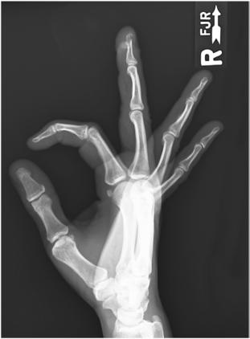
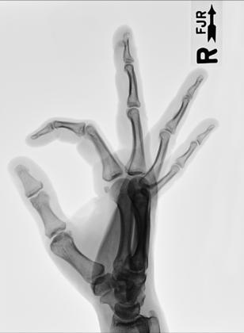

# Rx incidență latero-medială „FAN” — PROFIL (mână)

  📷 Radiografie Convențională (Rx)
  <strong>Actualizat:</strong> 2026-09-15
  <strong>Autor:</strong> Departamentul de Radiologie / Referință Bontrager

---

-   __1. Rezumat Clinic & Indicații__

    ---

    === "Indicații Clinice"

        - Suspiciune de fractură și luxație/subluxație articulară a falangelor, suspiciune de fractură cu deplasare anterioară/posterioară și luxație/subluxație articulară a oaselor metacarpiene
        - Procese patologice, precum osteoporoza și artroza/modificările degenerative articulare, în special la nivelul falangelor

    === "Ghid Național IRIS"

        !!! info "Referință Primară: Ghidul Național IRIS (Ordinul MS 1342/2012)"
            - **Capitol Ghid IRIS:** *Aparat locomotor & Membru superior*
            - **Grad de Recomandare:** **Grad A**
            - **Nivel de Iradiere Estimată:** `Clasa 1 (Minimă < 0.01 mSv)`

            [:octicons-search-16: Deschide Ghidul IRIS](../../iris.md){ .md-button .md-button--primary } [:material-open-in-new: Aplicația Oficială PWA](https://radiologie-pediatrica.ro/iris/){ .md-button target="_blank" rel="noopener" }

-   __2. Poziționare & Centrare Fascicul__

    ---

    - **Poziție Pacient:** Pacient: Așezați pacientul la capătul mesei, cu mâna și antebrațul extinse.; Regiune anatomică: Aliniați axa longitudinală a mâinii cu axa longitudinală a receptorului de imagine. Rotiți mâna și pumnul (articulația radiocarpiană) în incidență de profil, cu partea policelui în sus. Depărtați degetele mâinii și policele în poziție de „evantai” și sprijiniți fiecare falangă pe un suport radiotransparent, conform imaginii. Asigurați-vă că toate falangele, inclusiv policele, sunt separate și paralele cu receptorul de imagine și că oasele metacarpiene nu sunt rotite, ci rămân în adevărata incidență de profil (Fig. 4.75).
    - **Punct de Centrare Fascicul:** Perpendicular pe receptorul de imagine, orientat spre a doua articulație metacarpofalangiană (MCF)
    - **Distanță Focar-Film (DFF / SID):** 100 cm
    - **Comandă Respiratorie:** Apnee pe durata expunerii (sau conform cooperării pacientului)

-   __3. Parametri Tehnici Expunere__

    ---

    | Parametru Tehnic | Valoare Configurare Generator / Tub |
    |:-----------------|:-------------------------------------|
    | **Tensiune Tub (kV)** | 55 kV |
    | **Sarcină / Produs Curent-Timp (mAs)** | DE CONFIGURAT PE APARAT |
    | **Distanță Focar-Film (DFF / SID)** | 100 cm |
    | **Grilă Antidifuzoare (Bucky)** | Fără grilă (expunere directă) |
    | **Dimensiune Focar** | Focar Mic (0.6 mm) |
    | **Camere de Ionizare AEC** | DE CONFIGURAT PE APARAT |
    | **Colimare Fascicul** | Dimensiunea câmpului: Colimați pe cele patru laturi la marginile externe ale mâinii și pumnului (articulația radiocarpiană). |
    | **Filtrare Tub** | Totală ≥ 2.5 mm Al echivalent |

-   __4. Criterii de Calitate & Reușită Imagine__

    ---

    - Întreaga mână și întregul pumn (articulația radiocarpiană) și aproximativ 1 țol (2.5 cm) din antebrațul distal sunt vizibile (Fig. 4.76 și 4.77). Poziție:
    - Axa longitudinală a mâinii și pumnului (articulația radiocarpiană) trebuie să fie aliniată cu axa longitudinală a receptorului de imagine.
    - Degetele mâinii trebuie să apară egal depărtate, cu falangele în incidență de profil și spațiile articulare deschise, indicând că degetele mâinii au fost paralele cu receptorul de imagine.
    - Policele trebuie să apară în incidență ușor oblică, complet liber de suprapunere, cu spațiile articulare deschise.
    - Mâna și pumnul (articulația radiocarpiană) trebuie să fie în adevărata incidență de profil, evidențiată prin: radiusul distal și ulna sunt suprapuse; oasele metacarpiene sunt suprapuse.
    - Raza centrală și centrul câmpului de colimare trebuie să fie la nivelul celei de-a doua articulații metacarpofalangiene (MCF). Expunere:
    - Expunerea și contrastul optime ale receptorului de imagine, fără mișcare, evidențiază clar marginile părților moi, contururile osoase și traveele trabeculare, fără artefacte de mișcare.
    - Contururile oaselor metacarpiene individuale evidențiate sunt suprapuse.
    - Falangele medii și falangele distale ale policelui și degetelor mâinii trebuie să apară clare, dar pot fi ușor supraexpuse. MÂNĂ — RUTINĂ
    - PA
    - PA oblică
    - Profil. Fig. 4.76 Incidență de profil în evantai. Falange; metacarpiene; a 2-a; prima falangă (police) — 1; a 3-a; a 4-a; a 5-a. Fig. 4.77 Incidență de profil în evantai a mâinii drepte.

-   __5. Protecție Radiologică (ALARA)__

    ---

    - Ecranare gonadică și a organelor radiosensibile conform procedurilor locale de radioprotecție ALARA.
    - Colimare strictă la aria de interes pentru limitarea radiației difuze.
    - Verificarea posibilității unei sarcini la pacientele de vârstă fertilă înainte de expunere.

!!! note "Observații Clinice & Tehnice"
    Incidența de profil „evantai” este incidența laterală preferată pentru mână dacă falangele reprezintă aria de interes diagnostic. (Vezi pagina următoare pentru incidențe alternative.) Fig. 4.75 Poziția pacientului—profil „evantai” al mâinii (falangele menținute separat și paralele cu receptorul de imagine); raza centrală la a doua articulație metacarpofalangiană (MCF).

### 🖼️ Imagini

<figure class="protocol-image-card" markdown>

![Fig. 4.75 poziția pacientului — profil în evantai al mâinii (falangele menținute separate și [fragment deteriorat în sursă]](../../assets/images/protocols/bontrager/rx-lateromedial-projection-fan-lateral-mana-bontrager/fig_1.jpeg)

<figcaption><strong>Fig. 4.75 poziția pacientului — profil în evantai al mâinii (falangele menținute separate și [fragment deteriorat în sursă]</strong> — Poziționarea pacientului conform Ghidului Bontrager (Fig. 4.75 poziția pacientului — profil în evantai al mâinii (falangele menținute separate și)</figcaption>

</figure>

<figure class="protocol-image-card" markdown>

<figcaption><strong>Fig. 4.76 Incidență de profil în evantai.</strong> — Aspect radiografic de referință conform Ghidului Bontrager (Fig. 4.76 incidență de profil în evantai.)</figcaption>

</figure>

<figure class="protocol-image-card" markdown>

<figcaption><strong>Fig. 4.77 Incidență de profil în evantai a mâinii drepte.</strong> — Aspect radiografic de referință conform Ghidului Bontrager (Fig. 4.77 incidență de profil în evantai a mâinii drepte.)</figcaption>

</figure>

=== "Ghid Rapid de Execuție"

    1. **Identificarea și verificarea pacientului:** verificare identitate, zonă de examinat, consimțământ conform procedurii și evaluarea posibilității unei sarcini, când este relevantă.
    2. **Pregătire:** îndepărtarea oricăror obiecte radiopace (bijuterii, agrafe, fermoare, proteze, pansamente dense).
    3. **Poziționare precisă:** alinierea receptorului de imagine și a tubului la distanța prescrisă (100 cm).
    4. **Colimare strictă:** adaptarea fasciculului strict la regiunea de diagnostic pentru scăderea iradierii și reducerea radiației difuze.
    5. **Radioprotecție:** verificarea [politicii RX](../radioprotectie.md), cu măsuri distincte pentru pacient, personal și însoțitor.

## Surse de documentare

- [Bontrager's Textbook of Radiographic Positioning (Ed. 9/10), Pagina 162](https://www.elsevier.com/books/textbook-of-radiographic-positioning-and-related-anatomy/lampignano/978-0-323-65367-1)
