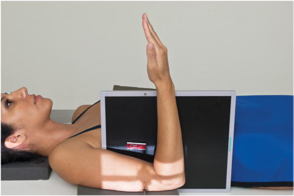
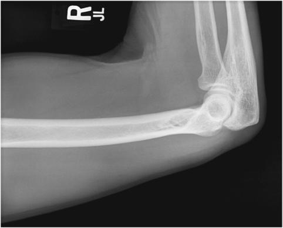
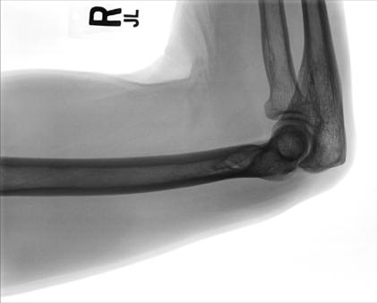

# Rx LATEROMEDIAL PROJECTION traumatism acuttism / Regim Urgență HORIZONTAL BEAM LATERAL (- MID)

  📷 Radiografie Convențională (Rx)
  <strong>Actualizat:</strong> 2026-09-15
  <strong>Autor:</strong> Departamentul de Radiologie / Referință Bontrager

---

-   __1. Rezumat Clinic & Indicații__

    ---

    === "Indicații Clinice"

        - suspiciune de fractură and luxație / subluxație articulară of the midhumerus and distal Humerus
        - Pathologic processes, including osteoporosis

    === "Ghid Național IRIS"

        !!! info "Referință Primară: Ghidul Național IRIS (Ordinul MS 1342/2012)"
            - **Capitol Ghid IRIS:** *Ghidul Național IRIS*
            - **Grad de Recomandare:** **De verificat pe indicație; fără grad atribuit automat**
            - **Nivel de Iradiere Estimată:** `De verificat pentru examinarea și populația selectate`

            [:octicons-search-16: Deschide Ghidul IRIS](../../iris.md){ .md-button .md-button--primary } [:material-open-in-new: Aplicația Oficială PWA](https://radiologie-pediatrica.ro/iris/){ .md-button target="_blank" rel="noopener" }
-   __2. Poziționare & Centrare Fascicul__

    ---

    - **Poziție Pacient:** Conform incidenței standard descrise
    - **Punct de Centrare Fascicul:** perpendicular to midpoint of distal twothirds of Humerus
    - **Distanță Focar-Film (DFF / SID):** 100 cm
    - **Comandă Respiratorie:** Suspend respiration during exposure. (This step is important in preventing movement of the image receptor during the exposure.) 43 (30) (24) Humerus ROUTINE AP Rotational lateral SPECIAL (traumatism acuttism / Regim Urgență) Horizontal beam lateral Transthoracic lateral Fig. 5.34 Horizontal beam lateral (midhumerus and distal Humerus). Fig. 5.35 Lateromedial projection of midto- distal Humerus. Olecranon process Trochlear notch Shaft (body) Fig. 5.36 Lateromedial projection of midto- distal Humerus.

-   __3. Parametri Tehnici Expunere__

    ---

    | Parametru Tehnic | Valoare Configurare Generator / Tub |
    |:-----------------|:-------------------------------------|
    | **Tensiune Tub (kV)** | 70-85 kV |
    | **Sarcină / Produs Curent-Timp (mAs)** | DE CONFIGURAT PE APARAT |
    | **Distanță Focar-Film (DFF / SID)** | 100 cm |
    | **Grilă Antidifuzoare (Bucky)** | Fără grilă (expunere directă) |
    | **Dimensiune Focar** | Focar Mic (0.6 mm) |
    | **Camere de Ionizare AEC** | DE CONFIGURAT PE APARAT |
    | **Colimare Fascicul** | Field Size Collimate to soft tissue margins. Include distal Humerus and midhumerus, Cot joint, and proximal Antebraț. |
    | **Filtrare Tub** | Totală ≥ 2.5 mm Al echivalent |

-   __4. Criterii de Calitate & Reușită Imagine__

    ---

    - Incidență de Profil (Lateral) of the midhumerus and distal Humerus, including the Cot joint, is visible (Figs. 5.35 and 5.36).
    - The distal twothirds of the Humerus should be well visualized. Position:
    - The long axis of the Humerus should be aligned with the long axis of the IR.
    - Cot is flexed 90°.
    - Collimation field size to area of interest. Exposure:
    - Optimal image receptor exposure and contrast with no motion should visualize sharp cortical borders and clear, Contururi osoase și travee trabeculare nete, fără artefacte de mișcare.

-   __5. Protecție Radiologică (ALARA)__

    ---

    - Ecranare gonadică și a organelor radiosensibile conform procedurilor locale de radioprotecție ALARA.
    - Colimare strictă la aria de interes pentru limitarea radiației difuze.
    - Verificarea posibilității unei sarcini la pacientele de vârstă fertilă înainte de expunere.

### 🖼️ Imagini

<figure class="protocol-image-card" markdown>

<figcaption><strong>Fig. 5.34 Horizontal beam lateral (midhumerus and distal Humerus).</strong> — Poziționare pacient conform Ghidului Bontrager (Fig. 5.34 Horizontal beam lateral (midhumerus and distal humerus).)</figcaption>

</figure>

<figure class="protocol-image-card" markdown>

<figcaption><strong>Fig. 5.35 Lateromedial projection of mid-</strong> — Aspect radiografic de referință conform Ghidului Bontrager (Fig. 5.35 Lateromedial projection of mid-)</figcaption>

</figure>

<figure class="protocol-image-card" markdown>

<figcaption><strong>Fig. 5.36 Lateromedial projection of mid-</strong> — Aspect radiografic de referință conform Ghidului Bontrager (Fig. 5.36 Lateromedial projection of mid-)</figcaption>

</figure>

=== "Ghid Rapid de Execuție"

    1. **Identificarea și verificarea pacientului:** verificare identitate, zonă de examinat, consimțământ conform procedurii și evaluarea posibilității unei sarcini, când este relevantă.
    2. **Pregătire:** îndepărtarea oricăror obiecte radiopace (bijuterii, agrafe, fermoare, proteze, pansamente dense).
    3. **Poziționare precisă:** alinierea receptorului de imagine și a tubului la distanța prescrisă (100 cm).
    4. **Colimare strictă:** adaptarea fasciculului strict la regiunea de diagnostic pentru scăderea iradierii și reducerea radiației difuze.
    5. **Radioprotecție:** verificarea [politicii RX](../radioprotectie.md), cu măsuri distincte pentru pacient, personal și însoțitor.

## Surse de documentare

- [Bontrager's Textbook of Radiographic Positioning (Ed. 9/10), Pagina 201](https://www.elsevier.com/books/textbook-of-radiographic-positioning-and-related-anatomy/lampignano/978-0-323-65367-1)
