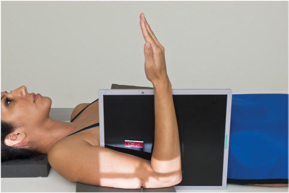
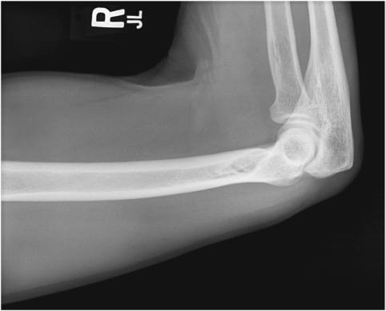
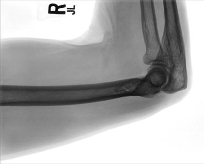

# Rx incidență latero-medială pentru traumatism acut / regim de urgență — INCIDENȚĂ DE PROFIL CU FASCICUL ORIZONTAL (- MIJLOC)

  📷 Radiografie Convențională (Rx)
  <strong>Actualizat:</strong> 2026-09-15
  <strong>Autor:</strong> Departamentul de Radiologie / Referință Bontrager

---

-   __1. Rezumat Clinic & Indicații__

    ---

    === "Indicații Clinice"

        - Suspiciune de fractură și luxație / subluxație articulară a humerusului mijlociu și distal
        - Procese patologice, inclusiv osteoporoza

    === "Ghid Național IRIS"

        !!! info "Referință Primară: Ghidul Național IRIS (Ordinul MS 1342/2012)"
            - **Capitol Ghid IRIS:** *Aparat locomotor & Membru superior*
            - **Grad de Recomandare:** **Grad A**
            - **Nivel de Iradiere Estimată:** `Clasa 1 (Minimă < 0.01 mSv)`

            [:octicons-search-16: Deschide Ghidul IRIS](../../iris.md){ .md-button .md-button--primary } [:material-open-in-new: Aplicația Oficială PWA](https://radiologie-pediatrica.ro/iris/){ .md-button target="_blank" rel="noopener" }

-   __2. Poziționare & Centrare Fascicul__

    ---

    - **Poziție Pacient:** Conform incidenței standard descrise
    - **Punct de Centrare Fascicul:** Perpendicular pe punctul median al celor două treimi distale ale humerusului
    - **Distanță Focar-Film (DFF / SID):** 100 cm
    - **Comandă Respiratorie:** Apnee pe durata expunerii. (Acest pas este important pentru prevenirea mișcării receptorului de imagine în timpul expunerii.) 43 (30) (24) Humerus — RUTINĂ AP Incidență de profil rotațională SPECIALĂ (traumatism acut / regim de urgență) fascicul orizontal, incidență de profil Incidență de profil transtoracică Fig. 5.34 fascicul orizontal, incidență de profil (humerus mijlociu și humerus distal). Fig. 5.35 Incidență latero-medială a humerusului mijlociu până la distal. olecran șanț trohlear diafiză (corp) Fig. 5.36 Incidență latero-medială a humerusului mijlociu până la distal.

-   __3. Parametri Tehnici Expunere__

    ---

    | Parametru Tehnic | Valoare Configurare Generator / Tub |
    |:-----------------|:-------------------------------------|
    | **Tensiune Tub (kV)** | 70-85 kV |
    | **Sarcină / Produs Curent-Timp (mAs)** | DE CONFIGURAT PE APARAT |
    | **Distanță Focar-Film (DFF / SID)** | 100 cm |
    | **Grilă Antidifuzoare (Bucky)** | Fără grilă (expunere directă) |
    | **Dimensiune Focar** | Focar Mic (0.6 mm) |
    | **Camere de Ionizare AEC** | DE CONFIGURAT PE APARAT |
    | **Colimare Fascicul** | Dimensiunea câmpului: Colimați la marginile părților moi. Includeți humerusul distal și humerusul mijlociu, articulația cotului și antebrațul proximal. |
    | **Filtrare Tub** | Totală ≥ 2.5 mm Al echivalent |

-   __4. Criterii de Calitate & Reușită Imagine__

    ---

    - Incidența de profil a humerusului mijlociu și distal, inclusiv articulația cotului, este vizibilă (Fig. 5.35 și 5.36).
    - Cele două treimi distale ale humerusului trebuie să fie bine vizualizate. Poziție:
    - Axa longitudinală a humerusului trebuie să fie aliniată cu axa longitudinală a receptorului de imagine.
    - Cotul este flectat la 90°.
    - Dimensiunea câmpului de colimare până la aria de interes diagnostic. Expunere:
    - Expunerea și contrastul optime ale receptorului de imagine, fără mișcare, trebuie să vizualizeze clar marginile corticale și contururile osoase și traveele trabeculare, fără artefacte de mișcare.

-   __5. Protecție Radiologică (ALARA)__

    ---

    - Ecranare gonadică și a organelor radiosensibile conform procedurilor locale de radioprotecție ALARA.
    - Colimare strictă la aria de interes pentru limitarea radiației difuze.
    - Verificarea posibilității unei sarcini la pacientele de vârstă fertilă înainte de expunere.

### 🖼️ Imagini

<figure class="protocol-image-card" markdown>

<figcaption><strong>Fig. 5.34 fascicul orizontal, incidență de profil (humerus mijlociu și distal).</strong> — Poziționarea pacientului conform Ghidului Bontrager (Fig. 5.34 fascicul orizontal, incidență de profil (humerus mijlociu și distal).)</figcaption>

</figure>

<figure class="protocol-image-card" markdown>

<figcaption><strong>Fig. 5.35 Incidență latero-medială a humerusului mijlociu—</strong> — Aspect radiografic de referință conform Ghidului Bontrager (Fig. 5.35 incidență latero-medială a humerusului mijlociu—)</figcaption>

</figure>

<figure class="protocol-image-card" markdown>

<figcaption><strong>Fig. 5.36 Incidență latero-medială a humerusului mijlociu—</strong> — Aspect radiografic de referință conform Ghidului Bontrager (Fig. 5.36 incidență latero-medială a humerusului mijlociu—)</figcaption>

</figure>

=== "Ghid Rapid de Execuție"

    1. **Identificarea și verificarea pacientului:** verificare identitate, zonă de examinat, consimțământ conform procedurii și evaluarea posibilității unei sarcini, când este relevantă.
    2. **Pregătire:** îndepărtarea oricăror obiecte radiopace (bijuterii, agrafe, fermoare, proteze, pansamente dense).
    3. **Poziționare precisă:** alinierea receptorului de imagine și a tubului la distanța prescrisă (100 cm).
    4. **Colimare strictă:** adaptarea fasciculului strict la regiunea de diagnostic pentru scăderea iradierii și reducerea radiației difuze.
    5. **Radioprotecție:** verificarea [politicii RX](../radioprotectie.md), cu măsuri distincte pentru pacient, personal și însoțitor.

## Surse de documentare

- [Bontrager's Textbook of Radiographic Positioning (Ed. 9/10), Pagina 201](https://www.elsevier.com/books/textbook-of-radiographic-positioning-and-related-anatomy/lampignano/978-0-323-65367-1)
