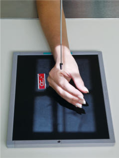
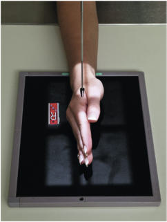
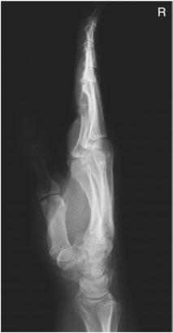
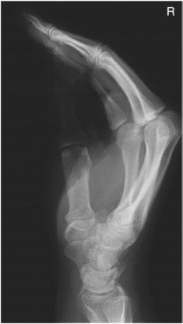
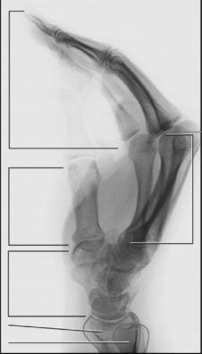

# Rx LATEROMEDIAL PROJECTIONS LATERAL IN EXTENSION AND FLEXION (- Mână)

  📷 Radiografie Convențională (Rx)
  <strong>Actualizat:</strong> 2026-09-15
  <strong>Autor:</strong> Departamentul de Radiologie / Referință Bontrager

---

-   __1. Rezumat Clinic & Indicații__

    ---

    === "Indicații Clinice"

        - The lateral in either extension or flexion is an alternative to the fan lateral for localization of foreign bodies of the Mână and Degete Mână; it also demonstrates anterior or posterior displaced suspiciune de fractură of the metacarpals. The lateral in a natural flexed position may be less painful for the patient.

    === "Ghid Național IRIS"

        !!! info "Referință Primară: Ghidul Național IRIS (Ordinul MS 1342/2012)"
            - **Capitol Ghid IRIS:** *Ghidul Național IRIS*
            - **Grad de Recomandare:** **De verificat pe indicație; fără grad atribuit automat**
            - **Nivel de Iradiere Estimată:** `De verificat pentru examinarea și populația selectate`

            [:octicons-search-16: Deschide Ghidul IRIS](../../iris.md){ .md-button .md-button--primary } [:material-open-in-new: Aplicația Oficială PWA](https://radiologie-pediatrica.ro/iris/){ .md-button target="_blank" rel="noopener" }
-   __2. Poziționare & Centrare Fascicul__

    ---

    - **Poziție Pacient:** Pacient: Seat patient at end of table with Mână and Antebraț extended.; Regiune anatomică: Rotate Mână and Pumn (Articulație Radiocarpiană), with Police side up, into true Incidență de Profil (Lateral), with second to fifth MCP joints centered to IR and CR. Lateral in extension: Extend Degete Mână and Police, and support against a radiolucent support block. Ensure that all Degete Mână and metacarpals are superimposed directly for true Incidență de Profil (Lateral) (Fig. 4.78) Lateral in flexion: Flex Degete Mână into a natural flexed position, with Police lightly touching the first finger; maintain true Incidență de Profil (Lateral) (Fig. 4.79)
    - **Punct de Centrare Fascicul:** perpendicular to IR, directed to the second to fifth MCp joints
    - **Distanță Focar-Film (DFF / SID):** 100 cm
    - **Comandă Respiratorie:** Apnee pe durata expunerii (sau conform cooperării pacientului)

-   __3. Parametri Tehnici Expunere__

    ---

    | Parametru Tehnic | Valoare Configurare Generator / Tub |
    |:-----------------|:-------------------------------------|
    | **Tensiune Tub (kV)** | 55 kV |
    | **Sarcină / Produs Curent-Timp (mAs)** | DE CONFIGURAT PE APARAT |
    | **Distanță Focar-Film (DFF / SID)** | 100 cm |
    | **Grilă Antidifuzoare (Bucky)** | Fără grilă (expunere directă) |
    | **Dimensiune Focar** | Focar Mic (0.6 mm) |
    | **Camere de Ionizare AEC** | DE CONFIGURAT PE APARAT |
    | **Colimare Fascicul** | Field Size Collimate to outer margins of Mână and Pumn (Articulație Radiocarpiană). Mână ALTERNATE Extension lateral Flexion lateral Fig. 4.78 Lateral in extension. Fig. 4.79 Lateral in flexion. |
    | **Filtrare Tub** | Totală ≥ 2.5 mm Al echivalent |

-   __4. Criterii de Calitate & Reușită Imagine__

    ---

    - Entire Mână and Pumn (Articulație Radiocarpiană) and about 1 inch (2.5 cm) of distal Antebraț are visible.
    - Police should appear in slightly Incidență Oblică and free of superimposition with joint spaces open. Position:
    - Long axis of the Mână and Pumn (Articulație Radiocarpiană) is aligned with long axis of the IR.
    - Mână and Pumn (Articulație Radiocarpiană) should be in true Incidență de Profil (Lateral), as evidenced by: distal radius and ulna are superimposed; metacarpals and phalanges are superimposed.
    - Lateral in extension: The phalanges and metacarpals should be superimposed and extended (Fig. 4.80).
    - Lateral in flexion: The phalanges and metacarpals should be superimposed with Mână in natural flexed position (Figs. 4.81 and 4.82).
    - CR and center of collimation field size should be at second to fifth MCp joints. Exposure:
    - Optimal image receptor exposure and contrast with no motion demonstrate soft tissue margins and clear, Contururi osoase și travee trabeculare nete, fără artefacte de mișcare.
    - Margins of individual metacarpals and phalanges are visible but mostly superimposed. Fig. 4.80 Lateral in extension. Fig. 4.81 Lateral in flexion. Ulna Radius Phalanges R 2nd to 5th MCP joints (CR) 2nd to 5th metacarpals 1st metacarpal Carpals Fig. 4.82 Lateral in flexion.

-   __5. Protecție Radiologică (ALARA)__

    ---

    - Ecranare gonadică și a organelor radiosensibile conform procedurilor locale de radioprotecție ALARA.
    - Colimare strictă la aria de interes pentru limitarea radiației difuze.
    - Verificarea posibilității unei sarcini la pacientele de vârstă fertilă înainte de expunere.

### 🖼️ Imagini

<figure class="protocol-image-card" markdown>

<figcaption><strong>Fig. 4.78 Lateral in extension.</strong> — Poziționare pacient conform Ghidului Bontrager (Fig. 4.78 Lateral in extension.)</figcaption>

</figure>

<figure class="protocol-image-card" markdown>

<figcaption><strong>Fig. 4.79 Lateral in flexion.</strong> — Aspect radiografic de referință conform Ghidului Bontrager (Fig. 4.79 Lateral in flexion.)</figcaption>

</figure>

<figure class="protocol-image-card" markdown>

<figcaption><strong>Fig. 4.80 Lateral in</strong> — Aspect radiografic de referință conform Ghidului Bontrager (Fig. 4.80 Lateral in)</figcaption>

</figure>

<figure class="protocol-image-card" markdown>

<figcaption><strong>Fig. 4.81 Lateral in flexion.</strong> — Aspect radiografic de referință conform Ghidului Bontrager (Fig. 4.81 Lateral in flexion.)</figcaption>

</figure>

<figure class="protocol-image-card" markdown>

<figcaption><strong>Fig. 4.82 Lateral in flexion.</strong> — Aspect radiografic de referință conform Ghidului Bontrager (Fig. 4.82 Lateral in flexion.)</figcaption>

</figure>

=== "Ghid Rapid de Execuție"

    1. **Identificarea și verificarea pacientului:** verificare identitate, zonă de examinat, consimțământ conform procedurii și evaluarea posibilității unei sarcini, când este relevantă.
    2. **Pregătire:** îndepărtarea oricăror obiecte radiopace (bijuterii, agrafe, fermoare, proteze, pansamente dense).
    3. **Poziționare precisă:** alinierea receptorului de imagine și a tubului la distanța prescrisă (100 cm).
    4. **Colimare strictă:** adaptarea fasciculului strict la regiunea de diagnostic pentru scăderea iradierii și reducerea radiației difuze.
    5. **Radioprotecție:** verificarea [politicii RX](../radioprotectie.md), cu măsuri distincte pentru pacient, personal și însoțitor.

## Surse de documentare

- [Bontrager's Textbook of Radiographic Positioning (Ed. 9/10), Pagina 163](https://www.elsevier.com/books/textbook-of-radiographic-positioning-and-related-anatomy/lampignano/978-0-323-65367-1)
