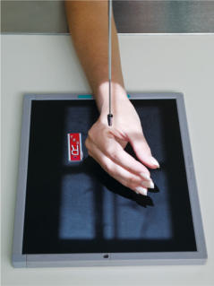
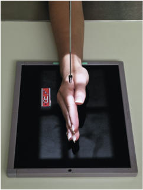
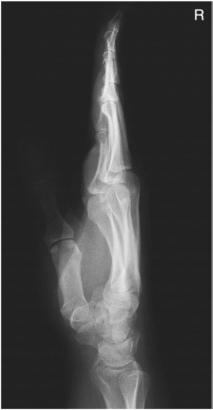
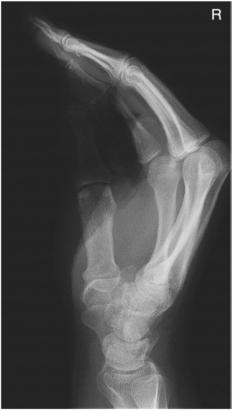
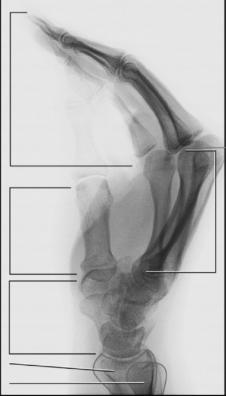

# Rx incidență latero-medială — PROFIL ÎN EXTENSIE ȘI FLEXIE (- MÂNĂ)

  📷 Radiografie Convențională (Rx)
  <strong>Actualizat:</strong> 2026-09-15
  <strong>Autor:</strong> Departamentul de Radiologie / Referință Bontrager

---

-   __1. Rezumat Clinic & Indicații__

    ---

    === "Indicații Clinice"

        - Incidența de profil în extensie sau în flexie este o alternativă la incidența de profil în evantai pentru localizarea corpului străin / corpurilor străine radioopace ale mâinii și degetelor mâinii; evidențiază, de asemenea, deplasarea anterioară sau posterioară în suspiciunea de fractură a oaselor metacarpiene. Incidența de profil în poziția naturală flectată poate fi mai puțin dureroasă pentru pacient.

    === "Ghid Național IRIS"

        !!! info "Referință Primară: Ghidul Național IRIS (Ordinul MS 1342/2012)"
            - **Capitol Ghid IRIS:** *Aparat locomotor & Membru superior*
            - **Grad de Recomandare:** **Grad A**
            - **Nivel de Iradiere Estimată:** `Clasa 1 (Minimă < 0.01 mSv)`

            [:octicons-search-16: Deschide Ghidul IRIS](../../iris.md){ .md-button .md-button--primary } [:material-open-in-new: Aplicația Oficială PWA](https://radiologie-pediatrica.ro/iris/){ .md-button target="_blank" rel="noopener" }

-   __2. Poziționare & Centrare Fascicul__

    ---

    - **Poziție Pacient:** Pacient: Așezați pacientul la capătul mesei, cu mâna și antebrațul extinse.; Regiune anatomică: Rotiți mâna și pumnul (articulația radiocarpiană), cu partea policelui în sus, în adevărata incidență de profil, cu articulațiile metacarpofalangiene (MCF) de la a doua până la a cincea centrate pe receptorul de imagine și pe raza centrală. Profil în extensie: Extindeți degetele mâinii și policele și sprijiniți-le pe un suport radiotransparent. Asigurați-vă că toate degetele mâinii și oasele metacarpiene sunt suprapuse direct pentru adevărata incidență de profil (Fig. 4.78). Profil în flexie: Flectați degetele mâinii în poziție naturală flectată, cu policele atingând ușor primul deget; mențineți adevărata incidență de profil (Fig. 4.79)
    - **Punct de Centrare Fascicul:** Perpendicular pe receptorul de imagine, orientat spre a doua până la a cincea articulații metacarpofalangiene (MCF)
    - **Distanță Focar-Film (DFF / SID):** 100 cm
    - **Comandă Respiratorie:** Apnee pe durata expunerii (sau conform cooperării pacientului)

-   __3. Parametri Tehnici Expunere__

    ---

    | Parametru Tehnic | Valoare Configurare Generator / Tub |
    |:-----------------|:-------------------------------------|
    | **Tensiune Tub (kV)** | 55 kV |
    | **Sarcină / Produs Curent-Timp (mAs)** | DE CONFIGURAT PE APARAT |
    | **Distanță Focar-Film (DFF / SID)** | 100 cm |
    | **Grilă Antidifuzoare (Bucky)** | Fără grilă (expunere directă) |
    | **Dimensiune Focar** | Focar Mic (0.6 mm) |
    | **Camere de Ionizare AEC** | DE CONFIGURAT PE APARAT |
    | **Colimare Fascicul** | Dimensiunea câmpului: Colimați la marginile externe ale mâinii și pumnului (articulația radiocarpiană). MÂNĂ ALTERNATIVĂ Profil în extensie Profil în flexie Fig. 4.78 profil în extensie. Fig. 4.79 profil în flexie. |
    | **Filtrare Tub** | Totală ≥ 2.5 mm Al echivalent |

-   __4. Criterii de Calitate & Reușită Imagine__

    ---

    - Întreaga mână și întregul pumn (articulația radiocarpiană) și aproximativ 1 țol (2.5 cm) din antebrațul distal sunt vizibile.
    - Policele trebuie să apară în incidență ușor oblică și liber de suprapunere, cu spațiile articulare deschise. Poziție:
    - Axa longitudinală a mâinii și pumnului (articulația radiocarpiană) este aliniată cu axa longitudinală a receptorului de imagine.
    - Mâna și pumnul (articulația radiocarpiană) trebuie să fie în adevărata incidență de profil, evidențiată prin: radiusul distal și ulna sunt suprapuse; oasele metacarpiene și falangele sunt suprapuse.
    - Profil în extensie: falangele și oasele metacarpiene trebuie să fie suprapuse și extinse (Fig. 4.80).
    - Profil în flexie: falangele și oasele metacarpiene trebuie să fie suprapuse, cu mâna în poziție naturală flectată (Fig. 4.81 și 4.82).
    - Raza centrală și centrul câmpului de colimare trebuie să fie la nivelul articulațiilor metacarpofalangiene (MCF) de la a doua până la a cincea. Expunere:
    - Expunerea și contrastul optime ale receptorului de imagine, fără mișcare, evidențiază clar marginile părților moi, contururile osoase și traveele trabeculare, fără artefacte de mișcare.
    - Marginile fiecărui metacarpian și ale fiecărei falange sunt vizibile, dar în mare parte suprapuse. Fig. 4.80 Incidență de profil în extensie. Fig. 4.81 Incidență de profil în flexie. Ulnă; radius; falange; R; articulațiile metacarpofalangiene (MCF) de la a 2-a până la a 5-a (raza centrală); metacarpienele de la al 2-lea până la al 5-lea; metacarpianul 1; oase carpiene. Fig. 4.82 Incidență de profil în flexie.

-   __5. Protecție Radiologică (ALARA)__

    ---

    - Ecranare gonadică și a organelor radiosensibile conform procedurilor locale de radioprotecție ALARA.
    - Colimare strictă la aria de interes pentru limitarea radiației difuze.
    - Verificarea posibilității unei sarcini la pacientele de vârstă fertilă înainte de expunere.

### 🖼️ Imagini

<figure class="protocol-image-card" markdown>

<figcaption><strong>Fig. 4.78 profil în extensie.</strong> — Poziționarea pacientului conform Ghidului Bontrager (Fig. 4.78 profil în extensie.)</figcaption>

</figure>

<figure class="protocol-image-card" markdown>

<figcaption><strong>Fig. 4.79 profil în flexie.</strong> — Aspect radiografic de referință conform Ghidului Bontrager (Fig. 4.79 profil în flexie.)</figcaption>

</figure>

<figure class="protocol-image-card" markdown>

<figcaption><strong>Fig. 4.80 profil în</strong> — Aspect radiografic de referință conform Ghidului Bontrager (Fig. 4.80 profil în)</figcaption>

</figure>

<figure class="protocol-image-card" markdown>

<figcaption><strong>Fig. 4.81 profil în flexie.</strong> — Aspect radiografic de referință conform Ghidului Bontrager (Fig. 4.81 profil în flexie.)</figcaption>

</figure>

<figure class="protocol-image-card" markdown>

<figcaption><strong>Fig. 4.82 profil în flexie.</strong> — Aspect radiografic de referință conform Ghidului Bontrager (Fig. 4.82 profil în flexie.)</figcaption>

</figure>

=== "Ghid Rapid de Execuție"

    1. **Identificarea și verificarea pacientului:** verificare identitate, zonă de examinat, consimțământ conform procedurii și evaluarea posibilității unei sarcini, când este relevantă.
    2. **Pregătire:** îndepărtarea oricăror obiecte radiopace (bijuterii, agrafe, fermoare, proteze, pansamente dense).
    3. **Poziționare precisă:** alinierea receptorului de imagine și a tubului la distanța prescrisă (100 cm).
    4. **Colimare strictă:** adaptarea fasciculului strict la regiunea de diagnostic pentru scăderea iradierii și reducerea radiației difuze.
    5. **Radioprotecție:** verificarea [politicii RX](../radioprotectie.md), cu măsuri distincte pentru pacient, personal și însoțitor.

## Surse de documentare

- [Bontrager's Textbook of Radiographic Positioning (Ed. 9/10), Pagina 163](https://www.elsevier.com/books/textbook-of-radiographic-positioning-and-related-anatomy/lampignano/978-0-323-65367-1)
