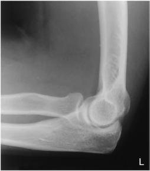
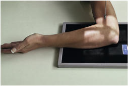
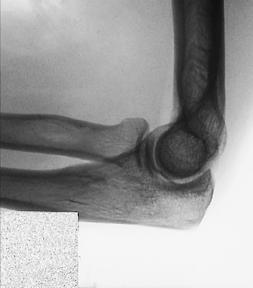
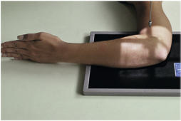
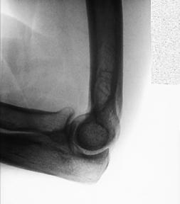
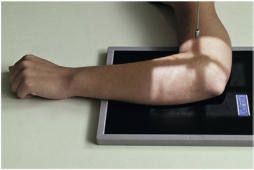
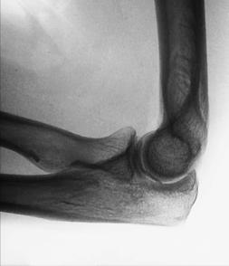
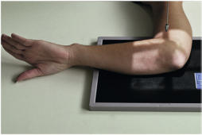

# Rx Incidență Latero-MedialăS RADIAL HEAD (Cot)

  📷 Radiografie Convențională (Rx)
  <strong>Actualizat:</strong> 2026-09-15
  <strong>Autor:</strong> Departamentul de Radiologie / Referință Bontrager

---

-   __1. Rezumat Clinic & Indicații__

    ---

    === "Indicații Clinice"

        - Occult suspiciune de fractură de cap radial sau neck

    === "Ghid Național IRIS"

        !!! info "Referință Primară: Ghidul Național IRIS (Ordinul MS 1342/2012)"
            - **Capitol Ghid IRIS:** *Ghidul Național IRIS*
            - **Grad de Recomandare:** **De verificat pe indicație; fără grad atribuit automat**
            - **Nivel de Iradiere Estimată:** `De verificat pentru examinarea și populația selectate`

            [:octicons-search-16: Deschide Ghidul IRIS](../../iris.md){ .md-button .md-button--primary } [:material-open-in-new: Aplicația Oficială PWA](https://radiologie-pediatrica.ro/iris/){ .md-button target="_blank" rel="noopener" }
-   __2. Poziționare & Centrare Fascicul__

    ---

    - **Poziție Pacient:** Pacient: Seat pacient la end de table, cu braț flectat 90° și resting pe receptorul de imagine cu Humerus, Antebraț, și Mână pe same plan orizontal. Place support under Mână și Pumn (Articulație Radiocarpiană) if needed.; Regiune anatomică: Center cap radial area la center de receptorul de imagine, poziționat so that distal Humerus și proximal Antebraț sunt plasat “square” cu, sau paralel cu, margini de receptorul de imagine. Center cap radial region la raza centrală. Take four incidențe, only difference among four being rotație de Mână și Pumn (Articulație Radiocarpiană) de la (1) maximum extern rotație la (4) maximum intern rotație; different parts de cap radial projected clear de proces coronoid sunt evidențiat. Nearcomplete rotație de cap radial occurs în these four incidențe, ca follows: 1. Supinate Mână (palm up) și externally rotate ca far ca pacient poate tolerate (Fig. 4.154). 2. Place Mână în true Incidență de Profil (lateral) (Police up) (Fig. 4.156). 3. Pronate Mână (palm down) (Fig. 4.158). 4. Internally rotate Mână (Police down) ca far ca pacient poate tolerate (Fig. 4.160).
    - **Punct de Centrare Fascicul:** perpendicular pe receptorul de imagine, orientat la cap radial (approximately1 inch [2 la 3 cm] distal la epicondil lateral)
    - **Distanță Focar-Film (DFF / SID):** 100 cm
    - **Comandă Respiratorie:** Apnee pe durata expunerii (sau conform cooperării pacientului)

-   __3. Parametri Tehnici Expunere__

    ---

    | Parametru Tehnic | Valoare Configurare Generator / Tub |
    |:-----------------|:-------------------------------------|
    | **Tensiune Tub (kV)** | 65 kV |
    | **Sarcină / Produs Curent-Timp (mAs)** | DE CONFIGURAT PE APARAT |
    | **Distanță Focar-Film (DFF / SID)** | 100 cm |
    | **Grilă Antidifuzoare (Bucky)** | Fără grilă (expunere directă) |
    | **Dimensiune Focar** | Focar Mic (0.6 mm) |
    | **Camere de Ionizare AEC** | DE CONFIGURAT PE APARAT |
    | **Colimare Fascicul** | Field Size Collimate pe four sides la aria de interes diagnostic (including la least 3 la 4 inches [10 cm] de proximal Antebraț și distal portion de Humerus). Cot SPECIAL traumatism acuttism / Regim Urgență axial laterals (Coyle method) cap radial laterals Fig. 4.155 Mână în supinație (maximum extern rotație). Fig. 4.157 Mână lateral. Fig. 4.159 Mână în pronație. Fig. 4.161 Mână cu maximum intern rotație. Fig. 4.154 Mână în supinație (maximum extern rotație). Fig. 4.156 Mână lateral. Fig. 4.158 Mână în pronație. Fig. 4.160 Mână cu maximum intern rotație. |
    | **Filtrare Tub** | Totală ≥ 2.5 mm Al echivalent |

-   __4. Criterii de Calitate & Reușită Imagine__

    ---

    - Cot trebuie să fie flectat 90° în true Incidență de Profil (lateral), ca evidenced prin direct superimposition de epicondyles.
    - cap radial și neck trebuie să fie partially superimposed prin ulna but completely visualized în profile în various incidențe.
    - tuberozitate radială bicipitală trebuie să fie visualized în various poziții și grade de profile ca follows (see small arrows): (1) Fig. 4.155, slightly anterior; (2) Fig. 4.157, nu în profile, superimposed over radial shaft; (3) Fig. 4.159, slightly posterior; (4) Fig. 4.161, seen posteriorly, adjacent la ulna when Mână și Pumn (Articulație Radiocarpiană) sunt la maximum intern rotație.
    - optim expunere cu fără mișcare trebuie să clearly visualize net, bony margins și clear trabecular markings de cap radial și neck area.

-   __5. Protecție Radiologică (ALARA)__

    ---

    - Ecranare gonadică și a organelor radiosensibile conform procedurilor locale de radioprotecție ALARA.
    - Colimare strictă la aria de interes pentru limitarea radiației difuze.
    - Verificarea posibilității unei sarcini la pacientele de vârstă fertilă înainte de expunere.

### 🖼️ Imagini

<figure class="protocol-image-card" markdown>

<figcaption><strong>Fig. 4.155 Mână în supinație</strong> — Poziționare pacient conform Ghidului Bontrager (Fig. 4.155 mână în supinație)</figcaption>

</figure>

<figure class="protocol-image-card" markdown>

<figcaption><strong>Fig. 4.157 Mână lateral.</strong> — Aspect radiografic de referință conform Ghidului Bontrager (Fig. 4.157 mână lateral.)</figcaption>

</figure>

<figure class="protocol-image-card" markdown>

<figcaption><strong>Fig. 4.159 Mână în pronație.</strong> — Aspect radiografic de referință conform Ghidului Bontrager (Fig. 4.159 mână în pronație.)</figcaption>

</figure>

<figure class="protocol-image-card" markdown>

<figcaption><strong>Fig. 4.161 Mână cu maximum</strong> — Aspect radiografic de referință conform Ghidului Bontrager (Fig. 4.161 mână cu maximum)</figcaption>

</figure>

<figure class="protocol-image-card" markdown>

<figcaption><strong>Fig. 4.154 Mână în supinație</strong> — Aspect radiografic de referință conform Ghidului Bontrager (Fig. 4.154 mână în supinație)</figcaption>

</figure>

<figure class="protocol-image-card" markdown>

<figcaption><strong>Fig. 4.156 Mână lateral.</strong> — Aspect radiografic de referință conform Ghidului Bontrager (Fig. 4.156 mână lateral.)</figcaption>

</figure>

<figure class="protocol-image-card" markdown>

<figcaption><strong>Fig. 4.158 Mână în pronație.</strong> — Aspect radiografic de referință conform Ghidului Bontrager (Fig. 4.158 mână în pronație.)</figcaption>

</figure>

<figure class="protocol-image-card" markdown>

<figcaption><strong>Fig. 4.160 Mână cu maximum</strong> — Aspect radiografic de referință conform Ghidului Bontrager (Fig. 4.160 mână cu maximum)</figcaption>

</figure>

=== "Ghid Rapid de Execuție"

    1. **Identificarea și verificarea pacientului:** verificare identitate, zonă de examinat, consimțământ conform procedurii și evaluarea posibilității unei sarcini, când este relevantă.
    2. **Pregătire:** îndepărtarea oricăror obiecte radiopace (bijuterii, agrafe, fermoare, proteze, pansamente dense).
    3. **Poziționare precisă:** alinierea receptorului de imagine și a tubului la distanța prescrisă (100 cm).
    4. **Colimare strictă:** adaptarea fasciculului strict la regiunea de diagnostic pentru scăderea iradierii și reducerea radiației difuze.
    5. **Radioprotecție:** verificarea [politicii RX](../radioprotectie.md), cu măsuri distincte pentru pacient, personal și însoțitor.

## Surse de documentare

- [Bontrager's Textbook of Radiographic Positioning (Ed. 9/10), Pagina 185](https://www.elsevier.com/books/textbook-of-radiographic-positioning-and-related-anatomy/lampignano/978-0-323-65367-1)
