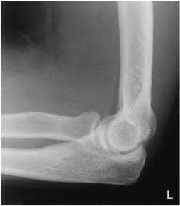
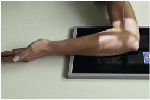
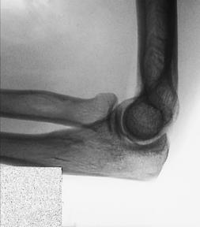
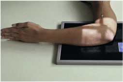
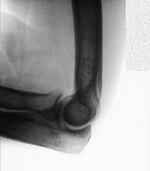
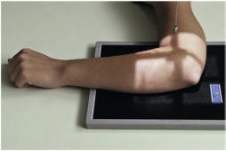
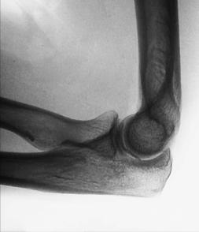
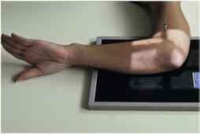

# Rx incidență latero-medială a capului radial (cot)

  📷 Radiografie Convențională (Rx)
  <strong>Actualizat:</strong> 2026-09-15
  <strong>Autor:</strong> Departamentul de Radiologie / Referință Bontrager

---

-   __1. Rezumat Clinic & Indicații__

    ---

    === "Indicații Clinice"

        - Suspiciune ocultă de fractură a capului radial sau a colului

    === "Ghid Național IRIS"

        !!! info "Referință Primară: Ghidul Național IRIS (Ordinul MS 1342/2012)"
            - **Capitol Ghid IRIS:** *Aparat locomotor & Membru superior*
            - **Grad de Recomandare:** **Grad A**
            - **Nivel de Iradiere Estimată:** `Clasa 1 (Minimă < 0.02 mSv)`

            [:octicons-search-16: Deschide Ghidul IRIS](../../iris.md){ .md-button .md-button--primary } [:material-open-in-new: Aplicația Oficială PWA](https://radiologie-pediatrica.ro/iris/){ .md-button target="_blank" rel="noopener" }

-   __2. Poziționare & Centrare Fascicul__

    ---

    - **Poziție Pacient:** Pacient: Așezați pacientul la capătul mesei, cu brațul flectat la 90° și sprijinit pe receptorul de imagine, cu humerusul, antebrațul și mâna în același plan orizontal. Așezați un suport sub mână și pumn (articulația radiocarpiană), dacă este necesar.; Regiune anatomică: Centrați regiunea capului radial la centrul receptorului de imagine, poziționat astfel încât humerusul distal și antebrațul proximal să fie în unghi drept față de marginile receptorului de imagine sau paralele cu acestea. Centrați regiunea capului radial la nivelul razei centrale. Efectuați patru incidențe, singura diferență dintre cele patru fiind rotația mâinii și pumnului (articulația radiocarpiană), de la (1) rotație externă maximă la (4) rotație internă maximă; diferite porțiuni ale capului radial proiectate liber de procesul coronoid sunt evidențiate. Rotația aproape completă a capului radial se realizează în aceste patru incidențe, după cum urmează: 1. Supinați mâna (palma în sus) și rotiți-o extern cât poate tolera pacientul (Fig. 4.154). 2. Așezați mâna în incidență de profil strict (policele în sus) (Fig. 4.156). 3. Pronați mâna (palma în jos) (Fig. 4.158). 4. Rotiți mâna intern cât poate tolera pacientul (policele în jos) (Fig. 4.160).
    - **Punct de Centrare Fascicul:** Perpendicular pe receptorul de imagine, orientat spre capul radial (aproximativ 1 țol [2 la 3 cm] distal față de epicondilul lateral)
    - **Distanță Focar-Film (DFF / SID):** 100 cm
    - **Comandă Respiratorie:** Apnee pe durata expunerii (sau conform cooperării pacientului)

-   __3. Parametri Tehnici Expunere__

    ---

    | Parametru Tehnic | Valoare Configurare Generator / Tub |
    |:-----------------|:-------------------------------------|
    | **Tensiune Tub (kV)** | 65 kV |
    | **Sarcină / Produs Curent-Timp (mAs)** | DE CONFIGURAT PE APARAT |
    | **Distanță Focar-Film (DFF / SID)** | 100 cm |
    | **Grilă Antidifuzoare (Bucky)** | Fără grilă (expunere directă) |
    | **Dimensiune Focar** | Focar Mic (0.6 mm) |
    | **Camere de Ionizare AEC** | DE CONFIGURAT PE APARAT |
    | **Colimare Fascicul** | Dimensiunea câmpului: Colimați pe cele patru laturi la aria de interes diagnostic (incluzând cel puțin 3 până la 4 țoli [10 cm] din antebrațul proximal și porțiunea distală a humerusului). Cot SPECIAL traumatism acut / regim de urgență, incidențe axiale de profil (metoda Coyle), incidențe de profil ale capului radial. Fig. 4.155 Mână în supinație (rotație externă maximă). Fig. 4.157 Mână în profil. Fig. 4.159 Mână în pronație. Fig. 4.161 Mână cu rotație internă maximă. Fig. 4.154 Mână în supinație (rotație externă maximă). Fig. 4.156 Mână în profil. Fig. 4.158 Mână în pronație. Fig. 4.160 Mână cu rotație internă maximă. |
    | **Filtrare Tub** | Totală ≥ 2.5 mm Al echivalent |

-   __4. Criterii de Calitate & Reușită Imagine__

    ---

    - Cotul trebuie să fie flectat la 90° în incidență de profil strict, fapt evidențiat prin suprapunerea directă a epicondililor.
    - Capul radial și colul trebuie să fie parțial suprapuse de ulnă, dar complet vizualizate din profil în diferitele incidențe.
    - Tuberozitatea radială bicipitală trebuie să fie vizualizată în diferite poziții și grade de profil, după cum urmează (vezi săgețile mici): (1) Fig. 4.155, ușor anterior; (2) Fig. 4.157, nu din profil, suprapusă peste diafiza radială; (3) Fig. 4.159, ușor posterior; (4) Fig. 4.161, vizibilă posterior, adiacentă ulnei când mâna și pumnul (articulația radiocarpiană) se află în rotație internă maximă.
    - O expunere optimă, fără mișcare, trebuie să vizualizeze clar marginile osoase nete și desenul trabecular clar al capului radial și al regiunii colului.

-   __5. Protecție Radiologică (ALARA)__

    ---

    - Ecranare gonadică și a organelor radiosensibile conform procedurilor locale de radioprotecție ALARA.
    - Colimare strictă la aria de interes pentru limitarea radiației difuze.
    - Verificarea posibilității unei sarcini la pacientele de vârstă fertilă înainte de expunere.

### 🖼️ Imagini

<figure class="protocol-image-card" markdown>

<figcaption><strong>Fig. 4.155 Mână în supinație</strong> — Poziționarea pacientului conform Ghidului Bontrager (Fig. 4.155, mână în supinație)</figcaption>

</figure>

<figure class="protocol-image-card" markdown>

<figcaption><strong>Fig. 4.157 Mână în profil.</strong> — Aspect radiografic de referință conform Ghidului Bontrager (Fig. 4.157, mână în profil.)</figcaption>

</figure>

<figure class="protocol-image-card" markdown>

<figcaption><strong>Fig. 4.159 Mână în pronație.</strong> — Aspect radiografic de referință conform Ghidului Bontrager (Fig. 4.159, mână în pronație.)</figcaption>

</figure>

<figure class="protocol-image-card" markdown>

<figcaption><strong>Fig. 4.161 Mână cu rotație internă maximă</strong> — Aspect radiografic de referință conform Ghidului Bontrager (Fig. 4.161, mână cu rotație internă maximă)</figcaption>

</figure>

<figure class="protocol-image-card" markdown>

<figcaption><strong>Fig. 4.154 Mână în supinație</strong> — Aspect radiografic de referință conform Ghidului Bontrager (Fig. 4.154, mână în supinație)</figcaption>

</figure>

<figure class="protocol-image-card" markdown>

<figcaption><strong>Fig. 4.156 Mână în profil.</strong> — Aspect radiografic de referință conform Ghidului Bontrager (Fig. 4.156, mână în profil.)</figcaption>

</figure>

<figure class="protocol-image-card" markdown>

<figcaption><strong>Fig. 4.158 Mână în pronație.</strong> — Aspect radiografic de referință conform Ghidului Bontrager (Fig. 4.158, mână în pronație.)</figcaption>

</figure>

<figure class="protocol-image-card" markdown>

<figcaption><strong>Fig. 4.160 Mână cu rotație internă maximă</strong> — Aspect radiografic de referință conform Ghidului Bontrager (Fig. 4.160, mână cu rotație internă maximă)</figcaption>

</figure>

=== "Ghid Rapid de Execuție"

    1. **Identificarea și verificarea pacientului:** verificare identitate, zonă de examinat, consimțământ conform procedurii și evaluarea posibilității unei sarcini, când este relevantă.
    2. **Pregătire:** îndepărtarea oricăror obiecte radiopace (bijuterii, agrafe, fermoare, proteze, pansamente dense).
    3. **Poziționare precisă:** alinierea receptorului de imagine și a tubului la distanța prescrisă (100 cm).
    4. **Colimare strictă:** adaptarea fasciculului strict la regiunea de diagnostic pentru scăderea iradierii și reducerea radiației difuze.
    5. **Radioprotecție:** verificarea [politicii RX](../radioprotectie.md), cu măsuri distincte pentru pacient, personal și însoțitor.

## Surse de documentare

- [Bontrager's Textbook of Radiographic Positioning (Ed. 9/10), Pagina 185](https://www.elsevier.com/books/textbook-of-radiographic-positioning-and-related-anatomy/lampignano/978-0-323-65367-1)
