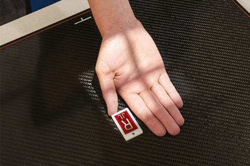
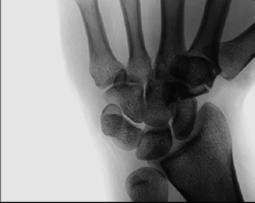
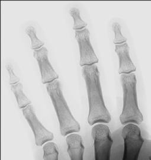

# Rx Mână AP Axială (BREWERTON METHOD10,11)

  📷 Radiografie Convențională (Rx)
  <strong>Actualizat:</strong> 2026-09-15
  <strong>Autor:</strong> Departamentul de Radiologie / Referință Bontrager

---

-   __1. Rezumat Clinic & Indicații__

    ---

    === "Indicații Clinice"

        - Performed commonly la evaluate pentru early evidence de Poliartrită reumatoidă / artropatie inflamatorie la second through fifth metacarpophalangeal (MCP) articulații. Evident prin slight erosion de capul de metacarpal.
        - poate evidențiază suspiciune de fractură de base de fourth și fifth metacarpal.

    === "Ghid Național IRIS"

        !!! info "Referință Primară: Ghidul Național IRIS (Ordinul MS 1342/2012)"
            - **Capitol Ghid IRIS:** *Ghidul Național IRIS*
            - **Grad de Recomandare:** **De verificat pe indicație; fără grad atribuit automat**
            - **Nivel de Iradiere Estimată:** `De verificat pentru examinarea și populația selectate`

            [:octicons-search-16: Deschide Ghidul IRIS](../../iris.md){ .md-button .md-button--primary } [:material-open-in-new: Aplicația Oficială PWA](https://radiologie-pediatrica.ro/iris/){ .md-button target="_blank" rel="noopener" }
-   __2. Poziționare & Centrare Fascicul__

    ---

    - **Poziție Pacient:** Pacient: Stand pacient la end de table cu Mână în supinație și flectat.; Regiune anatomică: Supinate Mână și place la center de receptorul de imagine. de la this poziție, keeping Degete Mână în contact cu receptorul de imagine, se flectează Mână la create a 65° angle între dorsum de Mână și receptorul de imagine (Fig. 4.83). Extend Degete Mână și ensure they sunt relaxat, slightly separated și paralel cu receptorul de imagine. Abduct Police la avoid superimposition.
    - **Punct de Centrare Fascicul:** Fig. 4.83 AP axial—Brewerton method. Fig. 4.84 AP axial. (de la Wilson DJ et al: Musculoskeletal imaging, ed 2, Philadelphia, 2015, Elsevier.) 2nd la 5th articulații metacarpofalangiene (MCF) în profile Fig. 4.85 AP axial. (Modified de la Wilson DJ et al: Musculoskeletal imaging, ed 2, Philadelphia, 2015, Elsevier.)
    - **Distanță Focar-Film (DFF / SID):** 100 cm
    - **Comandă Respiratorie:** Apnee pe durata expunerii (sau conform cooperării pacientului)

-   __3. Parametri Tehnici Expunere__

    ---

    | Parametru Tehnic | Valoare Configurare Generator / Tub |
    |:-----------------|:-------------------------------------|
    | **Tensiune Tub (kV)** | 55 kV |
    | **Sarcină / Produs Curent-Timp (mAs)** | DE CONFIGURAT PE APARAT |
    | **Distanță Focar-Film (DFF / SID)** | 100 cm |
    | **Grilă Antidifuzoare (Bucky)** | Fără grilă (expunere directă) |
    | **Dimensiune Focar** | Focar Mic (0.6 mm) |
    | **Camere de Ionizare AEC** | DE CONFIGURAT PE APARAT |
    | **Colimare Fascicul** | Field Size Collimate pe four sides la outer margins de Mână și Pumn (Articulație Radiocarpiană). Mână SPECIAL AP axial |
    | **Filtrare Tub** | Totală ≥ 2.5 mm Al echivalent |

-   __4. Criterii de Calitate & Reușită Imagine__

    ---

    - Entire Mână de la carpal area la tips de falange sunt vizibil (Figs. 4.84 și 4.85). poziție:
    - Second through fifth articulații metacarpofalangiene (MCF) open și vizibil cu fără superimposition de palmer părți moi; Police trebuie să fie liber de superimposition cu second through fifth falange. treimea medie diafizeis de second through fifth oase metacarpiene și falange trebuie să nu overlap.
    - raza centrală și center de collimation field size trebuie să fie la treia articulație metacarpofalangiană (MCP 3). expunere:
    - optim receptorul de imagine expunere și contrast cu fără mișcare sunt evidențiat prin clear, Contururi osoase și travee trabeculare nete, fără artefacte de mișcare și spații articulare margins de articulații metacarpofalangiene (MCF).

-   __5. Protecție Radiologică (ALARA)__

    ---

    - Ecranare gonadică și a organelor radiosensibile conform procedurilor locale de radioprotecție ALARA.
    - Colimare strictă la aria de interes pentru limitarea radiației difuze.
    - Verificarea posibilității unei sarcini la pacientele de vârstă fertilă înainte de expunere.

### 🖼️ Imagini

<figure class="protocol-image-card" markdown>

<figcaption><strong>Fig. 4.83 AP axial—Brewerton method.</strong> — Poziționare pacient conform Ghidului Bontrager (Fig. 4.83 AP axial—Brewerton method.)</figcaption>

</figure>

<figure class="protocol-image-card" markdown>

<figcaption><strong>Fig. 4.84 AP axial. (de la Wilson DJ et al: Musculoskeletal imaging,</strong> — Aspect radiografic de referință conform Ghidului Bontrager (Fig. 4.84 AP axial. (de la Wilson DJ et al: Musculoskeletal imaging,)</figcaption>

</figure>

<figure class="protocol-image-card" markdown>

<figcaption><strong>Fig. 4.85 AP axial. (Modified de la Wilson DJ et al: Musculoskeletal</strong> — Aspect radiografic de referință conform Ghidului Bontrager (Fig. 4.85 AP axial. (Modified de la Wilson DJ et al: Musculoskeletal)</figcaption>

</figure>

<figure class="protocol-image-card" markdown>

<figcaption><strong>Figura 4</strong> — Aspect radiografic de referință conform Ghidului Bontrager (Figura 4)</figcaption>

</figure>

<figure class="protocol-image-card" markdown>

<figcaption><strong>Figura 5</strong> — Aspect radiografic de referință conform Ghidului Bontrager (Figura 5)</figcaption>

</figure>

=== "Ghid Rapid de Execuție"

    1. **Identificarea și verificarea pacientului:** verificare identitate, zonă de examinat, consimțământ conform procedurii și evaluarea posibilității unei sarcini, când este relevantă.
    2. **Pregătire:** îndepărtarea oricăror obiecte radiopace (bijuterii, agrafe, fermoare, proteze, pansamente dense).
    3. **Poziționare precisă:** alinierea receptorului de imagine și a tubului la distanța prescrisă (100 cm).
    4. **Colimare strictă:** adaptarea fasciculului strict la regiunea de diagnostic pentru scăderea iradierii și reducerea radiației difuze.
    5. **Radioprotecție:** verificarea [politicii RX](../radioprotectie.md), cu măsuri distincte pentru pacient, personal și însoțitor.

## Surse de documentare

- [Bontrager's Textbook of Radiographic Positioning (Ed. 9/10), Pagina 164](https://www.elsevier.com/books/textbook-of-radiographic-positioning-and-related-anatomy/lampignano/978-0-323-65367-1)
