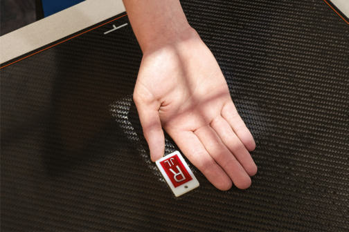
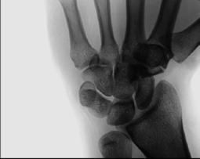
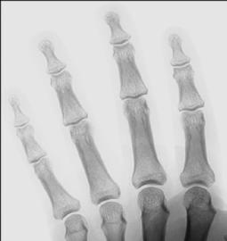

# Rx mână AP axială (metoda Brewerton 10,11)

  📷 Radiografie Convențională (Rx)
  <strong>Actualizat:</strong> 2026-09-15
  <strong>Autor:</strong> Departamentul de Radiologie / Referință Bontrager

---

-   __1. Rezumat Clinic & Indicații__

    ---

    === "Indicații Clinice"

        - Efectuată în mod obișnuit pentru evaluarea semnelor precoce de poliartrită reumatoidă / artropatie inflamatorie la nivelul articulațiilor metacarpofalangiene (MCP) de la a doua la a cincea. Evidențiată prin eroziunea discretă a capului metacarpian.
        - Poate evidenția suspiciunea de fractură a bazei metacarpienelor IV și V.

    === "Ghid Național IRIS"

        !!! info "Referință Primară: Ghidul Național IRIS (Ordinul MS 1342/2012)"
            - **Capitol Ghid IRIS:** *Aparat locomotor & Membru superior*
            - **Grad de Recomandare:** **Grad A**
            - **Nivel de Iradiere Estimată:** `Clasa 1 (Minimă < 0.01 mSv)`

            [:octicons-search-16: Deschide Ghidul IRIS](../../iris.md){ .md-button .md-button--primary } [:material-open-in-new: Aplicația Oficială PWA](https://radiologie-pediatrica.ro/iris/){ .md-button target="_blank" rel="noopener" }

-   __2. Poziționare & Centrare Fascicul__

    ---

    - **Poziție Pacient:** Pacient: Așezați pacientul la capătul mesei, cu mâna în supinație și flectată.; Regiune anatomică: Supinați mâna și așezați-o în centrul receptorului de imagine. Din această poziție, menținând degetele mâinii în contact cu receptorul de imagine, flectați mâna pentru a crea un unghi de 65° între dosul mâinii și receptorul de imagine (Fig. 4.83). Extindeți degetele mâinii și asigurați-vă că sunt relaxate, ușor depărtate și paralele cu receptorul de imagine. Abduceți policele pentru a evita suprapunerea.
    - **Punct de Centrare Fascicul:** Fig. 4.83 Incidență AP axială — metoda Brewerton. Fig. 4.84 Incidență AP axială. (Din Wilson DJ și colab.: Musculoskeletal imaging, ediția 2, Philadelphia, 2015, Elsevier.) Articulațiile metacarpofalangiene (MCF) de la a 2-a până la a 5-a, văzute din profil. Fig. 4.85 Incidență AP axială. (Modificat după Wilson DJ și colab.: Musculoskeletal imaging, ediția 2, Philadelphia, 2015, Elsevier.)
    - **Distanță Focar-Film (DFF / SID):** 100 cm
    - **Comandă Respiratorie:** Apnee pe durata expunerii (sau conform cooperării pacientului)

-   __3. Parametri Tehnici Expunere__

    ---

    | Parametru Tehnic | Valoare Configurare Generator / Tub |
    |:-----------------|:-------------------------------------|
    | **Tensiune Tub (kV)** | 55 kV |
    | **Sarcină / Produs Curent-Timp (mAs)** | DE CONFIGURAT PE APARAT |
    | **Distanță Focar-Film (DFF / SID)** | 100 cm |
    | **Grilă Antidifuzoare (Bucky)** | Fără grilă (expunere directă) |
    | **Dimensiune Focar** | Focar Mic (0.6 mm) |
    | **Camere de Ionizare AEC** | DE CONFIGURAT PE APARAT |
    | **Colimare Fascicul** | Dimensiunea câmpului: Colimați pe cele patru laturi la marginile externe ale mâinii și pumnului (articulației radiocarpiene). Mână, SPECIAL, AP axială |
    | **Filtrare Tub** | Totală ≥ 2.5 mm Al echivalent |

-   __4. Criterii de Calitate & Reușită Imagine__

    ---

    - Întreaga mână, de la regiunea carpiană până la vârfurile falangelor, este vizibilă (Figs. 4.84 și 4.85). Poziție:
    - Articulațiile metacarpofalangiene (MCF) de la II la V sunt deschise și vizibile, fără suprapunerea părților moi palmare; policele trebuie să fie liber de suprapunerea cu falangele II–V. Treimile medii ale diafizelor oaselor metacarpiene și falangelor II–V nu trebuie să se suprapună.
    - Raza centrală și centrul câmpului de colimare trebuie să fie la nivelul celei de-a treia articulații metacarpofalangiene (MCP 3). Expunere:
    - Expunerea și contrastul optime ale receptorului de imagine, fără mișcare, sunt evidențiate prin contururi osoase clare și travee trabeculare nete, fără artefacte de mișcare, precum și prin marginile spațiilor articulare ale articulațiilor metacarpofalangiene (MCF).

-   __5. Protecție Radiologică (ALARA)__

    ---

    - Ecranare gonadică și a organelor radiosensibile conform procedurilor locale de radioprotecție ALARA.
    - Colimare strictă la aria de interes pentru limitarea radiației difuze.
    - Verificarea posibilității unei sarcini la pacientele de vârstă fertilă înainte de expunere.

### 🖼️ Imagini

<figure class="protocol-image-card" markdown>

<figcaption><strong>Fig. 4.83 AP axială — metoda Brewerton.</strong> — Poziționarea pacientului conform Ghidului Bontrager (Fig. 4.83, AP axială — metoda Brewerton.)</figcaption>

</figure>

<figure class="protocol-image-card" markdown>

<figcaption><strong>Fig. 4.84 AP axială. (după Wilson DJ et al.: Musculoskeletal imaging,</strong> — Aspect radiografic de referință conform Ghidului Bontrager (Fig. 4.84, AP axială. (după Wilson DJ et al.: Musculoskeletal imaging,)</figcaption>

</figure>

<figure class="protocol-image-card" markdown>

<figcaption><strong>Fig. 4.85 AP axială. (Adaptat după Wilson DJ et al.: Musculoskeletal</strong> — Aspect radiografic de referință conform Ghidului Bontrager (Fig. 4.85, AP axială. (Adaptat după Wilson DJ et al.: Musculoskeletal)</figcaption>

</figure>

<figure class="protocol-image-card" markdown>

<figcaption><strong>Figura 4</strong> — Aspect radiografic de referință conform Ghidului Bontrager (Figura 4)</figcaption>

</figure>

<figure class="protocol-image-card" markdown>

<figcaption><strong>Figura 5</strong> — Aspect radiografic de referință conform Ghidului Bontrager (Figura 5)</figcaption>

</figure>

=== "Ghid Rapid de Execuție"

    1. **Identificarea și verificarea pacientului:** verificare identitate, zonă de examinat, consimțământ conform procedurii și evaluarea posibilității unei sarcini, când este relevantă.
    2. **Pregătire:** îndepărtarea oricăror obiecte radiopace (bijuterii, agrafe, fermoare, proteze, pansamente dense).
    3. **Poziționare precisă:** alinierea receptorului de imagine și a tubului la distanța prescrisă (100 cm).
    4. **Colimare strictă:** adaptarea fasciculului strict la regiunea de diagnostic pentru scăderea iradierii și reducerea radiației difuze.
    5. **Radioprotecție:** verificarea [politicii RX](../radioprotectie.md), cu măsuri distincte pentru pacient, personal și însoțitor.

## Surse de documentare

- [Bontrager's Textbook of Radiographic Positioning (Ed. 9/10), Pagina 164](https://www.elsevier.com/books/textbook-of-radiographic-positioning-and-related-anatomy/lampignano/978-0-323-65367-1)
