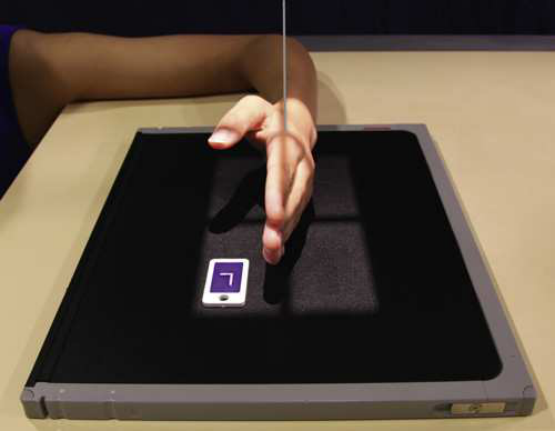
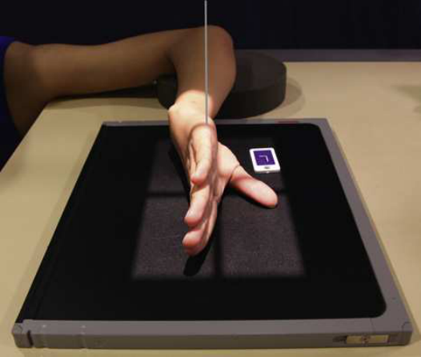
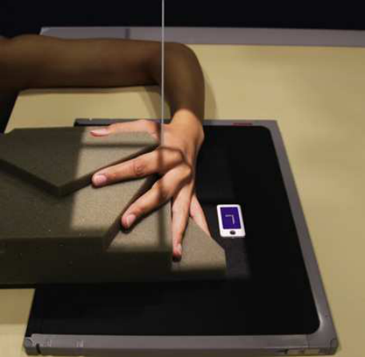
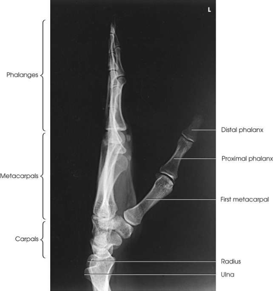
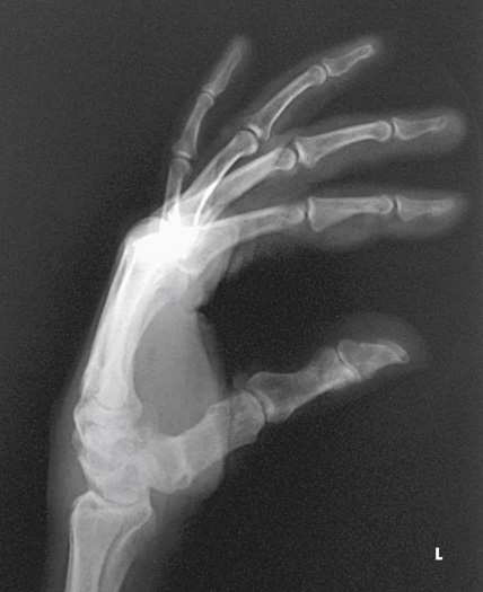

# Rx Mână — Incidență de Profil (Lateral) — Medio-Lateral or Latero-Medial extension and fan lateral (Merrill)

  📷 Radiografie Convențională (Rx)
  <strong>Actualizat:</strong> 2026-09-16
  <strong>Autor:</strong> Referință Merrill

---

-   __1. Rezumat Clinic & Indicații__

    ---

    === "Indicații Clinice"

        - Conform reperelor anatomice standard din tratat

    === "Ghid Național IRIS"

        !!! info "Referință Primară: Ghidul Național IRIS (Ordinul MS 1342/2012)"
            - **Capitol Ghid IRIS:** *Ghidul Național IRIS*
            - **Grad de Recomandare:** **De verificat pe indicație; fără grad atribuit automat**
            - **Nivel de Iradiere Estimată:** `De verificat pentru examinarea și populația selectate`

            [:octicons-search-16: Deschide Ghidul IRIS](../../iris.md){ .md-button .md-button--primary } [:material-open-in-new: Aplicația Oficială PWA](https://radiologie-pediatrica.ro/iris/){ .md-button target="_blank" rel="noopener" }
-   __2. Poziționare & Centrare Fascicul__

    ---

    - **Poziție Pacient:** se așază pacientul pe scaun la end de masa radiologică, cu Antebraț în contact cu masa de examinare și Mână în Incidență de Profil (lateral) cu ulnar aspect down (Fig. 5.59). Alternatively, place radial side de Pumn (Articulație Radiocarpiană) pe / sprijinit de receptorul de imagine (Fig. 5.60). This poziție este more dificult pentru pacientul la assume. If Cot este ridicat, support it cu săculeți cu nisip.; se extinde pacient’s falange și se ajustează first falange la drept angle la palm. Place palmar surface perpendicular pe receptorul de imagine (RI). se centrează receptorul de imagine la articulații metacarpofalangiene (MCF) și se ajustează midline la fie paralel cu axa longitudinală de Mână și Antebraț. If Mână este resting pe ulnar surface, imobilizare de Police poate fie necessary. two extins falange poziții result în superimposition de falange. modification de lateral Mână este ̌ Incidență de Profil (lateral), which eliminates superimposition de toate but proximal falange. pentru fan Incidență de Profil (lateral), place falange pe sponge wedge. Abduct Police și place it pe radiolucent sponge pentru support (Fig. 5.61). se efectuează ecranarea gonadelor cu șorț plumbat.
    - **Punct de Centrare Fascicul:** perpendicular pe second falange articulații metacarpofalangiene (MCF) pentru mediolateral perpendicular la fiͥ h falange MCP pentru lateromedial
    - **Distanță Focar-Film (DFF / SID):** Nespecificat în fragmentul extras; de verificat în sursă
    - **Comandă Respiratorie:** Conform reperelor anatomice standard din tratat

-   __3. Parametri Tehnici Expunere__

    ---

    | Parametru Tehnic | Valoare Configurare Generator / Tub |
    |:-----------------|:-------------------------------------|
    | **Tensiune Tub (kV)** | DE CONFIGURAT PE APARAT |
    | **Sarcină / Produs Curent-Timp (mAs)** | DE CONFIGURAT PE APARAT |
    | **Distanță Focar-Film (DFF / SID)** | Nespecificat în fragmentul extras; de verificat în sursă |
    | **Grilă Antidifuzoare (Bucky)** | DE CONFIGURAT PE APARAT |
    | **Dimensiune Focar** | DE CONFIGURAT PE APARAT |
    | **Camere de Ionizare AEC** | DE CONFIGURAT PE APARAT |
    | **Colimare Fascicul** | Adjust câmp de iradiere la 1 inch (2.5 cm) pe toate sides de shadow de Mână și Police, including 1 inch (2.5 cm) proximal la ulnar styloid. Se plasează markerul de lateralitate în câmpul colimat. |
    | **Filtrare Tub** | DE CONFIGURAT PE APARAT |

-   __4. Criterii de Calitate & Reușită Imagine__

    ---

    - Criterii radiologice de calitate imaginii:
    - Colimare adecvată vizibilă și prezența markerului de lateralitate (D/S) plasat clear de anatomy de interest
    - Anatomy de la fingertips la distal radius și ulna
    - extins falange
    - Mână în true Incidență de Profil (lateral)
    - Superimposed falange (individually seen pe fan lateral)
    - Superimposed oase metacarpiene
    - Superimposed distal radius și ulna
    - Police liber de mișcare și superimposition
    - Bony detalii trabeculare osoase și surrounding soft tissues

-   __5. Protecție Radiologică (ALARA)__

    ---

    - Nespecificat în fragmentul extras; de verificat în sursă

!!! note "Observații Clinice & Tehnice"
    la show suspiciune de fractură de fifth metacarpal better, Lewis 4 recommended rotating Mână 5 grade posteriorly de la true Incidență de Profil (lateral). This positioning removes superimposition de second through fourth oase metacarpiene. Police este extins ca much ca possible, și Mână este allowed la become hollow prin relaxation. raza centrală este înclinat so that it passes paralel cu extins Police și enters midshaft de fifth metacarpal.

### 🖼️ Imagini

<figure class="protocol-image-card" markdown>

<figcaption><strong>Merrill — pagina PDF 280, imaginea 1</strong> — Imagine din fragmentul sursă; asocierea necesită revizie.</figcaption>

</figure>

<figure class="protocol-image-card" markdown>

<figcaption><strong>Merrill — pagina PDF 281, imaginea 2</strong> — Imagine din fragmentul sursă; asocierea necesită revizie.</figcaption>

</figure>

<figure class="protocol-image-card" markdown>

<figcaption><strong>Merrill — pagina PDF 281, imaginea 3</strong> — Imagine din fragmentul sursă; asocierea necesită revizie.</figcaption>

</figure>

<figure class="protocol-image-card" markdown>

<figcaption><strong>Merrill — pagina PDF 283, imaginea 4</strong> — Imagine din fragmentul sursă; asocierea necesită revizie.</figcaption>

</figure>

<figure class="protocol-image-card" markdown>

<figcaption><strong>Merrill — pagina PDF 284, imaginea 5</strong> — Imagine din fragmentul sursă; asocierea necesită revizie.</figcaption>

</figure>

=== "Ghid Rapid de Execuție"

    1. **Identificarea și verificarea pacientului:** verificare identitate, zonă de examinat, consimțământ conform procedurii și evaluarea posibilității unei sarcini, când este relevantă.
    2. **Pregătire:** îndepărtarea oricăror obiecte radiopace (bijuterii, agrafe, fermoare, proteze, pansamente dense).
    3. **Poziționare precisă:** alinierea receptorului de imagine și a tubului la distanța prescrisă (Nespecificat în fragmentul extras; de verificat în sursă).
    4. **Colimare strictă:** adaptarea fasciculului strict la regiunea de diagnostic pentru scăderea iradierii și reducerea radiației difuze.
    5. **Radioprotecție:** verificarea [politicii RX](../radioprotectie.md), cu măsuri distincte pentru pacient, personal și însoțitor.

## Surse de documentare

- [Merrill’s Atlas, 5. Upper Extremity, pagini PDF 279–284](../../assets/protocols/sources/a56d45c16829_Merrills_Atlas_of_Radiographic_Positioning__Procedures_3Vol_Set.pdf#page=279)

## Fragmente sursă traduse (referință tehnică)

### anatomy

This imagine, which shows lateral incidență de mână în extension (Fig. 5.62), presents customary poziție pentru localizing Corp străin / corpuri străine radio-opace și
metacarpal suspiciune de fractură displacement. expunere technique depends pe Corp străin / corpuri străine radio-opace.
fan lateral superimposes oase metacarpiene but shows almost toate de individual falange. most proximal portions de proximal
falange remain superimposed (Fig. 5.63).

### collimation

• Adjust câmp de iradiere la 1 inch (2.5 cm) pe toate sides de shadow de mână și thumb, including 1 inch (2.5 cm) proximal la ulnar styloid. Se plasează markerul de lateralitate în câmpul colimat.

### cr

• perpendicular pe second falange articulații metacarpofalangiene (MCF) pentru mediolateral
• perpendicular la fiͥ h falange MCP pentru lateromedial

### criteria

Criterii radiologice de calitate imaginii:
• Colimare adecvată vizibilă și prezența markerului de lateralitate (D/S) plasat clear de anatomy de interest
• Anatomy de la fingertips la distal radius și ulna
• extins falange
• mână în true poziție de profil (lateral)
• Superimposed falange (individually seen pe fan lateral)
• Superimposed oase metacarpiene
• Superimposed distal radius și ulna
• Thumb liber de mișcare și superimposition
• Bony detalii trabeculare osoase și surrounding soft tissues

### notes

la show suspiciune de fractură de fifth metacarpal better, Lewis 4 recommended rotating mână 5 grade posteriorly de la true lateral
poziție. This positioning removes superimposition de second through fourth oase metacarpiene. policele este extins ca much ca possible,
și mână este allowed la become hollow prin relaxation. raza centrală este înclinat so that it passes paralel cu extins thumb și enters
midshaft de fifth metacarpal.

### part_pos

• se extinde pacient’s falange și se ajustează first falange la drept angle la palm.
• Place palmar surface perpendicular pe receptorul de imagine (RI).
• se centrează receptorul de imagine la articulații metacarpofalangiene (MCF) și se ajustează midline la fie paralel cu axa longitudinală de mână și forearm. If mână este resting
pe ulnar surface, imobilizare de policele poate fie necessary.
• two extins falange poziții result în superimposition de falange. modification de lateral mână este ̌ poziție de profil (lateral),
which eliminates superimposition de toate but proximal falange. pentru fan poziție de profil (lateral), place falange pe sponge wedge.
Abduct policele și place it pe radiolucent sponge pentru support (Fig. 5.61).
• se efectuează ecranarea gonadelor cu șorț plumbat.

### patient_pos

• se așază pacientul pe scaun la end de masa radiologică, cu forearm în contact cu masa de examinare și mână în poziție de profil (lateral)
cu ulnar aspect down (Fig. 5.59).
• Alternatively, place radial side de wrist pe / sprijinit de receptorul de imagine (Fig. 5.60). This poziție este more dificult pentru pacientul la assume.
• If cot este ridicat, support it cu săculeți cu nisip.

### tech

poziționat prin manufacturer sau department protocol pentru corect anatomy display orientation; raza centrală plate: 10 × 12 inches (24 × 30 cm) longitudinal.

