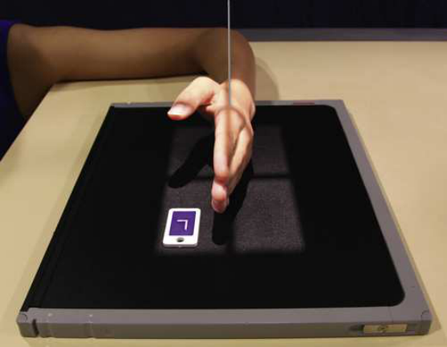
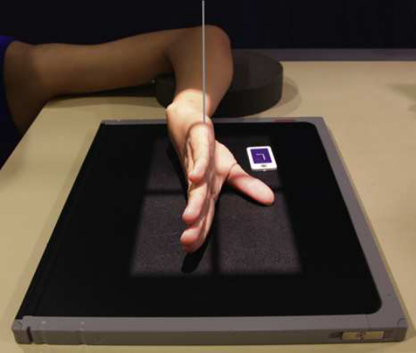
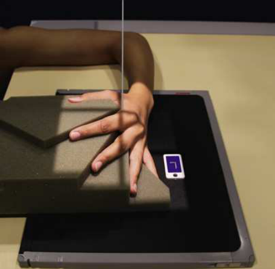
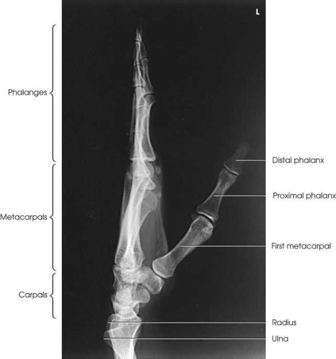
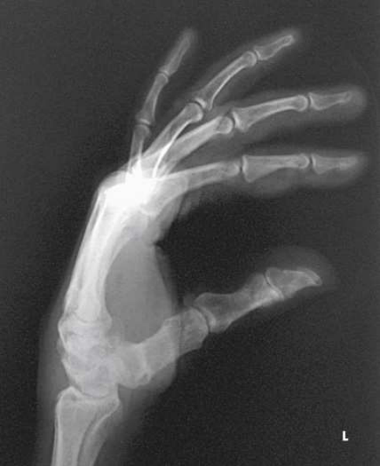

# Rx Mână — Incidență de Profil (Lateral) — Extensie mediolaterală sau lateromedială și profil lateral în evantai (Merrill)

  📷 Radiografie Convențională (Rx)
  <strong>Actualizat:</strong> 2026-09-16
  <strong>Autor:</strong> Referință Merrill

---

-   __1. Rezumat Clinic & Indicații__

    ---

    === "Indicații Clinice"

        - Conform reperelor anatomice standard din tratat

    === "Ghid Național IRIS"

        !!! info "Referință Primară: Ghidul Național IRIS (Ordinul MS 1342/2012)"
            - **Capitol Ghid IRIS:** *Aparat locomotor & Membru superior*
            - **Grad de Recomandare:** **Grad A**
            - **Nivel de Iradiere Estimată:** `Clasa 1 (Minimă < 0.01 mSv)`

            [:octicons-search-16: Deschide Ghidul IRIS](../../iris.md){ .md-button .md-button--primary } [:material-open-in-new: Aplicația Oficială PWA](https://radiologie-pediatrica.ro/iris/){ .md-button target="_blank" rel="noopener" }

-   __2. Poziționare & Centrare Fascicul__

    ---

    - **Poziție Pacient:** Se așază pacientul pe scaun la capătul mesei radiologice, cu antebrațul în contact cu masa de examinare și mâna în incidență de profil (lateral), cu fața ulnară în jos (Fig. 5.59). Alternativ, se așază partea radială a pumnului (articulației radiocarpiene) pe sau sprijinită de receptorul de imagine (Fig. 5.60). Această poziție este mai dificil de adoptat de către pacient. Dacă cotul este ridicat, acesta se susține cu săculeți cu nisip.; se extind falangele pacientului și se ajustează prima falangă la un unghi drept față de palmă. Se așază suprafața palmară perpendicular pe receptorul de imagine (RI). Se centrează receptorul de imagine la articulațiile metacarpofalangiene (MCF) și se ajustează linia mediană pentru a fi paralelă cu axa longitudinală a mâinii și antebrațului. Dacă mâna se sprijină pe suprafața ulnară, poate fi necesară imobilizarea policelui. Cele două poziții cu falangele extinse determină suprapunerea falangelor. Modificarea laterală a mâinii este incidența de profil (laterală), care elimină suprapunerea tuturor falangelor, cu excepția falangelor proximale. Pentru incidența de profil (laterală) în evantai, se așază falangele pe o pană de burete. Se abduce policele și se așază pe un burete radiotransparent pentru susținere (Fig. 5.61). Se efectuează ecranarea gonadelor cu șorț plumbat.
    - **Punct de Centrare Fascicul:** perpendicular pe articulațiile metacarpofalangiene (MCF) ale celei de-a doua falange pentru mediolateral; perpendicular pe falanga a cincea MCP pentru lateromedial
    - **Distanță Focar-Film (DFF / SID):** Nespecificat în fragmentul extras; de verificat în sursă
    - **Comandă Respiratorie:** Conform reperelor anatomice standard din tratat

-   __3. Parametri Tehnici Expunere__

    ---

    | Parametru Tehnic | Valoare Configurare Generator / Tub |
    |:-----------------|:-------------------------------------|
    | **Tensiune Tub (kV)** | DE CONFIGURAT PE APARAT |
    | **Sarcină / Produs Curent-Timp (mAs)** | DE CONFIGURAT PE APARAT |
    | **Distanță Focar-Film (DFF / SID)** | Nespecificat în fragmentul extras; de verificat în sursă |
    | **Grilă Antidifuzoare (Bucky)** | DE CONFIGURAT PE APARAT |
    | **Dimensiune Focar** | DE CONFIGURAT PE APARAT |
    | **Camere de Ionizare AEC** | DE CONFIGURAT PE APARAT |
    | **Colimare Fascicul** | Se ajustează câmpul de iradiere la 1 țol (2.5 cm) față de toate laturile umbrei mâinii și policelui, inclusiv 1 țol (2.5 cm) proximal față de stiloida ulnară. Se plasează markerul de lateralitate în câmpul colimat. |
    | **Filtrare Tub** | DE CONFIGURAT PE APARAT |

-   __4. Criterii de Calitate & Reușită Imagine__

    ---

    - Criterii radiologice de calitate a imaginii:
    - Colimare adecvată vizibilă și prezența markerului de lateralitate (D/S) plasat în afara structurilor anatomice de interes
    - Anatomie de la vârfurile degetelor până la radiusul și ulna distale
    - falange extinse
    - Mâna în incidență de profil adevărată (laterală)
    - Falange suprapuse (vizualizate individual în incidența de profil în evantai)
    - Oase metacarpiene suprapuse
    - Radius și ulna distale suprapuse
    - Policele liber de mișcare și fără suprapunere
    - Detalii trabeculare osoase și țesuturile moi înconjurătoare

-   __5. Protecție Radiologică (ALARA)__

    ---

    - Nespecificat în fragmentul extras; de verificat în sursă

!!! note "Observații Clinice & Tehnice"
    Pentru a evidenția mai bine suspiciunea de fractură a celui de-al cincilea metacarpian, Lewis 4 recomandă rotirea mâinii cu 5 grade posterior față de incidența de profil adevărată (laterală). Această poziționare elimină suprapunerea oaselor metacarpiene de la al doilea până la al patrulea. Policele este extins cât posibil, iar mâna este lăsată să devină concavă prin relaxare. Raza centrală este înclinată astfel încât să treacă paralel cu policele extins și să intre la nivelul diafizei celui de-al cincilea metacarpian.

### 🖼️ Imagini

<figure class="protocol-image-card" markdown>

<figcaption><strong>Merrill — pagina 280, imaginea 1</strong> — Imagine din fragmentul sursă; asocierea necesită revizie.</figcaption>

</figure>

<figure class="protocol-image-card" markdown>

<figcaption><strong>Merrill — pagina 281, imaginea 2</strong> — Imagine din fragmentul sursă; asocierea necesită revizie.</figcaption>

</figure>

<figure class="protocol-image-card" markdown>

<figcaption><strong>Merrill — pagina 281, imaginea 3</strong> — Imagine din fragmentul sursă; asocierea necesită revizie.</figcaption>

</figure>

<figure class="protocol-image-card" markdown>

<figcaption><strong>Merrill — pagina 283, imaginea 4</strong> — Imagine din fragmentul sursă; asocierea necesită revizie.</figcaption>

</figure>

<figure class="protocol-image-card" markdown>

<figcaption><strong>Merrill — pagina 284, imaginea 5</strong> — Imagine din fragmentul sursă; asocierea necesită revizie.</figcaption>

</figure>

=== "Ghid Rapid de Execuție"

    1. **Identificarea și verificarea pacientului:** verificare identitate, zonă de examinat, consimțământ conform procedurii și evaluarea posibilității unei sarcini, când este relevantă.
    2. **Pregătire:** îndepărtarea oricăror obiecte radiopace (bijuterii, agrafe, fermoare, proteze, pansamente dense).
    3. **Poziționare precisă:** alinierea receptorului de imagine și a tubului la distanța prescrisă (Nespecificat în fragmentul extras; de verificat în sursă).
    4. **Colimare strictă:** adaptarea fasciculului strict la regiunea de diagnostic pentru scăderea iradierii și reducerea radiației difuze.
    5. **Radioprotecție:** verificarea [politicii RX](../radioprotectie.md), cu măsuri distincte pentru pacient, personal și însoțitor.

## Surse de documentare

- [Merrill’s Atlas, 5. Upper Extremity, pagini 279–284](https://books.google.com/books/about/Merrill_s_Atlas_of_Radiographic_Position.html?id=BM0lEQAAQBAJ)
