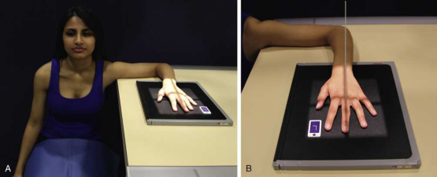
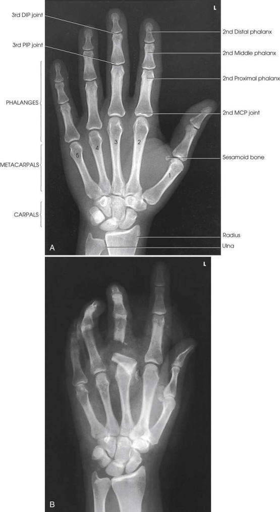

# Rx Mână — Incidență Postero-Anterioară (PA) (Merrill)

  📷 Radiografie Convențională (Rx)
  <strong>Actualizat:</strong> 2026-09-16
  <strong>Autor:</strong> Referință Merrill

---

-   __1. Rezumat Clinic & Indicații__

    ---

    === "Indicații Clinice"

        - Conform reperelor anatomice standard din tratat

    === "Ghid Național IRIS"

        !!! info "Referință Primară: Ghidul Național IRIS (Ordinul MS 1342/2012)"
            - **Capitol Ghid IRIS:** *Ghidul Național IRIS*
            - **Grad de Recomandare:** **De verificat pe indicație; fără grad atribuit automat**
            - **Nivel de Iradiere Estimată:** `De verificat pentru examinarea și populația selectate`

            [:octicons-search-16: Deschide Ghidul IRIS](../../iris.md){ .md-button .md-button--primary } [:material-open-in-new: Aplicația Oficială PWA](https://radiologie-pediatrica.ro/iris/){ .md-button target="_blank" rel="noopener" }
-   __2. Poziționare & Centrare Fascicul__

    ---

    - **Poziție Pacient:** se așază pacientul pe scaun la end de masa radiologică. se ajustează pacient’s height astfel încât Antebraț este resting pe masa de examinare (Fig. 5.53A).; se sprijină pacientul’s Antebraț pe masa de examinare, și place Mână cu palmar surface down pe receptorul de imagine. se centrează receptorul de imagine la articulații metacarpofalangiene (MCF), then se ajustează axa longitudinală de receptorul de imagine paralel cu axa longitudinală de Mână și Antebraț. Spread Degete Mână slightly (see Fig. 5.53B). Se instruiește pacientul să relax Mână la avoid mișcare. Prevent involuntary movement cu use de adhesive tape sau positioning sponges. săculeți cu nisip poate fie plasat over distal Antebraț. se efectuează ecranarea gonadelor cu șorț plumbat.
    - **Punct de Centrare Fascicul:** perpendicular pe third articulații metacarpofalangiene (MCF)
    - **Distanță Focar-Film (DFF / SID):** Nespecificat în fragmentul extras; de verificat în sursă
    - **Comandă Respiratorie:** Conform reperelor anatomice standard din tratat

-   __3. Parametri Tehnici Expunere__

    ---

    | Parametru Tehnic | Valoare Configurare Generator / Tub |
    |:-----------------|:-------------------------------------|
    | **Tensiune Tub (kV)** | DE CONFIGURAT PE APARAT |
    | **Sarcină / Produs Curent-Timp (mAs)** | DE CONFIGURAT PE APARAT |
    | **Distanță Focar-Film (DFF / SID)** | Nespecificat în fragmentul extras; de verificat în sursă |
    | **Grilă Antidifuzoare (Bucky)** | DE CONFIGURAT PE APARAT |
    | **Dimensiune Focar** | DE CONFIGURAT PE APARAT |
    | **Camere de Ionizare AEC** | DE CONFIGURAT PE APARAT |
    | **Colimare Fascicul** | Adjust câmp de iradiere la 1 inch (2.5 cm) pe toate sides de Mână, including 1 inch (2.5 cm) proximal la ulnar styloid. Se plasează markerul de lateralitate în câmpul colimat. |
    | **Filtrare Tub** | DE CONFIGURAT PE APARAT |

-   __4. Criterii de Calitate & Reușită Imagine__

    ---

    - Criterii radiologice de calitate imaginii:
    - Colimare adecvată vizibilă și prezența markerului de lateralitate (D/S) plasat clear de anatomy de interest
    - Anatomy de la fingertips la distal radius și ulna
    - Slightly separate falange cu fără părți moi overlap
    - Absența rotației anatomice (simetrie bilaterală perfectă) de Mână
    - Equal concavity de metacarpal și phalangeal corpuri pe ambele părți (bilateral)
    - Equal amount de părți moi pe ambele părți (bilateral) de falange
    - Fingernails, if visualized, în center de fiecare distal phalanx
    - Equal distance între metacarpal heads
    - Open MCP și articulații interfalangiene (IF), indicating that Mână este plasat flat pe receptorul de imagine
    - Bony detalii trabeculare osoase și surrounding soft tissues

-   __5. Protecție Radiologică (ALARA)__

    ---

    - Nespecificat în fragmentul extras; de verificat în sursă

!!! note "Observații Clinice & Tehnice"
    When articulații metacarpofalangiene (MCF) sunt under examination și pacientul cannot se extinde Mână enough la place its palmar surface în contact cu receptorul de imagine, poziție de Mână poate fie reversed pentru Incidență Antero-Posterioară (AP). This poziție este also used pentru oase metacarpiene when Mână cannot fie extins because de injury, pathologic condition, sau use de dressings. SPECIAL TECHNIļUES: Clements și Nakayama 9 described special expunere technique pentru imaging early Poliartrită reumatoidă / artropatie inflamatorie. Lewis 10 described positioning variation la place second through fifth oase metacarpiene paralel cu receptorul de imagine (RI), resulting în true Incidență Postero-Anterioară (PA).

### 🖼️ Imagini

<figure class="protocol-image-card" markdown>

<figcaption><strong>Merrill — pagina PDF 275, imaginea 1</strong> — Imagine din fragmentul sursă; asocierea necesită revizie.</figcaption>

</figure>

<figure class="protocol-image-card" markdown>

<figcaption><strong>Merrill — pagina PDF 276, imaginea 2</strong> — Imagine din fragmentul sursă; asocierea necesită revizie.</figcaption>

</figure>

=== "Ghid Rapid de Execuție"

    1. **Identificarea și verificarea pacientului:** verificare identitate, zonă de examinat, consimțământ conform procedurii și evaluarea posibilității unei sarcini, când este relevantă.
    2. **Pregătire:** îndepărtarea oricăror obiecte radiopace (bijuterii, agrafe, fermoare, proteze, pansamente dense).
    3. **Poziționare precisă:** alinierea receptorului de imagine și a tubului la distanța prescrisă (Nespecificat în fragmentul extras; de verificat în sursă).
    4. **Colimare strictă:** adaptarea fasciculului strict la regiunea de diagnostic pentru scăderea iradierii și reducerea radiației difuze.
    5. **Radioprotecție:** verificarea [politicii RX](../radioprotectie.md), cu măsuri distincte pentru pacient, personal și însoțitor.

## Surse de documentare

- [Merrill’s Atlas, 5. Upper Extremity, pagini PDF 273–276](../../assets/protocols/sources/a56d45c16829_Merrills_Atlas_of_Radiographic_Positioning__Procedures_3Vol_Set.pdf#page=273)

## Fragmente sursă traduse (referință tehnică)

### anatomy

PA incidențe de oase carpiene, oase metacarpiene, falange (except policele), interarticulations de mână, și distal radius și ulna sunt vizualizat în

### collimation

• Adjust câmp de iradiere la 1 inch (2.5 cm) pe toate sides de mână, including 1 inch (2.5 cm) proximal la ulnar styloid. Place side
marker în collimated expunere field.

### cr

• perpendicular pe third articulații metacarpofalangiene (MCF)

### criteria

Criterii radiologice de calitate imaginii:
• Colimare adecvată vizibilă și prezența markerului de lateralitate (D/S) plasat clear de anatomy de interest
• Anatomy de la fingertips la distal radius și ulna
• Slightly separate falange cu fără părți moi overlap
• Absența rotației anatomice (simetrie bilaterală perfectă) de mână
• Equal concavity de metacarpal și phalangeal corpuri pe ambele părți (bilateral)
• Equal amount de părți moi pe ambele părți (bilateral) de falange
• Fingernails, if visualized, în center de fiecare distal phalanx
• Equal distance între metacarpal heads
• Open MCP și articulații interfalangiene (IF), indicating that mână este plasat flat pe receptorul de imagine
• Bony detalii trabeculare osoase și surrounding soft tissues

### notes

When articulații metacarpofalangiene (MCF) sunt under examination și pacientul cannot se extinde mână enough la place its palmar surface în contact cu receptorul de imagine, poziție de mână poate fie reversed pentru AP incidență. This poziție este also used pentru oase metacarpiene when mână cannot fie extins because de injury, pathologic condition, sau
use de dressings.
SPECIAL TECHNIļUES: Clements și Nakayama 9 described special expunere technique pentru imaging early Poliartrită reumatoidă / artropatie inflamatorie. Lewis 10 described positioning
variation la place second through fifth oase metacarpiene paralel cu receptorul de imagine (RI), resulting în true PA incidență.

### part_pos

• se sprijină pacientul’s forearm pe masa de examinare, și place mână cu palmar surface down pe receptorul de imagine.
• se centrează receptorul de imagine la articulații metacarpofalangiene (MCF), then se ajustează axa longitudinală de receptorul de imagine paralel cu axa longitudinală de mână și forearm.
• Spread degetele slightly (see Fig. 5.53B).
• Se instruiește pacientul să relax mână la avoid mișcare. Prevent involuntary movement cu use de adhesive tape sau positioning sponges.
săculeți cu nisip poate fie plasat over distal forearm.
• se efectuează ecranarea gonadelor cu șorț plumbat.

### patient_pos

• se așază pacientul pe scaun la end de masa radiologică.
• se ajustează pacient’s height astfel încât forearm este resting pe masa de examinare (Fig. 5.53A).

### tech

poziționat prin manufacturer sau department protocol pentru corect anatomy display orientation; raza centrală plate: 10 × 12 inches (24 × 30 cm) longitudinal.

