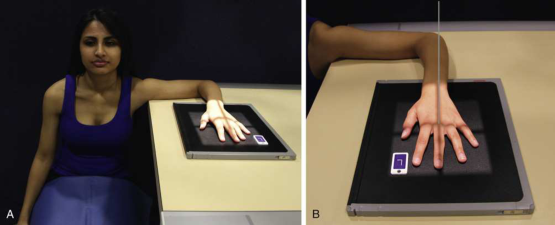
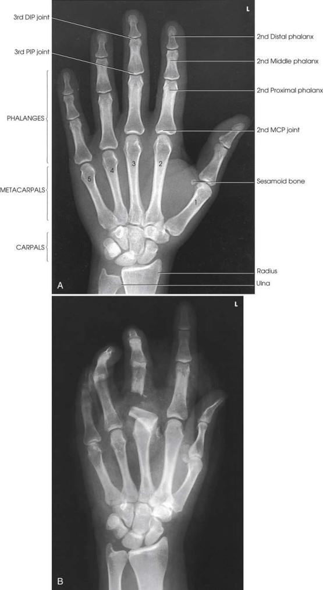

# Rx Mână — Incidență Postero-Anterioară (PA) (Merrill)

  📷 Radiografie Convențională (Rx)
  <strong>Actualizat:</strong> 2026-09-16
  <strong>Autor:</strong> Referință Merrill

---

-   __1. Rezumat Clinic & Indicații__

    ---

    === "Indicații Clinice"

        - Conform reperelor anatomice standard din tratat

    === "Ghid Național IRIS"

        !!! info "Referință Primară: Ghidul Național IRIS (Ordinul MS 1342/2012)"
            - **Capitol Ghid IRIS:** *Aparat locomotor & Membru superior*
            - **Grad de Recomandare:** **Grad A**
            - **Nivel de Iradiere Estimată:** `Clasa 1 (Minimă < 0.01 mSv)`

            [:octicons-search-16: Deschide Ghidul IRIS](../../iris.md){ .md-button .md-button--primary } [:material-open-in-new: Aplicația Oficială PWA](https://radiologie-pediatrica.ro/iris/){ .md-button target="_blank" rel="noopener" }

-   __2. Poziționare & Centrare Fascicul__

    ---

    - **Poziție Pacient:** Se așază pacientul pe scaun la capătul mesei radiologice. Se ajustează înălțimea pacientului astfel încât antebrațul să se sprijine pe masa de examinare (Fig. 5.53A).; Se sprijină antebrațul pacientului pe masa de examinare și se așază mâna cu suprafața palmară în jos pe receptorul de imagine. Se centrează receptorul de imagine la articulațiile metacarpofalangiene (MCF), apoi se ajustează axa longitudinală a receptorului de imagine paralel cu axa longitudinală a mâinii și antebrațului. Se depărtează ușor degetele mâinii (vezi Fig. 5.53B). Se instruiește pacientul să relaxeze mâna pentru a evita mișcarea. Se previne mișcarea involuntară prin utilizarea benzii adezive sau a bureților de poziționare. Săculeți cu nisip pot fi plasați peste antebrațul distal. Se efectuează ecranarea gonadelor cu șorț plumbat.
    - **Punct de Centrare Fascicul:** perpendicular pe articulațiile metacarpofalangiene (MCF) ale celui de-al treilea metacarpian
    - **Distanță Focar-Film (DFF / SID):** Nespecificat în fragmentul extras; de verificat în sursă
    - **Comandă Respiratorie:** Conform reperelor anatomice standard din tratat

-   __3. Parametri Tehnici Expunere__

    ---

    | Parametru Tehnic | Valoare Configurare Generator / Tub |
    |:-----------------|:-------------------------------------|
    | **Tensiune Tub (kV)** | DE CONFIGURAT PE APARAT |
    | **Sarcină / Produs Curent-Timp (mAs)** | DE CONFIGURAT PE APARAT |
    | **Distanță Focar-Film (DFF / SID)** | Nespecificat în fragmentul extras; de verificat în sursă |
    | **Grilă Antidifuzoare (Bucky)** | DE CONFIGURAT PE APARAT |
    | **Dimensiune Focar** | DE CONFIGURAT PE APARAT |
    | **Camere de Ionizare AEC** | DE CONFIGURAT PE APARAT |
    | **Colimare Fascicul** | Se ajustează câmpul de iradiere la 1 țol (2.5 cm) față de toate laturile mâinii, inclusiv 1 țol (2.5 cm) proximal față de stiloida ulnară. Se plasează markerul de lateralitate în câmpul colimat. |
    | **Filtrare Tub** | DE CONFIGURAT PE APARAT |

-   __4. Criterii de Calitate & Reușită Imagine__

    ---

    - Criterii radiologice de calitate a imaginii:
    - Colimare adecvată vizibilă și prezența markerului de lateralitate (D/S) plasat în afara structurilor anatomice de interes
    - Anatomie de la vârfurile degetelor până la radiusul și ulna distale
    - Falange ușor separate, fără suprapunerea părților moi
    - Absența rotației anatomice a mâinii (simetrie bilaterală perfectă)
    - Concavitate egală a corpurilor metacarpiene și falangiene pe ambele părți (bilateral)
    - Cantitate egală de părți moi de ambele părți ale falangei
    - Unghiile, dacă sunt vizualizate, în centrul fiecărei falange distale
    - Distanță egală între capetele metacarpienelor
    - Articulații MCP și interfalangiene (IF) deschise, indicând faptul că mâna este așezată plat pe receptorul de imagine
    - Detalii trabeculare osoase și țesuturile moi înconjurătoare

-   __5. Protecție Radiologică (ALARA)__

    ---

    - Nespecificat în fragmentul extras; de verificat în sursă

!!! note "Observații Clinice & Tehnice"
    Când articulațiile metacarpofalangiene (MCF) sunt examinate și pacientul nu poate extinde suficient mâna pentru a așeza suprafața palmară în contact cu receptorul de imagine, poziția mâinii poate fi inversată pentru incidența Antero-Posterioară (AP). Această poziție este utilizată și pentru oasele metacarpiene când mâna nu poate fi extinsă din cauza unei leziuni, a unei afecțiuni patologice sau a utilizării pansamentelor. TEHNICI SPECIALE: Clements și Nakayama 9 au descris o tehnică specială de expunere pentru imagistica precoce a poliartritei reumatoide / artropatiei inflamatorii. Lewis 10 a descris o variantă de poziționare pentru a așeza oasele metacarpiene de la al doilea până la al cincilea paralel cu receptorul de imagine (RI), rezultând o incidență Postero-Anterioară (PA) adevărată.

### 🖼️ Imagini

<figure class="protocol-image-card" markdown>

<figcaption><strong>Merrill — pagina 275, imaginea 1</strong> — Imagine din fragmentul sursă; asocierea necesită revizie.</figcaption>

</figure>

<figure class="protocol-image-card" markdown>

<figcaption><strong>Merrill — pagina 276, imaginea 2</strong> — Imagine din fragmentul sursă; asocierea necesită revizie.</figcaption>

</figure>

=== "Ghid Rapid de Execuție"

    1. **Identificarea și verificarea pacientului:** verificare identitate, zonă de examinat, consimțământ conform procedurii și evaluarea posibilității unei sarcini, când este relevantă.
    2. **Pregătire:** îndepărtarea oricăror obiecte radiopace (bijuterii, agrafe, fermoare, proteze, pansamente dense).
    3. **Poziționare precisă:** alinierea receptorului de imagine și a tubului la distanța prescrisă (Nespecificat în fragmentul extras; de verificat în sursă).
    4. **Colimare strictă:** adaptarea fasciculului strict la regiunea de diagnostic pentru scăderea iradierii și reducerea radiației difuze.
    5. **Radioprotecție:** verificarea [politicii RX](../radioprotectie.md), cu măsuri distincte pentru pacient, personal și însoțitor.

## Surse de documentare

- [Merrill’s Atlas, 5. Upper Extremity, pagini 273–276](https://books.google.com/books/about/Merrill_s_Atlas_of_Radiographic_Position.html?id=BM0lEQAAQBAJ)
