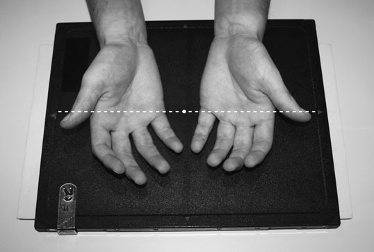
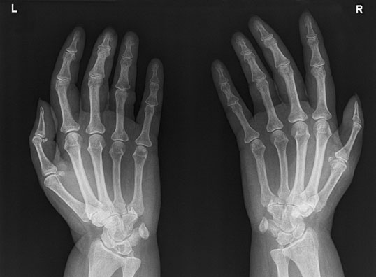
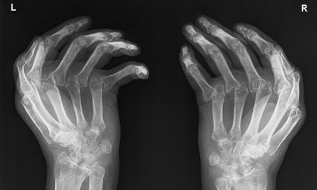
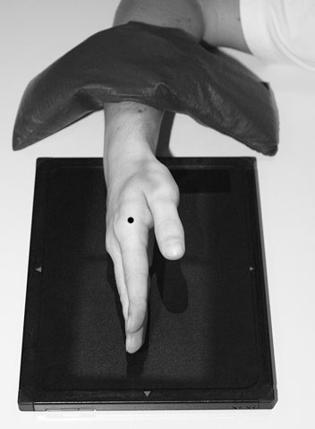
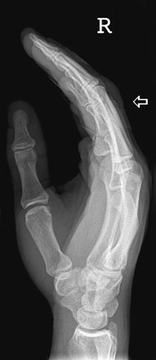

# Rx Mână Oblică Posterioară - Ambele Mâini (Metoda Incidența Norgaard (Ball-Catcher) (Ball-Catcher) or Nørgaard

  📷 Radiografie Convențională (Rx)
  <strong>Actualizat:</strong> 2026-09-16
  <strong>Autor:</strong> Departamentul de Radiologie / Referință Clark (Ed. 12)

---

-   __1. Rezumat Clinic & Indicații__

    ---

    === "Indicații Clinice"

        - Mână și Pumn (Articulație Radiocarpiană) (like Gleznă (Articulație Talocrurală) și Picior) have many accessory ossicles, which poate trap unwary into false diagnosis de pathology.
        - ‘Boxer’s suspiciune de fractură’ de gâtul de fifth metacarpal este seen easily, but conspicuity de suspiciune de fractură de bases de oase metacarpiene este reduced prin over rotație și underexposure. Profil (lateral) radiografie de Mână cu corp străin radiopac marker. There este old suspiciune de fractură de fifth metacarpal

    === "Ghid Național IRIS"

        !!! info "Referință Primară: Ghidul Național IRIS (Ordinul MS 1342/2012)"
            - **Capitol Ghid IRIS:** *Ghidul Național IRIS*
            - **Grad de Recomandare:** **De verificat pe indicație; fără grad atribuit automat**
            - **Nivel de Iradiere Estimată:** `De verificat pentru examinarea și populația selectate`

            [:octicons-search-16: Deschide Ghidul IRIS](../../iris.md){ .md-button .md-button--primary } [:material-open-in-new: Aplicația Oficială PWA](https://radiologie-pediatrica.ro/iris/){ .md-button target="_blank" rel="noopener" }
-   __2. Poziționare & Centrare Fascicul__

    ---

    - **Poziție Pacient:** • Ideally, Pacientul este așezat pe scaun lângă masa de examinare. However, if this este nu possible due la pacientul’s condition, pacientul poate fie așezat pe scaun facing masa de examinare (see Radiation protection, p. 35).
• ambele forearms sunt în supinație și plasat pe masa de examinare cu dorsal surface de mâinile în contact cu caseta.
• de la this poziție, Ambele Mâini sunt rotit internally (medially) 45 grade into a ‘ball-catching’ poziție.
• Degete Mână și thumbs sunt separated și extins but relaxat la ensure that they remain în contact cu caseta.
• mâinile poate fie sprijinit using 45-grade non-opaque pads.
• săculeți cu nisip este plasat over lower forearms pentru imobilizare.

• de la Postero-anterior (PA) poziție, Mână este externally rotit 90 grade.
• palm de Mână este perpendicular pe casetă, cu Degete Mână extins și Police în abducție și sprijinit paralel cu film radiologic pe non-opaque pad.
• radial și ulnar styloid processes sunt superimposed.
    - **Punct de Centrare Fascicul:** • raza centrală verticală centrală este centred la point midway între mâini la nivelul fifth metacarpo-phalangeal articulații.

• Raza centrală verticală este centrată pe cap de second metacarpal.
    - **Distanță Focar-Film (DFF / SID):** 100 cm
    - **Comandă Respiratorie:** Apnee pe durata expunerii (apnee în inspir pentru torace; expir pentru Abdomen/bazin).

-   __3. Parametri Tehnici Expunere__

    ---

    | Parametru Tehnic | Valoare Configurare Generator / Tub |
    |:-----------------|:-------------------------------------|
    | **Tensiune Tub (kV)** | DE CONFIGURAT PE APARAT |
    | **Sarcină / Produs Curent-Timp (mAs)** | Conform AEC / grosime anatomică |
    | **Distanță Focar-Film (DFF / SID)** | 100 cm |
    | **Grilă Antidifuzoare (Bucky)** | Conform grosimii anatomice (> 10-12 cm cu grilă) |
    | **Dimensiune Focar** | Focar Mic (0.6 mm) |
    | **Camere de Ionizare AEC** | DE CONFIGURAT PE APARAT |
    | **Colimare Fascicul** | Colimare strictă la aria anatomică de interes diagnostic |
    | **Filtrare Tub** | Totală ≥ 2.5 mm Al echivalent (conform Clark: 3.0 mm Al eq.) |

-   __4. Criterii de Calitate & Reușită Imagine__

    ---

    - imagine trebuie să evidențiază toate falange, including părți moi de fingertips, carpal și oase metacarpiene, și extremitatea distală radius și ulna.
    - parametri de expunere selected trebuie să produce densitate optică și contrast that optimally evidențiază articulație detail.
    - heads de oase metacarpiene trebuie să nu fie superimposed.
    - imagine trebuie să include fingertips, including părți moi, și radial și ulnar styloid processes.
    - heads de oase metacarpiene trebuie să fie superimposed.
    - Police trebuie să fie clar evidențiat(e) fără superimposition de other structures.

-   __5. Protecție Radiologică (ALARA)__

    ---

    - If it has been necessary to position the patient facing the table, it is essential to provide radiation protection for the lower limbs and gonads. This may be achieved by placing a lead-rubber sheet on the table underneath the cassette to attenuate the primary beam. 44 Normal radiograph of hands in Metoda Incidența Norgaard (Ball-Catcher) (Ball-Catcher) position Radiograph of hands in Metoda Incidența Norgaard (Ball-Catcher) (Ball-Catcher) position showing severe erosive disease
    - Ecranare gonadică cu șorț plumbat dacă gonadele sunt în apropierea fasciculului util (regula ALARA).
    - Colimare precisă la dimensiunea anatomică strict necesară pentru reducerea dozei și a radiației difuze.
    - Verificarea posibilității unei sarcini la pacientele de vârstă fertilă înainte de expunere.

!!! note "Observații Clinice & Tehnice"
    • If incidență has been undertaken la identify poziție de corp străin radiopac, kVp trebuie să fie lowered la evidențiază sau exclude its presence în soft tissues.
• metal marker plasat adjacent la puncture site este commonly used la aid localization de corp străin radiopac.

### 🖼️ Imagini

<figure class="protocol-image-card" markdown>

<figcaption><strong>arthritis. It poate also fie used la evidențiază suspiciune de fractură de the</strong> — Poziționare pacient și centrare fascicul conform Clark (Ed. 12)</figcaption>

</figure>

<figure class="protocol-image-card" markdown>

<figcaption><strong>Normal radiografie de mâini în Metoda Incidența Norgaard (Ball-Catcher) (Ball-Catcher) poziție</strong> — Aspect radiografic / ghid de poziționare conform tratatului Clark (Ed. 12)</figcaption>

</figure>

<figure class="protocol-image-card" markdown>

<figcaption><strong>radiografie de mâini în Metoda Incidența Norgaard (Ball-Catcher) (Ball-Catcher) poziție evidențiind severe erosive disease</strong> — Aspect radiografic / ghid de poziționare conform tratatului Clark (Ed. 12)</figcaption>

</figure>

<figure class="protocol-image-card" markdown>

<figcaption><strong>suspiciune de fractură sau luxație articulară de oase carpiene.</strong> — Aspect radiografic / ghid de poziționare conform tratatului Clark (Ed. 12)</figcaption>

</figure>

<figure class="protocol-image-card" markdown>

<figcaption><strong>• ‘Boxer’s suspiciune de fractură’ de gâtul de fifth metacarpal este seen</strong> — Aspect radiografic / ghid de poziționare conform tratatului Clark (Ed. 12)</figcaption>

</figure>

=== "Ghid Rapid de Execuție"

    1. **Identificarea și verificarea pacientului:** verificare identitate, zonă de examinat, consimțământ conform procedurii și evaluarea posibilității unei sarcini, când este relevantă.
    2. **Pregătire:** îndepărtarea oricăror obiecte radiopace (bijuterii, agrafe, fermoare, proteze, pansamente dense).
    3. **Poziționare precisă:** alinierea receptorului de imagine și a tubului la distanța prescrisă (100 cm).
    4. **Colimare strictă:** adaptarea fasciculului strict la regiunea de diagnostic pentru scăderea iradierii și reducerea radiației difuze.
    5. **Radioprotecție:** verificarea [politicii RX](../radioprotectie.md), cu măsuri distincte pentru pacient, personal și însoțitor.

## Surse de documentare

- [Clark's Positioning in Radiography (Ed. 12), Pagina 59](../../assets/protocols/sources/Clark___Positioning_in_Radiography__12th_edition.pdf#page=59)
