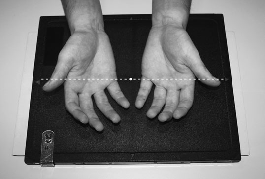
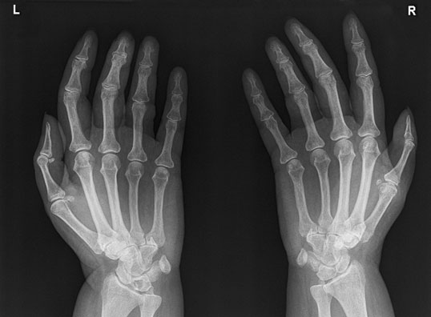
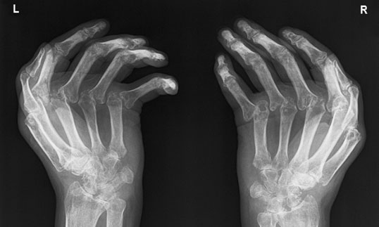
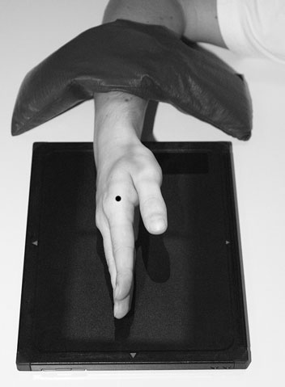
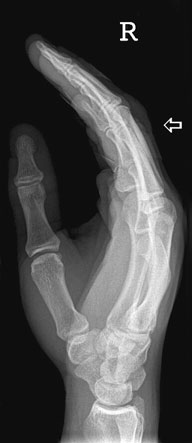

# Rx mână — oblică posterioară — ambele mâini (metoda incidenței Norgaard [prinderea mingii] sau Nørgaard)

  📷 Radiografie Convențională (Rx)
  <strong>Actualizat:</strong> 2026-09-16
  <strong>Autor:</strong> Departamentul de Radiologie / Referință Clark (Ed. 12)

---

-   __1. Rezumat Clinic & Indicații__

    ---

    === "Indicații Clinice"

        - Mâna și pumnul (articulația radiocarpiană), asemenea gleznei (articulația talocrurală) și piciorului, au numeroase oscioare accesorii, care pot induce în eroare și pot duce la un diagnostic fals de patologie.
        - „Suspiciunea de fractură de boxer” a colului celui de-al cincilea metacarpian este ușor vizibilă, însă vizibilitatea suspiciunii de fractură a bazelor oaselor metacarpiene este redusă prin rotație excesivă și subexpunere. Radiografie de profil (laterală) a mâinii cu marker pentru corp străin radiopac. Există o suspiciune de fractură veche a celui de-al cincilea metacarpian.

    === "Ghid Național IRIS"

        !!! info "Referință Primară: Ghidul Național IRIS (Ordinul MS 1342/2012)"
            - **Capitol Ghid IRIS:** *Aparat locomotor & Membru superior*
            - **Grad de Recomandare:** **Grad A**
            - **Nivel de Iradiere Estimată:** `Clasa 1 (Minimă < 0.01 mSv)`

            [:octicons-search-16: Deschide Ghidul IRIS](../../iris.md){ .md-button .md-button--primary } [:material-open-in-new: Aplicația Oficială PWA](https://radiologie-pediatrica.ro/iris/){ .md-button target="_blank" rel="noopener" }

-   __2. Poziționare & Centrare Fascicul__

    ---

    - **Poziție Pacient:**
        - Ideal, pacientul este așezat pe scaun lângă masa de examinare. Totuși, dacă acest lucru nu este posibil din cauza stării pacientului, acesta poate fi așezat pe scaun cu fața spre masa de examinare (vezi Protecția împotriva radiațiilor, p. 35).
        - Ambele antebrațe sunt în supinație și plasate pe masa de examinare, cu suprafața dorsală a mâinilor în contact cu caseta.
        - Din această poziție, ambele mâini sunt rotite intern (medial) la 45 grade, în poziția de „prindere a mingii”.
        - Degetele mâinii și policele sunt depărtate și extinse, dar relaxate, pentru a se asigura că rămân în contact cu caseta.
        - Mâinile pot fi sprijinite folosind suporturi radiotransparente la 45 grade.
        - Săculețul cu nisip este plasat peste partea inferioară a antebrațelor pentru imobilizare.
        - Din poziția postero-anterioară (PA), mâna este rotită extern la 90 grade.
        - Palma mâinii este perpendiculară pe casetă, cu degetele mâinii extinse și policele în abducție, sprijinit paralel cu filmul radiologic pe un suport radiotransparent.
        - Procesele stiloide radial și ulnar sunt suprapuse.
    - **Punct de Centrare Fascicul:**
        - Raza centrală verticală este centrată în punctul situat la jumătatea distanței dintre mâini, la nivelul articulațiilor metacarpofalangiene ale celui de-al cincilea deget.
        - Raza centrală verticală este centrată pe capul celui de-al doilea metacarpian.
    - **Distanță Focar-Film (DFF / SID):** 100 cm
    - **Comandă Respiratorie:** Apnee pe durata expunerii (apnee în inspir pentru torace; expir pentru Abdomen/bazin).

-   __3. Parametri Tehnici Expunere__

    ---

    | Parametru Tehnic | Valoare Configurare Generator / Tub |
    |:-----------------|:-------------------------------------|
    | **Tensiune Tub (kV)** | DE CONFIGURAT PE APARAT |
    | **Sarcină / Produs Curent-Timp (mAs)** | Conform AEC / grosimii anatomice |
    | **Distanță Focar-Film (DFF / SID)** | 100 cm |
    | **Grilă Antidifuzoare (Bucky)** | Conform grosimii anatomice (> 10-12 cm cu grilă) |
    | **Dimensiune Focar** | Focar Mic (0.6 mm) |
    | **Camere de Ionizare AEC** | DE CONFIGURAT PE APARAT |
    | **Colimare Fascicul** | Colimare strictă la aria anatomică de interes diagnostic |
    | **Filtrare Tub** | Totală ≥ 2.5 mm Al echivalent (conform Clark: 3.0 mm Al echivalent) |

-   __4. Criterii de Calitate & Reușită Imagine__

    ---

    - Imaginea trebuie să evidențieze toate falangele, inclusiv părțile moi ale vârfurilor degetelor, oasele carpiene și metacarpiene, precum și extremitatea distală a radiusului și ulnei.
    - Parametrii de expunere selectați trebuie să producă o densitate optică și un contrast care să evidențieze optim detaliile articulare.
    - Capetele oaselor metacarpiene nu trebuie să fie suprapuse.
    - Imaginea trebuie să includă vârfurile degetelor, inclusiv părțile moi, precum și procesele stiloide radial și ulnar.
    - Capetele oaselor metacarpiene trebuie să fie suprapuse.
    - Policele trebuie să fie clar evidențiat, fără suprapunerea altor structuri.

-   __5. Protecție Radiologică (ALARA)__

    ---

    - Dacă a fost necesară poziționarea pacientului cu fața spre masă, este esențial să se asigure protecția împotriva radiațiilor pentru membrele inferioare și gonade. Aceasta poate fi realizată prin plasarea unei foi de cauciuc plumbat pe masă, sub casetă, pentru atenuarea fasciculului primar. 44 Radiografie normală a mâinilor în poziția prin metoda incidenței Norgaard (prinderea mingii). Radiografie a mâinilor în poziția prin metoda incidenței Norgaard (prinderea mingii), evidențiind boală erozivă severă.
    - Ecranare gonadică cu șorț plumbat dacă gonadele sunt în apropierea fasciculului util (regula ALARA).
    - Colimare precisă la dimensiunea anatomică strict necesară pentru reducerea dozei și a radiației difuze.
    - Verificarea posibilității unei sarcini la pacientele de vârstă fertilă înainte de expunere.

!!! note "Observații Clinice & Tehnice"
    - Dacă incidența a fost efectuată pentru identificarea poziției unui corp străin radiopac, kVp trebuie redus pentru a evidenția sau exclude prezența acestuia în țesuturile moi.
    - Un marker metalic plasat adiacent locului puncției este utilizat frecvent pentru a facilita localizarea corpului străin radiopac.

### 🖼️ Imagini

<figure class="protocol-image-card" markdown>

<figcaption><strong>Artrită. Poate fi utilizată și pentru a evidenția suspiciunea de fractură a</strong> — Poziționarea pacientului și centrarea fasciculului conform Clark (Ed. 12)</figcaption>

</figure>

<figure class="protocol-image-card" markdown>

<figcaption><strong>Radiografie normală a mâinilor în poziția prin metoda incidenței Norgaard (prinderea mingii)</strong> — Aspect radiografic / ghid de poziționare conform tratatului Clark (Ed. 12)</figcaption>

</figure>

<figure class="protocol-image-card" markdown>

<figcaption><strong>Radiografie a mâinilor în poziția prin metoda incidenței Norgaard (prinderea mingii), evidențiind boală erozivă severă</strong> — Aspect radiografic / ghid de poziționare conform tratatului Clark (Ed. 12)</figcaption>

</figure>

<figure class="protocol-image-card" markdown>

<figcaption><strong>Suspiciune de fractură sau luxație articulară a oaselor carpiene.</strong> — Aspect radiografic / ghid de poziționare conform tratatului Clark (Ed. 12)</figcaption>

</figure>

<figure class="protocol-image-card" markdown>

<figcaption><strong>• „Suspiciunea de fractură de boxer” a colului celui de-al cincilea metacarpian este vizibilă</strong> — Aspect radiografic / ghid de poziționare conform tratatului Clark (Ed. 12)</figcaption>

</figure>

=== "Ghid Rapid de Execuție"

    1. **Identificarea și verificarea pacientului:** verificare identitate, zonă de examinat, consimțământ conform procedurii și evaluarea posibilității unei sarcini, când este relevantă.
    2. **Pregătire:** îndepărtarea oricăror obiecte radiopace (bijuterii, agrafe, fermoare, proteze, pansamente dense).
    3. **Poziționare precisă:** alinierea receptorului de imagine și a tubului la distanța prescrisă (100 cm).
    4. **Colimare strictă:** adaptarea fasciculului strict la regiunea de diagnostic pentru scăderea iradierii și reducerea radiației difuze.
    5. **Radioprotecție:** verificarea [politicii RX](../radioprotectie.md), cu măsuri distincte pentru pacient, personal și însoțitor.

## Surse de documentare

- [Clark's Positioning in Radiography (Ed. 12), Pagina 59](https://books.google.com/books/about/Clark_s_Positioning_in_Radiography.html?id=Xxu6MwEACAAJ)
