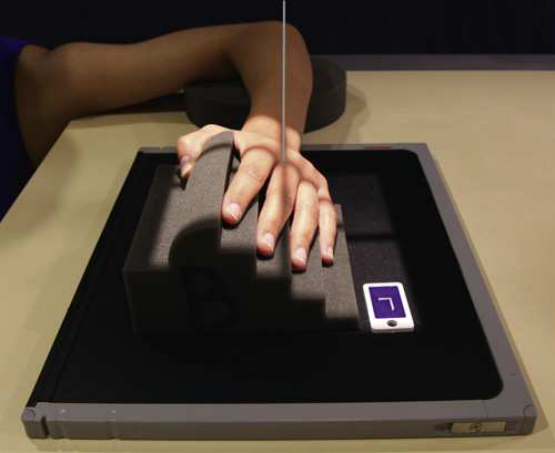
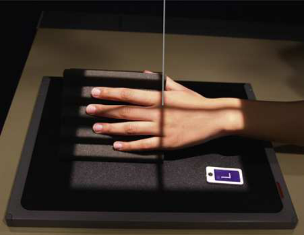
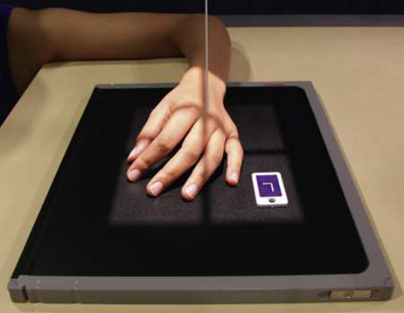
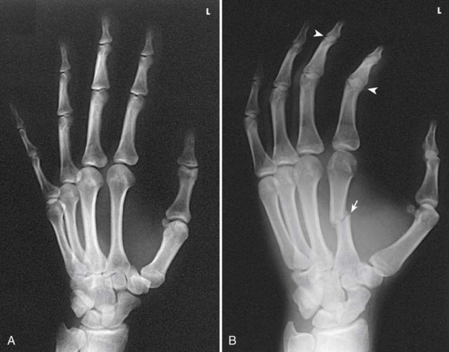

# Rx Mână — Oblică Postero-Anterioară (PA) — Rotație Externă (Laterală) (Merrill)

  📷 Radiografie Convențională (Rx)
  <strong>Actualizat:</strong> 2026-09-16
  <strong>Autor:</strong> Referință Merrill

---

-   __1. Rezumat Clinic & Indicații__

    ---

    === "Indicații Clinice"

        - Conform reperelor anatomice standard din tratat

    === "Ghid Național IRIS"

        !!! info "Referință Primară: Ghidul Național IRIS (Ordinul MS 1342/2012)"
            - **Capitol Ghid IRIS:** *Ghidul Național IRIS*
            - **Grad de Recomandare:** **De verificat pe indicație; fără grad atribuit automat**
            - **Nivel de Iradiere Estimată:** `De verificat pentru examinarea și populația selectate`

            [:octicons-search-16: Deschide Ghidul IRIS](../../iris.md){ .md-button .md-button--primary } [:material-open-in-new: Aplicația Oficială PWA](https://radiologie-pediatrica.ro/iris/){ .md-button target="_blank" rel="noopener" }
-   __2. Poziționare & Centrare Fascicul__

    ---

    - **Poziție Pacient:** se așază pacientul pe scaun la end de masa radiologică. se ajustează pacient’s height la rest Antebraț pe masa de examinare.; se sprijină pacientul’s Antebraț pe masa de examinare, cu Mână în pronație și palm resting pe receptorul de imagine. se ajustează obliquity de Mână astfel încât articulații metacarpofalangiene (MCF) form angle de approximately 45 grade cu receptorul de imagine plane. Use a 45-grade foam wedge la support Degete Mână în extins poziție la show articulații interfalangiene (IF) (see Figs. 5.55 și 5.56). When examining oase metacarpiene, obtain PA Incidență Oblică de Mână prin rotating pacientul’s Mână laterally (externally) de la în pronație poziție until fingertips touch receptorul de imagine (Fig. 5.57). If it este impossible la obtain correct poziție cu toate fingertips resting pe receptorul de imagine, elevate index finger și Police pe suitable radiolucent material (see Fig. 5.56). Elevation opens spații articulare și reduces grade de foreshortening de falange. pentru either approach, se centrează receptorul de imagine la articulații metacarpofalangiene (MCF) și se ajustează midline la fie paralel cu axa longitudinală de Mână și Antebraț. se efectuează ecranarea gonadelor cu șorț plumbat.
    - **Punct de Centrare Fascicul:** perpendicular pe third articulații metacarpofalangiene (MCF)
    - **Distanță Focar-Film (DFF / SID):** Nespecificat în fragmentul extras; de verificat în sursă
    - **Comandă Respiratorie:** Conform reperelor anatomice standard din tratat

-   __3. Parametri Tehnici Expunere__

    ---

    | Parametru Tehnic | Valoare Configurare Generator / Tub |
    |:-----------------|:-------------------------------------|
    | **Tensiune Tub (kV)** | DE CONFIGURAT PE APARAT |
    | **Sarcină / Produs Curent-Timp (mAs)** | DE CONFIGURAT PE APARAT |
    | **Distanță Focar-Film (DFF / SID)** | Nespecificat în fragmentul extras; de verificat în sursă |
    | **Grilă Antidifuzoare (Bucky)** | DE CONFIGURAT PE APARAT |
    | **Dimensiune Focar** | DE CONFIGURAT PE APARAT |
    | **Camere de Ionizare AEC** | DE CONFIGURAT PE APARAT |
    | **Colimare Fascicul** | Adjust câmp de iradiere la 1 inch (2.5 cm) pe toate sides de Mână, including 1 inch (2.5 cm) proximal la ulnar styloid. Se plasează markerul de lateralitate în câmpul colimat. |
    | **Filtrare Tub** | DE CONFIGURAT PE APARAT |

-   __4. Criterii de Calitate & Reușită Imagine__

    ---

    - Criterii radiologice de calitate imaginii:
    - Colimare adecvată vizibilă și prezența markerului de lateralitate (D/S) plasat clear de anatomy de interest
    - Anatomy de la fingertips la distal radius și ulna
    - falange separated slightly cu fără overlap de their soft tissues
    - 45 grade de rotație de anatomy
    - Decreasing amounts de separation între metacarpal corpuri two through five, cu second și third having greatest separation.
    - Partial superimposition de third, fourth, și fifth metacarpal bases și heads
    - Open articulații metacarpofalangiene (MCF)
    - Open articulații interfalangiene (IF), when falange sunt poziționat paralel cu receptorul de imagine
    - Bony detalii trabeculare osoase și surrounding soft tissues

-   __5. Protecție Radiologică (ALARA)__

    ---

    - Nespecificat în fragmentul extras; de verificat în sursă

!!! note "Observații Clinice & Tehnice"
    Lane et al. 11 recommended inclusion de reverse Incidență Oblică la better show severe metacarpal deformities sau suspiciune de fractură. This incidență este accomplished prin having pacientul se rotește Mână 45 grade medially (internally) de la palm-down poziție. Kallen 12 recommended using tangențial Incidență Oblică la show metacarpal cap suspiciune de fractură. de la PA Mână poziție, articulații metacarpofalangiene (MCF) sunt flectat 75 la 80 grade cu dorsum de falange resting pe receptorul de imagine. Mână este rotit 40 la 45 grade spre ulnar surface. Then Mână este rotit 40 la 45 grade forward until afected articulații metacarpofalangiene (MCF) este projected beyond its proximal phalanx. perpendicular raza centrală este orientat tangentially la enter articulații metacarpofalangiene (MCF) de interest. Variations de rotație sunt described la show second metacarpal cap liber de superimposition.

### 🖼️ Imagini

<figure class="protocol-image-card" markdown>

<figcaption><strong>Merrill — pagina PDF 277, imaginea 1</strong> — Imagine din fragmentul sursă; asocierea necesită revizie.</figcaption>

</figure>

<figure class="protocol-image-card" markdown>

<figcaption><strong>Merrill — pagina PDF 278, imaginea 2</strong> — Imagine din fragmentul sursă; asocierea necesită revizie.</figcaption>

</figure>

<figure class="protocol-image-card" markdown>

<figcaption><strong>Merrill — pagina PDF 278, imaginea 3</strong> — Imagine din fragmentul sursă; asocierea necesită revizie.</figcaption>

</figure>

<figure class="protocol-image-card" markdown>

<figcaption><strong>Merrill — pagina PDF 279, imaginea 4</strong> — Imagine din fragmentul sursă; asocierea necesită revizie.</figcaption>

</figure>

=== "Ghid Rapid de Execuție"

    1. **Identificarea și verificarea pacientului:** verificare identitate, zonă de examinat, consimțământ conform procedurii și evaluarea posibilității unei sarcini, când este relevantă.
    2. **Pregătire:** îndepărtarea oricăror obiecte radiopace (bijuterii, agrafe, fermoare, proteze, pansamente dense).
    3. **Poziționare precisă:** alinierea receptorului de imagine și a tubului la distanța prescrisă (Nespecificat în fragmentul extras; de verificat în sursă).
    4. **Colimare strictă:** adaptarea fasciculului strict la regiunea de diagnostic pentru scăderea iradierii și reducerea radiației difuze.
    5. **Radioprotecție:** verificarea [politicii RX](../radioprotectie.md), cu măsuri distincte pentru pacient, personal și însoțitor.

## Surse de documentare

- [Merrill’s Atlas, 5. Upper Extremity, pagini PDF 277–279](../../assets/protocols/sources/a56d45c16829_Merrills_Atlas_of_Radiographic_Positioning__Procedures_3Vol_Set.pdf#page=277)

## Fragmente sursă traduse (referință tehnică)

### anatomy

PA oblic incidență de bones și soft tissues de mână, including distal radius și ulna (see Fig. 5.58). This supplemental poziție
este used pentru investigating suspiciune de fractură și pathologic conditions.

### collimation

• Adjust câmp de iradiere la 1 inch (2.5 cm) pe toate sides de mână, including 1 inch (2.5 cm) proximal la ulnar styloid. Place side
marker în collimated expunere field.

### cr

• perpendicular pe third articulații metacarpofalangiene (MCF)

### criteria

Criterii radiologice de calitate imaginii:
• Colimare adecvată vizibilă și prezența markerului de lateralitate (D/S) plasat clear de anatomy de interest
• Anatomy de la fingertips la distal radius și ulna
• falange separated slightly cu fără overlap de their soft tissues
• 45 grade de rotație de anatomy
• Decreasing amounts de separation între metacarpal corpuri two through five, cu second și third having greatest
separation.
• Partial superimposition de third, fourth, și fifth metacarpal bases și heads
• Open articulații metacarpofalangiene (MCF)
• Open articulații interfalangiene (IF), when falange sunt poziționat paralel cu receptorul de imagine
• Bony detalii trabeculare osoase și surrounding soft tissues

### notes

Lane et al. 11 recommended inclusion de reverse oblic incidență la better show severe metacarpal deformities sau suspiciune de fractură. This
incidență este accomplished prin having pacientul se rotește mână 45 grade medially (internally) de la palm-down poziție.
Kallen 12 recommended using tangențial oblic incidență la show metacarpal cap suspiciune de fractură. de la PA mână poziție, articulații metacarpofalangiene (MCF)
sunt flectat 75 la 80 grade cu dorsum de falange resting pe receptorul de imagine. mână este rotit 40 la 45 grade spre ulnar surface. Then mână este rotit 40 la 45 grade forward until afected articulații metacarpofalangiene (MCF) este projected beyond its proximal phalanx. perpendicular raza centrală este orientat
tangentially la enter articulații metacarpofalangiene (MCF) de interest. Variations de rotație sunt described la show second metacarpal cap liber de superimposition.

### part_pos

• se sprijină pacientul’s forearm pe masa de examinare, cu mână în pronație și palm resting pe receptorul de imagine.
• se ajustează obliquity de mână astfel încât articulații metacarpofalangiene (MCF) form angle de approximately 45 grade cu receptorul de imagine plane.
• Use a 45-grade foam wedge la support degetele în extins poziție la show articulații interfalangiene (IF) (see Figs. 5.55 și 5.56).
• When examining oase metacarpiene, obtain PA oblic incidență de mână prin rotating pacientul’s mână laterally (externally) de la
în pronație poziție until fingertips touch receptorul de imagine (Fig. 5.57).
• If it este impossible la obtain correct poziție cu toate fingertips resting pe receptorul de imagine, elevate index finger și thumb pe suitable
radiolucent material (see Fig. 5.56). Elevation opens spații articulare și reduces grade de foreshortening de falange.
• pentru either approach, se centrează receptorul de imagine la articulații metacarpofalangiene (MCF) și se ajustează midline la fie paralel cu axa longitudinală de mână și forearm.
• se efectuează ecranarea gonadelor cu șorț plumbat.

### patient_pos

• se așază pacientul pe scaun la end de masa radiologică.
• se ajustează pacient’s height la rest forearm pe masa de examinare.

### tech

poziționat prin manufacturer sau department protocol pentru corect anatomy display orientation; raza centrală plate: 10 × 12 inches (24 × 30 cm) longitudinal.

