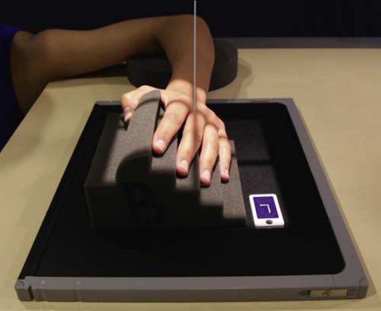
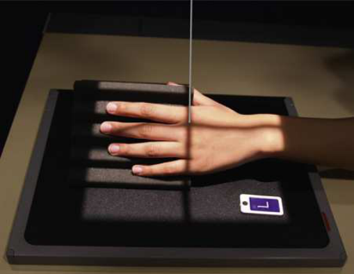
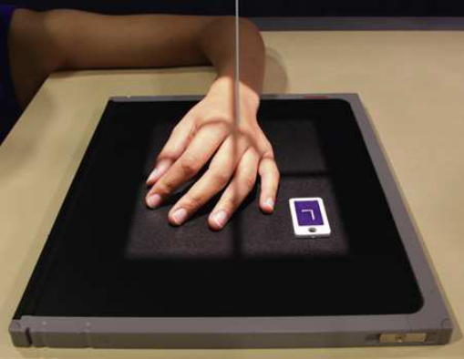
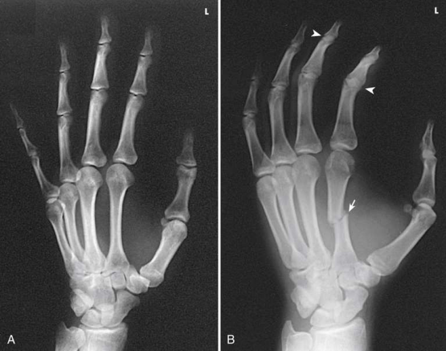

# Rx mână — oblică postero-anterioară (PA) — rotație externă (laterală) (Merrill)

  📷 Radiografie Convențională (Rx)
  <strong>Actualizat:</strong> 2026-09-16
  <strong>Autor:</strong> Referință Merrill

---

-   __1. Rezumat Clinic & Indicații__

    ---

    === "Indicații Clinice"

        - Conform reperelor anatomice standard din tratat

    === "Ghid Național IRIS"

        !!! info "Referință Primară: Ghidul Național IRIS (Ordinul MS 1342/2012)"
            - **Capitol Ghid IRIS:** *Aparat locomotor & Membru superior*
            - **Grad de Recomandare:** **Grad A**
            - **Nivel de Iradiere Estimată:** `Clasa 1 (Minimă < 0.01 mSv)`

            [:octicons-search-16: Deschide Ghidul IRIS](../../iris.md){ .md-button .md-button--primary } [:material-open-in-new: Aplicația Oficială PWA](https://radiologie-pediatrica.ro/iris/){ .md-button target="_blank" rel="noopener" }

-   __2. Poziționare & Centrare Fascicul__

    ---

    - **Poziție Pacient:** Se așază pacientul pe scaun la capătul mesei radiologice. Se ajustează înălțimea pacientului pentru a sprijini antebrațul pe masa de examinare. Se sprijină antebrațul pacientului pe masa de examinare, cu mâna în pronație și palma sprijinită pe receptorul de imagine. Se ajustează oblicitatea mâinii astfel încât articulațiile metacarpofalangiene (MCF) să formeze un unghi de aproximativ 45 grade cu planul receptorului de imagine. Se utilizează un suport din spumă la 45 grade pentru susținerea degetelor în poziție extinsă, pentru evidențierea articulațiilor interfalangiene (IF) (vezi Fig. 5.55 și 5.56). La examinarea oaselor metacarpiene, se obține o incidență PA oblică a mâinii prin rotirea laterală (externă) a mâinii pacientului din poziția în pronație, până când vârfurile degetelor ating receptorul de imagine (Fig. 5.57). Dacă este imposibil să se obțină poziția corectă cu toate vârfurile degetelor sprijinite pe receptorul de imagine, se ridică indexul și policele pe un material radiotransparent adecvat (vezi Fig. 5.56). Ridicarea deschide spațiile articulare și reduce gradul de scurtare aparentă a falangelor. Pentru oricare dintre abordări, se centrează receptorul de imagine la nivelul articulațiilor metacarpofalangiene (MCF) și se ajustează linia mediană pentru a fi paralelă cu axa longitudinală a mâinii și antebrațului. Se efectuează ecranarea gonadelor cu șorț plumbat.
    - **Punct de Centrare Fascicul:** perpendicular pe articulațiile metacarpofalangiene (MCF) ale celui de-al treilea metacarpian
    - **Distanță Focar-Film (DFF / SID):** Nespecificat în fragmentul extras; de verificat în sursă
    - **Comandă Respiratorie:** Conform reperelor anatomice standard din tratat

-   __3. Parametri Tehnici Expunere__

    ---

    | Parametru Tehnic | Valoare Configurare Generator / Tub |
    |:-----------------|:-------------------------------------|
    | **Tensiune Tub (kV)** | DE CONFIGURAT PE APARAT |
    | **Sarcină / Produs Curent-Timp (mAs)** | DE CONFIGURAT PE APARAT |
    | **Distanță Focar-Film (DFF / SID)** | Nespecificat în fragmentul extras; de verificat în sursă |
    | **Grilă Antidifuzoare (Bucky)** | DE CONFIGURAT PE APARAT |
    | **Dimensiune Focar** | DE CONFIGURAT PE APARAT |
    | **Camere de Ionizare AEC** | DE CONFIGURAT PE APARAT |
    | **Colimare Fascicul** | Se ajustează câmpul de iradiere la 1 țol (2.5 cm) față de toate laturile mâinii, inclusiv 1 țol (2.5 cm) proximal față de stiloida ulnară. Se plasează markerul de lateralitate în câmpul colimat. |
    | **Filtrare Tub** | DE CONFIGURAT PE APARAT |

-   __4. Criterii de Calitate & Reușită Imagine__

    ---

    - Criterii radiologice de calitate a imaginii:
    - Colimare adecvată vizibilă și prezența markerului de lateralitate (D/S) plasat în afara structurilor anatomice de interes
    - Anatomie de la vârfurile degetelor până la radiusul și ulna distale
    - Falange ușor depărtate, fără suprapunerea țesuturilor lor moi
    - Rotație de 45 grade a anatomiei
    - Cantități descrescătoare de separare între corpurile metacarpiene de la doi la cinci, al doilea și al treilea prezentând cea mai mare separare.
    - Suprapunere parțială a bazelor și capetelor metacarpienelor al treilea, al patrulea și al cincilea
    - Articulații metacarpofalangiene (MCF) deschise
    - Articulații interfalangiene (IF) deschise, atunci când falangele sunt poziționate paralel cu receptorul de imagine
    - Detalii trabeculare osoase și țesuturile moi înconjurătoare

-   __5. Protecție Radiologică (ALARA)__

    ---

    - Nespecificat în fragmentul extras; de verificat în sursă

!!! note "Observații Clinice & Tehnice"
    Lane et al. 11 au recomandat includerea incidenței oblice inverse pentru a evidenția mai bine deformările metacarpiene severe sau suspiciunea de fractură. Această incidență se realizează prin rotirea mâinii pacientului la 45 grade medial (intern) din poziția cu palma în jos. Kallen 12 a recomandat utilizarea unei incidențe oblice tangențiale pentru evidențierea suspiciunii de fractură a capului metacarpian. Din poziția PA a mâinii, articulațiile metacarpofalangiene (MCF) sunt flectate la 75 la 80 grade, cu dosul falangelor sprijinit pe receptorul de imagine. Mâna este rotită la 40 la 45 grade spre suprafața ulnară. Apoi mâna este rotită la 40 la 45 grade înainte, până când articulația metacarpofalangiană (MCF) afectată este proiectată dincolo de falanga sa proximală. Raza centrală perpendiculară este orientată tangențial pentru a pătrunde în articulația metacarpofalangiană (MCF) de interes. Au fost descrise variații ale rotației pentru a evidenția capul celui de-al doilea metacarpian liber de suprapunere.

### 🖼️ Imagini

<figure class="protocol-image-card" markdown>

<figcaption><strong>Merrill — pagina 277, imaginea 1</strong> — Imagine din fragmentul sursă; asocierea necesită revizie.</figcaption>

</figure>

<figure class="protocol-image-card" markdown>

<figcaption><strong>Merrill — pagina 278, imaginea 2</strong> — Imagine din fragmentul sursă; asocierea necesită revizie.</figcaption>

</figure>

<figure class="protocol-image-card" markdown>

<figcaption><strong>Merrill — pagina 278, imaginea 3</strong> — Imagine din fragmentul sursă; asocierea necesită revizie.</figcaption>

</figure>

<figure class="protocol-image-card" markdown>

<figcaption><strong>Merrill — pagina 279, imaginea 4</strong> — Imagine din fragmentul sursă; asocierea necesită revizie.</figcaption>

</figure>

=== "Ghid Rapid de Execuție"

    1. **Identificarea și verificarea pacientului:** verificare identitate, zonă de examinat, consimțământ conform procedurii și evaluarea posibilității unei sarcini, când este relevantă.
    2. **Pregătire:** îndepărtarea oricăror obiecte radiopace (bijuterii, agrafe, fermoare, proteze, pansamente dense).
    3. **Poziționare precisă:** alinierea receptorului de imagine și a tubului la distanța prescrisă (Nespecificat în fragmentul extras; de verificat în sursă).
    4. **Colimare strictă:** adaptarea fasciculului strict la regiunea de diagnostic pentru scăderea iradierii și reducerea radiației difuze.
    5. **Radioprotecție:** verificarea [politicii RX](../radioprotectie.md), cu măsuri distincte pentru pacient, personal și însoțitor.

## Surse de documentare

- [Merrill’s Atlas, 5. Upper Extremity, pagini 277–279](https://books.google.com/books/about/Merrill_s_Atlas_of_Radiographic_Position.html?id=BM0lEQAAQBAJ)
