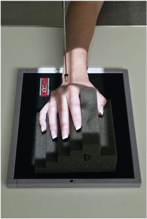
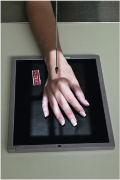
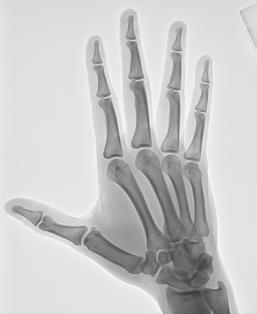
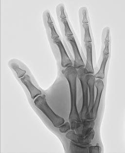
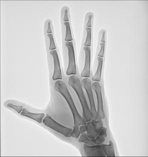

# Rx Mână PA Oblică

  📷 Radiografie Convențională (Rx)
  <strong>Actualizat:</strong> 2026-09-15
  <strong>Autor:</strong> Departamentul de Radiologie / Referință Bontrager

---

-   __1. Rezumat Clinic & Indicații__

    ---

    === "Indicații Clinice"

        - suspiciune de fractură și luxație / subluxație articulară de falange, oase metacarpiene, și toate articulații de Mână
        - Pathologic processes, such ca osteoporosis și artroză / modificări degenerative articulare

    === "Ghid Național IRIS"

        !!! info "Referință Primară: Ghidul Național IRIS (Ordinul MS 1342/2012)"
            - **Capitol Ghid IRIS:** *Ghidul Național IRIS*
            - **Grad de Recomandare:** **De verificat pe indicație; fără grad atribuit automat**
            - **Nivel de Iradiere Estimată:** `De verificat pentru examinarea și populația selectate`

            [:octicons-search-16: Deschide Ghidul IRIS](../../iris.md){ .md-button .md-button--primary } [:material-open-in-new: Aplicația Oficială PWA](https://radiologie-pediatrica.ro/iris/){ .md-button target="_blank" rel="noopener" }
-   __2. Poziționare & Centrare Fascicul__

    ---

    - **Poziție Pacient:** Pacient: Seat pacient la end de table cu Mână și Antebraț extins.; Regiune anatomică: Pronate Mână pe receptorul de imagine; center și align axa longitudinală de Mână cu axa longitudinală de receptorul de imagine. Rotate entire Mână și Pumn (Articulație Radiocarpiană) laterally 45° și support cu radiolucent wedge sau step block, ca vizualizat, so that toate falange sunt separated și paralel cu receptorul de imagine (see Exception).
    - **Punct de Centrare Fascicul:** perpendicular pe receptorul de imagine, orientat la treia articulație metacarpofalangiană (MCP 3)
    - **Distanță Focar-Film (DFF / SID):** 100 cm
    - **Comandă Respiratorie:** Apnee pe durata expunerii (sau conform cooperării pacientului)

-   __3. Parametri Tehnici Expunere__

    ---

    | Parametru Tehnic | Valoare Configurare Generator / Tub |
    |:-----------------|:-------------------------------------|
    | **Tensiune Tub (kV)** | 55 kV |
    | **Sarcină / Produs Curent-Timp (mAs)** | DE CONFIGURAT PE APARAT |
    | **Distanță Focar-Film (DFF / SID)** | 100 cm |
    | **Grilă Antidifuzoare (Bucky)** | Fără grilă (expunere directă) |
    | **Dimensiune Focar** | Focar Mic (0.6 mm) |
    | **Camere de Ionizare AEC** | DE CONFIGURAT PE APARAT |
    | **Colimare Fascicul** | Field Size Collimate pe four sides la Mână și Pumn (Articulație Radiocarpiană). Exception pentru routine oblic Mână, use support block la place falange paralel cu receptorul de imagine (Figs. 4.70 și 4.72). This block prevents foreshortening de falange și obscuring de articulații interfalangiene (IF). If oase metacarpiene only sunt de interest, imagine poate fie taken cu Police și fingertips touching receptorul de imagine (Figs. 4.71 și 4.73). Mână ROUTINE PA PA oblic lateral Fig. 4.70 Routine oblic Mână (falange paralel). Fig. 4.71 Exception: oblic Mână pentru oase metacarpiene (falange nu paralel)—nu recommended pentru falange. Fig. 4.72 PA oblic Mână (falange paralel). |
    | **Filtrare Tub** | Totală ≥ 2.5 mm Al echivalent |

-   __4. Criterii de Calitate & Reușită Imagine__

    ---

    - Incidență Oblică de entire Mână și Pumn (Articulație Radiocarpiană) și about 1 inch (2.5 cm) de distal Antebraț sunt vizibil. poziție:
    - axa longitudinală de Mână și Pumn (Articulație Radiocarpiană) trebuie să fie aliniat cu receptorul de imagine.
    - 45° oblic este evidenced prin: treimea medie diafizeis de oase metacarpiene trebuie să nu overlap; some overlap de distal heads de third, fourth, și fifth oase metacarpiene but fără overlap de distal second și third oase metacarpiene trebuie să occur; excessive overlap de oase metacarpiene indicates overrotation, și too much separation indicates underrotation.
    - MCP și articulații interfalangiene (IF) sunt open fără foreshortening de midphalanges sau distal falange, indicating that Degete Mână sunt paralel cu receptorul de imagine (Fig. 4.74).
    - raza centrală și center de collimation field size trebuie să fie la treia articulație metacarpofalangiană (MCP 3). expunere:
    - optim receptorul de imagine expunere și contrast cu fără mișcare evidențiază părți moi margins și clear, Contururi osoase și travee trabeculare nete, fără artefacte de mișcare. R Fig. 4.73 PA oblic Mână (falange nu paralel)—spații articulare nu open. oase carpiene cap de 5th metacarpal Ulna Radius 1st falange (Police) 1st metacarpal 2nd 3rd 4th 5th R Fig. 4.74 PA oblic Mână (falange paralel).

-   __5. Protecție Radiologică (ALARA)__

    ---

    - Ecranare gonadică și a organelor radiosensibile conform procedurilor locale de radioprotecție ALARA.
    - Colimare strictă la aria de interes pentru limitarea radiației difuze.
    - Verificarea posibilității unei sarcini la pacientele de vârstă fertilă înainte de expunere.

### 🖼️ Imagini

<figure class="protocol-image-card" markdown>

<figcaption><strong>Fig. 4.70 Routine oblic Mână</strong> — Poziționare pacient conform Ghidului Bontrager (Fig. 4.70 Routine oblic mână)</figcaption>

</figure>

<figure class="protocol-image-card" markdown>

<figcaption><strong>Fig. 4.71 Exception: oblic</strong> — Aspect radiografic de referință conform Ghidului Bontrager (Fig. 4.71 Exception: oblic)</figcaption>

</figure>

<figure class="protocol-image-card" markdown>

<figcaption><strong>Fig. 4.72 PA oblic Mână (falange</strong> — Aspect radiografic de referință conform Ghidului Bontrager (Fig. 4.72 PA oblic mână (falange)</figcaption>

</figure>

<figure class="protocol-image-card" markdown>

<figcaption><strong>Fig. 4.73 PA oblic Mână (falange</strong> — Aspect radiografic de referință conform Ghidului Bontrager (Fig. 4.73 PA oblic mână (falange)</figcaption>

</figure>

<figure class="protocol-image-card" markdown>

<figcaption><strong>Fig. 4.74 PA oblic Mână (falange paralel).</strong> — Aspect radiografic de referință conform Ghidului Bontrager (Fig. 4.74 PA oblic mână (falange paralel).)</figcaption>

</figure>

=== "Ghid Rapid de Execuție"

    1. **Identificarea și verificarea pacientului:** verificare identitate, zonă de examinat, consimțământ conform procedurii și evaluarea posibilității unei sarcini, când este relevantă.
    2. **Pregătire:** îndepărtarea oricăror obiecte radiopace (bijuterii, agrafe, fermoare, proteze, pansamente dense).
    3. **Poziționare precisă:** alinierea receptorului de imagine și a tubului la distanța prescrisă (100 cm).
    4. **Colimare strictă:** adaptarea fasciculului strict la regiunea de diagnostic pentru scăderea iradierii și reducerea radiației difuze.
    5. **Radioprotecție:** verificarea [politicii RX](../radioprotectie.md), cu măsuri distincte pentru pacient, personal și însoțitor.

## Surse de documentare

- [Bontrager's Textbook of Radiographic Positioning (Ed. 9/10), Pagina 161](https://www.elsevier.com/books/textbook-of-radiographic-positioning-and-related-anatomy/lampignano/978-0-323-65367-1)
