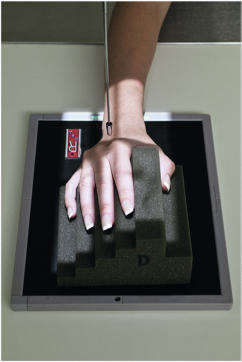
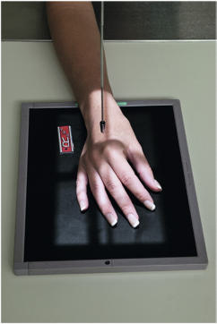
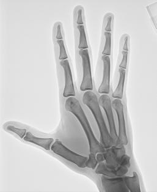
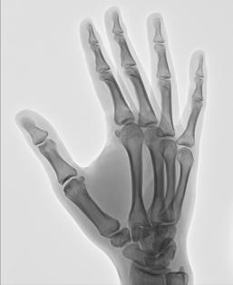
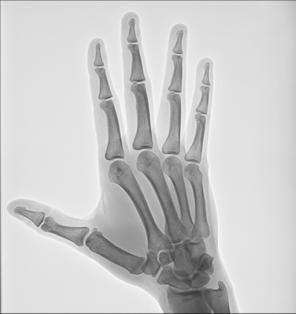

# Rx mână PA oblică

  📷 Radiografie Convențională (Rx)
  <strong>Actualizat:</strong> 2026-09-15
  <strong>Autor:</strong> Departamentul de Radiologie / Referință Bontrager

---

-   __1. Rezumat Clinic & Indicații__

    ---

    === "Indicații Clinice"

        - Suspiciune de fractură și luxație/subluxație articulară a falangelor, oaselor metacarpiene și a tuturor articulațiilor mâinii
        - Procese patologice, precum osteoporoza și artroza / modificările degenerative articulare

    === "Ghid Național IRIS"

        !!! info "Referință Primară: Ghidul Național IRIS (Ordinul MS 1342/2012)"
            - **Capitol Ghid IRIS:** *Aparat locomotor & Membru superior*
            - **Grad de Recomandare:** **Grad A**
            - **Nivel de Iradiere Estimată:** `Clasa 1 (Minimă < 0.01 mSv)`

            [:octicons-search-16: Deschide Ghidul IRIS](../../iris.md){ .md-button .md-button--primary } [:material-open-in-new: Aplicația Oficială PWA](https://radiologie-pediatrica.ro/iris/){ .md-button target="_blank" rel="noopener" }

-   __2. Poziționare & Centrare Fascicul__

    ---

    - **Poziție Pacient:** Pacient: Așezați pacientul la capătul mesei, cu mâna și antebrațul extinse.; Regiune anatomică: Pronați mâna pe receptorul de imagine; centrați și aliniați axa longitudinală a mâinii cu axa longitudinală a receptorului de imagine. Rotiți întreaga mână și articulația radiocarpiană lateral la 45° și sprijiniți-le cu o pană radiotransparentă sau cu un bloc de treaptă, după cum se vede, astfel încât toate falangele să fie separate și paralele cu receptorul de imagine (a se vedea excepția).
    - **Punct de Centrare Fascicul:** Perpendicular pe receptorul de imagine, orientat spre a treia articulație metacarpofalangiană (MCP 3)
    - **Distanță Focar-Film (DFF / SID):** 100 cm
    - **Comandă Respiratorie:** Apnee pe durata expunerii (sau conform cooperării pacientului)

-   __3. Parametri Tehnici Expunere__

    ---

    | Parametru Tehnic | Valoare Configurare Generator / Tub |
    |:-----------------|:-------------------------------------|
    | **Tensiune Tub (kV)** | 55 kV |
    | **Sarcină / Produs Curent-Timp (mAs)** | DE CONFIGURAT PE APARAT |
    | **Distanță Focar-Film (DFF / SID)** | 100 cm |
    | **Grilă Antidifuzoare (Bucky)** | Fără grilă (expunere directă) |
    | **Dimensiune Focar** | Focar Mic (0.6 mm) |
    | **Camere de Ionizare AEC** | DE CONFIGURAT PE APARAT |
    | **Colimare Fascicul** | Dimensiunea câmpului: Colimați pe cele patru laturi la nivelul mâinii și articulației radiocarpiene. Excepție pentru incidența oblică de rutină a mâinii: utilizați un bloc de sprijin pentru a plasa falangele paralele cu receptorul de imagine (Fig. 4.70 și 4.72). Acest bloc previne scurtarea aparentă a falangelor și mascarea articulațiilor interfalangiene (IF). Dacă prezintă interes doar oasele metacarpiene, imaginea poate fi efectuată cu policele și vârfurile degetelor atingând receptorul de imagine (Fig. 4.71 și 4.73). MÂNĂ DE RUTINĂ PA; PA oblică; laterală. Fig. 4.70 Mână, incidență oblică de rutină (falangele sunt paralele). Fig. 4.71 Excepție: mână, incidență oblică pentru oasele metacarpiene (falangele nu sunt paralele)—nu este recomandată pentru falange. Fig. 4.72 Mână, incidență PA oblică (falangele sunt paralele). |
    | **Filtrare Tub** | Totală ≥ 2.5 mm Al echivalent |

-   __4. Criterii de Calitate & Reușită Imagine__

    ---

    - Este vizibilă incidența oblică a întregii mâini și a articulației radiocarpiene, precum și aproximativ 1 țol (2.5 cm) din antebrațul distal. Poziție:
    - Axa longitudinală a mâinii și a articulației radiocarpiene trebuie aliniată cu receptorul de imagine.
    - Poziția oblică la 45° este evidențiată prin următoarele: treimile medii ale diafizelor metacarpienelor nu trebuie să se suprapună; trebuie să existe o oarecare suprapunere a capetelor distale ale celui de-al treilea, al patrulea și al cincilea metacarpian, dar fără suprapunerea porțiunilor distale ale celui de-al doilea și al treilea metacarpian; suprapunerea excesivă a metacarpienelor indică rotație excesivă, iar separarea prea mare indică rotație insuficientă.
    - Articulațiile metacarpofalangiene și interfalangiene (IF) sunt deschise, fără scurtarea aparentă a falangelor medii sau distale, indicând că degetele mâinii sunt paralele cu receptorul de imagine (Fig. 4.74).
    - Raza centrală și centrul câmpului de colimare trebuie să fie la nivelul celei de-a treia articulații metacarpofalangiene (MCP 3). Expunere:
    - Expunerea și contrastul optime ale receptorului de imagine, fără mișcare, evidențiază marginile părților moi și contururi osoase și travee trabeculare clare, fără artefacte de mișcare. R Fig. 4.73 Mână, incidență PA oblică (falangele nu sunt paralele)—spațiile articulare nu sunt deschise. Oase carpiene; capul metacarpianului 5; Ulna; Radius; falanga 1 (police); metacarpianul 1; 2; 3; 4; 5. R Fig. 4.74 Mână, incidență PA oblică (falangele sunt paralele).

-   __5. Protecție Radiologică (ALARA)__

    ---

    - Ecranare gonadică și a organelor radiosensibile conform procedurilor locale de radioprotecție ALARA.
    - Colimare strictă la aria de interes pentru limitarea radiației difuze.
    - Verificarea posibilității unei sarcini la pacientele de vârstă fertilă înainte de expunere.

### 🖼️ Imagini

<figure class="protocol-image-card" markdown>

<figcaption><strong>Fig. 4.70 Mână, incidență oblică de rutină</strong> — Poziționarea pacientului conform Ghidului Bontrager (Fig. 4.70 Mână, incidență oblică de rutină)</figcaption>

</figure>

<figure class="protocol-image-card" markdown>

<figcaption><strong>Fig. 4.71 Excepție: incidență oblică</strong> — Aspect radiografic de referință conform Ghidului Bontrager (Fig. 4.71 Excepție: incidență oblică)</figcaption>

</figure>

<figure class="protocol-image-card" markdown>

<figcaption><strong>Fig. 4.72 Mână, incidență PA oblică (falangele</strong> — Aspect radiografic de referință conform Ghidului Bontrager (Fig. 4.72 Mână, incidență PA oblică (falangele)</figcaption>

</figure>

<figure class="protocol-image-card" markdown>

<figcaption><strong>Fig. 4.73 Mână, incidență PA oblică (falangele</strong> — Aspect radiografic de referință conform Ghidului Bontrager (Fig. 4.73 Mână, incidență PA oblică (falangele)</figcaption>

</figure>

<figure class="protocol-image-card" markdown>

<figcaption><strong>Fig. 4.74 Mână, incidență PA oblică (falangele sunt paralele).</strong> — Aspect radiografic de referință conform Ghidului Bontrager (Fig. 4.74 Mână, incidență PA oblică (falangele sunt paralele).)</figcaption>

</figure>

=== "Ghid Rapid de Execuție"

    1. **Identificarea și verificarea pacientului:** verificare identitate, zonă de examinat, consimțământ conform procedurii și evaluarea posibilității unei sarcini, când este relevantă.
    2. **Pregătire:** îndepărtarea oricăror obiecte radiopace (bijuterii, agrafe, fermoare, proteze, pansamente dense).
    3. **Poziționare precisă:** alinierea receptorului de imagine și a tubului la distanța prescrisă (100 cm).
    4. **Colimare strictă:** adaptarea fasciculului strict la regiunea de diagnostic pentru scăderea iradierii și reducerea radiației difuze.
    5. **Radioprotecție:** verificarea [politicii RX](../radioprotectie.md), cu măsuri distincte pentru pacient, personal și însoțitor.

## Surse de documentare

- [Bontrager's Textbook of Radiographic Positioning (Ed. 9/10), Pagina 161](https://www.elsevier.com/books/textbook-of-radiographic-positioning-and-related-anatomy/lampignano/978-0-323-65367-1)
