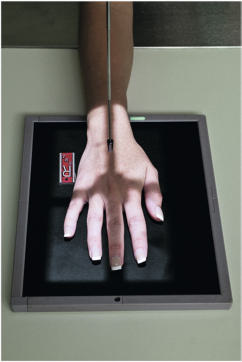
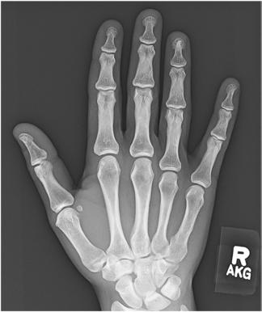
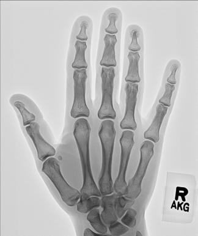

# Rx Mână PA (Postero-Anterior)

  📷 Radiografie Convențională (Rx)
  <strong>Actualizat:</strong> 2026-09-15
  <strong>Autor:</strong> Departamentul de Radiologie / Referință Bontrager

---

-   __1. Rezumat Clinic & Indicații__

    ---

    === "Indicații Clinice"

        - suspiciune de fractură, luxație / subluxație articulară, or foreign bodies of the phalanges, metacarpals, and all joints of the Mână
        - Pathologic processes such as osteoporosis and artroză / modificări degenerative articulare

    === "Ghid Național IRIS"

        !!! info "Referință Primară: Ghidul Național IRIS (Ordinul MS 1342/2012)"
            - **Capitol Ghid IRIS:** *Ghidul Național IRIS*
            - **Grad de Recomandare:** **De verificat pe indicație; fără grad atribuit automat**
            - **Nivel de Iradiere Estimată:** `De verificat pentru examinarea și populația selectate`

            [:octicons-search-16: Deschide Ghidul IRIS](../../iris.md){ .md-button .md-button--primary } [:material-open-in-new: Aplicația Oficială PWA](https://radiologie-pediatrica.ro/iris/){ .md-button target="_blank" rel="noopener" }
-   __2. Poziționare & Centrare Fascicul__

    ---

    - **Poziție Pacient:** Pacient: Seat patient at end of table with Mână and Antebraț extended.; Regiune anatomică: Pronate Mână with palmar surface in contact with IR; spread Degete Mână slightly (Fig. 4.67) Align long axis of Mână and Antebraț with long axis of IR. Center Mână and Pumn (Articulație Radiocarpiană) to IR
    - **Punct de Centrare Fascicul:** perpendicular to IR, directed to a treia articulație metacarpofalangiană (MCP 3)
    - **Distanță Focar-Film (DFF / SID):** 100 cm
    - **Comandă Respiratorie:** Apnee pe durata expunerii (sau conform cooperării pacientului)

-   __3. Parametri Tehnici Expunere__

    ---

    | Parametru Tehnic | Valoare Configurare Generator / Tub |
    |:-----------------|:-------------------------------------|
    | **Tensiune Tub (kV)** | 55 kV |
    | **Sarcină / Produs Curent-Timp (mAs)** | DE CONFIGURAT PE APARAT |
    | **Distanță Focar-Film (DFF / SID)** | 100 cm |
    | **Grilă Antidifuzoare (Bucky)** | Fără grilă (expunere directă) |
    | **Dimensiune Focar** | Focar Mic (0.6 mm) |
    | **Camere de Ionizare AEC** | DE CONFIGURAT PE APARAT |
    | **Colimare Fascicul** | field size should be to a treia articulație metacarpofalangiană (MCP 3). Exposure: Optimal image receptor exposure and contrast with no motion demonstrate soft tissue margins and clear, Contururi osoase și travee trabeculare nete, fără artefacte de mișcare. Fig. 4.68 PA Mână. Phalanges Metacarpals 1st distal phalanx 1st proximal phalanx 1st metacarpal Radius 1st digit (Police) 2nd 3rd 4th 5th Fig. 4.69 PA of right Mână. |
    | **Filtrare Tub** | Totală ≥ 2.5 mm Al echivalent |

-   __4. Criterii de Calitate & Reușită Imagine__

    ---

    - Incidență Postero-Anterioară (PA) of entire Mână and Pumn (Articulație Radiocarpiană) and about 1 inch (2.5 cm) of distal Antebraț are visible.
    - Incidență Postero-Anterioară (PA) of Mână demonstrates oblique view of the Police. Position:
    - Long axis of Mână and Pumn (Articulație Radiocarpiană) aligned with long axis of IR.
    - Absența rotației anatomice: clavicule echidistante față de linia apofizelor spinoase of Mână, as evidenced by symmetric appearance of both sides or concavities of shafts of metacarpals and phalanges of digits 2 through 5 and the appearance of equal amounts of soft tissue on each side of phalanges 2 through 5.
    - Digits should be separated slightly with soft tissues not overlapping.
    - MCP and IP joints should appear open, indicating correct CR location and that Mână was fully pronated (Figs. 4.68 and 4.69).
    - CR and center of

-   __5. Protecție Radiologică (ALARA)__

    ---

    - Ecranare gonadică și a organelor radiosensibile conform procedurilor locale de radioprotecție ALARA.
    - Colimare strictă la aria de interes pentru limitarea radiației difuze.
    - Verificarea posibilității unei sarcini la pacientele de vârstă fertilă înainte de expunere.

!!! note "Observații Clinice & Tehnice"
    If examinations of both hands or wrists are requested, generally the body parts should be positioned and exposed separately for correct CR placement. Mână ROUTINE PA PA oblique Lateral Fig. 4.67 PA Mână, CR to a treia articulație metacarpofalangiană (MCP 3).

### 🖼️ Imagini

<figure class="protocol-image-card" markdown>

<figcaption><strong>Fig. 4.67 PA Mână, CR to a treia articulație metacarpofalangiană (MCP 3).</strong> — Poziționare pacient conform Ghidului Bontrager (Fig. 4.67 PA hand, CR to third MCP joint.)</figcaption>

</figure>

<figure class="protocol-image-card" markdown>

<figcaption><strong>Fig. 4.68 PA Mână.</strong> — Aspect radiografic de referință conform Ghidului Bontrager (Fig. 4.68 PA hand.)</figcaption>

</figure>

<figure class="protocol-image-card" markdown>

<figcaption><strong>Fig. 4.69 PA of right Mână.</strong> — Aspect radiografic de referință conform Ghidului Bontrager (Fig. 4.69 PA of right hand.)</figcaption>

</figure>

=== "Ghid Rapid de Execuție"

    1. **Identificarea și verificarea pacientului:** verificare identitate, zonă de examinat, consimțământ conform procedurii și evaluarea posibilității unei sarcini, când este relevantă.
    2. **Pregătire:** îndepărtarea oricăror obiecte radiopace (bijuterii, agrafe, fermoare, proteze, pansamente dense).
    3. **Poziționare precisă:** alinierea receptorului de imagine și a tubului la distanța prescrisă (100 cm).
    4. **Colimare strictă:** adaptarea fasciculului strict la regiunea de diagnostic pentru scăderea iradierii și reducerea radiației difuze.
    5. **Radioprotecție:** verificarea [politicii RX](../radioprotectie.md), cu măsuri distincte pentru pacient, personal și însoțitor.

## Surse de documentare

- [Bontrager's Textbook of Radiographic Positioning (Ed. 9/10), Pagina 160](https://www.elsevier.com/books/textbook-of-radiographic-positioning-and-related-anatomy/lampignano/978-0-323-65367-1)
