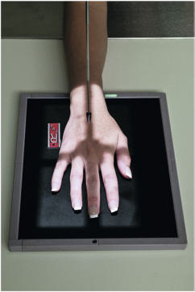
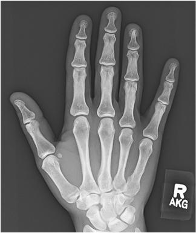
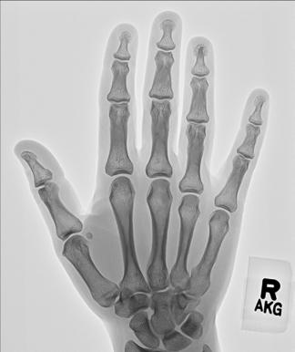

# Rx mână PA (postero-anterioară)

  📷 Radiografie Convențională (Rx)
  <strong>Actualizat:</strong> 2026-09-15
  <strong>Autor:</strong> Departamentul de Radiologie / Referință Bontrager

---

-   __1. Rezumat Clinic & Indicații__

    ---

    === "Indicații Clinice"

        - Suspiciune de fractură, luxație / subluxație articulară sau corp străin / corpuri străine radio-opace la nivelul falangelor, oaselor metacarpiene și tuturor articulațiilor mâinii
        - Procese patologice, precum osteoporoza și artroza / modificările degenerative articulare

    === "Ghid Național IRIS"

        !!! info "Referință Primară: Ghidul Național IRIS (Ordinul MS 1342/2012)"
            - **Capitol Ghid IRIS:** *Aparat locomotor & Membru superior*
            - **Grad de Recomandare:** **Grad A**
            - **Nivel de Iradiere Estimată:** `Clasa 1 (Minimă < 0.01 mSv)`

            [:octicons-search-16: Deschide Ghidul IRIS](../../iris.md){ .md-button .md-button--primary } [:material-open-in-new: Aplicația Oficială PWA](https://radiologie-pediatrica.ro/iris/){ .md-button target="_blank" rel="noopener" }

-   __2. Poziționare & Centrare Fascicul__

    ---

    - **Poziție Pacient:** Pacient: Așezați pacientul la capătul mesei, cu mâna și antebrațul extinse.; Regiune anatomică: Pronați mâna cu suprafața palmară în contact cu receptorul de imagine; depărtați ușor degetele mâinii (Fig. 4.67). Aliniați axa longitudinală a mâinii și antebrațului cu axa longitudinală a receptorului de imagine. Centrați mâna și articulația radiocarpiană la nivelul receptorului de imagine.
    - **Punct de Centrare Fascicul:** Perpendicular pe receptorul de imagine, orientat spre a treia articulație metacarpofalangiană (MCP 3)
    - **Distanță Focar-Film (DFF / SID):** 100 cm
    - **Comandă Respiratorie:** Apnee pe durata expunerii (sau conform cooperării pacientului)

-   __3. Parametri Tehnici Expunere__

    ---

    | Parametru Tehnic | Valoare Configurare Generator / Tub |
    |:-----------------|:-------------------------------------|
    | **Tensiune Tub (kV)** | 55 kV |
    | **Sarcină / Produs Curent-Timp (mAs)** | DE CONFIGURAT PE APARAT |
    | **Distanță Focar-Film (DFF / SID)** | 100 cm |
    | **Grilă Antidifuzoare (Bucky)** | Fără grilă (expunere directă) |
    | **Dimensiune Focar** | Focar Mic (0.6 mm) |
    | **Camere de Ionizare AEC** | DE CONFIGURAT PE APARAT |
    | **Colimare Fascicul** | Dimensiunea câmpului trebuie să fie la nivelul celei de-a treia articulații metacarpofalangiene (MCP 3). Expunere: expunerea și contrastul optime ale receptorului de imagine, fără mișcare, evidențiază marginile părților moi și contururi osoase și travee trabeculare clare, fără artefacte de mișcare. Fig. 4.68 Mână, incidență PA. Falange; oase metacarpiene; falanga distală 1; falanga proximală 1; metacarpianul 1; Radius; falanga 1 (police); 2; 3; 4; 5. Fig. 4.69 Mâna dreaptă, incidență PA. |
    | **Filtrare Tub** | Totală ≥ 2.5 mm Al echivalent |

-   __4. Criterii de Calitate & Reușită Imagine__

    ---

    - Este vizibilă incidența postero-anterioară (PA) a întregii mâini și a articulației radiocarpiene, precum și aproximativ 1 țol (2.5 cm) din antebrațul distal.
    - Incidența postero-anterioară (PA) a mâinii evidențiază incidența oblică a policelui. Poziție:
    - Axa longitudinală a mâinii și a articulației radiocarpiene este aliniată cu axa longitudinală a receptorului de imagine.
    - Absența rotației anatomice: claviculele sunt echidistante față de linia apofizelor spinoase ale mâinii, după cum este evidențiat prin aspectul simetric al ambelor părți (bilateral), sau prin concavitățile diafizelor oaselor metacarpiene și falangelor 2 până la 5 și prin aspectul unor cantități egale de țesuturi moi de fiecare parte a falangelor 2 până la 5.
    - Falangele trebuie să fie ușor separate, cu țesuturile moi fără suprapunere.
    - Articulațiile metacarpofalangiene și interfalangiene (IF) trebuie să apară deschise, indicând localizarea corectă a razei centrale și faptul că mâna a fost complet pronată (Fig. 4.68 și 4.69).
    - Raza centrală și centrul

-   __5. Protecție Radiologică (ALARA)__

    ---

    - Ecranare gonadică și a organelor radiosensibile conform procedurilor locale de radioprotecție ALARA.
    - Colimare strictă la aria de interes pentru limitarea radiației difuze.
    - Verificarea posibilității unei sarcini la pacientele de vârstă fertilă înainte de expunere.

!!! note "Observații Clinice & Tehnice"
    Dacă sunt solicitate examinări ale ambelor mâini sau articulații radiocarpiene, în general părțile corpului trebuie poziționate și expuse separat pentru plasarea corectă a razei centrale. MÂNĂ DE RUTINĂ PA; PA oblică; laterală. Fig. 4.67 Mână, incidență PA, raza centrală la a treia articulație metacarpofalangiană (MCP 3).

### 🖼️ Imagini

<figure class="protocol-image-card" markdown>

<figcaption><strong>Fig. 4.67 Mână, incidență PA, raza centrală la a treia articulație metacarpofalangiană (MCP 3).</strong> — Poziționarea pacientului conform Ghidului Bontrager (Fig. 4.67 Mână, incidență PA, raza centrală la a treia articulație metacarpofalangiană (MCF).)</figcaption>

</figure>

<figure class="protocol-image-card" markdown>

<figcaption><strong>Fig. 4.68 Mână, incidență PA.</strong> — Aspect radiografic de referință conform Ghidului Bontrager (Fig. 4.68 Mână, incidență PA.)</figcaption>

</figure>

<figure class="protocol-image-card" markdown>

<figcaption><strong>Fig. 4.69 Mâna dreaptă, incidență PA.</strong> — Aspect radiografic de referință conform Ghidului Bontrager (Fig. 4.69 Mâna dreaptă, incidență PA.)</figcaption>

</figure>

=== "Ghid Rapid de Execuție"

    1. **Identificarea și verificarea pacientului:** verificare identitate, zonă de examinat, consimțământ conform procedurii și evaluarea posibilității unei sarcini, când este relevantă.
    2. **Pregătire:** îndepărtarea oricăror obiecte radiopace (bijuterii, agrafe, fermoare, proteze, pansamente dense).
    3. **Poziționare precisă:** alinierea receptorului de imagine și a tubului la distanța prescrisă (100 cm).
    4. **Colimare strictă:** adaptarea fasciculului strict la regiunea de diagnostic pentru scăderea iradierii și reducerea radiației difuze.
    5. **Radioprotecție:** verificarea [politicii RX](../radioprotectie.md), cu măsuri distincte pentru pacient, personal și însoțitor.

## Surse de documentare

- [Bontrager's Textbook of Radiographic Positioning (Ed. 9/10), Pagina 160](https://www.elsevier.com/books/textbook-of-radiographic-positioning-and-related-anatomy/lampignano/978-0-323-65367-1)
