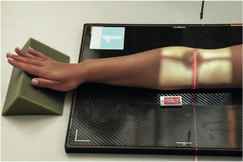
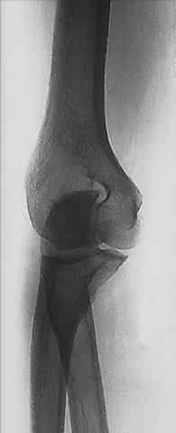
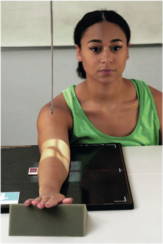
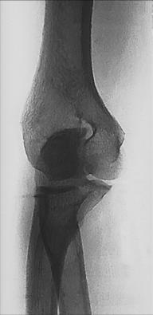

# Rx MEDIAL (INTERNAL) ROTATION AP Oblică (Cot)

  📷 Radiografie Convențională (Rx)
  <strong>Actualizat:</strong> 2026-09-15
  <strong>Autor:</strong> Departamentul de Radiologie / Referință Bontrager

---

-   __1. Rezumat Clinic & Indicații__

    ---

    === "Indicații Clinice"

        - suspiciune de fractură and luxație / subluxație articulară of the Cot, primarily the coronoid process
        - Certain pathologic processes, such as osteoporosis and arthritis Medial (Internal Rotation) Oblique Best visualizes coronoid process of ulna and trochlea in profile.

    === "Ghid Național IRIS"

        !!! info "Referință Primară: Ghidul Național IRIS (Ordinul MS 1342/2012)"
            - **Capitol Ghid IRIS:** *Ghidul Național IRIS*
            - **Grad de Recomandare:** **De verificat pe indicație; fără grad atribuit automat**
            - **Nivel de Iradiere Estimată:** `De verificat pentru examinarea și populația selectate`

            [:octicons-search-16: Deschide Ghidul IRIS](../../iris.md){ .md-button .md-button--primary } [:material-open-in-new: Aplicația Oficială PWA](https://radiologie-pediatrica.ro/iris/){ .md-button target="_blank" rel="noopener" }
-   __2. Poziționare & Centrare Fascicul__

    ---

    - **Poziție Pacient:** Pacient: Seat patient at end of table, with arm fully extended and Umăr and Cot on same horizontal plane.; Regiune anatomică: Align arm and Antebraț with long axis of IR. Center Cot joint to CR and to IR. Pronate Mână into a natural palmdown position and rotate arm as needed until distal Humerus and anterior surface of Cot are rotated 45° (place interepicondylar plane approximately 45° to the IR) (Figs. 4.139 and 4.140).
    - **Punct de Centrare Fascicul:** perpendicular to IR, directed to midelbow joint (approximately ¾ inch [2 cm] distal to midpoint of line between epicondyles as viewed from xray tube)
    - **Distanță Focar-Film (DFF / SID):** 100 cm
    - **Comandă Respiratorie:** Apnee pe durata expunerii (sau conform cooperării pacientului)

-   __3. Parametri Tehnici Expunere__

    ---

    | Parametru Tehnic | Valoare Configurare Generator / Tub |
    |:-----------------|:-------------------------------------|
    | **Tensiune Tub (kV)** | 65 kV |
    | **Sarcină / Produs Curent-Timp (mAs)** | DE CONFIGURAT PE APARAT |
    | **Distanță Focar-Film (DFF / SID)** | 100 cm |
    | **Grilă Antidifuzoare (Bucky)** | Fără grilă (expunere directă) |
    | **Dimensiune Focar** | Focar Mic (0.6 mm) |
    | **Camere de Ionizare AEC** | DE CONFIGURAT PE APARAT |
    | **Colimare Fascicul** | field size should be at midelbow joint. Exposure: Optimal image receptor exposure and contrast with no motion should visualize soft tissue detail; bony cortical margins; and clear, bony trabecular markings. Cot ROUTINE AP Alternate AP—partial flexion Alternate AP—acute flexion Oblique Lateral (external) Medial (internal) Lateral Fig. 4.141 Medial (internal rotation) oblique. Olecranon process Radius Humerus Medial epicondyle Trochlea Radial head Ulna Olecranon fossa Trochlear notch Coronoid process of ulna Fig. 4.142 Medial oblique of right Cot. |
    | **Filtrare Tub** | Totală ≥ 2.5 mm Al echivalent |

-   __4. Criterii de Calitate & Reușită Imagine__

    ---

    - Oblique view of distal Humerus and proximal radius and ulna is visible (Figs. 4.141 and 4.142). Position:
    - Long axis of arm should be aligned with side border of IR.
    - Correct 45° medial oblique should visualize coronoid process of the ulna in profile.
    - Radial head and neck should be superimposed and centered over the proximal ulna.
    - Medial epicondyle and trochlea should appear elongated and in partial profile.
    - Olecranon process should appear Poziție Șezândă in olecranon fossa and trochlear notch partially open and visualized with arm fully extended.
    - CR and center of

-   __5. Protecție Radiologică (ALARA)__

    ---

    - Ecranare gonadică și a organelor radiosensibile conform procedurilor locale de radioprotecție ALARA.
    - Colimare strictă la aria de interes pentru limitarea radiației difuze.
    - Verificarea posibilității unei sarcini la pacientele de vârstă fertilă înainte de expunere.

### 🖼️ Imagini

<figure class="protocol-image-card" markdown>

<figcaption><strong>Fig. 4.139 Medial (internal rotation) oblique.</strong> — Poziționare pacient conform Ghidului Bontrager (Fig. 4.139 Medial (internal rotation) oblique.)</figcaption>

</figure>

<figure class="protocol-image-card" markdown>

<figcaption><strong>Fig. 4.140 End view, showing 45° medial</strong> — Aspect radiografic de referință conform Ghidului Bontrager (Fig. 4.140 End view, showing 45° medial)</figcaption>

</figure>

<figure class="protocol-image-card" markdown>

<figcaption><strong>Fig. 4.141 Medial</strong> — Aspect radiografic de referință conform Ghidului Bontrager (Fig. 4.141 Medial)</figcaption>

</figure>

<figure class="protocol-image-card" markdown>

<figcaption><strong>Fig. 4.142 Medial oblique of right Cot.</strong> — Aspect radiografic de referință conform Ghidului Bontrager (Fig. 4.142 Medial oblique of right elbow.)</figcaption>

</figure>

=== "Ghid Rapid de Execuție"

    1. **Identificarea și verificarea pacientului:** verificare identitate, zonă de examinat, consimțământ conform procedurii și evaluarea posibilității unei sarcini, când este relevantă.
    2. **Pregătire:** îndepărtarea oricăror obiecte radiopace (bijuterii, agrafe, fermoare, proteze, pansamente dense).
    3. **Poziționare precisă:** alinierea receptorului de imagine și a tubului la distanța prescrisă (100 cm).
    4. **Colimare strictă:** adaptarea fasciculului strict la regiunea de diagnostic pentru scăderea iradierii și reducerea radiației difuze.
    5. **Radioprotecție:** verificarea [politicii RX](../radioprotectie.md), cu măsuri distincte pentru pacient, personal și însoțitor.

## Surse de documentare

- [Bontrager's Textbook of Radiographic Positioning (Ed. 9/10), Pagina 182](https://www.elsevier.com/books/textbook-of-radiographic-positioning-and-related-anatomy/lampignano/978-0-323-65367-1)
