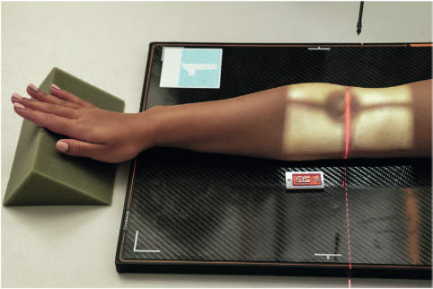
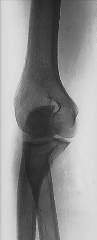
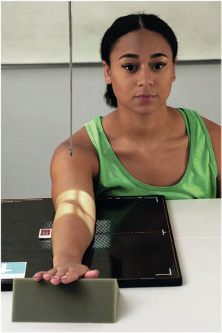
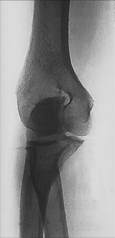

# Rx AP oblică medială (rotație internă) a cotului

  📷 Radiografie Convențională (Rx)
  <strong>Actualizat:</strong> 2026-09-15
  <strong>Autor:</strong> Departamentul de Radiologie / Referință Bontrager

---

-   __1. Rezumat Clinic & Indicații__

    ---

    === "Indicații Clinice"

        - Suspiciune de fractură și luxație / subluxație articulară a cotului, în principal a procesului coronoid
        - Anumite procese patologice, precum osteoporoza și artrita. Incidența oblică medială (rotație internă) evidențiază cel mai bine procesul coronoid al ulnei și trohleea în profil.

    === "Ghid Național IRIS"

        !!! info "Referință Primară: Ghidul Național IRIS (Ordinul MS 1342/2012)"
            - **Capitol Ghid IRIS:** *Aparat locomotor & Membru superior*
            - **Grad de Recomandare:** **Grad A**
            - **Nivel de Iradiere Estimată:** `Clasa 1 (Minimă < 0.02 mSv)`

            [:octicons-search-16: Deschide Ghidul IRIS](../../iris.md){ .md-button .md-button--primary } [:material-open-in-new: Aplicația Oficială PWA](https://radiologie-pediatrica.ro/iris/){ .md-button target="_blank" rel="noopener" }

-   __2. Poziționare & Centrare Fascicul__

    ---

    - **Poziție Pacient:** Pacient: Așezați pacientul la capătul mesei, cu brațul complet extins și umărul și cotul în același plan orizontal.; Regiune anatomică: Aliniați brațul și antebrațul cu axa longitudinală a receptorului de imagine. Centrați articulația cotului la nivelul razei centrale și al receptorului de imagine. Pronați mâna în poziție naturală, cu palma în jos, și rotiți brațul după cum este necesar până când humerusul distal și suprafața anterioară a cotului sunt rotite la 45° (plasați planul interepicondilian la aproximativ 45° față de receptorul de imagine) (Fig. 4.139 și 4.140).
    - **Punct de Centrare Fascicul:** Perpendicular pe receptorul de imagine, orientat către articulația cotului, la aproximativ ¾ țol [2 cm] distal față de punctul median al liniei dintre epicondili, după cum este vizualizat de la tubul radiogen.
    - **Distanță Focar-Film (DFF / SID):** 100 cm
    - **Comandă Respiratorie:** Apnee pe durata expunerii (sau conform cooperării pacientului)

-   __3. Parametri Tehnici Expunere__

    ---

    | Parametru Tehnic | Valoare Configurare Generator / Tub |
    |:-----------------|:-------------------------------------|
    | **Tensiune Tub (kV)** | 65 kV |
    | **Sarcină / Produs Curent-Timp (mAs)** | DE CONFIGURAT PE APARAT |
    | **Distanță Focar-Film (DFF / SID)** | 100 cm |
    | **Grilă Antidifuzoare (Bucky)** | Fără grilă (expunere directă) |
    | **Dimensiune Focar** | Focar Mic (0.6 mm) |
    | **Camere de Ionizare AEC** | DE CONFIGURAT PE APARAT |
    | **Colimare Fascicul** | Dimensiunea câmpului trebuie să fie la nivelul articulației cotului. Expunere: expunerea și contrastul optime ale receptorului de imagine, fără mișcare, trebuie să vizualizeze detaliile părților moi, marginile corticale osoase și traveele osoase clare. Cot DE RUTINĂ AP; AP alternativă—flexie parțială; AP alternativă—flexie acută; oblică laterală (externă); medială (internă); laterală. Fig. 4.141 Incidență oblică medială (rotație internă). Olecran; Radius; Humerus; epicondil medial (epitrohlee); trohlee; cap radial; Ulna; fosa olecraniană; incizura trohleară; procesul coronoid al ulnei. Fig. 4.142 Cot drept, incidență oblică medială. |
    | **Filtrare Tub** | Totală ≥ 2.5 mm Al echivalent |

-   __4. Criterii de Calitate & Reușită Imagine__

    ---

    - Este vizibilă incidența oblică a humerusului distal și a radiusului și ulnei proximale (Fig. 4.141 și 4.142). Poziție:
    - Axa longitudinală a brațului trebuie aliniată cu marginea laterală a receptorului de imagine.
    - Incidența oblică medială corectă la 45° trebuie să vizualizeze procesul coronoid al ulnei în profil.
    - Capul și colul radial trebuie să fie suprapuse și centrate deasupra ulnei proximale.
    - Epicondilul medial (epitrohleea) și trohleea trebuie să apară alungite și în profil parțial.
    - Olecranul trebuie să apară în fosa olecraniană, iar incizura trohleară trebuie să fie parțial deschisă și vizualizată, cu brațul complet extins.
    - Raza centrală și centrul

-   __5. Protecție Radiologică (ALARA)__

    ---

    - Ecranare gonadică și a organelor radiosensibile conform procedurilor locale de radioprotecție ALARA.
    - Colimare strictă la aria de interes pentru limitarea radiației difuze.
    - Verificarea posibilității unei sarcini la pacientele de vârstă fertilă înainte de expunere.

### 🖼️ Imagini

<figure class="protocol-image-card" markdown>

<figcaption><strong>Fig. 4.139 Incidență oblică medială (rotație internă).</strong> — Poziționarea pacientului conform Ghidului Bontrager (Fig. 4.139 Incidență oblică medială (rotație internă).)</figcaption>

</figure>

<figure class="protocol-image-card" markdown>

<figcaption><strong>Fig. 4.140 Incidență finală, evidențiind 45° medial</strong> — Aspect radiografic de referință conform Ghidului Bontrager (Fig. 4.140 Incidență finală, evidențiind 45° medial)</figcaption>

</figure>

<figure class="protocol-image-card" markdown>

<figcaption><strong>Fig. 4.141 medial</strong> — Aspect radiografic de referință conform Ghidului Bontrager (Fig. 4.141 medial)</figcaption>

</figure>

<figure class="protocol-image-card" markdown>

<figcaption><strong>Fig. 4.142 oblică medială de cot.</strong> — Aspect radiografic de referință conform Ghidului Bontrager (Fig. 4.142 oblică medială de cot.)</figcaption>

</figure>

=== "Ghid Rapid de Execuție"

    1. **Identificarea și verificarea pacientului:** verificare identitate, zonă de examinat, consimțământ conform procedurii și evaluarea posibilității unei sarcini, când este relevantă.
    2. **Pregătire:** îndepărtarea oricăror obiecte radiopace (bijuterii, agrafe, fermoare, proteze, pansamente dense).
    3. **Poziționare precisă:** alinierea receptorului de imagine și a tubului la distanța prescrisă (100 cm).
    4. **Colimare strictă:** adaptarea fasciculului strict la regiunea de diagnostic pentru scăderea iradierii și reducerea radiației difuze.
    5. **Radioprotecție:** verificarea [politicii RX](../radioprotectie.md), cu măsuri distincte pentru pacient, personal și însoțitor.

## Surse de documentare

- [Bontrager's Textbook of Radiographic Positioning (Ed. 9/10), Pagina 182](https://www.elsevier.com/books/textbook-of-radiographic-positioning-and-related-anatomy/lampignano/978-0-323-65367-1)
