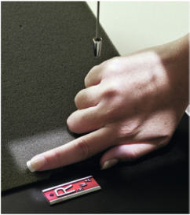
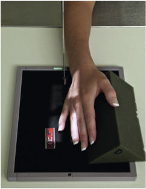
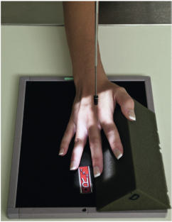
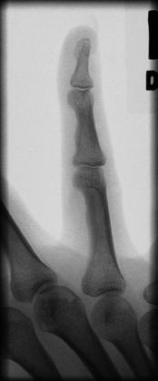
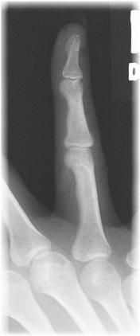
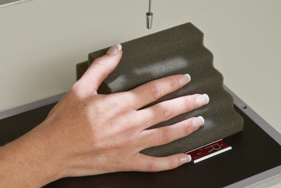

# Rx MEDIAL OR LATERAL ROTATION PA Oblică (Degete Mână)

  📷 Radiografie Convențională (Rx)
  <strong>Actualizat:</strong> 2026-09-15
  <strong>Autor:</strong> Departamentul de Radiologie / Referință Bontrager

---

-   __1. Rezumat Clinic & Indicații__

    ---

    === "Indicații Clinice"

        - suspiciune de fractură and luxație / subluxație articulară of the distal, middle, and proximal phalanges; distal metacarpal; and associated joints
        - Pathologies such as osteoporosis and artroză / modificări degenerative articulare

    === "Ghid Național IRIS"

        !!! info "Referință Primară: Ghidul Național IRIS (Ordinul MS 1342/2012)"
            - **Capitol Ghid IRIS:** *Ghidul Național IRIS*
            - **Grad de Recomandare:** **De verificat pe indicație; fără grad atribuit automat**
            - **Nivel de Iradiere Estimată:** `De verificat pentru examinarea și populația selectate`

            [:octicons-search-16: Deschide Ghidul IRIS](../../iris.md){ .md-button .md-button--primary } [:material-open-in-new: Aplicația Oficială PWA](https://radiologie-pediatrica.ro/iris/){ .md-button target="_blank" rel="noopener" }
-   __2. Poziționare & Centrare Fascicul__

    ---

    - **Poziție Pacient:** Pacient: Seat patient at end of table, with Cot flexed about 90° with Mână and Pumn (Articulație Radiocarpiană) resting on IR and Degete Mână extended.; Regiune anatomică: With Degete Mână extended against 45° foam wedge block, place Mână in a 45° lateral oblique (Police side up) (Fig. 4.39). Position Mână on image receptor so that the long axis of the finger is aligned with the long axis of the IR. Separate Degete Mână and carefully place finger that is being examined against block, so it is supported in a 45° oblique and parallel to IR.
    - **Punct de Centrare Fascicul:** perpendicular to IR, directed to pIp joint
    - **Distanță Focar-Film (DFF / SID):** 100 cm
    - **Comandă Respiratorie:** Apnee pe durata expunerii (sau conform cooperării pacientului)

-   __3. Parametri Tehnici Expunere__

    ---

    | Parametru Tehnic | Valoare Configurare Generator / Tub |
    |:-----------------|:-------------------------------------|
    | **Tensiune Tub (kV)** | 55 kV |
    | **Sarcină / Produs Curent-Timp (mAs)** | DE CONFIGURAT PE APARAT |
    | **Distanță Focar-Film (DFF / SID)** | 100 cm |
    | **Grilă Antidifuzoare (Bucky)** | Fără grilă (expunere directă) |
    | **Dimensiune Focar** | Focar Mic (0.6 mm) |
    | **Camere de Ionizare AEC** | DE CONFIGURAT PE APARAT |
    | **Colimare Fascicul** | Field Size Collimate on four sides to affected finger and distal aspect of metacarpal. Optional Medial Oblique Second digit also may be taken in a 45° medial oblique (Police side down) with Police and other Degete Mână flexed to prevent superimposition (Fig. 4.40). This position places the part closer to the IR for improved definition but may be more painful for the patient. Lateral rotation of Mână is recommended to demonstrate the third, fourth, and fifth digits (Figs. 4.41 and 4.42). Degete Mână ROUTINE PA PA oblique Lateral Fig. 4.39 Second digit (lateral rotation). Fig. 4.40 Second digit (medial rotation). Fig. 4.41 Third digit (lateral rotation). Fig. 4.42 Fifth digit (lateral rotation). |
    | **Filtrare Tub** | Totală ≥ 2.5 mm Al echivalent |

-   __4. Criterii de Calitate & Reușită Imagine__

    ---

    - Oblique view of distal, middle, and proximal phalanges; distal metacarpal; and associated joints. Position:
    - Long axis of finger should be aligned with side border of IR.
    - View of finger being examined should be 45° oblique.
    - No superimposition of adjacent Degete Mână should occur.
    - IP and MCP joint spaces should be open, indicating correct CR location and that the phalanges are parallel to IR.
    - CR and center of collimation field size should be to the pIp joint (Figs. 4.43 and 4.44). Exposure:
    - Optimal image receptor exposure and contrast with no motion demonstrate soft tissue margins and clear, Contururi osoase și travee trabeculare nete, fără artefacte de mișcare. Fig. 4.43 Fourth digit (lateral rotation). Distal phalanx Middle phalanx Distal IP joint Proximal IP joint 4th MCP joint Proximal phalanx (CR) Fig. 4.44 Fourth digit.

-   __5. Protecție Radiologică (ALARA)__

    ---

    - Ecranare gonadică și a organelor radiosensibile conform procedurilor locale de radioprotecție ALARA.
    - Colimare strictă la aria de interes pentru limitarea radiației difuze.
    - Verificarea posibilității unei sarcini la pacientele de vârstă fertilă înainte de expunere.

### 🖼️ Imagini

<figure class="protocol-image-card" markdown>

<figcaption><strong>Fig. 4.39 Second digit (lateral rotation).</strong> — Poziționare pacient conform Ghidului Bontrager (Fig. 4.39 Second digit (lateral rotation).)</figcaption>

</figure>

<figure class="protocol-image-card" markdown>

<figcaption><strong>Fig. 4.40 Second digit (medial rotation).</strong> — Aspect radiografic de referință conform Ghidului Bontrager (Fig. 4.40 Second digit (medial rotation).)</figcaption>

</figure>

<figure class="protocol-image-card" markdown>

<figcaption><strong>Fig. 4.41 Third digit (lateral</strong> — Aspect radiografic de referință conform Ghidului Bontrager (Fig. 4.41 Third digit (lateral)</figcaption>

</figure>

<figure class="protocol-image-card" markdown>

<figcaption><strong>Fig. 4.42 Fifth digit (lateral</strong> — Aspect radiografic de referință conform Ghidului Bontrager (Fig. 4.42 Fifth digit (lateral)</figcaption>

</figure>

<figure class="protocol-image-card" markdown>

<figcaption><strong>Fig. 4.43 Fourth digit</strong> — Aspect radiografic de referință conform Ghidului Bontrager (Fig. 4.43 Fourth digit)</figcaption>

</figure>

<figure class="protocol-image-card" markdown>

<figcaption><strong>Fig. 4.44 Fourth digit.</strong> — Aspect radiografic de referință conform Ghidului Bontrager (Fig. 4.44 Fourth digit.)</figcaption>

</figure>

=== "Ghid Rapid de Execuție"

    1. **Identificarea și verificarea pacientului:** verificare identitate, zonă de examinat, consimțământ conform procedurii și evaluarea posibilității unei sarcini, când este relevantă.
    2. **Pregătire:** îndepărtarea oricăror obiecte radiopace (bijuterii, agrafe, fermoare, proteze, pansamente dense).
    3. **Poziționare precisă:** alinierea receptorului de imagine și a tubului la distanța prescrisă (100 cm).
    4. **Colimare strictă:** adaptarea fasciculului strict la regiunea de diagnostic pentru scăderea iradierii și reducerea radiației difuze.
    5. **Radioprotecție:** verificarea [politicii RX](../radioprotectie.md), cu măsuri distincte pentru pacient, personal și însoțitor.

## Surse de documentare

- [Bontrager's Textbook of Radiographic Positioning (Ed. 9/10), Pagina 153](https://www.elsevier.com/books/textbook-of-radiographic-positioning-and-related-anatomy/lampignano/978-0-323-65367-1)
