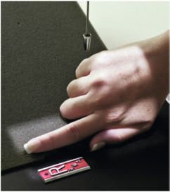
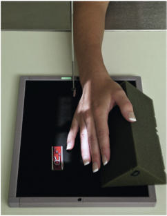
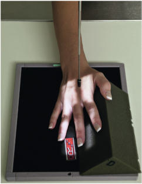
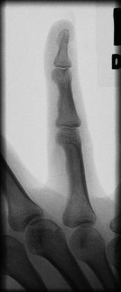
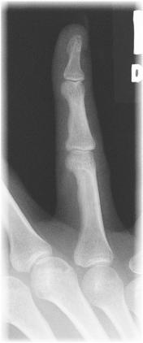
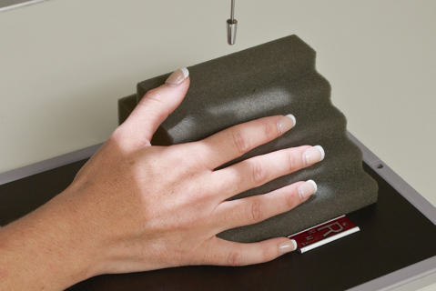

# Rx medială sau rotație externă (laterală) PA oblică (degetele mâinii)

  📷 Radiografie Convențională (Rx)
  <strong>Actualizat:</strong> 2026-09-15
  <strong>Autor:</strong> Departamentul de Radiologie / Referință Bontrager

---

-   __1. Rezumat Clinic & Indicații__

    ---

    === "Indicații Clinice"

        - suspiciune de fractură și luxație / subluxație articulară a falangelor distale, mijlocii și proximale; a metacarpianului distal; și a articulațiilor asociate
        - Patologii precum osteoporoza și artroza / modificări degenerative articulare

    === "Ghid Național IRIS"

        !!! info "Referință Primară: Ghidul Național IRIS (Ordinul MS 1342/2012)"
            - **Capitol Ghid IRIS:** *Aparat locomotor & Membru superior*
            - **Grad de Recomandare:** **Grad A**
            - **Nivel de Iradiere Estimată:** `Clasa 1 (Minimă < 0.01 mSv)`

            [:octicons-search-16: Deschide Ghidul IRIS](../../iris.md){ .md-button .md-button--primary } [:material-open-in-new: Aplicația Oficială PWA](https://radiologie-pediatrica.ro/iris/){ .md-button target="_blank" rel="noopener" }

-   __2. Poziționare & Centrare Fascicul__

    ---

    - **Poziție Pacient:** Pacient: Așezați pacientul la capătul mesei, cu cotul flectat la aproximativ 90°, cu mâna și pumnul (articulația radiocarpiană) sprijinite pe receptorul de imagine și degetele mâinii extinse.; Regiune anatomică: Cu degetele mâinii extinse pe blocul de spumă în formă de pană la 45°, așezați mâna într-o incidență oblică laterală la 45° (partea policelui în sus) (Fig. 4.39). Poziționați mâna pe receptorul de imagine astfel încât axa longitudinală a degetului să fie aliniată cu axa longitudinală a receptorului de imagine. Separați degetele mâinii și așezați cu grijă degetul examinat pe bloc, astfel încât să fie sprijinit într-o poziție oblică la 45° și paralelă cu receptorul de imagine.
    - **Punct de Centrare Fascicul:** perpendicular pe receptorul de imagine, orientat spre articulația IFP
    - **Distanță Focar-Film (DFF / SID):** 100 cm
    - **Comandă Respiratorie:** Apnee pe durata expunerii (sau conform cooperării pacientului)

-   __3. Parametri Tehnici Expunere__

    ---

    | Parametru Tehnic | Valoare Configurare Generator / Tub |
    |:-----------------|:-------------------------------------|
    | **Tensiune Tub (kV)** | 55 kV |
    | **Sarcină / Produs Curent-Timp (mAs)** | DE CONFIGURAT PE APARAT |
    | **Distanță Focar-Film (DFF / SID)** | 100 cm |
    | **Grilă Antidifuzoare (Bucky)** | Fără grilă (expunere directă) |
    | **Dimensiune Focar** | Focar Mic (0.6 mm) |
    | **Camere de Ionizare AEC** | DE CONFIGURAT PE APARAT |
    | **Colimare Fascicul** | Dimensiunea câmpului: Colimați pe cele patru laturi până la degetul afectat și aspectul distal al metacarpianului. Opțional, a doua falangă poate fi examinată și într-o incidență oblică medială la 45° (partea policelui în jos), cu policele și celelalte degete flectate pentru a preveni suprapunerea (Fig. 4.40). Această poziție plasează partea mai aproape de receptorul de imagine pentru o definiție îmbunătățită, dar poate fi mai dureroasă pentru pacient. Rotația externă (laterală) a mâinii este recomandată pentru evidențierea falangelor a treia, a patra și a cincea (Fig. 4.41 și 4.42). Degete ale mâinii: de rutină PA; PA oblică; laterală. Fig. 4.39 A doua falangă (rotație externă (laterală)). Fig. 4.40 A doua falangă (rotație internă (medială)). Fig. 4.41 A treia falangă (rotație externă (laterală)). Fig. 4.42 A cincea falangă (rotație externă (laterală)). |
    | **Filtrare Tub** | Totală ≥ 2.5 mm Al echivalent |

-   __4. Criterii de Calitate & Reușită Imagine__

    ---

    - Incidență oblică a falangelor distală, mijlocie și proximală; metacarpianului distal; și articulațiilor asociate. Poziție:
    - Axa longitudinală a degetului trebuie să fie aliniată cu marginea laterală a receptorului de imagine.
    - Incidența degetului examinat trebuie să fie oblică la 45°.
    - Nu trebuie să existe suprapunerea degetelor mâinii adiacente.
    - Spațiile articulațiilor interfalangiene (IF) și metacarpofalangiene (MCF) trebuie să fie deschise, indicând localizarea corectă a razei centrale și faptul că falangele sunt paralele cu receptorul de imagine.
    - Raza centrală și centrul câmpului de colimare trebuie să fie la articulația interfalangiană proximală (IF) (Fig. 4.43 și 4.44). Expunere:
    - Expunerea și contrastul optime ale receptorului de imagine, cu absența mișcării, evidențiază marginile clare ale părților moi, contururile osoase și trabeculația nete, fără artefacte de mișcare. Fig. 4.43 Al patrulea deget (rotație externă (laterală)). Falangă distală; falangă mijlocie; articulații interfalangiene (IF) distale; articulații interfalangiene (IF) proximale; articulații metacarpofalangiene (MCF) ale degetului 4; falangă proximală (raza centrală). Fig. 4.44 Al patrulea deget.

-   __5. Protecție Radiologică (ALARA)__

    ---

    - Ecranare gonadică și a organelor radiosensibile conform procedurilor locale de radioprotecție ALARA.
    - Colimare strictă la aria de interes pentru limitarea radiației difuze.
    - Verificarea posibilității unei sarcini la pacientele de vârstă fertilă înainte de expunere.

### 🖼️ Imagini

<figure class="protocol-image-card" markdown>

<figcaption><strong>Fig. 4.39 A doua falangă (rotație externă (laterală)).</strong> — Poziționarea pacientului conform Ghidului Bontrager (Fig. 4.39 A doua falangă (rotație externă (laterală)).)</figcaption>

</figure>

<figure class="protocol-image-card" markdown>

<figcaption><strong>Fig. 4.40 A doua falangă (rotație internă (medială)).</strong> — Aspect radiografic de referință conform Ghidului Bontrager (Fig. 4.40 A doua falangă (rotație internă (medială)).)</figcaption>

</figure>

<figure class="protocol-image-card" markdown>

<figcaption><strong>Fig. 4.41 A treia falangă (laterală</strong> — Aspect radiografic de referință conform Ghidului Bontrager (Fig. 4.41 A treia falangă (laterală)</figcaption>

</figure>

<figure class="protocol-image-card" markdown>

<figcaption><strong>Fig. 4.42 A cincea falangă (laterală</strong> — Aspect radiografic de referință conform Ghidului Bontrager (Fig. 4.42 A cincea falangă (laterală)</figcaption>

</figure>

<figure class="protocol-image-card" markdown>

<figcaption><strong>Fig. 4.43 A patra falangă</strong> — Aspect radiografic de referință conform Ghidului Bontrager (Fig. 4.43 A patra falangă)</figcaption>

</figure>

<figure class="protocol-image-card" markdown>

<figcaption><strong>Fig. 4.44 A patra falangă.</strong> — Aspect radiografic de referință conform Ghidului Bontrager (Fig. 4.44 A patra falangă.)</figcaption>

</figure>

=== "Ghid Rapid de Execuție"

    1. **Identificarea și verificarea pacientului:** verificare identitate, zonă de examinat, consimțământ conform procedurii și evaluarea posibilității unei sarcini, când este relevantă.
    2. **Pregătire:** îndepărtarea oricăror obiecte radiopace (bijuterii, agrafe, fermoare, proteze, pansamente dense).
    3. **Poziționare precisă:** alinierea receptorului de imagine și a tubului la distanța prescrisă (100 cm).
    4. **Colimare strictă:** adaptarea fasciculului strict la regiunea de diagnostic pentru scăderea iradierii și reducerea radiației difuze.
    5. **Radioprotecție:** verificarea [politicii RX](../radioprotectie.md), cu măsuri distincte pentru pacient, personal și însoțitor.

## Surse de documentare

- [Bontrager's Textbook of Radiographic Positioning (Ed. 9/10), Pagina 153](https://www.elsevier.com/books/textbook-of-radiographic-positioning-and-related-anatomy/lampignano/978-0-323-65367-1)
