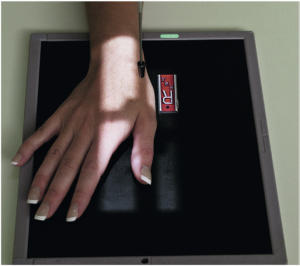
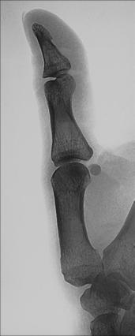

# Rx rotație internă (medială) PA oblică (police)

  📷 Radiografie Convențională (Rx)
  <strong>Actualizat:</strong> 2026-09-15
  <strong>Autor:</strong> Departamentul de Radiologie / Referință Bontrager

---

-   __1. Rezumat Clinic & Indicații__

    ---

    === "Indicații Clinice"

        - Suspiciune de fractură și luxație / subluxație articulară a falangelor distală și proximală, a metacarpianului distal și a articulațiilor asociate
        - Procese patologice, precum osteoporoza și artroza / modificările degenerative articulare

    === "Ghid Național IRIS"

        !!! info "Referință Primară: Ghidul Național IRIS (Ordinul MS 1342/2012)"
            - **Capitol Ghid IRIS:** *Aparat locomotor & Membru superior*
            - **Grad de Recomandare:** **Grad A**
            - **Nivel de Iradiere Estimată:** `Clasa 1 (Minimă < 0.01 mSv)`

            [:octicons-search-16: Deschide Ghidul IRIS](../../iris.md){ .md-button .md-button--primary } [:material-open-in-new: Aplicația Oficială PWA](https://radiologie-pediatrica.ro/iris/){ .md-button target="_blank" rel="noopener" }

-   __2. Poziționare & Centrare Fascicul__

    ---

    - **Poziție Pacient:** Pacient: Așezați pacientul la capătul mesei, cu mâna sprijinită pe receptorul de imagine.; Regiune anatomică: Abduceți ușor policele, cu suprafața palmară a mâinii în contact cu receptorul de imagine (această acțiune plasează în mod natural policele într-o incidență oblică la 45°). Aliniați axa longitudinală a policelui cu axa longitudinală a receptorului de imagine. Centrați prima articulație metacarpofalangiană (MCF) la raza centrală și la centrul receptorului de imagine (Fig. 4.55).
    - **Punct de Centrare Fascicul:** Perpendicular pe receptorul de imagine, orientat către prima articulație metacarpofalangiană (MCF)
    - **Distanță Focar-Film (DFF / SID):** 100 cm
    - **Comandă Respiratorie:** Apnee pe durata expunerii (sau conform cooperării pacientului)

-   __3. Parametri Tehnici Expunere__

    ---

    | Parametru Tehnic | Valoare Configurare Generator / Tub |
    |:-----------------|:-------------------------------------|
    | **Tensiune Tub (kV)** | 55 kV |
    | **Sarcină / Produs Curent-Timp (mAs)** | DE CONFIGURAT PE APARAT |
    | **Distanță Focar-Film (DFF / SID)** | 100 cm |
    | **Grilă Antidifuzoare (Bucky)** | Fără grilă (expunere directă) |
    | **Dimensiune Focar** | Focar Mic (0.6 mm) |
    | **Camere de Ionizare AEC** | DE CONFIGURAT PE APARAT |
    | **Colimare Fascicul** | Dimensiunea câmpului: Colimați pe cele patru laturi până la police, asigurând includerea întregului prim metacarpian și a trapezului. Police: de rutină AP; PA oblică; laterală. Fig. 4.55 PA oblică a policelui—raza centrală la prima articulație metacarpofalangiană (MCF). |
    | **Filtrare Tub** | Totală ≥ 2.5 mm Al echivalent |

-   __4. Criterii de Calitate & Reușită Imagine__

    ---

    - Falangele distală și proximală, primul metacarpian, trapezul și articulațiile asociate sunt vizualizate într-o incidență oblică la 45° (Fig. 4.56 și 4.57). Poziție:
    - Axa longitudinală a policelui trebuie să fie aliniată cu marginea laterală a receptorului de imagine.
    - Articulațiile interfalangiene și metacarpofalangiene (MCF) trebuie să apară deschise dacă falangele sunt paralele cu receptorul de imagine (RI) și dacă localizarea razei centrale este corectă.
    - Raza centrală și centrul câmpului de colimare trebuie să fie la prima articulație metacarpofalangiană (MCF). Expunere:
    - Expunerea optimă a receptorului de imagine și contrastul, în absența mișcării, evidențiază marginile părților moi, contururile osoase și traveele trabeculare nete, fără artefacte de mișcare. Falangă distală; articulații interfalangiene (IF); R; falangă proximală; articulații metacarpofalangiene (MCF); raza centrală; metacarpianul 1; os sesamoid; articulația carpometacarpiană (CMC) 1. Fig. 4.57 Police în incidență PA oblică. R Fig. 4.56 Police în incidență PA oblică.

-   __5. Protecție Radiologică (ALARA)__

    ---

    - Ecranare gonadică și a organelor radiosensibile conform procedurilor locale de radioprotecție ALARA.
    - Colimare strictă la aria de interes pentru limitarea radiației difuze.
    - Verificarea posibilității unei sarcini la pacientele de vârstă fertilă înainte de expunere.

### 🖼️ Imagini

<figure class="protocol-image-card" markdown>

<figcaption><strong>Fig. 4.55 PA oblică a policelui—raza centrală la prima articulație metacarpofalangiană (MCF).</strong> — Poziționarea pacientului conform Ghidului Bontrager (Fig. 4.55 PA oblică a policelui—raza centrală la prima articulație metacarpofalangiană (MCF).)</figcaption>

</figure>

<figure class="protocol-image-card" markdown>

<figcaption><strong>Fig. 4.57 PA oblică a policelui.</strong> — Aspect radiografic de referință conform Ghidului Bontrager (Fig. 4.57 PA oblică a policelui.)</figcaption>

</figure>

<figure class="protocol-image-card" markdown>

<figcaption><strong>Fig. 4.56 PA oblică</strong> — Aspect radiografic de referință conform Ghidului Bontrager (Fig. 4.56 PA oblică)</figcaption>

</figure>

=== "Ghid Rapid de Execuție"

    1. **Identificarea și verificarea pacientului:** verificare identitate, zonă de examinat, consimțământ conform procedurii și evaluarea posibilității unei sarcini, când este relevantă.
    2. **Pregătire:** îndepărtarea oricăror obiecte radiopace (bijuterii, agrafe, fermoare, proteze, pansamente dense).
    3. **Poziționare precisă:** alinierea receptorului de imagine și a tubului la distanța prescrisă (100 cm).
    4. **Colimare strictă:** adaptarea fasciculului strict la regiunea de diagnostic pentru scăderea iradierii și reducerea radiației difuze.
    5. **Radioprotecție:** verificarea [politicii RX](../radioprotectie.md), cu măsuri distincte pentru pacient, personal și însoțitor.

## Surse de documentare

- [Bontrager's Textbook of Radiographic Positioning (Ed. 9/10), Pagina 156](https://www.elsevier.com/books/textbook-of-radiographic-positioning-and-related-anatomy/lampignano/978-0-323-65367-1)
