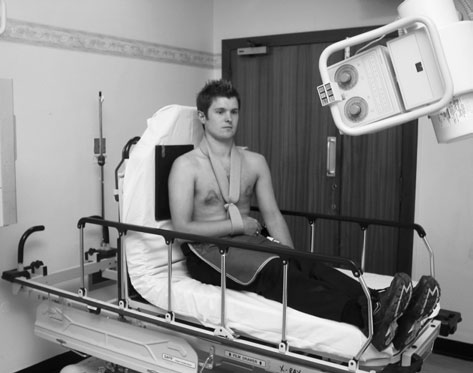
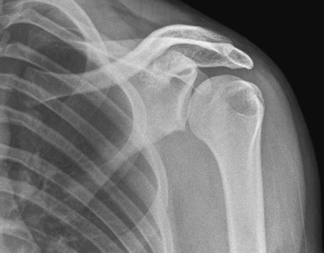
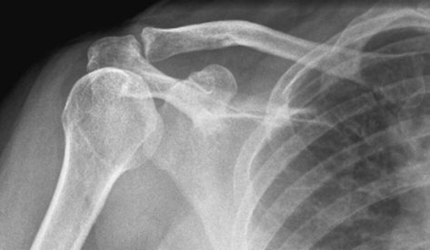

# Rx Modifications in technique (post - manipulation)

  📷 Radiografie Convențională (Rx)
  <strong>Actualizat:</strong> 2026-09-16
  <strong>Autor:</strong> Departamentul de Radiologie / Referință Clark (Ed. 12)

---

-   __1. Rezumat Clinic & Indicații__

    ---

    === "Indicații Clinice"

        - 87 3 Modifications în technique (post-manipulation) revised Umăr technique poate fie necessary immediately following manipulation la check that Umăr luxație articulară has been reduced successfully. brațul afectat will fie imobilizat, usually în collar și cuff support. imagine de spații articulare este taken în Antero-posterior (AP) poziție pe an 18  24-cm casetă; this este achieved prin raising partea sănătoasă (neafectată) approximately 30 grade. It este important that precis assessment de glenohumeral articulație este possible de la resultant imagine în order that avulsion suspiciune de fractură de la around glenoid rim este clar evidențiat(e). Poor positioning technique poate fie result de following:
        - pacientul nu being X-rayed Ortostatism și nu enough compensatory caudal angulation being applied.
        - imobilizat braț will fie nursed cu Humerus internally rotit. This has effect that plan coronal este often tilted spre partea sănătoasă (neafectată). Such poor technique results în fără spații articulare being seen, cap humeral overlying acromion, și cap humeral appearing ca a ‘lightbulb’ cu mare tuberozitate humerală (trohiter) nu being evidențiat. Antero-posterior (AP) – 25 grade caudal

    === "Ghid Național IRIS"

        !!! info "Referință Primară: Ghidul Național IRIS (Ordinul MS 1342/2012)"
            - **Capitol Ghid IRIS:** *Ghidul Național IRIS*
            - **Grad de Recomandare:** **De verificat pe indicație; fără grad atribuit automat**
            - **Nivel de Iradiere Estimată:** `De verificat pentru examinarea și populația selectate`

            [:octicons-search-16: Deschide Ghidul IRIS](../../iris.md){ .md-button .md-button--primary } [:material-open-in-new: Aplicația Oficială PWA](https://radiologie-pediatrica.ro/iris/){ .md-button target="_blank" rel="noopener" }
-   __2. Poziționare & Centrare Fascicul__

    ---

    - **Poziție Pacient:** • pacientul stă așezat fully Ortostatism, if possible, pe accident și emergency (A&E) trolley, cu capul section de trolley raised la vertical poziție la support pacientul.
• cu braț imobilizat în collar și cuff, pacientul este întors 30 grade spre partea afectată.
• unaffected Umăr este sprijinit pe pads la bring posterior aspect de affected Umăr into closer contact cu caseta, which este poziționat under brațul afectat și held în poziție cu pacientul’s corp weight.
• caseta este poziționat so that its upper margine este la least 5 cm above Umăr la ensure that Oblică rays do nu project Umăr off film radiologic.
    - **Punct de Centrare Fascicul:** • raza centrală orizontală centrală este înclinat 25 grade caudally și orientat la palpable Proces Coracoid de Omoplat (Scapulă).
• fascicul este collimated la 18  24-cm casetă.
    - **Distanță Focar-Film (DFF / SID):** 100 cm
    - **Comandă Respiratorie:** Apnee pe durata expunerii (apnee în inspir pentru torace; expir pentru Abdomen/bazin).

-   __3. Parametri Tehnici Expunere__

    ---

    | Parametru Tehnic | Valoare Configurare Generator / Tub |
    |:-----------------|:-------------------------------------|
    | **Tensiune Tub (kV)** | DE CONFIGURAT PE APARAT |
    | **Sarcină / Produs Curent-Timp (mAs)** | Conform AEC / grosime anatomică |
    | **Distanță Focar-Film (DFF / SID)** | 100 cm |
    | **Grilă Antidifuzoare (Bucky)** | Conform grosimii anatomice (> 10-12 cm cu grilă) |
    | **Dimensiune Focar** | Focar Mic (0.6 mm) |
    | **Camere de Ionizare AEC** | DE CONFIGURAT PE APARAT |
    | **Colimare Fascicul** | Colimare strictă adaptată pe receptor 18 x 24 cm |
    | **Filtrare Tub** | Totală ≥ 2.5 mm Al echivalent (conform Clark: 3.0 mm Al eq.) |

-   __4. Criterii de Calitate & Reușită Imagine__

    ---

    - glenoid rim trebuie să fie clear de cap humeral și articular surface de capul de Humerus trebuie să fie clear de acromion.
    - orice avulsion fragments trebuie să fie seen clearly în spații articulare. Antero-posterior (AP) radiografie de Umăr, post manipulation, evidențiind poor technique – spații articulare nu adequately evidențiat Antero-posterior (AP) radiografie de Umăr, post manipulation, evidențiind good technique

-   __5. Protecție Radiologică (ALARA)__

    ---

    - Ecranare gonadică cu șorț plumbat dacă gonadele sunt în apropierea fasciculului util (regula ALARA).
    - Colimare precisă la dimensiunea anatomică strict necesară pentru reducerea dozei și a radiației difuze.
    - Verificarea posibilității unei sarcini la pacientele de vârstă fertilă înainte de expunere.

!!! note "Observații Clinice & Tehnice"
    Pregătirea pacientului prin îndepărtarea tuturor accesoriilor radio-opace.

### 🖼️ Imagini

<figure class="protocol-image-card" markdown>

<figcaption><strong>usually în collar și cuff support. imagine de spații articulare</strong> — Poziționare pacient și centrare fascicul conform Clark (Ed. 12)</figcaption>

</figure>

<figure class="protocol-image-card" markdown>

<figcaption><strong>sion suspiciune de fractură de la around glenoid rim este clar evidențiat(e).</strong> — Aspect radiografic / ghid de poziționare conform tratatului Clark (Ed. 12)</figcaption>

</figure>

<figure class="protocol-image-card" markdown>

<figcaption><strong>Such poor technique results în fără spații articulare being seen, the</strong> — Aspect radiografic / ghid de poziționare conform tratatului Clark (Ed. 12)</figcaption>

</figure>

=== "Ghid Rapid de Execuție"

    1. **Identificarea și verificarea pacientului:** verificare identitate, zonă de examinat, consimțământ conform procedurii și evaluarea posibilității unei sarcini, când este relevantă.
    2. **Pregătire:** îndepărtarea oricăror obiecte radiopace (bijuterii, agrafe, fermoare, proteze, pansamente dense).
    3. **Poziționare precisă:** alinierea receptorului de imagine și a tubului la distanța prescrisă (100 cm).
    4. **Colimare strictă:** adaptarea fasciculului strict la regiunea de diagnostic pentru scăderea iradierii și reducerea radiației difuze.
    5. **Radioprotecție:** verificarea [politicii RX](../radioprotectie.md), cu măsuri distincte pentru pacient, personal și însoțitor.

## Surse de documentare

- [Clark's Positioning in Radiography (Ed. 12), Pagina 102](../../assets/protocols/sources/Clark___Positioning_in_Radiography__12th_edition.pdf#page=102)
