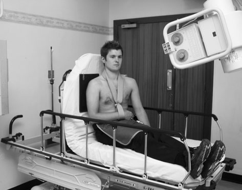
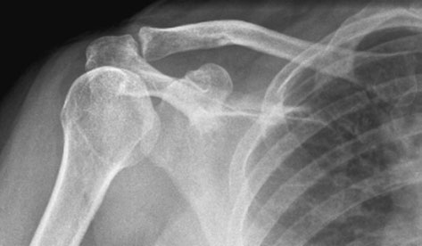

# Rx modificări ale tehnicii (post-manipulare)

  📷 Radiografie Convențională (Rx)
  <strong>Actualizat:</strong> 2026-09-16
  <strong>Autor:</strong> Departamentul de Radiologie / Referință Clark (Ed. 12)

---

-   __1. Rezumat Clinic & Indicații__

    ---

    === "Indicații Clinice"

        - 87 3 Modificări ale tehnicii (post-manipulare) Tehnica revizuită pentru umăr poate fi necesară imediat după manipulare pentru a verifica dacă luxația articulară a umărului a fost redusă cu succes. Brațul afectat va fi imobilizat, de obicei într-un suport tip eșarfă și manșetă. Imaginea spațiilor articulare este realizată în poziție antero-posterioară (AP), pe o casetă de 18 × 24-cm; aceasta se obține prin ridicarea părții sănătoase (neafectate) cu aproximativ 30 grade. Este important ca evaluarea precisă a articulației glenohumerale să fie posibilă pe imaginea rezultată, astfel încât suspiciunea de fractură prin avulsie din jurul marginii glenoide să fie clar evidențiată. Tehnica de poziționare incorectă poate avea următoarele rezultate:
        - Pacientul nu este radiografiat în ortostatism și nu se aplică o angulație caudală compensatorie suficientă.
        - Brațul imobilizat va fi îngrijit cu humerusul rotat intern. Aceasta are ca efect înclinarea frecventă a planului coronal spre partea sănătoasă (neafectată). O astfel de tehnică incorectă duce la imposibilitatea vizualizării spațiilor articulare, la suprapunerea capului humeral peste acromion și la apariția capului humeral ca un „bec”, cu marea tuberozitate humerală (trohiterul) neevidențiată. Antero-posterior (AP) – 25 grade caudal

    === "Ghid Național IRIS"

        !!! info "Referință Primară: Ghidul Național IRIS (Ordinul MS 1342/2012)"
            - **Capitol Ghid IRIS:** *Aparat locomotor & Membru superior*
            - **Grad de Recomandare:** **Grad A**
            - **Nivel de Iradiere Estimată:** `Clasa 1 (Minimă < 0.01 mSv)`

            [:octicons-search-16: Deschide Ghidul IRIS](../../iris.md){ .md-button .md-button--primary } [:material-open-in-new: Aplicația Oficială PWA](https://radiologie-pediatrica.ro/iris/){ .md-button target="_blank" rel="noopener" }

-   __2. Poziționare & Centrare Fascicul__

    ---

    - **Poziție Pacient:**
        - pacientul stă complet în ortostatism, dacă este posibil, pe targa de accident și urgență (A&E), cu segmentul cefalic al tărgii ridicat în poziție verticală pentru susținerea pacientului.
        - cu brațul imobilizat într-un suport tip eșarfă și manșetă, pacientul este rotit cu 30 grade spre partea afectată.
        - umărul neafectat este sprijinit pe tampoane pentru a aduce aspectul posterior al umărului afectat în contact mai apropiat cu caseta, care este poziționată sub brațul afectat și menținută în poziție de greutatea corporală a pacientului.
        - caseta este poziționată astfel încât marginea sa superioară să fie cu cel puțin 5 cm deasupra umărului, pentru a asigura că razele oblice nu proiectează umărul în afara filmului radiologic.
    - **Punct de Centrare Fascicul:**
        - raza centrală orizontală este înclinată cu 25 grade caudal și orientată către procesul coracoid palpabil al omoplatului (scapulei).
        - fasciculul este colimat la caseta de 18 × 24-cm.
    - **Distanță Focar-Film (DFF / SID):** 100 cm
    - **Comandă Respiratorie:** Apnee pe durata expunerii (apnee în inspir pentru torace; expir pentru Abdomen/bazin).

-   __3. Parametri Tehnici Expunere__

    ---

    | Parametru Tehnic | Valoare Configurare Generator / Tub |
    |:-----------------|:-------------------------------------|
    | **Tensiune Tub (kV)** | DE CONFIGURAT PE APARAT |
    | **Sarcină / Produs Curent-Timp (mAs)** | Conform AEC / grosimii anatomice |
    | **Distanță Focar-Film (DFF / SID)** | 100 cm |
    | **Grilă Antidifuzoare (Bucky)** | Conform grosimii anatomice (> 10-12 cm cu grilă) |
    | **Dimensiune Focar** | Focar Mic (0.6 mm) |
    | **Camere de Ionizare AEC** | DE CONFIGURAT PE APARAT |
    | **Colimare Fascicul** | Colimare strictă adaptată pe receptor 18 x 24 cm |
    | **Filtrare Tub** | Totală ≥ 2.5 mm Al echivalent (conform Clark: 3.0 mm Al echivalent) |

-   __4. Criterii de Calitate & Reușită Imagine__

    ---

    - Marginea glenoidă trebuie să fie liberă de capul humeral, iar suprafața articulară a capului humerusului trebuie să fie liberă de acromion.
    - Orice fragmente de avulsie trebuie să fie vizualizate clar în spațiile articulare. Radiografie antero-posterioară (AP) a umărului, post-manipulare, evidențiind tehnica incorectă – spațiile articulare nu sunt evidențiate adecvat. Radiografie antero-posterioară (AP) a umărului, post-manipulare, evidențiind tehnica corectă

-   __5. Protecție Radiologică (ALARA)__

    ---

    - Ecranare gonadică cu șorț plumbat dacă gonadele sunt în apropierea fasciculului util (regula ALARA).
    - Colimare precisă la dimensiunea anatomică strict necesară pentru reducerea dozei și a radiației difuze.
    - Verificarea posibilității unei sarcini la pacientele de vârstă fertilă înainte de expunere.

!!! note "Observații Clinice & Tehnice"
    Pregătirea pacientului prin îndepărtarea tuturor accesoriilor radio-opace.

### 🖼️ Imagini

<figure class="protocol-image-card" markdown>

<figcaption><strong>De obicei într-un suport tip eșarfă și manșetă. Imaginea spațiilor articulare</strong> — Poziționarea pacientului și centrarea fasciculului conform Clark (Ed. 12)</figcaption>

</figure>

<figure class="protocol-image-card" markdown>

![[fragment deteriorat în sursă] suspiciunea de fractură din jurul marginii glenoide este clar evidențiată.](../../assets/images/protocols/clark/rx-modifications-in-technique-post-manipulation-p102-clark/fig_2.jpeg)

<figcaption><strong>[fragment deteriorat în sursă] suspiciunea de fractură din jurul marginii glenoide este clar evidențiată.</strong> — Aspect radiografic / ghid de poziționare conform tratatului Clark (Ed. 12)</figcaption>

</figure>

<figure class="protocol-image-card" markdown>

<figcaption><strong>O astfel de tehnică incorectă duce la imposibilitatea vizualizării spațiilor articulare, a</strong> — Aspect radiografic / ghid de poziționare conform tratatului Clark (Ed. 12)</figcaption>

</figure>

=== "Ghid Rapid de Execuție"

    1. **Identificarea și verificarea pacientului:** verificare identitate, zonă de examinat, consimțământ conform procedurii și evaluarea posibilității unei sarcini, când este relevantă.
    2. **Pregătire:** îndepărtarea oricăror obiecte radiopace (bijuterii, agrafe, fermoare, proteze, pansamente dense).
    3. **Poziționare precisă:** alinierea receptorului de imagine și a tubului la distanța prescrisă (100 cm).
    4. **Colimare strictă:** adaptarea fasciculului strict la regiunea de diagnostic pentru scăderea iradierii și reducerea radiației difuze.
    5. **Radioprotecție:** verificarea [politicii RX](../radioprotectie.md), cu măsuri distincte pentru pacient, personal și însoțitor.

## Surse de documentare

- [Clark's Positioning in Radiography (Ed. 12), Pagina 102](https://books.google.com/books/about/Clark_s_Positioning_in_Radiography.html?id=Xxu6MwEACAAJ)
