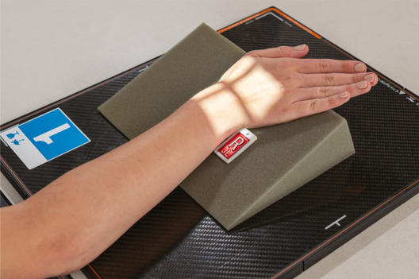
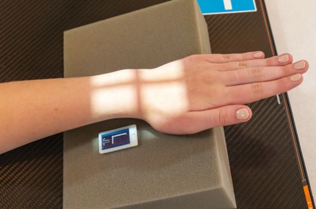
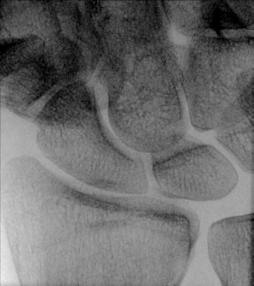
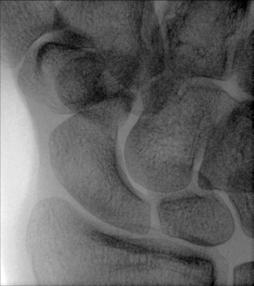

# Rx MODIFIED STECHER METHOD13

  📷 Radiografie Convențională (Rx)
  <strong>Actualizat:</strong> 2026-09-15
  <strong>Autor:</strong> Departamentul de Radiologie / Referință Bontrager

---

-   __1. Rezumat Clinic & Indicații__

    ---

    === "Indicații Clinice"

        - Possible suspiciune de fractură of the scaphoid This is an alternative projection to the CR angle ulnar deviation method demonstrated on the preceding page.

    === "Ghid Național IRIS"

        !!! info "Referință Primară: Ghidul Național IRIS (Ordinul MS 1342/2012)"
            - **Capitol Ghid IRIS:** *Ghidul Național IRIS*
            - **Grad de Recomandare:** **De verificat pe indicație; fără grad atribuit automat**
            - **Nivel de Iradiere Estimată:** `De verificat pentru examinarea și populația selectate`

            [:octicons-search-16: Deschide Ghidul IRIS](../../iris.md){ .md-button .md-button--primary } [:material-open-in-new: Aplicația Oficială PWA](https://radiologie-pediatrica.ro/iris/){ .md-button target="_blank" rel="noopener" }
-   __2. Poziționare & Centrare Fascicul__

    ---

    - **Poziție Pacient:** Pacient: Seat patient at end of table with Mână and Antebraț extended. Drop Umăr so that Umăr, Cot, and Pumn (Articulație Radiocarpiană) are on same horizontal plane.; Regiune anatomică: Place Mână and Pumn (Articulație Radiocarpiană) palm down on IR with Mână elevated on 20° angle sponge (Fig. 4.102). Ensure that Pumn (Articulație Radiocarpiană) is in direct contact with IR. Gently evert or turn Mână outward (toward ulnar side) unless contraindicated because of severe injury (Fig. 4.103).
    - **Punct de Centrare Fascicul:** angle with ulnar deviation Scaphoid projections: Mână elevated and ulnar deviation, modified Incidență Scafoid (Metoda Stecher) Fig. 4.102 PA Pumn (Articulație Radiocarpiană) for scaphoid as follows: Mână elevated 20°; ulnar deviation, if possible; no CR angle.
    - **Distanță Focar-Film (DFF / SID):** 100 cm
    - **Comandă Respiratorie:** Apnee pe durata expunerii (sau conform cooperării pacientului)

-   __3. Parametri Tehnici Expunere__

    ---

    | Parametru Tehnic | Valoare Configurare Generator / Tub |
    |:-----------------|:-------------------------------------|
    | **Tensiune Tub (kV)** | 55 kV |
    | **Sarcină / Produs Curent-Timp (mAs)** | DE CONFIGURAT PE APARAT |
    | **Distanță Focar-Film (DFF / SID)** | 100 cm |
    | **Grilă Antidifuzoare (Bucky)** | Fără grilă (expunere directă) |
    | **Dimensiune Focar** | Focar Mic (0.6 mm) |
    | **Camere de Ionizare AEC** | DE CONFIGURAT PE APARAT |
    | **Colimare Fascicul** | Field Size Collimate on four sides to carpal region. |
    | **Filtrare Tub** | Totală ≥ 2.5 mm Al echivalent |

-   __4. Criterii de Calitate & Reușită Imagine__

    ---

    - Distal radius and ulna, carpals, and proximal metacarpals are visible.
    - Carpals are visible, with adjacent interspaces more open on the lateral (radial) side of the Pumn (Articulație Radiocarpiană).
    - Scaphoid is shown, without foreshortening or superimposition of adjoining carpals (Figs. 4.104 and 4.105). Position:
    - Long axis of Pumn (Articulație Radiocarpiană) and Antebraț should be aligned with side border of IR.
    - Ulnar deviation is evidenced by only minimal, if any, superimposition of distal scaphoid.
    - Absența rotației anatomice: clavicule echidistante față de linia apofizelor spinoase of Pumn (Articulație Radiocarpiană) is evidenced by the appearance of distal radius and ulna with no or only minimal superimposition of distal radioulnar joint.
    - CR and center of collimation field size should be to scaphoid. Exposure:
    - Optimal image receptor exposure and contrast with no motion visualize the scaphoid borders and clear, Contururi osoase și travee trabeculare nete, fără artefacte de mișcare. Fig. 4.103 Severe pain as follows: Mână elevated 20°; no ulnar deviation; no CR angle. R Fig. 4.104 Mână elevated, ulnar deviation, and no CR angle.

-   __5. Protecție Radiologică (ALARA)__

    ---

    - Ecranare gonadică și a organelor radiosensibile conform procedurilor locale de radioprotecție ALARA.
    - Colimare strictă la aria de interes pentru limitarea radiației difuze.
    - Verificarea posibilității unei sarcini la pacientele de vârstă fertilă înainte de expunere.

!!! note "Observații Clinice & Tehnice"
    Stecher12 indicated that elevation of the Mână 20° rather than angling of CR places the scaphoid parallel to the IR. Stecher also suggested that clenching of the fist is an alternative to elevation of the Mână or angling of the CR. Bridgman14 recommended ulnar deviation in addition to Mână elevation, for less scaphoid superimposition. Fig. 4.105 Mână elevated, no ulnar deviation or CR angle. Pumn (Articulație Radiocarpiană) ALTERNATE Scaphoid projections:

### 🖼️ Imagini

<figure class="protocol-image-card" markdown>

<figcaption><strong>Fig. 4.105 Mână elevated, no</strong> — Poziționare pacient conform Ghidului Bontrager (Fig. 4.105 Hand elevated, no)</figcaption>

</figure>

<figure class="protocol-image-card" markdown>

<figcaption><strong>Fig. 4.102 PA Pumn (Articulație Radiocarpiană) for scaphoid as follows: Mână elevated 20°; ulnar</strong> — Aspect radiografic de referință conform Ghidului Bontrager (Fig. 4.102 PA wrist for scaphoid as follows: hand elevated 20°; ulnar)</figcaption>

</figure>

<figure class="protocol-image-card" markdown>

<figcaption><strong>Fig. 4.103 Severe pain as follows: Mână elevated 20°; no ulnar</strong> — Aspect radiografic de referință conform Ghidului Bontrager (Fig. 4.103 Severe pain as follows: hand elevated 20°; no ulnar)</figcaption>

</figure>

<figure class="protocol-image-card" markdown>

<figcaption><strong>Fig. 4.104 Mână elevated, ulnar</strong> — Aspect radiografic de referință conform Ghidului Bontrager (Fig. 4.104 Hand elevated, ulnar)</figcaption>

</figure>

=== "Ghid Rapid de Execuție"

    1. **Identificarea și verificarea pacientului:** verificare identitate, zonă de examinat, consimțământ conform procedurii și evaluarea posibilității unei sarcini, când este relevantă.
    2. **Pregătire:** îndepărtarea oricăror obiecte radiopace (bijuterii, agrafe, fermoare, proteze, pansamente dense).
    3. **Poziționare precisă:** alinierea receptorului de imagine și a tubului la distanța prescrisă (100 cm).
    4. **Colimare strictă:** adaptarea fasciculului strict la regiunea de diagnostic pentru scăderea iradierii și reducerea radiației difuze.
    5. **Radioprotecție:** verificarea [politicii RX](../radioprotectie.md), cu măsuri distincte pentru pacient, personal și însoțitor.

## Surse de documentare

- [Bontrager's Textbook of Radiographic Positioning (Ed. 9/10), Pagina 169](https://www.elsevier.com/books/textbook-of-radiographic-positioning-and-related-anatomy/lampignano/978-0-323-65367-1)
