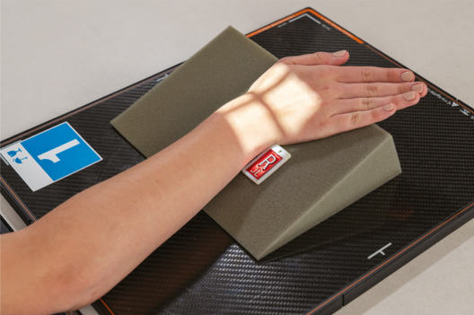
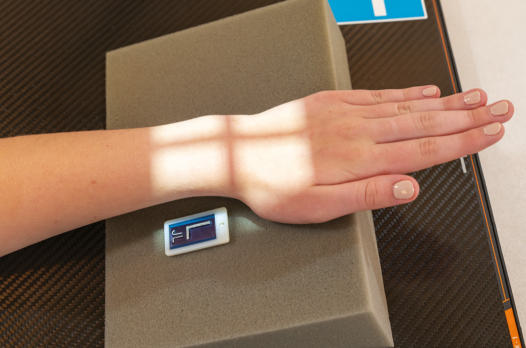
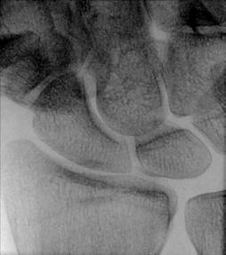
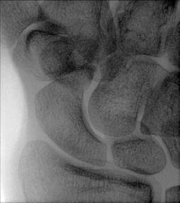

# Rx metodă Stecher modificată13

  📷 Radiografie Convențională (Rx)
  <strong>Actualizat:</strong> 2026-09-15
  <strong>Autor:</strong> Departamentul de Radiologie / Referință Bontrager

---

-   __1. Rezumat Clinic & Indicații__

    ---

    === "Indicații Clinice"

        - Posibilă suspiciune de fractură a scafoidului. Aceasta este o incidență alternativă la metoda cu deviație ulnară și angularea razei centrale prezentată pe pagina precedentă.

    === "Ghid Național IRIS"

        !!! info "Referință Primară: Ghidul Național IRIS (Ordinul MS 1342/2012)"
            - **Capitol Ghid IRIS:** *Aparat locomotor & Membru superior*
            - **Grad de Recomandare:** **Grad A**
            - **Nivel de Iradiere Estimată:** `Clasa 1 (Minimă < 0.01 mSv)`

            [:octicons-search-16: Deschide Ghidul IRIS](../../iris.md){ .md-button .md-button--primary } [:material-open-in-new: Aplicația Oficială PWA](https://radiologie-pediatrica.ro/iris/){ .md-button target="_blank" rel="noopener" }

-   __2. Poziționare & Centrare Fascicul__

    ---

    - **Poziție Pacient:** Pacient: Așezați pacientul la capătul mesei, cu mâna și antebrațul extinse. Coborâți umărul astfel încât umărul, cotul și pumnul (articulația radiocarpiană) să fie în același plan orizontal.; Regiune anatomică: Așezați mâna și pumnul (articulația radiocarpiană) cu palma în jos pe receptorul de imagine, cu mâna ridicată pe un suport de spumă înclinat la 20° (Fig. 4.102). Asigurați-vă că pumnul (articulația radiocarpiană) este în contact direct cu receptorul de imagine. Eversați ușor sau rotiți mâna spre exterior (către partea ulnară), cu excepția cazului în care este contraindicat din cauza unei leziuni severe (Fig. 4.103).
    - **Punct de Centrare Fascicul:** Unghiul cu deviație ulnară. Incidențe ale scafoidului: Mâna ridicată și cu deviație ulnară, incidența modificată a scafoidului (metoda Stecher). Fig. 4.102 PA a pumnului (articulației radiocarpiene) pentru scafoid, după cum urmează: Mâna ridicată cu 20°; deviație ulnară, dacă este posibil; fără angularea razei centrale.
    - **Distanță Focar-Film (DFF / SID):** 100 cm
    - **Comandă Respiratorie:** Apnee pe durata expunerii (sau conform cooperării pacientului)

-   __3. Parametri Tehnici Expunere__

    ---

    | Parametru Tehnic | Valoare Configurare Generator / Tub |
    |:-----------------|:-------------------------------------|
    | **Tensiune Tub (kV)** | 55 kV |
    | **Sarcină / Produs Curent-Timp (mAs)** | DE CONFIGURAT PE APARAT |
    | **Distanță Focar-Film (DFF / SID)** | 100 cm |
    | **Grilă Antidifuzoare (Bucky)** | Fără grilă (expunere directă) |
    | **Dimensiune Focar** | Focar Mic (0.6 mm) |
    | **Camere de Ionizare AEC** | DE CONFIGURAT PE APARAT |
    | **Colimare Fascicul** | Dimensiunea câmpului: colimați pe toate cele patru laturi la regiunea carpiană. |
    | **Filtrare Tub** | Totală ≥ 2.5 mm Al echivalent |

-   __4. Criterii de Calitate & Reușită Imagine__

    ---

    - Radiusul și ulna distale, oasele carpiene și oasele metacarpiene proximale sunt vizibile.
    - Oasele carpiene sunt vizibile, cu spațiile interosoase adiacente mai deschise pe partea laterală (radială) a pumnului (articulației radiocarpiene).
    - Scafoidul este vizualizat fără scurtare sau suprapunere peste oasele carpiene adiacente (Fig. 4.104 și 4.105). Poziție:
    - Axa longitudinală a pumnului (articulației radiocarpiene) și antebrațului trebuie aliniată cu marginea laterală a receptorului de imagine.
    - Deviația ulnară este evidențiată prin suprapunerea doar minimă, dacă există, a scafoidului distal.
    - Absența rotației anatomice: claviculele echidistante față de linia apofizelor spinoase a pumnului (articulației radiocarpiene) este evidențiată prin aspectul radiusului și ulnei distale, cu absența sau doar suprapunerea minimă a articulației radioulnare distale.
    - Raza centrală și centrul câmpului de colimare trebuie orientate spre scafoid. Expunere:
    - Expunere optimă la receptorul de imagine și contrast, fără mișcare, evidențiind marginile scafoidului și contururi osoase și travee trabeculare clare, fără artefacte de mișcare. Fig. 4.103 Durere severă, după cum urmează: mâna ridicată la 20°; fără deviație ulnară; fără unghi al razei centrale. R Fig. 4.104 Mâna ridicată, deviație ulnară și fără unghi al razei centrale.

-   __5. Protecție Radiologică (ALARA)__

    ---

    - Ecranare gonadică și a organelor radiosensibile conform procedurilor locale de radioprotecție ALARA.
    - Colimare strictă la aria de interes pentru limitarea radiației difuze.
    - Verificarea posibilității unei sarcini la pacientele de vârstă fertilă înainte de expunere.

!!! note "Observații Clinice & Tehnice"
    Stecher12 a indicat că ridicarea mâinii cu 20°, în locul angulării razei centrale, plasează scafoidul paralel cu receptorul de imagine (RI). Stecher a sugerat, de asemenea, că strângerea pumnului este o alternativă la ridicarea mâinii sau la angularea razei centrale. Bridgman14 a recomandat deviația ulnară în plus față de ridicarea mâinii, pentru o suprapunere mai redusă a scafoidului. Fig. 4.105 Mâna ridicată, fără deviație ulnară sau angularea razei centrale. Pumn (articulație radiocarpiană). Incidențe ALTERNATIVE ale scafoidului:

### 🖼️ Imagini

<figure class="protocol-image-card" markdown>

<figcaption><strong>Fig. 4.105 Mâna ridicată, fără</strong> — Poziționarea pacientului conform Ghidului Bontrager (Fig. 4.105 mâna ridicată, fără)</figcaption>

</figure>

<figure class="protocol-image-card" markdown>

<figcaption><strong>Fig. 4.102 PA a pumnului pentru scafoid, după cum urmează: mâna ridicată la 20°; ulnar</strong> — Aspect radiografic de referință conform Ghidului Bontrager (Fig. 4.102 PA a pumnului pentru scafoid, după cum urmează: mâna ridicată la 20°; ulnar)</figcaption>

</figure>

<figure class="protocol-image-card" markdown>

<figcaption><strong>Fig. 4.103 Durere severă, după cum urmează: mâna ridicată la 20°; fără ulnar</strong> — Aspect radiografic de referință conform Ghidului Bontrager (Fig. 4.103 Durere severă, după cum urmează: mâna ridicată la 20°; fără ulnar)</figcaption>

</figure>

<figure class="protocol-image-card" markdown>

<figcaption><strong>Fig. 4.104 Mâna ridicată, ulnar</strong> — Aspect radiografic de referință conform Ghidului Bontrager (Fig. 4.104 mâna ridicată, ulnar)</figcaption>

</figure>

=== "Ghid Rapid de Execuție"

    1. **Identificarea și verificarea pacientului:** verificare identitate, zonă de examinat, consimțământ conform procedurii și evaluarea posibilității unei sarcini, când este relevantă.
    2. **Pregătire:** îndepărtarea oricăror obiecte radiopace (bijuterii, agrafe, fermoare, proteze, pansamente dense).
    3. **Poziționare precisă:** alinierea receptorului de imagine și a tubului la distanța prescrisă (100 cm).
    4. **Colimare strictă:** adaptarea fasciculului strict la regiunea de diagnostic pentru scăderea iradierii și reducerea radiației difuze.
    5. **Radioprotecție:** verificarea [politicii RX](../radioprotectie.md), cu măsuri distincte pentru pacient, personal și însoțitor.

## Surse de documentare

- [Bontrager's Textbook of Radiographic Positioning (Ed. 9/10), Pagina 169](https://www.elsevier.com/books/textbook-of-radiographic-positioning-and-related-anatomy/lampignano/978-0-323-65367-1)
