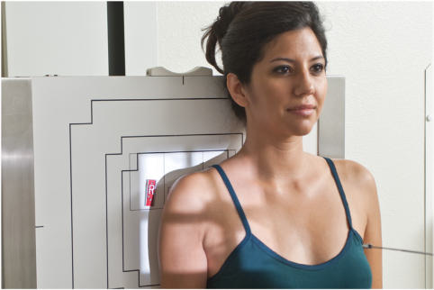
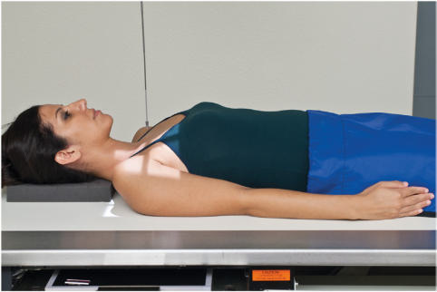
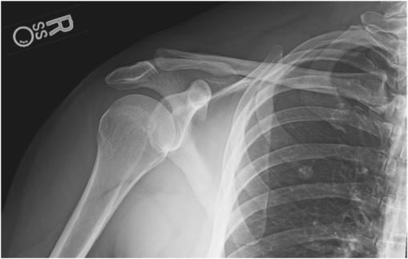
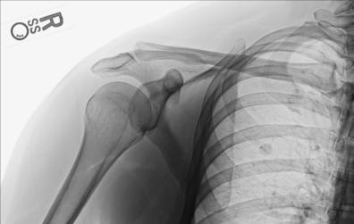

# Rx NEUTRAL ROTATION AP (Antero-Posterior) (Umăr (traumatism acuttism / Regim Urgență))

  📷 Radiografie Convențională (Rx)
  <strong>Actualizat:</strong> 2026-09-15
  <strong>Autor:</strong> Departamentul de Radiologie / Referință Bontrager

---

-   __1. Rezumat Clinic & Indicații__

    ---

    === "Indicații Clinice"

        - suspiciune de fractură or luxație / subluxație articulară of proximal Humerus and Umăr girdle
        - Calcium deposits in muscles, tendons, or bursal structures may be evident, along with degenerative diseases

    === "Ghid Național IRIS"

        !!! info "Referință Primară: Ghidul Național IRIS (Ordinul MS 1342/2012)"
            - **Capitol Ghid IRIS:** *Ghidul Național IRIS*
            - **Grad de Recomandare:** **De verificat pe indicație; fără grad atribuit automat**
            - **Nivel de Iradiere Estimată:** `De verificat pentru examinarea și populația selectate`

            [:octicons-search-16: Deschide Ghidul IRIS](../../iris.md){ .md-button .md-button--primary } [:material-open-in-new: Aplicația Oficială PWA](https://radiologie-pediatrica.ro/iris/){ .md-button target="_blank" rel="noopener" }
-   __2. Poziționare & Centrare Fascicul__

    ---

    - **Poziție Pacient:** Pacient: Perform radiograph with patient in Ortostatism or Decubit Dorsal position. (The Ortostatism position is usually less painful for patient, if condition allows.) Rotate body slightly toward affected side if necessary to place Umăr in contact with IR or tabletop (Figs. 5.69 and 5.70).; Regiune anatomică: Position patient to center scapulohumeral joint to IR. Place patient’s arm at side in “as is” neutral rotation. (Epicondyles generally are approximately 45° to plane of IR.)
    - **Punct de Centrare Fascicul:** perpendicular to IR, directed to midscapulohumeral joint, which is approximately ¾ inch (2 cm) inferior and slightly lateral to coracoid process (see NOTE, p. 189).
    - **Distanță Focar-Film (DFF / SID):** 100 cm
    - **Comandă Respiratorie:** Suspend respiration during exposure. Umăr (traumatism acuttism / Regim Urgență) ROUTINE AP (neutral rotation) Transthoracic lateral or PA oblique (scapular Y lateral) Fig. 5.69 AP Ortostatism—neutral rotation. Fig. 5.70 AP Decubit Dorsal—neutral rotation.

-   __3. Parametri Tehnici Expunere__

    ---

    | Parametru Tehnic | Valoare Configurare Generator / Tub |
    |:-----------------|:-------------------------------------|
    | **Tensiune Tub (kV)** | 70-85 kV |
    | **Sarcină / Produs Curent-Timp (mAs)** | DE CONFIGURAT PE APARAT |
    | **Distanță Focar-Film (DFF / SID)** | 100 cm |
    | **Grilă Antidifuzoare (Bucky)** | Cu grilă antidifuzoare Bucky |
    | **Dimensiune Focar** | Focar Mic (0.6 mm) |
    | **Camere de Ionizare AEC** | Camerele laterale (sau camera centrală funcție de regiune) |
    | **Colimare Fascicul** | Field Size Collimate on four sides, with lateral and upper borders adjusted to soft tissue margins. |
    | **Filtrare Tub** | Totală ≥ 2.5 mm Al echivalent |

-   __4. Criterii de Calitate & Reușită Imagine__

    ---

    - The proximal onethird of the Humerus and upper Omoplat (Scapulă) and the lateral twothirds of the Claviculă are shown, including the relationship of the humeral head to the glenoid cavity. Position:
    - With neutral rotation, both the greater and the lesser tubercles most often are superimposed by the humeral head (Figs. 5.71 and 5.72).
    - Collimation field size to area of interest Exposure:
    - Optimal image receptor exposure and contrast with no motion visualize Contururi osoase și travee trabeculare nete, fără artefacte de mișcare and pertinent soft tissue anatomy.
    - The outline of the medial aspect of the humeral head is visible through the glenoid cavity, and soft tissue detail should be visible to demonstrate possible calcium deposits. Fig. 5.71 Incidență Antero-Posterioară (AP)—neutral rotation. Coracoid process Acromion Scapulohumeral joint Greater tubercle Lesser tubercle Omoplat (Scapulă) Proximal Humerus Fig. 5.72 Incidență Antero-Posterioară (AP)—neutral rotation.

-   __5. Protecție Radiologică (ALARA)__

    ---

    - Ecranare gonadică și a organelor radiosensibile conform procedurilor locale de radioprotecție ALARA.
    - Colimare strictă la aria de interes pentru limitarea radiației difuze.
    - Verificarea posibilității unei sarcini la pacientele de vârstă fertilă înainte de expunere.

### 🖼️ Imagini

<figure class="protocol-image-card" markdown>

<figcaption><strong>Fig. 5.69 AP Ortostatism—neutral rotation.</strong> — Poziționare pacient conform Ghidului Bontrager (Fig. 5.69 AP erect—neutral rotation.)</figcaption>

</figure>

<figure class="protocol-image-card" markdown>

<figcaption><strong>Fig. 5.70 AP Decubit Dorsal—neutral rotation.</strong> — Aspect radiografic de referință conform Ghidului Bontrager (Fig. 5.70 AP supine—neutral rotation.)</figcaption>

</figure>

<figure class="protocol-image-card" markdown>

<figcaption><strong>Fig. 5.71 Incidență Antero-Posterioară (AP)—neutral rotation.</strong> — Aspect radiografic de referință conform Ghidului Bontrager (Fig. 5.71 AP projection—neutral rotation.)</figcaption>

</figure>

<figure class="protocol-image-card" markdown>

<figcaption><strong>Fig. 5.72 Incidență Antero-Posterioară (AP)—neutral rotation.</strong> — Aspect radiografic de referință conform Ghidului Bontrager (Fig. 5.72 AP projection—neutral rotation.)</figcaption>

</figure>

=== "Ghid Rapid de Execuție"

    1. **Identificarea și verificarea pacientului:** verificare identitate, zonă de examinat, consimțământ conform procedurii și evaluarea posibilității unei sarcini, când este relevantă.
    2. **Pregătire:** îndepărtarea oricăror obiecte radiopace (bijuterii, agrafe, fermoare, proteze, pansamente dense).
    3. **Poziționare precisă:** alinierea receptorului de imagine și a tubului la distanța prescrisă (100 cm).
    4. **Colimare strictă:** adaptarea fasciculului strict la regiunea de diagnostic pentru scăderea iradierii și reducerea radiației difuze.
    5. **Radioprotecție:** verificarea [politicii RX](../radioprotectie.md), cu măsuri distincte pentru pacient, personal și însoțitor.

## Surse de documentare

- [Bontrager's Textbook of Radiographic Positioning (Ed. 9/10), Pagina 212](https://www.elsevier.com/books/textbook-of-radiographic-positioning-and-related-anatomy/lampignano/978-0-323-65367-1)
