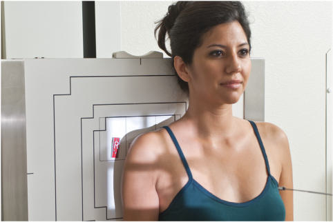
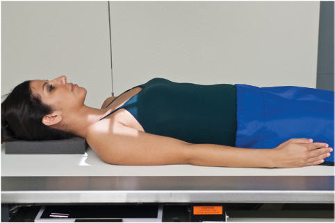
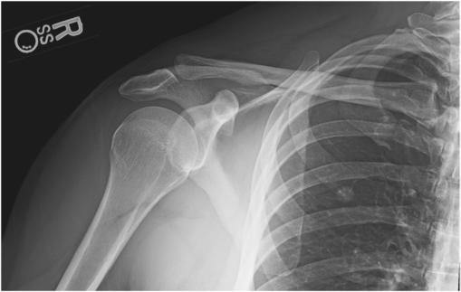
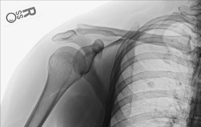

# Rx rotație neutră AP (anteroposterioară) (umăr (traumatism acut / regim de urgență))

  📷 Radiografie Convențională (Rx)
  <strong>Actualizat:</strong> 2026-09-15
  <strong>Autor:</strong> Departamentul de Radiologie / Referință Bontrager

---

-   __1. Rezumat Clinic & Indicații__

    ---

    === "Indicații Clinice"

        - Suspiciune de fractură sau luxație/subluxație articulară a humerusului proximal și a centurii scapulare
        - Depozitele de calciu din mușchi, tendoane sau structurile bursale pot fi evidente, împreună cu bolile degenerative.

    === "Ghid Național IRIS"

        !!! info "Referință Primară: Ghidul Național IRIS (Ordinul MS 1342/2012)"
            - **Capitol Ghid IRIS:** *Aparat locomotor & Membru superior*
            - **Grad de Recomandare:** **Grad A**
            - **Nivel de Iradiere Estimată:** `Clasa 1 (Minimă < 0.05 mSv)`

            [:octicons-search-16: Deschide Ghidul IRIS](../../iris.md){ .md-button .md-button--primary } [:material-open-in-new: Aplicația Oficială PWA](https://radiologie-pediatrica.ro/iris/){ .md-button target="_blank" rel="noopener" }

-   __2. Poziționare & Centrare Fascicul__

    ---

    - **Poziție Pacient:** Pacient: efectuați radiografia cu pacientul în ortostatism sau în decubit dorsal. (Poziția în ortostatism este de obicei mai puțin dureroasă pentru pacient, dacă starea permite.) Rotiți corpul ușor spre partea afectată, dacă este necesar, pentru a plasa umărul în contact cu receptorul de imagine sau cu masa radiologică (Fig. 5.69 și 5.70). Regiune anatomică: poziționați pacientul astfel încât articulația scapulohumerală să fie centrată pe receptorul de imagine. Plasați brațul pacientului lateral, în „așa cum este”, în rotație neutră. (Epicondilii sunt, în general, situați la aproximativ 45° față de planul receptorului de imagine.)
    - **Punct de Centrare Fascicul:** Perpendiculară pe receptorul de imagine, orientată spre articulația scapulohumerală mijlocie, situată la aproximativ ¾ țol (2 cm) inferior și ușor lateral față de procesul coracoid (vezi NOTA, p. 189).
    - **Distanță Focar-Film (DFF / SID):** 100 cm
    - **Comandă Respiratorie:** Apnee pe durata expunerii. Umăr (traumatism acut / regim de urgență) AP DE RUTINĂ (rotație neutră) Incidență laterală transtoracică sau PA oblică (laterală în Y scapular) Fig. 5.69 AP în ortostatism—rotație neutră. Fig. 5.70 AP în decubit dorsal—rotație neutră.

-   __3. Parametri Tehnici Expunere__

    ---

    | Parametru Tehnic | Valoare Configurare Generator / Tub |
    |:-----------------|:-------------------------------------|
    | **Tensiune Tub (kV)** | 70-85 kV |
    | **Sarcină / Produs Curent-Timp (mAs)** | DE CONFIGURAT PE APARAT |
    | **Distanță Focar-Film (DFF / SID)** | 100 cm |
    | **Grilă Antidifuzoare (Bucky)** | Cu grilă antidifuzoare Bucky |
    | **Dimensiune Focar** | Focar Mic (0.6 mm) |
    | **Camere de Ionizare AEC** | Camerele laterale (sau camera centrală, în funcție de regiune) |
    | **Colimare Fascicul** | Dimensiunea câmpului. Se colimează pe patru laturi, cu marginile laterală și superioară ajustate la marginile părților moi. |
    | **Filtrare Tub** | Totală ≥ 2.5 mm Al echivalent |

-   __4. Criterii de Calitate & Reușită Imagine__

    ---

    - Treimea proximală a humerusului, omoplatul superior și cele două treimi laterale ale claviculei sunt vizualizate, inclusiv relația capului humeral cu cavitatea glenoidă. Poziție:
    - În rotație neutră, tuberculii mare și mic sunt cel mai adesea suprapuși de capul humeral (Fig. 5.71 și 5.72).
    - Dimensiunea câmpului de colimare la aria de interes diagnostic. Expunere:
    - Expunere optimă la receptorul de imagine și contrast, fără mișcare, evidențiind contururi osoase și travee trabeculare clare, fără artefacte de mișcare și cu anatomia relevantă a părților moi.
    - Conturul aspectului medial al capului humeral este vizibil prin cavitatea glenoidă, iar detaliile părților moi trebuie să fie vizibile pentru evidențierea eventualelor depozite de calciu. Fig. 5.71 Incidență anteroposterioară (AP)—rotație neutră. Proces coracoid; acromion; articulație scapulohumerală; tuberozitate mare humerală (trohiter); tuberozitate mică humerală (trohin); omoplat (scapulă); humerus proximal. Fig. 5.72 Incidență anteroposterioară (AP)—rotație neutră.

-   __5. Protecție Radiologică (ALARA)__

    ---

    - Ecranare gonadică și a organelor radiosensibile conform procedurilor locale de radioprotecție ALARA.
    - Colimare strictă la aria de interes pentru limitarea radiației difuze.
    - Verificarea posibilității unei sarcini la pacientele de vârstă fertilă înainte de expunere.

### 🖼️ Imagini

<figure class="protocol-image-card" markdown>

<figcaption><strong>Fig. 5.69 AP în ortostatism—rotație neutră.</strong> — Poziționarea pacientului conform Ghidului Bontrager (Fig. 5.69 AP în ortostatism—rotație neutră.)</figcaption>

</figure>

<figure class="protocol-image-card" markdown>

<figcaption><strong>Fig. 5.70 AP în decubit dorsal—rotație neutră.</strong> — Aspect radiografic de referință conform Ghidului Bontrager (Fig. 5.70 AP în decubit dorsal—rotație neutră.)</figcaption>

</figure>

<figure class="protocol-image-card" markdown>

<figcaption><strong>Fig. 5.71 Incidență anteroposterioară (AP)—rotație neutră.</strong> — Aspect radiografic de referință conform Ghidului Bontrager (Fig. 5.71 incidență AP—rotație neutră.)</figcaption>

</figure>

<figure class="protocol-image-card" markdown>

<figcaption><strong>Fig. 5.72 Incidență anteroposterioară (AP)—rotație neutră.</strong> — Aspect radiografic de referință conform Ghidului Bontrager (Fig. 5.72 incidență AP—rotație neutră.)</figcaption>

</figure>

=== "Ghid Rapid de Execuție"

    1. **Identificarea și verificarea pacientului:** verificare identitate, zonă de examinat, consimțământ conform procedurii și evaluarea posibilității unei sarcini, când este relevantă.
    2. **Pregătire:** îndepărtarea oricăror obiecte radiopace (bijuterii, agrafe, fermoare, proteze, pansamente dense).
    3. **Poziționare precisă:** alinierea receptorului de imagine și a tubului la distanța prescrisă (100 cm).
    4. **Colimare strictă:** adaptarea fasciculului strict la regiunea de diagnostic pentru scăderea iradierii și reducerea radiației difuze.
    5. **Radioprotecție:** verificarea [politicii RX](../radioprotectie.md), cu măsuri distincte pentru pacient, personal și însoțitor.

## Surse de documentare

- [Bontrager's Textbook of Radiographic Positioning (Ed. 9/10), Pagina 212](https://www.elsevier.com/books/textbook-of-radiographic-positioning-and-related-anatomy/lampignano/978-0-323-65367-1)
