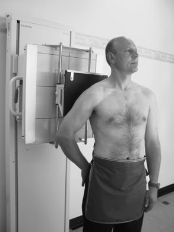
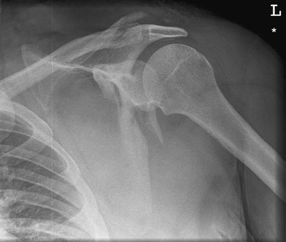
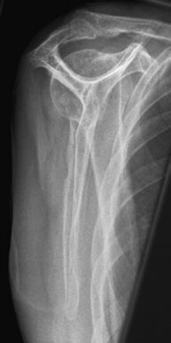
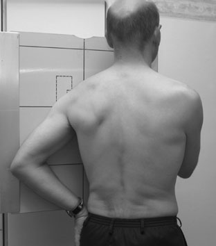
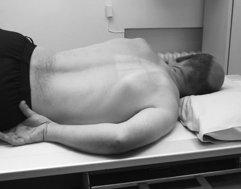
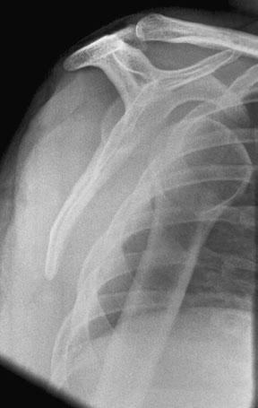

# Rx Omoplat (Scapulă) Antero-Posterior (AP) (basic) - Ortostatism

  📷 Radiografie Convențională (Rx)
  <strong>Actualizat:</strong> 2026-09-16
  <strong>Autor:</strong> Departamentul de Radiologie / Referință Clark (Ed. 12)

---

-   __1. Rezumat Clinic & Indicații__

    ---

    === "Indicații Clinice"

        - This este very thin sheet de bone cu several dense appendages overlying upper Coaste (Grilaj Costal), making suspiciune de fractură, și their full extent, hard la assess. CT poate fie very useful pentru complete evaluation, în particular multiplanar reconstruction facility, once suspiciune de fractură has been detected. 102 articulații acromioclaviculare Claviculă superior margine de Omoplat (Scapulă) Supraspinatus fossa Tip de Proces Coracoid cap de Humerus (dislocated anteriorly) Posterolateral Coaste (Grilaj Costal) Shaft de Humerus corp de acromion coloană vertebrală de Omoplat (Scapulă) posterior margine de glenoid inferior tip de Omoplat (Scapulă) anterior surface de Omoplat (Scapulă) (fossa pentru subscapularis) Normal Profil (lateral) radiografie de Omoplat (Scapulă)

    === "Ghid Național IRIS"

        !!! info "Referință Primară: Ghidul Național IRIS (Ordinul MS 1342/2012)"
            - **Capitol Ghid IRIS:** *Ghidul Național IRIS*
            - **Grad de Recomandare:** **De verificat pe indicație; fără grad atribuit automat**
            - **Nivel de Iradiere Estimată:** `De verificat pentru examinarea și populația selectate`

            [:octicons-search-16: Deschide Ghidul IRIS](../../iris.md){ .md-button .md-button--primary } [:material-open-in-new: Aplicația Oficială PWA](https://radiologie-pediatrica.ro/iris/){ .md-button target="_blank" rel="noopener" }
-   __2. Poziționare & Centrare Fascicul__

    ---

    - **Poziție Pacient:** • pacientul stă în ortostatism cu affected Umăr against casetă și rotit slightly la bring plane de Omoplat (Scapulă) paralel cu casetă.
• braț este slightly în abducție away de la corp și medially rotit.
• caseta este poziționat so that its upper margine este la least 5 cm above Umăr la ensure that Oblică rays do nu project Umăr off caseta.

• Pacientul este așezat în decubit ventral pe masa radiologică.
• braț pe side being examined este slightly în abducție și Cot flectat.
• partea sănătoasă (neafectată) este raised until palpable corp de Omoplat (Scapulă) este la drept-angles la masa de examinare și în linia mediană mesei.
    - **Punct de Centrare Fascicul:** • orizontal ray este orientat la capul de Humerus.

• raza centrală verticală centrală este orientat just medial la midpoint de palpable medial margine de Omoplat (Scapulă) și la middle de masa radiologică.
    - **Distanță Focar-Film (DFF / SID):** 100 cm
    - **Comandă Respiratorie:** Apnee pe durata expunerii (apnee în inspir pentru torace; expir pentru Abdomen/bazin).

-   __3. Parametri Tehnici Expunere__

    ---

    | Parametru Tehnic | Valoare Configurare Generator / Tub |
    |:-----------------|:-------------------------------------|
    | **Tensiune Tub (kV)** | DE CONFIGURAT PE APARAT |
    | **Sarcină / Produs Curent-Timp (mAs)** | Conform AEC / grosime anatomică |
    | **Distanță Focar-Film (DFF / SID)** | 100 cm |
    | **Grilă Antidifuzoare (Bucky)** | Cu grilă antidifuzoare Bucky |
    | **Dimensiune Focar** | Focar Mic (0.6 mm) |
    | **Camere de Ionizare AEC** | Camerele laterale (sau camera centrală funcție de regiune) |
    | **Colimare Fascicul** | Colimare strictă adaptată pe receptor 24 x 30 cm |
    | **Filtrare Tub** | Totală ≥ 2.5 mm Al echivalent (conform Clark: 3.0 mm Al eq.) |

-   __4. Criterii de Calitate & Reușită Imagine__

    ---

    - entire Omoplat (Scapulă) trebuie să fie evidențiat pe imagine.
    - medial margine de Omoplat (Scapulă) trebuie să fie projected clear de mediastinum.
    - medial margine de Omoplat (Scapulă) trebuie să fie projected clear de Coaste (Grilaj Costal). X-ray tube Oblică ray Normal ray Claviculă Coaste (Grilaj Costal) Omoplat (Scapulă) Humerus 20° casetă săculeți cu nisip II I III 3rd TV Antero-posterior (AP) radiografie de Omoplat (Scapulă) evidențiind suspiciune de fractură through gâtul de glenoid Axială diagram evidențiind relationship de casetă și X-ray fascicul la Omoplat (Scapulă)
    - Omoplat (Scapulă) trebuie să fie evidențiat clear de Coaste (Grilaj Costal).
    - medial și Profil (lateral) margini trebuie să fie superimposed.
    - Humerus trebuie să fie projected clear de area under examination.
    - expunere trebuie să evidențiază adequately whole de Omoplat (Scapulă). Profil (lateral) (alternate)

-   __5. Protecție Radiologică (ALARA)__

    ---

    - Ecranare gonadică cu șorț plumbat dacă gonadele sunt în apropierea fasciculului util (regula ALARA).
    - Colimare precisă la dimensiunea anatomică strict necesară pentru reducerea dozei și a radiației difuze.
    - Verificarea posibilității unei sarcini la pacientele de vârstă fertilă înainte de expunere.

!!! note "Observații Clinice & Tehnice"
    long expunere time poate fie chosen și pacientul allowed la continue quiet respirație during expunere, so that imagini de overlying lung și rib sunt blurred în cases de non-trauma.

### 🖼️ Imagini

<figure class="protocol-image-card" markdown>

<figcaption><strong>There poate also fie underlying rib suspiciune de fractură.</strong> — Poziționare pacient și centrare fascicul conform Clark (Ed. 12)</figcaption>

</figure>

<figure class="protocol-image-card" markdown>

<figcaption><strong>Antero-posterior (AP) radiografie de Omoplat (Scapulă) evidențiind suspiciune de fractură through the</strong> — Aspect radiografic / ghid de poziționare conform tratatului Clark (Ed. 12)</figcaption>

</figure>

<figure class="protocol-image-card" markdown>

<figcaption><strong>overlying upper Coaste (Grilaj Costal), making suspiciune de fractură, și their full extent,</strong> — Aspect radiografic / ghid de poziționare conform tratatului Clark (Ed. 12)</figcaption>

</figure>

<figure class="protocol-image-card" markdown>

<figcaption><strong>once suspiciune de fractură has been detected.</strong> — Aspect radiografic / ghid de poziționare conform tratatului Clark (Ed. 12)</figcaption>

</figure>

<figure class="protocol-image-card" markdown>

<figcaption><strong>Normal Profil (lateral) radiografie de</strong> — Aspect radiografic / ghid de poziționare conform tratatului Clark (Ed. 12)</figcaption>

</figure>

<figure class="protocol-image-card" markdown>

<figcaption><strong>Figura 6: Aspect radiografic / Poziționare (Clark Ed. 12)</strong> — Aspect radiografic / ghid de poziționare conform tratatului Clark (Ed. 12)</figcaption>

</figure>

=== "Ghid Rapid de Execuție"

    1. **Identificarea și verificarea pacientului:** verificare identitate, zonă de examinat, consimțământ conform procedurii și evaluarea posibilității unei sarcini, când este relevantă.
    2. **Pregătire:** îndepărtarea oricăror obiecte radiopace (bijuterii, agrafe, fermoare, proteze, pansamente dense).
    3. **Poziționare precisă:** alinierea receptorului de imagine și a tubului la distanța prescrisă (100 cm).
    4. **Colimare strictă:** adaptarea fasciculului strict la regiunea de diagnostic pentru scăderea iradierii și reducerea radiației difuze.
    5. **Radioprotecție:** verificarea [politicii RX](../radioprotectie.md), cu măsuri distincte pentru pacient, personal și însoțitor.

## Surse de documentare

- [Clark's Positioning in Radiography (Ed. 12), Pagina 116](../../assets/protocols/sources/Clark___Positioning_in_Radiography__12th_edition.pdf#page=116)
