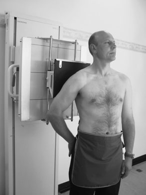
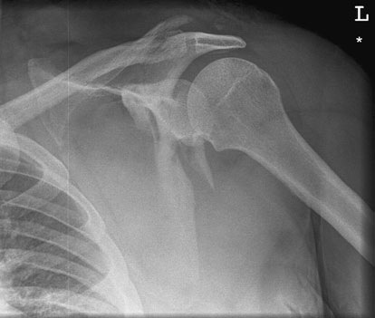
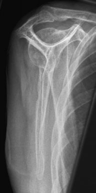
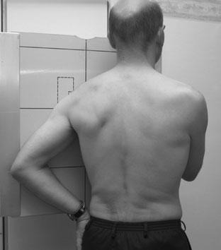
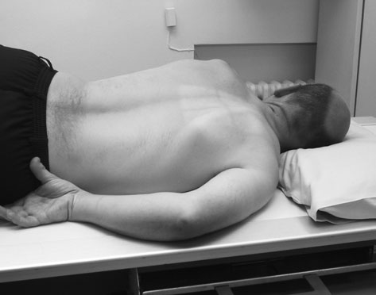
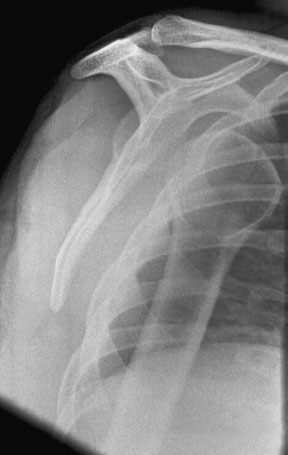

# Rx omoplat (scapulă) anteroposterior (AP) (de bază) - ortostatism

  📷 Radiografie Convențională (Rx)
  <strong>Actualizat:</strong> 2026-09-16
  <strong>Autor:</strong> Departamentul de Radiologie / Referință Clark (Ed. 12)

---

-   __1. Rezumat Clinic & Indicații__

    ---

    === "Indicații Clinice"

        - Aceasta este o lamă osoasă foarte subțire, cu mai multe prelungiri dense suprapuse peste coastele superioare, ceea ce face dificilă evaluarea unei suspiciuni de fractură și a extinderii complete a acesteia. CT poate fi foarte util pentru evaluarea completă, în special datorită posibilității de reconstrucție multiplanară, după detectarea unei suspiciuni de fractură. 102 articulații acromioclaviculare; claviculă; marginea superioară a omoplatului (scapulei); fosa supraspinoasă; vârful procesului coracoid; capul humerusului (dislocat anterior); coaste posterolaterale; diafiza humerusului; corpul acromionului; coloana omoplatului (scapulei); marginea posterioară a glenoidului; vârful inferior al omoplatului (scapulei); suprafața anterioară a omoplatului (scapulei) (fosa subscapulară). Radiografie normală de profil (laterală) a omoplatului (scapulei)

    === "Ghid Național IRIS"

        !!! info "Referință Primară: Ghidul Național IRIS (Ordinul MS 1342/2012)"
            - **Capitol Ghid IRIS:** *Aparat locomotor & Membru superior*
            - **Grad de Recomandare:** **Grad A**
            - **Nivel de Iradiere Estimată:** `Clasa 1 (Minimă < 0.05 mSv)`

            [:octicons-search-16: Deschide Ghidul IRIS](../../iris.md){ .md-button .md-button--primary } [:material-open-in-new: Aplicația Oficială PWA](https://radiologie-pediatrica.ro/iris/){ .md-button target="_blank" rel="noopener" }

-   __2. Poziționare & Centrare Fascicul__

    ---

    - **Poziție Pacient:**
        - Pacientul stă în ortostatism, cu umărul afectat lipit de casetă, și este rotit ușor pentru a aduce planul omoplatului (scapulei) paralel cu caseta.
        - Brațul este ușor în abducție față de corp și rotit medial.
        - Caseta este poziționată astfel încât marginea sa superioară să fie cu cel puțin 5 cm deasupra umărului, pentru a asigura că razele oblice nu proiectează umărul în afara casetei.
        - Pacientul este așezat în decubit ventral pe masa radiologică.
        - Brațul de pe partea examinată este ușor în abducție, iar cotul flectat.
        - Partea sănătoasă (neafectată) este ridicată până când corpul palpabil al omoplatului (scapulei) este perpendicular pe masa de examinare și pe linia mediană a mesei.
    - **Punct de Centrare Fascicul:**
        - Raza orizontală este orientată spre capul humerusului.
        - Raza centrală verticală este orientată imediat medial față de punctul de mijloc al marginii mediale palpabile a omoplatului (scapulei) și spre mijlocul mesei radiologice.
    - **Distanță Focar-Film (DFF / SID):** 100 cm
    - **Comandă Respiratorie:** Apnee pe durata expunerii (apnee în inspir pentru torace; expir pentru Abdomen/bazin).

-   __3. Parametri Tehnici Expunere__

    ---

    | Parametru Tehnic | Valoare Configurare Generator / Tub |
    |:-----------------|:-------------------------------------|
    | **Tensiune Tub (kV)** | DE CONFIGURAT PE APARAT |
    | **Sarcină / Produs Curent-Timp (mAs)** | Conform AEC / grosimii anatomice |
    | **Distanță Focar-Film (DFF / SID)** | 100 cm |
    | **Grilă Antidifuzoare (Bucky)** | Cu grilă antidifuzoare Bucky |
    | **Dimensiune Focar** | Focar Mic (0.6 mm) |
    | **Camere de Ionizare AEC** | Camerele laterale (sau camera centrală, în funcție de regiune) |
    | **Colimare Fascicul** | Colimare strictă adaptată pe receptor 24 x 30 cm |
    | **Filtrare Tub** | Totală ≥ 2.5 mm Al echivalent (conform Clark: 3.0 mm Al echivalent) |

-   __4. Criterii de Calitate & Reușită Imagine__

    ---

    - Întregul omoplat (scapulă) trebuie să fie evidențiat pe imagine.
    - Marginea medială a omoplatului (scapulei) trebuie proiectată clar față de mediastin.
    - Marginea medială a omoplatului (scapulei) trebuie proiectată clar față de coastele (grilajul costal). Tubul radiogen; rază oblică; rază normală; claviculă; coaste (grilaj costal); omoplat (scapulă); humerus; 20°; casetă; săculeți cu nisip; II; I; III; a 3-a; TV. Radiografie anteroposterioară (AP) a omoplatului (scapulei), evidențiind o suspiciune de fractură prin gâtul glenoidului. Diagramă axială care evidențiază relația dintre casetă și fasciculul de raze X față de omoplat (scapulă)
    - Omoplatul (scapula) trebuie să fie evidențiat clar față de coastele (grilajul costal).
    - Marginile medială și laterală trebuie să fie suprapuse.
    - Humerusul trebuie proiectat clar față de aria examinată.
    - Expunerea trebuie să evidențieze adecvat întregul omoplat (scapulă). Profil (lateral) (alternativă)

-   __5. Protecție Radiologică (ALARA)__

    ---

    - Ecranare gonadică cu șorț plumbat dacă gonadele sunt în apropierea fasciculului util (regula ALARA).
    - Colimare precisă la dimensiunea anatomică strict necesară pentru reducerea dozei și a radiației difuze.
    - Verificarea posibilității unei sarcini la pacientele de vârstă fertilă înainte de expunere.

!!! note "Observații Clinice & Tehnice"
    Poate fi aleasă o durată lungă de expunere, iar pacientului i se poate permite să continue să respire liniștit în timpul expunerii, astfel încât imaginile plămânului și coastelor suprapuse să fie estompate în cazurile nontraumatice.

### 🖼️ Imagini

<figure class="protocol-image-card" markdown>

<figcaption><strong>Poate exista și o suspiciune subiacentă de fractură costală.</strong> — Poziționarea pacientului și centrarea fasciculului conform Clark (Ed. 12)</figcaption>

</figure>

<figure class="protocol-image-card" markdown>

<figcaption><strong>Radiografie anteroposterioară (AP) a omoplatului (scapulei), evidențiind o suspiciune de fractură prin</strong> — Aspect radiografic / ghid de poziționare conform tratatului Clark (Ed. 12)</figcaption>

</figure>

<figure class="protocol-image-card" markdown>

<figcaption><strong>coastele superioare suprapuse, ceea ce face dificilă evaluarea unei suspiciuni de fractură și a extinderii complete a acesteia,</strong> — Aspect radiografic / ghid de poziționare conform tratatului Clark (Ed. 12)</figcaption>

</figure>

<figure class="protocol-image-card" markdown>

<figcaption><strong>după detectarea unei suspiciuni de fractură.</strong> — Aspect radiografic / ghid de poziționare conform tratatului Clark (Ed. 12)</figcaption>

</figure>

<figure class="protocol-image-card" markdown>

<figcaption><strong>Radiografie de profil (lateral) normală a</strong> — Aspect radiografic / ghid de poziționare conform tratatului Clark (Ed. 12)</figcaption>

</figure>

<figure class="protocol-image-card" markdown>

<figcaption><strong>Figura 6: Aspect radiografic / Poziționare (Clark Ed. 12)</strong> — Aspect radiografic / ghid de poziționare conform tratatului Clark (Ed. 12)</figcaption>

</figure>

=== "Ghid Rapid de Execuție"

    1. **Identificarea și verificarea pacientului:** verificare identitate, zonă de examinat, consimțământ conform procedurii și evaluarea posibilității unei sarcini, când este relevantă.
    2. **Pregătire:** îndepărtarea oricăror obiecte radiopace (bijuterii, agrafe, fermoare, proteze, pansamente dense).
    3. **Poziționare precisă:** alinierea receptorului de imagine și a tubului la distanța prescrisă (100 cm).
    4. **Colimare strictă:** adaptarea fasciculului strict la regiunea de diagnostic pentru scăderea iradierii și reducerea radiației difuze.
    5. **Radioprotecție:** verificarea [politicii RX](../radioprotectie.md), cu măsuri distincte pentru pacient, personal și însoțitor.

## Surse de documentare

- [Clark's Positioning in Radiography (Ed. 12), Pagina 116](https://books.google.com/books/about/Clark_s_Positioning_in_Radiography.html?id=Xxu6MwEACAAJ)
