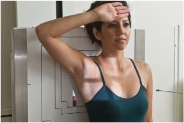
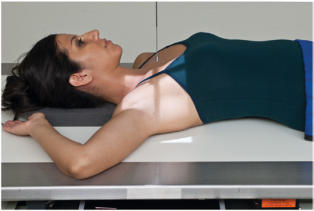
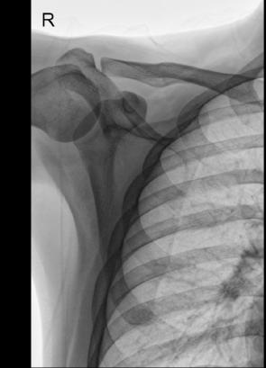

# Rx Omoplat (Scapulă) AP (Antero-Posterior)

  📷 Radiografie Convențională (Rx)
  <strong>Actualizat:</strong> 2026-09-15
  <strong>Autor:</strong> Departamentul de Radiologie / Referință Bontrager

---

-   __1. Rezumat Clinic & Indicații__

    ---

    === "Indicații Clinice"

        - suspiciune de fractură and other pathology of Omoplat (Scapulă)

    === "Ghid Național IRIS"

        !!! info "Referință Primară: Ghidul Național IRIS (Ordinul MS 1342/2012)"
            - **Capitol Ghid IRIS:** *Ghidul Național IRIS*
            - **Grad de Recomandare:** **De verificat pe indicație; fără grad atribuit automat**
            - **Nivel de Iradiere Estimată:** `De verificat pentru examinarea și populația selectate`

            [:octicons-search-16: Deschide Ghidul IRIS](../../iris.md){ .md-button .md-button--primary } [:material-open-in-new: Aplicația Oficială PWA](https://radiologie-pediatrica.ro/iris/){ .md-button target="_blank" rel="noopener" }
-   __2. Poziționare & Centrare Fascicul__

    ---

    - **Poziție Pacient:** Pacient: Perform radiograph with patient in Ortostatism or Decubit Dorsal position. (The Ortostatism position may be more comfortable for the patient.) Posterior surface of Umăr is in direct contact with tabletop or IR without rotation of thorax. (Rotation toward affected side would place the Omoplat (Scapulă) into a truer posterior position, but this also would result in greater superimposition of the rib cage.); Regiune anatomică: Position patient so that midscapular area is centered to CR. Adjust cassette to center to CR. Top of IR should be approximately 2 inches (5 cm) above Umăr, and lateral border of IR should be approximately 2 inches (5 cm) from lateral margin of rib cage. Gently abduct arm 90° and supinate Mână. (Abduction moves Omoplat (Scapulă) laterally to clear more of the thoracic structures (Figs. 5.98 and 5.99).
    - **Punct de Centrare Fascicul:** perpendicular to midscapula, 2 inches (5 cm) inferior to coracoid process, or to level of axilla, and approximately 2 inches (5 cm) medial from lateral border of patient
    - **Distanță Focar-Film (DFF / SID):** 100 cm
    - **Comandă Respiratorie:** orthostatic (breathing) technique is preferred if patient can cooperate. Ask patient to breathe gently without moving affected Umăr or arm. Or suspend respiration if orthostatic technique is not preferred. Omoplat (Scapulă) ROUTINE AP Lateral

-   __3. Parametri Tehnici Expunere__

    ---

    | Parametru Tehnic | Valoare Configurare Generator / Tub |
    |:-----------------|:-------------------------------------|
    | **Tensiune Tub (kV)** | 70-85 kV |
    | **Sarcină / Produs Curent-Timp (mAs)** | DE CONFIGURAT PE APARAT |
    | **Distanță Focar-Film (DFF / SID)** | 100 cm |
    | **Grilă Antidifuzoare (Bucky)** | Cu grilă antidifuzoare Bucky |
    | **Dimensiune Focar** | Focar Mic (0.6 mm) |
    | **Camere de Ionizare AEC** | Camerele laterale (sau camera centrală funcție de regiune) |
    | **Colimare Fascicul** | Field Size Closely collimate on four sides to area of Omoplat (Scapulă). |
    | **Filtrare Tub** | Totală ≥ 2.5 mm Al echivalent |

-   __4. Criterii de Calitate & Reușită Imagine__

    ---

    - Lateral portion of the Omoplat (Scapulă) is free of superimposition.
    - Medial portion of the Omoplat (Scapulă) is seen through the thoracic structures (Figs. 5.100 and 5.101). Position:
    - Affected arm seen to be abducted 90° and Mână supinated, as evidenced by the lateral border of the Omoplat (Scapulă) free of superimposition.
    - Collimation field size to area of interest. Exposure:
    - Optimal image receptor exposure and contrast with no motion demonstrate clear, Contururi osoase și travee trabeculare nete, fără artefacte de mișcare of the lateral portion of the Omoplat (Scapulă).
    - Coaste (Grilaj Costal) and lung structures appear blurred with proper breathing technique. Fig. 5.98 AP Omoplat (Scapulă) Ortostatism. Fig. 5.99 AP Decubit Dorsal. Fig. 5.100 AP Omoplat (Scapulă). (Courtesy Joss Wertz, DO.) Claviculă Coracoid process Lateral border Glenoid cavity Omoplat (Scapulă) Inferior angle Fig. 5.101 AP Omoplat (Scapulă). (Courtesy Joss Wertz, DO.)

-   __5. Protecție Radiologică (ALARA)__

    ---

    - Ecranare gonadică și a organelor radiosensibile conform procedurilor locale de radioprotecție ALARA.
    - Colimare strictă la aria de interes pentru limitarea radiației difuze.
    - Verificarea posibilității unei sarcini la pacientele de vârstă fertilă înainte de expunere.

### 🖼️ Imagini

<figure class="protocol-image-card" markdown>

<figcaption><strong>Fig. 5.98 AP Omoplat (Scapulă) Ortostatism.</strong> — Poziționare pacient conform Ghidului Bontrager (Fig. 5.98 AP scapula erect.)</figcaption>

</figure>

<figure class="protocol-image-card" markdown>

<figcaption><strong>Fig. 5.99 AP Decubit Dorsal.</strong> — Aspect radiografic de referință conform Ghidului Bontrager (Fig. 5.99 AP supine.)</figcaption>

</figure>

<figure class="protocol-image-card" markdown>

<figcaption><strong>Fig. 5.100 AP Omoplat (Scapulă). (Courtesy Joss Wertz, DO.)</strong> — Aspect radiografic de referință conform Ghidului Bontrager (Fig. 5.100 AP scapula. (Courtesy Joss Wertz, DO.))</figcaption>

</figure>

<figure class="protocol-image-card" markdown>

<figcaption><strong>Fig. 5.101 AP Omoplat (Scapulă). (Courtesy Joss Wertz, DO.)</strong> — Aspect radiografic de referință conform Ghidului Bontrager (Fig. 5.101 AP scapula. (Courtesy Joss Wertz, DO.))</figcaption>

</figure>

=== "Ghid Rapid de Execuție"

    1. **Identificarea și verificarea pacientului:** verificare identitate, zonă de examinat, consimțământ conform procedurii și evaluarea posibilității unei sarcini, când este relevantă.
    2. **Pregătire:** îndepărtarea oricăror obiecte radiopace (bijuterii, agrafe, fermoare, proteze, pansamente dense).
    3. **Poziționare precisă:** alinierea receptorului de imagine și a tubului la distanța prescrisă (100 cm).
    4. **Colimare strictă:** adaptarea fasciculului strict la regiunea de diagnostic pentru scăderea iradierii și reducerea radiației difuze.
    5. **Radioprotecție:** verificarea [politicii RX](../radioprotectie.md), cu măsuri distincte pentru pacient, personal și însoțitor.

## Surse de documentare

- [Bontrager's Textbook of Radiographic Positioning (Ed. 9/10), Pagina 220](https://www.elsevier.com/books/textbook-of-radiographic-positioning-and-related-anatomy/lampignano/978-0-323-65367-1)
