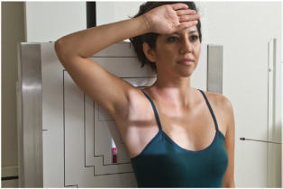
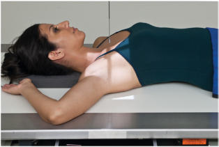
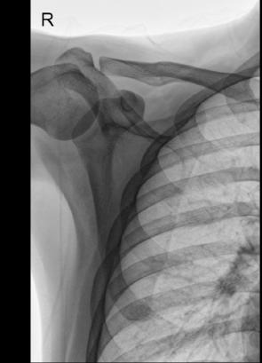

# Rx omoplat AP (antero-posterior)

  📷 Radiografie Convențională (Rx)
  <strong>Actualizat:</strong> 2026-09-15
  <strong>Autor:</strong> Departamentul de Radiologie / Referință Bontrager

---

-   __1. Rezumat Clinic & Indicații__

    ---

    === "Indicații Clinice"

        - suspiciune de fractură și alte patologii ale omoplatului (scapulei)

    === "Ghid Național IRIS"

        !!! info "Referință Primară: Ghidul Național IRIS (Ordinul MS 1342/2012)"
            - **Capitol Ghid IRIS:** *Aparat locomotor & Membru superior*
            - **Grad de Recomandare:** **Grad A**
            - **Nivel de Iradiere Estimată:** `Clasa 1 (Minimă < 0.01 mSv)`

            [:octicons-search-16: Deschide Ghidul IRIS](../../iris.md){ .md-button .md-button--primary } [:material-open-in-new: Aplicația Oficială PWA](https://radiologie-pediatrica.ro/iris/){ .md-button target="_blank" rel="noopener" }

-   __2. Poziționare & Centrare Fascicul__

    ---

    - **Poziție Pacient:** Pacient: Efectuați radiografia cu pacientul în ortostatism sau în decubit dorsal. Poziția în ortostatism poate fi mai confortabilă pentru pacient. Suprafața posterioară a umărului este în contact direct cu masa sau cu receptorul de imagine, fără rotația toracelui. (Rotația spre partea afectată ar plasa omoplatul într-o poziție posterioară mai adevărată, dar aceasta ar determina și o suprapunere mai mare a grilajului costal.); Regiune anatomică: poziționați pacientul astfel încât regiunea medi-scapulară să fie centrată pe raza centrală. Ajustați caseta pentru a fi centrată pe raza centrală. Partea superioară a receptorului de imagine trebuie să fie la aproximativ 2 țoli (5 cm) deasupra umărului, iar marginea laterală a receptorului de imagine trebuie să fie la aproximativ 2 țoli (5 cm) de marginea laterală a grilajului costal. Abduceți ușor brațul la 90° și supinați mâna. (Abducția deplasează omoplatul lateral pentru a elibera mai mult structurile toracice (Figs. 5.98 și 5.99).
    - **Punct de Centrare Fascicul:** perpendicular pe linia medi-scapulară, la 2 țoli (5 cm) inferior de procesul coracoid sau la nivelul axilei și la aproximativ 2 țoli (5 cm) medial de marginea laterală a pacientului
    - **Distanță Focar-Film (DFF / SID):** 100 cm
    - **Comandă Respiratorie:** Tehnica în ortostatism (respirație) este preferată dacă pacientul poate coopera. Cereți pacientului să respire ușor fără să miște umărul sau brațul afectat. Sau apnee pe durata expunerii dacă tehnica în ortostatism nu este preferată. Omoplat (scapulă) AP de rutină profil

-   __3. Parametri Tehnici Expunere__

    ---

    | Parametru Tehnic | Valoare Configurare Generator / Tub |
    |:-----------------|:-------------------------------------|
    | **Tensiune Tub (kV)** | 70-85 kV |
    | **Sarcină / Produs Curent-Timp (mAs)** | DE CONFIGURAT PE APARAT |
    | **Distanță Focar-Film (DFF / SID)** | 100 cm |
    | **Grilă Antidifuzoare (Bucky)** | Cu grilă antidifuzoare Bucky |
    | **Dimensiune Focar** | Focar Mic (0.6 mm) |
    | **Camere de Ionizare AEC** | Camerele laterale (sau camera centrală, în funcție de regiune) |
    | **Colimare Fascicul** | Dimensiunea câmpului: colimați atent pe cele patru laturi la regiunea omoplatului. |
    | **Filtrare Tub** | Totală ≥ 2.5 mm Al echivalent |

-   __4. Criterii de Calitate & Reușită Imagine__

    ---

    - porțiunea laterală a omoplatului este liberă de suprapunere
    - porțiunea medială a omoplatului este vizibilă prin structurile toracice (Figs. 5.100 și 5.101). Poziție:
    - Brațul afectat este vizibil în abducție la 90°, iar mâna în supinație, evidențiate prin marginea laterală a omoplatului, liberă de suprapunere.
    - Dimensiunea câmpului de colimare până la aria de interes diagnostic. Expunere:
    - Expunere optimă a receptorului de imagine și contrastul, fără mișcare, evidențiază contururi osoase și travee trabeculare clare, fără artefacte de mișcare, ale porțiunii laterale a omoplatului.
    - Coastele (grilajul costal) și structurile pulmonare apar estompate prin tehnica corectă de estompare prin respirație superficială (tehnica respirației). Fig. 5.98 AP omoplat în ortostatism. Fig. 5.99 AP în decubit dorsal. Fig. 5.100 AP omoplat. (Cu amabilitatea lui Joss Wertz, DO.) Claviculă proces coracoid margine laterală cavitate glenoidă omoplat unghi inferior Fig. 5.101 AP omoplat. (Cu amabilitatea lui Joss Wertz, DO.)

-   __5. Protecție Radiologică (ALARA)__

    ---

    - Ecranare gonadică și a organelor radiosensibile conform procedurilor locale de radioprotecție ALARA.
    - Colimare strictă la aria de interes pentru limitarea radiației difuze.
    - Verificarea posibilității unei sarcini la pacientele de vârstă fertilă înainte de expunere.

### 🖼️ Imagini

<figure class="protocol-image-card" markdown>

<figcaption><strong>Fig. 5.98 AP omoplat în ortostatism.</strong> — Poziționarea pacientului conform Ghidului Bontrager (Fig. 5.98 AP scapulă în ortostatism.)</figcaption>

</figure>

<figure class="protocol-image-card" markdown>

<figcaption><strong>Fig. 5.99 AP în decubit dorsal.</strong> — Aspect radiografic de referință conform Ghidului Bontrager (Fig. 5.99 AP în decubit dorsal.)</figcaption>

</figure>

<figure class="protocol-image-card" markdown>

<figcaption><strong>Fig. 5.100 AP omoplat. (Cu amabilitatea lui Joss Wertz, DO.)</strong> — Aspect radiografic de referință conform Ghidului Bontrager (Fig. 5.100 AP scapulă. (Cu amabilitatea lui Joss Wertz, DO.))</figcaption>

</figure>

<figure class="protocol-image-card" markdown>

<figcaption><strong>Fig. 5.101 AP omoplat. (Cu amabilitatea lui Joss Wertz, DO.)</strong> — Aspect radiografic de referință conform Ghidului Bontrager (Fig. 5.101 AP scapulă. (Cu amabilitatea lui Joss Wertz, DO.))</figcaption>

</figure>

=== "Ghid Rapid de Execuție"

    1. **Identificarea și verificarea pacientului:** verificare identitate, zonă de examinat, consimțământ conform procedurii și evaluarea posibilității unei sarcini, când este relevantă.
    2. **Pregătire:** îndepărtarea oricăror obiecte radiopace (bijuterii, agrafe, fermoare, proteze, pansamente dense).
    3. **Poziționare precisă:** alinierea receptorului de imagine și a tubului la distanța prescrisă (100 cm).
    4. **Colimare strictă:** adaptarea fasciculului strict la regiunea de diagnostic pentru scăderea iradierii și reducerea radiației difuze.
    5. **Radioprotecție:** verificarea [politicii RX](../radioprotectie.md), cu măsuri distincte pentru pacient, personal și însoțitor.

## Surse de documentare

- [Bontrager's Textbook of Radiographic Positioning (Ed. 9/10), Pagina 220](https://www.elsevier.com/books/textbook-of-radiographic-positioning-and-related-anatomy/lampignano/978-0-323-65367-1)
