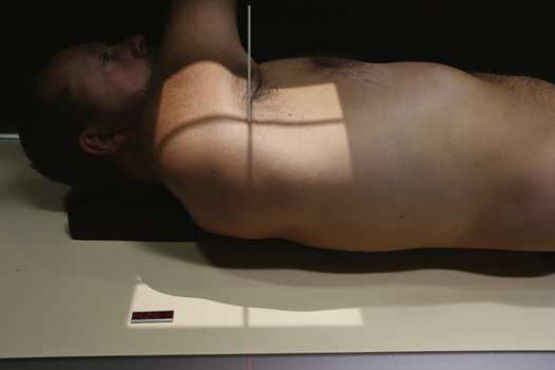
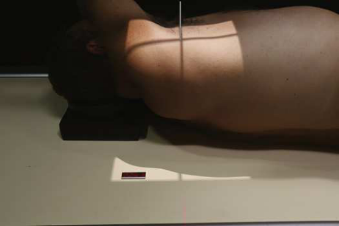
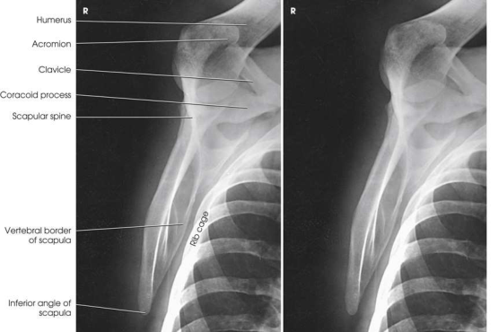
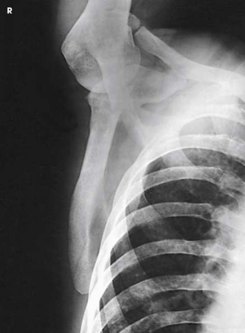

# Rx Omoplat (Scapulă) — Oblică Antero-Posterioară (AP) — RPO or Oblică Posterioară Stângă (OPS / LPO) (Merrill)

  📷 Radiografie Convențională (Rx)
  <strong>Actualizat:</strong> 2026-09-16
  <strong>Autor:</strong> Referință Merrill

---

-   __1. Rezumat Clinic & Indicații__

    ---

    === "Indicații Clinice"

        - Conform reperelor anatomice standard din tratat

    === "Ghid Național IRIS"

        !!! info "Referință Primară: Ghidul Național IRIS (Ordinul MS 1342/2012)"
            - **Capitol Ghid IRIS:** *Ghidul Național IRIS*
            - **Grad de Recomandare:** **De verificat pe indicație; fără grad atribuit automat**
            - **Nivel de Iradiere Estimată:** `De verificat pentru examinarea și populația selectate`

            [:octicons-search-16: Deschide Ghidul IRIS](../../iris.md){ .md-button .md-button--primary } [:material-open-in-new: Aplicația Oficială PWA](https://radiologie-pediatrica.ro/iris/){ .md-button target="_blank" rel="noopener" }
-   __2. Poziționare & Centrare Fascicul__

    ---

    - **Poziție Pacient:** se așază pacientul în Decubit dorsal sau ortostatism. Use ortostatism when Umăr este painful unless contraindicated.; se aliniază corp și se centrează afected Omoplat (Scapulă) la linia mediană grilă. pentru moderate AP Incidență Oblică, Se instruiește pacientul să se extinde braț superiorly, se flectează Cot, și place în supinație Mână under capul, sau Se instruiește pacientul să se extinde afected braț across anterior Torace. Se instruiește pacientul să turn away de la afected side enough la se rotește Umăr 15 la 25 grade (Fig. 6.75). pentru steeper Incidență Oblică, Se instruiește pacientul să se extinde braț, rest flectat Cot pe forehead, și se rotește corp away de la afected side 25 la 35 grade (Fig. 6.76). Grasp lateral și medial margini de Omoplat (Scapulă) între Police și index finger de one Mână și se ajustează rotație de corp la project Omoplat (Scapulă) liber de rib cage. pentru direct Incidență de Profil (lateral) de Omoplat (Scapulă) using this poziție, draw braț across Torace, și se ajustează corp rotație la place Omoplat (Scapulă) perpendicular pe plane de receptorul de imagine ca previously described și vizualizat în Figs. 6.71 through 6.74. se efectuează ecranarea gonadelor cu șorț plumbat.
    - **Punct de Centrare Fascicul:** perpendicular pe lateral margine de rib cage la midscapular area
    - **Distanță Focar-Film (DFF / SID):** Nespecificat în fragmentul extras; de verificat în sursă
    - **Comandă Respiratorie:** apnee (oprirea respirației).

-   __3. Parametri Tehnici Expunere__

    ---

    | Parametru Tehnic | Valoare Configurare Generator / Tub |
    |:-----------------|:-------------------------------------|
    | **Tensiune Tub (kV)** | DE CONFIGURAT PE APARAT |
    | **Sarcină / Produs Curent-Timp (mAs)** | DE CONFIGURAT PE APARAT |
    | **Distanță Focar-Film (DFF / SID)** | Nespecificat în fragmentul extras; de verificat în sursă |
    | **Grilă Antidifuzoare (Bucky)** | DE CONFIGURAT PE APARAT |
    | **Dimensiune Focar** | DE CONFIGURAT PE APARAT |
    | **Camere de Ionizare AEC** | DE CONFIGURAT PE APARAT |
    | **Colimare Fascicul** | Adjust câmp de iradiere la 12 inches (30 cm) în length pe collimator, 1.5 inches (3.8 cm) above Umăr și 1 inch (2.5 cm) beyond lateral shadow. Se plasează markerul de lateralitate în câmpul colimat. |
    | **Filtrare Tub** | DE CONFIGURAT PE APARAT |

-   __4. Criterii de Calitate & Reușită Imagine__

    ---

    - Criterii radiologice de calitate imaginii:
    - Colimare adecvată vizibilă și prezența markerului de lateralitate (D/S) plasat clear de anatomy de interest
    - oblic Omoplat (Scapulă)
    - lateral scapular margine adjacent la Coaste (Grilaj Costal)
    - acromion și inferior angle
    - Bony detalii trabeculare osoase și surrounding soft tissues

-   __5. Protecție Radiologică (ALARA)__

    ---

    - Nespecificat în fragmentul extras; de verificat în sursă

!!! note "Observații Clinice & Tehnice"
    Conform reperelor anatomice standard din tratat

### 🖼️ Imagini

<figure class="protocol-image-card" markdown>

<figcaption><strong>Merrill — pagina PDF 433, imaginea 1</strong> — Imagine din fragmentul sursă; asocierea necesită revizie.</figcaption>

</figure>

<figure class="protocol-image-card" markdown>

<figcaption><strong>Merrill — pagina PDF 433, imaginea 2</strong> — Imagine din fragmentul sursă; asocierea necesită revizie.</figcaption>

</figure>

<figure class="protocol-image-card" markdown>

<figcaption><strong>Merrill — pagina PDF 434, imaginea 3</strong> — Imagine din fragmentul sursă; asocierea necesită revizie.</figcaption>

</figure>

<figure class="protocol-image-card" markdown>

<figcaption><strong>Merrill — pagina PDF 434, imaginea 4</strong> — Imagine din fragmentul sursă; asocierea necesită revizie.</figcaption>

</figure>

=== "Ghid Rapid de Execuție"

    1. **Identificarea și verificarea pacientului:** verificare identitate, zonă de examinat, consimțământ conform procedurii și evaluarea posibilității unei sarcini, când este relevantă.
    2. **Pregătire:** îndepărtarea oricăror obiecte radiopace (bijuterii, agrafe, fermoare, proteze, pansamente dense).
    3. **Poziționare precisă:** alinierea receptorului de imagine și a tubului la distanța prescrisă (Nespecificat în fragmentul extras; de verificat în sursă).
    4. **Colimare strictă:** adaptarea fasciculului strict la regiunea de diagnostic pentru scăderea iradierii și reducerea radiației difuze.
    5. **Radioprotecție:** verificarea [politicii RX](../radioprotectie.md), cu măsuri distincte pentru pacient, personal și însoțitor.

## Surse de documentare

- [Merrill’s Atlas, 6. Shoulder Girdle, pagini PDF 432–435](../../assets/protocols/sources/a56d45c16829_Merrills_Atlas_of_Radiographic_Positioning__Procedures_3Vol_Set.pdf#page=432)

## Fragmente sursă traduse (referință tehnică)

### anatomy

oblic imagine de scapula, projected liber sau nearly liber de rib superimposition (Figs. 6.77 și 6.78).

### collimation

• Adjust câmp de iradiere la 12 inches (30 cm) în length pe collimator, 1.5 inches (3.8 cm) above umăr și 1 inch (2.5 cm) beyond
lateral shadow. Se plasează markerul de lateralitate în câmpul colimat.

### cr

• perpendicular pe lateral margine de rib cage la midscapular area

### criteria

Criterii radiologice de calitate imaginii:
• Colimare adecvată vizibilă și prezența markerului de lateralitate (D/S) plasat clear de anatomy de interest
• oblic scapula
• lateral scapular margine adjacent la coaste
• acromion și inferior angle
• Bony detalii trabeculare osoase și surrounding soft tissues

### part_pos

• se aliniază corp și se centrează afected scapula la linia mediană grilă.
• pentru moderate AP oblic incidență, Se instruiește pacientul să se extinde braț superiorly, se flectează cot, și place în supinație mână under
capul, sau Se instruiește pacientul să se extinde afected braț across anterior chest.
• Se instruiește pacientul să turn away de la afected side enough la se rotește umăr 15 la 25 grade (Fig. 6.75).
• pentru steeper oblic incidență, Se instruiește pacientul să se extinde braț, rest flectat cot pe forehead, și se rotește corp away
de la afected side 25 la 35 grade (Fig. 6.76).
• Grasp lateral și medial margini de scapula între thumb și index finger de one mână și se ajustează rotație de corp la project scapula liber de rib cage.
• pentru direct lateral incidență de scapula using this poziție, draw braț across toracele, și se ajustează corp rotație la place scapula perpendicular pe plane de receptorul de imagine ca previously described și vizualizat în Figs. 6.71 through 6.74.
• se efectuează ecranarea gonadelor cu șorț plumbat.

### patient_pos

• se așază pacientul în decubit dorsal sau ortostatism.
• Use ortostatism when umăr este painful unless contraindicated.

### respiration

apnee (oprirea respirației).

### tech

poziționat prin manufacturer sau department protocol pentru corect anatomy display orientation; raza centrală plate: 10 × 12 inches (24 ×
30 cm) longitudinal.

