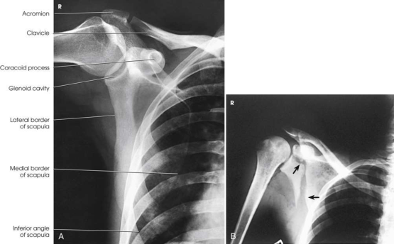

# Rx Omoplat (Scapulă) — Incidență Antero-Posterioară (AP) (Merrill)

  📷 Radiografie Convențională (Rx)
  <strong>Actualizat:</strong> 2026-09-16
  <strong>Autor:</strong> Referință Merrill

---

-   __1. Rezumat Clinic & Indicații__

    ---

    === "Indicații Clinice"

        - Conform reperelor anatomice standard din tratat

    === "Ghid Național IRIS"

        !!! info "Referință Primară: Ghidul Național IRIS (Ordinul MS 1342/2012)"
            - **Capitol Ghid IRIS:** *Ghidul Național IRIS*
            - **Grad de Recomandare:** **De verificat pe indicație; fără grad atribuit automat**
            - **Nivel de Iradiere Estimată:** `De verificat pentru examinarea și populația selectate`

            [:octicons-search-16: Deschide Ghidul IRIS](../../iris.md){ .md-button .md-button--primary } [:material-open-in-new: Aplicația Oficială PWA](https://radiologie-pediatrica.ro/iris/){ .md-button target="_blank" rel="noopener" }
-   __2. Poziționare & Centrare Fascicul__

    ---

    - **Poziție Pacient:** se așază pacientul în ortostatism sau Decubit dorsal poziție. ortostatism este usually more comfortable pentru pacienți.; se ajustează pacient’s corp și se centrează afected Omoplat (Scapulă) la linia mediană grilă. Abduct braț la drept angle cu corp la draw Omoplat (Scapulă) laterally. se flectează Cot și support Mână în comfortable poziție. pentru this incidență, do nu se rotește corp spre afected side because resultant obliquity would ofset efect de drawing Omoplat (Scapulă) laterally (see Fig. 6.69). poziție top de receptorul de imagine 2 inches (5 cm) above top de Umăr. se efectuează ecranarea gonadelor cu șorț plumbat.
    - **Punct de Centrare Fascicul:** perpendicular pe midscapular area la point approximately 2 inches (5 cm) inferior la proces coracoid
    - **Distanță Focar-Film (DFF / SID):** Nespecificat în fragmentul extras; de verificat în sursă
    - **Comandă Respiratorie:** Make this expunere during slow respirație la obliterate lung detail.

-   __3. Parametri Tehnici Expunere__

    ---

    | Parametru Tehnic | Valoare Configurare Generator / Tub |
    |:-----------------|:-------------------------------------|
    | **Tensiune Tub (kV)** | DE CONFIGURAT PE APARAT |
    | **Sarcină / Produs Curent-Timp (mAs)** | DE CONFIGURAT PE APARAT |
    | **Distanță Focar-Film (DFF / SID)** | Nespecificat în fragmentul extras; de verificat în sursă |
    | **Grilă Antidifuzoare (Bucky)** | DE CONFIGURAT PE APARAT |
    | **Dimensiune Focar** | DE CONFIGURAT PE APARAT |
    | **Camere de Ionizare AEC** | DE CONFIGURAT PE APARAT |
    | **Colimare Fascicul** | Se ajustează câmpul de iradiere la formatul 24 × 30 cm pe colimator. Include 1.5 inches (3.8 cm) above Umăr, 2 inches (5 cm) beyond lateral aspect de Umăr, lateral half de Claviculă, și 1 inch (2.5 cm) below inferior angle de Omoplat (Scapulă). Se plasează markerul de lateralitate în câmpul colimat. |
    | **Filtrare Tub** | DE CONFIGURAT PE APARAT |

-   __4. Criterii de Calitate & Reușită Imagine__

    ---

    - Criterii radiologice de calitate imaginii:
    - Colimare adecvată vizibilă și prezența markerului de lateralitate (D/S) plasat clear de anatomy de interest
    - lateral portion de Omoplat (Scapulă) liber de superimposition de la Coaste (Grilaj Costal)
    - Omoplat (Scapulă) orizontal și nu slanted
    - Scapular detail through superimposed lung și Coaste (Grilaj Costal) (shallow respirație trebuie să help la obliterate lung detail)
    - acromion și inferior angle
    - Bony detalii trabeculare osoase și surrounding soft tissues

-   __5. Protecție Radiologică (ALARA)__

    ---

    - Nespecificat în fragmentul extras; de verificat în sursă

!!! note "Observații Clinice & Tehnice"
    Conform reperelor anatomice standard din tratat

### 🖼️ Imagini

<figure class="protocol-image-card" markdown>

<figcaption><strong>Merrill — pagina PDF 426, imaginea 1</strong> — Imagine din fragmentul sursă; asocierea necesită revizie.</figcaption>

</figure>

=== "Ghid Rapid de Execuție"

    1. **Identificarea și verificarea pacientului:** verificare identitate, zonă de examinat, consimțământ conform procedurii și evaluarea posibilității unei sarcini, când este relevantă.
    2. **Pregătire:** îndepărtarea oricăror obiecte radiopace (bijuterii, agrafe, fermoare, proteze, pansamente dense).
    3. **Poziționare precisă:** alinierea receptorului de imagine și a tubului la distanța prescrisă (Nespecificat în fragmentul extras; de verificat în sursă).
    4. **Colimare strictă:** adaptarea fasciculului strict la regiunea de diagnostic pentru scăderea iradierii și reducerea radiației difuze.
    5. **Radioprotecție:** verificarea [politicii RX](../radioprotectie.md), cu măsuri distincte pentru pacient, personal și însoțitor.

## Surse de documentare

- [Merrill’s Atlas, 6. Shoulder Girdle, pagini PDF 425–426](../../assets/protocols/sources/a56d45c16829_Merrills_Atlas_of_Radiographic_Positioning__Procedures_3Vol_Set.pdf#page=425)

## Fragmente sursă traduse (referință tehnică)

### anatomy

AP incidență de scapula (Fig. 6.70).

### collimation

• Se ajustează câmpul de iradiere la formatul 24 × 30 cm pe colimator. Include 1.5 inches (3.8 cm) above umăr, 2 inches (5 cm)
beyond lateral aspect de umăr, lateral half de clavicle, și 1 inch (2.5 cm) below inferior angle de scapula.
Se plasează markerul de lateralitate în câmpul colimat.

### cr

• perpendicular pe midscapular area la point approximately 2 inches (5 cm) inferior la proces coracoid

### criteria

Criterii radiologice de calitate imaginii:
• Colimare adecvată vizibilă și prezența markerului de lateralitate (D/S) plasat clear de anatomy de interest
• lateral portion de scapula liber de superimposition de la coaste
• Scapula orizontal și nu slanted
• Scapular detail through superimposed lung și coaste (shallow respirație trebuie să help la obliterate lung detail)
• acromion și inferior angle
• Bony detalii trabeculare osoase și surrounding soft tissues

### part_pos

• se ajustează pacient’s corp și se centrează afected scapula la linia mediană grilă.
• Abduct braț la drept angle cu corp la draw scapula laterally. se flectează cot și support mână în comfortable
poziție.
• pentru this incidență, do nu se rotește corp spre afected side because resultant obliquity would ofset efect de drawing
scapula laterally (see Fig. 6.69).
• poziție top de receptorul de imagine 2 inches (5 cm) above top de umăr.
• se efectuează ecranarea gonadelor cu șorț plumbat.

### patient_pos

• se așază pacientul în ortostatism sau decubit dorsal. ortostatism este usually more comfortable pentru pacienți.

### respiration

Make this expunere during slow respirație la obliterate lung detail.

### tech

poziționat prin manufacturer sau department protocol pentru corect anatomy display orientation; raza centrală plate: 10 × 12 inches (24 ×
30 cm) longitudinal.

