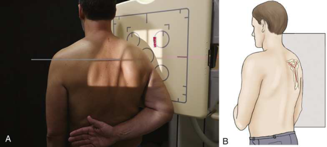
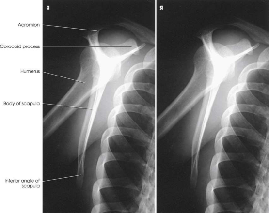
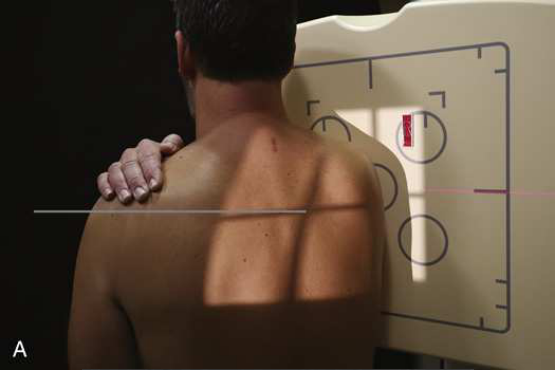
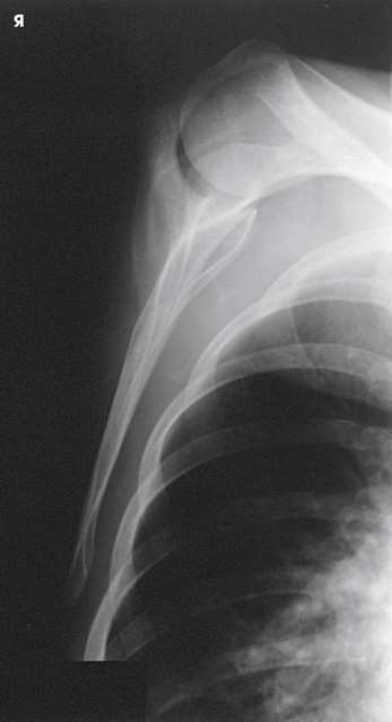
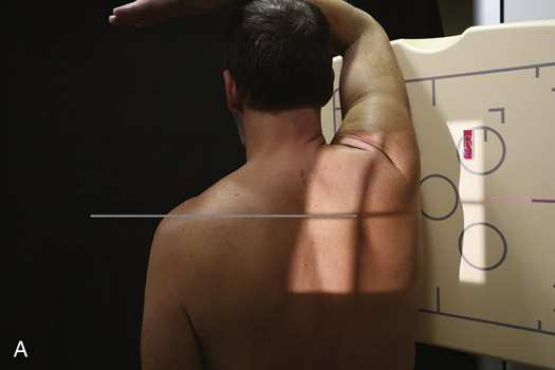
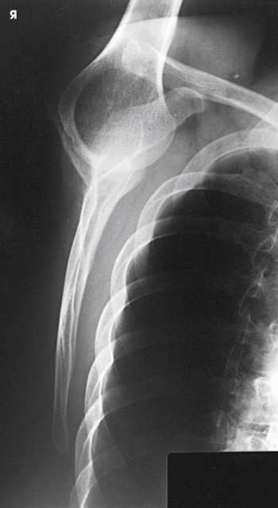

# Rx Omoplat (Scapulă) — Incidență de Profil (Lateral) — RAO or LAO body Poziționare (Merrill)

  📷 Radiografie Convențională (Rx)
  <strong>Actualizat:</strong> 2026-09-16
  <strong>Autor:</strong> Referință Merrill

---

-   __1. Rezumat Clinic & Indicații__

    ---

    === "Indicații Clinice"

        - Conform reperelor anatomice standard din tratat

    === "Ghid Național IRIS"

        !!! info "Referință Primară: Ghidul Național IRIS (Ordinul MS 1342/2012)"
            - **Capitol Ghid IRIS:** *Ghidul Național IRIS*
            - **Grad de Recomandare:** **De verificat pe indicație; fără grad atribuit automat**
            - **Nivel de Iradiere Estimată:** `De verificat pentru examinarea și populația selectate`

            [:octicons-search-16: Deschide Ghidul IRIS](../../iris.md){ .md-button .md-button--primary } [:material-open-in-new: Aplicația Oficială PWA](https://radiologie-pediatrica.ro/iris/){ .md-button target="_blank" rel="noopener" }
-   __2. Poziționare & Centrare Fascicul__

    ---

    - **Poziție Pacient:** se așază pacientul în ortostatism, în ortostatism sau Poziție Șezândă, facing stativ vertical Bucky. Decubit ventral poziție poate fie used, but incidență este more dificult la perform.; se ajustează pacient în RAO sau poziție oblică anterioară stângă (OAS / LAO), cu afected Omoplat (Scapulă) centrat pe grila. average pacient requires a 45- la 60- grade rotație de la plane de receptorul de imagine. According la Johnston et al., 1 corect pacient rotație este accomplished prin orienting plane through superior angle de Omoplat (Scapulă) și acromial tip, perpendicular pe receptorul de imagine (RI). poziție de braț depends pe area de Omoplat (Scapulă) la fie vizualizat. pentru delineation de acromion și proces coracoid de Omoplat (Scapulă), Se instruiește pacientul să se flectează Cot și place back de Mână pe posterior thorax la level suficient la prevent Humerus de la overlapping Omoplat (Scapulă) (Figs. 6.71 și 6.72). Mazujian 17 suСested that pacientul place braț across upper Torace prin grasping opposite Umăr, ca vizualizat în Fig. 6.73. la show corp de Omoplat (Scapulă), Se instruiește pacientul să se extinde braț upward și rest Antebraț pe capul (Fig. 6.74) sau alternatively across upper Torace prin grasping opposite Umăr (see Fig. 6.73). After placing braț în orice de these poziții, grasp lateral și medial margini de Omoplat (Scapulă) între Police și index finger de one Mână. Make final adjustment de corp rotație, placing corp de Omoplat (Scapulă) perpendicular pe plane de receptorul de imagine. se efectuează ecranarea gonadelor cu șorț plumbat.
    - **Punct de Centrare Fascicul:** perpendicular pe midmedial margine de protruding Omoplat (Scapulă) (see Table 6.3)
    - **Distanță Focar-Film (DFF / SID):** Nespecificat în fragmentul extras; de verificat în sursă
    - **Comandă Respiratorie:** apnee (oprirea respirației).

-   __3. Parametri Tehnici Expunere__

    ---

    | Parametru Tehnic | Valoare Configurare Generator / Tub |
    |:-----------------|:-------------------------------------|
    | **Tensiune Tub (kV)** | DE CONFIGURAT PE APARAT |
    | **Sarcină / Produs Curent-Timp (mAs)** | DE CONFIGURAT PE APARAT |
    | **Distanță Focar-Film (DFF / SID)** | Nespecificat în fragmentul extras; de verificat în sursă |
    | **Grilă Antidifuzoare (Bucky)** | DE CONFIGURAT PE APARAT |
    | **Dimensiune Focar** | DE CONFIGURAT PE APARAT |
    | **Camere de Ionizare AEC** | DE CONFIGURAT PE APARAT |
    | **Colimare Fascicul** | Adjust câmp de iradiere la 12 inches (30 cm) în length pe collimator, 1.5 inches (3.8 cm) above Umăr, și 1 inch (2.5 cm) beyond lateral shadow. Se plasează markerul de lateralitate în câmpul colimat. Compensating Filter Use de specially designed compensating filter pentru Umăr, called boomerang, improves quality de imagine because de large amount de primary fascicul radiation striking receptorul de imagine. |
    | **Filtrare Tub** | DE CONFIGURAT PE APARAT |

-   __4. Criterii de Calitate & Reușită Imagine__

    ---

    - Criterii radiologice de calitate imaginii:
    - Colimare adecvată vizibilă și prezența markerului de lateralitate (D/S) plasat clear de anatomy de interest
    - lateral și medial scapular margini superimposed
    - fără superimposition de scapular corp pe Coaste (Grilaj Costal)
    - fără superimposition de Humerus pe aria de interes diagnostic
    - Inclusion de acromion și inferior angle
    - Bony detalii trabeculare osoase și surrounding soft tissues

-   __5. Protecție Radiologică (ALARA)__

    ---

    - Nespecificat în fragmentul extras; de verificat în sursă

!!! note "Observații Clinice & Tehnice"
    pentru Traumatism / Regim Urgență pacienți, this incidență poate fie performed using LPO sau poziție oblică posterioară dreaptă (OPD / RPO) (see Chapter 12 în Volume 2).

### 🖼️ Imagini

<figure class="protocol-image-card" markdown>

<figcaption><strong>Merrill — pagina PDF 427, imaginea 1</strong> — Imagine din fragmentul sursă; asocierea necesită revizie.</figcaption>

</figure>

<figure class="protocol-image-card" markdown>

<figcaption><strong>Merrill — pagina PDF 428, imaginea 2</strong> — Imagine din fragmentul sursă; asocierea necesită revizie.</figcaption>

</figure>

<figure class="protocol-image-card" markdown>

<figcaption><strong>Merrill — pagina PDF 429, imaginea 3</strong> — Imagine din fragmentul sursă; asocierea necesită revizie.</figcaption>

</figure>

<figure class="protocol-image-card" markdown>

<figcaption><strong>Merrill — pagina PDF 429, imaginea 4</strong> — Imagine din fragmentul sursă; asocierea necesită revizie.</figcaption>

</figure>

<figure class="protocol-image-card" markdown>

<figcaption><strong>Merrill — pagina PDF 431, imaginea 5</strong> — Imagine din fragmentul sursă; asocierea necesită revizie.</figcaption>

</figure>

<figure class="protocol-image-card" markdown>

<figcaption><strong>Merrill — pagina PDF 431, imaginea 6</strong> — Imagine din fragmentul sursă; asocierea necesită revizie.</figcaption>

</figure>

=== "Ghid Rapid de Execuție"

    1. **Identificarea și verificarea pacientului:** verificare identitate, zonă de examinat, consimțământ conform procedurii și evaluarea posibilității unei sarcini, când este relevantă.
    2. **Pregătire:** îndepărtarea oricăror obiecte radiopace (bijuterii, agrafe, fermoare, proteze, pansamente dense).
    3. **Poziționare precisă:** alinierea receptorului de imagine și a tubului la distanța prescrisă (Nespecificat în fragmentul extras; de verificat în sursă).
    4. **Colimare strictă:** adaptarea fasciculului strict la regiunea de diagnostic pentru scăderea iradierii și reducerea radiației difuze.
    5. **Radioprotecție:** verificarea [politicii RX](../radioprotectie.md), cu măsuri distincte pentru pacient, personal și însoțitor.

## Surse de documentare

- [Merrill’s Atlas, 6. Shoulder Girdle, pagini PDF 426–431](../../assets/protocols/sources/a56d45c16829_Merrills_Atlas_of_Radiographic_Positioning__Procedures_3Vol_Set.pdf#page=426)

## Fragmente sursă traduse (referință tehnică)

### anatomy

lateral imagine de scapula. placement de braț determines portion de superior scapula that este superimposed over humerus.

### collimation

• Adjust câmp de iradiere la 12 inches (30 cm) în length pe collimator, 1.5 inches (3.8 cm) above umăr, și 1 inch (2.5 cm) beyond
lateral shadow. Se plasează markerul de lateralitate în câmpul colimat.
Compensating Filter
Use de specially designed compensating filter pentru umăr, called boomerang, improves quality de imagine because de large
amount de primary fascicul radiation striking receptorul de imagine.

### cr

• perpendicular pe midmedial margine de protruding scapula (see Table 6.3)

### criteria

Criterii radiologice de calitate imaginii:
• Colimare adecvată vizibilă și prezența markerului de lateralitate (D/S) plasat clear de anatomy de interest
• lateral și medial scapular margini superimposed
• fără superimposition de scapular corp pe coaste
• fără superimposition de humerus pe aria de interes diagnostic
• Inclusion de acromion și inferior angle
• Bony detalii trabeculare osoase și surrounding soft tissues

### notes

pentru trauma pacienți, this incidență poate fie performed using LPO sau poziție oblică posterioară dreaptă (OPD / RPO) (see Chapter 12 în Volume 2).

### part_pos

• se ajustează pacient în RAO sau poziție oblică anterioară stângă (OAS / LAO), cu afected scapula centrat pe grila. average pacient requires a 45- la 60-
grade rotație de la plane de receptorul de imagine. According la Johnston et al., 1 corect pacient rotație este accomplished prin orienting plane through superior angle de scapula și acromial tip, perpendicular pe receptorul de imagine (RI).
• poziție de braț depends pe area de scapula la fie vizualizat.
• pentru delineation de acromion și proces coracoid de scapula, Se instruiește pacientul să se flectează cot și place back de mână pe posterior thorax la level suficient la prevent humerus de la overlapping scapula (Figs. 6.71 și 6.72).
Mazujian 17 suСested that pacientul place braț across upper chest prin grasping opposite umăr, ca vizualizat în Fig.
6.73.
• la show corp de scapula, Se instruiește pacientul să se extinde braț upward și rest forearm pe capul (Fig. 6.74) sau
alternatively across upper chest prin grasping opposite umăr (see Fig. 6.73).
• After placing braț în orice de these poziții, grasp lateral și medial margini de scapula între thumb și index finger
de one mână. Make final adjustment de corp rotație, placing corp de scapula perpendicular pe plane de receptorul de imagine.
• se efectuează ecranarea gonadelor cu șorț plumbat.

### patient_pos

• se așază pacientul în ortostatism, în ortostatism sau așezat pe scaun, facing stativ vertical Bucky.
• decubit ventral poate fie used, but incidență este more dificult la perform.

### respiration

apnee (oprirea respirației).

### tech

poziționat prin manufacturer sau department protocol pentru corect anatomy display orientation; raza centrală plate: 10 × 12 inches (24 ×
30 cm) longitudinal.

