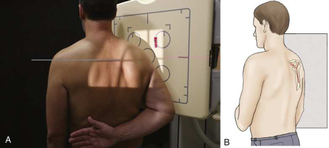
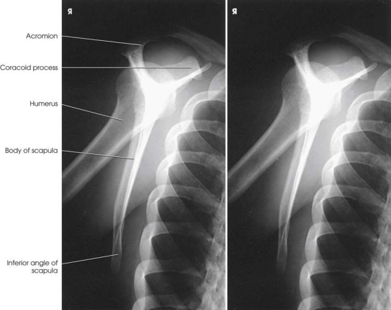
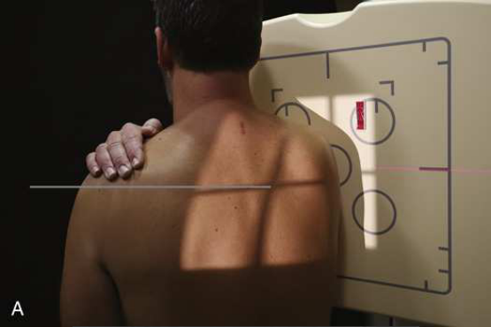
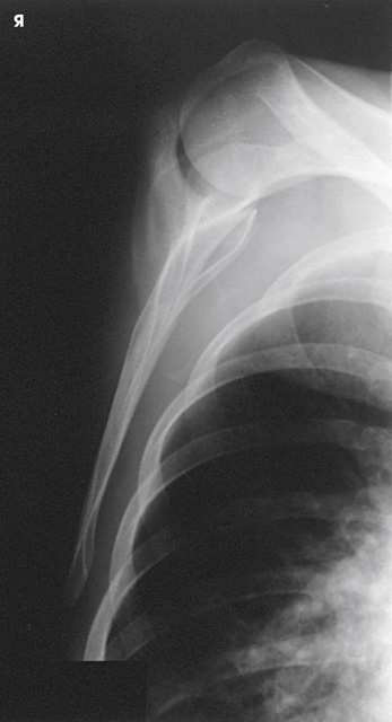
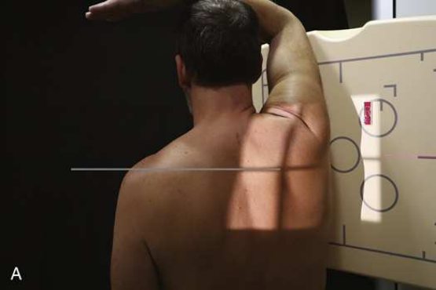
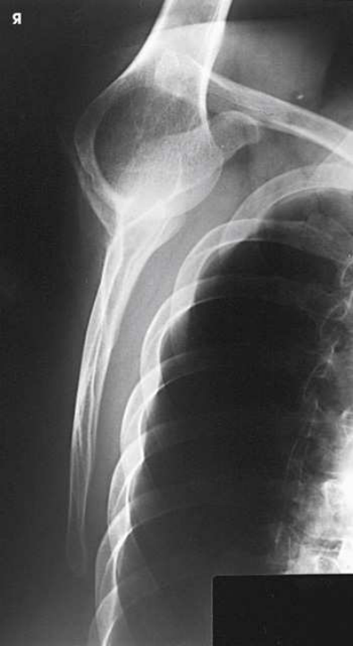

# Rx omoplat (scapulă) — incidență de profil (lateral) — poziționarea corpului în RAO sau LAO (Merrill)

  📷 Radiografie Convențională (Rx)
  <strong>Actualizat:</strong> 2026-09-16
  <strong>Autor:</strong> Referință Merrill

---

-   __1. Rezumat Clinic & Indicații__

    ---

    === "Indicații Clinice"

        - Conform reperelor anatomice standard din tratat

    === "Ghid Național IRIS"

        !!! info "Referință Primară: Ghidul Național IRIS (Ordinul MS 1342/2012)"
            - **Capitol Ghid IRIS:** *Aparat locomotor & Membru superior*
            - **Grad de Recomandare:** **Grad A**
            - **Nivel de Iradiere Estimată:** `Clasa 1 (Minimă < 0.05 mSv)`

            [:octicons-search-16: Deschide Ghidul IRIS](../../iris.md){ .md-button .md-button--primary } [:material-open-in-new: Aplicația Oficială PWA](https://radiologie-pediatrica.ro/iris/){ .md-button target="_blank" rel="noopener" }

-   __2. Poziționare & Centrare Fascicul__

    ---

    - **Poziție Pacient:** Se poziționează pacientul în ortostatism sau în poziție șezândă, cu fața spre stativul vertical Bucky. Se poate utiliza poziția în decubit ventral, dar efectuarea incidenței este mai dificilă; se ajustează pacientul în RAO sau în poziție oblică anterioară stângă (OAS / LAO), cu omoplatul afectat centrat pe grilă. Pacientul mediu necesită o rotație de 45 la 60 grade față de planul receptorului de imagine. Conform Johnston et al. (1), rotația corectă a pacientului se obține orientând planul care trece prin unghiul superior al omoplatului și vârful acromionului perpendicular pe receptorul de imagine (RI). Poziția brațului depinde de regiunea omoplatului care trebuie vizualizată. Pentru evidențierea acromionului și a procesului coracoid al omoplatului, pacientul este instruit să flecteze cotul și să așeze dosul mâinii pe toracele posterior, la un nivel suficient pentru a preveni suprapunerea humerusului peste omoplat (Fig. 6.71 și 6.72). Mazujian 17 a sugerat ca pacientul să ducă brațul peste toracele superior, apucând umărul opus, așa cum se vede în Fig. 6.73. Pentru a evidenția corpul omoplatului, pacientul este instruit să extindă brațul în sus și să sprijine antebrațul pe cap (Fig. 6.74) sau, alternativ, peste toracele superior, apucând umărul opus (vezi Fig. 6.73). După plasarea brațului în oricare dintre aceste poziții, se prind marginile laterală și medială ale omoplatului între policele și degetul arătător al unei mâini. Se face ajustarea finală a rotației corpului, poziționând corpul omoplatului perpendicular pe planul receptorului de imagine. Se efectuează ecranarea gonadelor cu șorț plumbat.
    - **Punct de Centrare Fascicul:** perpendicular pe marginea mediomedială a omoplatului proeminent (vezi Tabelul 6.3)
    - **Distanță Focar-Film (DFF / SID):** Nespecificat în fragmentul extras; de verificat în sursă
    - **Comandă Respiratorie:** apnee (oprirea respirației).

-   __3. Parametri Tehnici Expunere__

    ---

    | Parametru Tehnic | Valoare Configurare Generator / Tub |
    |:-----------------|:-------------------------------------|
    | **Tensiune Tub (kV)** | DE CONFIGURAT PE APARAT |
    | **Sarcină / Produs Curent-Timp (mAs)** | DE CONFIGURAT PE APARAT |
    | **Distanță Focar-Film (DFF / SID)** | Nespecificat în fragmentul extras; de verificat în sursă |
    | **Grilă Antidifuzoare (Bucky)** | DE CONFIGURAT PE APARAT |
    | **Dimensiune Focar** | DE CONFIGURAT PE APARAT |
    | **Camere de Ionizare AEC** | DE CONFIGURAT PE APARAT |
    | **Colimare Fascicul** | Se ajustează câmpul de iradiere la 12 țoli (30 cm) în lungime pe colimator, la 1.5 țoli (3.8 cm) deasupra umărului și la 1 țol (2.5 cm) dincolo de marginea laterală. Se plasează markerul de lateralitate în câmpul colimat. Utilizarea filtrului compensator: utilizarea unui filtru compensator special conceput pentru umăr, numit boomerang, îmbunătățește calitatea imaginii datorită cantității mari de radiație din fasciculul primar care lovește receptorul de imagine. |
    | **Filtrare Tub** | DE CONFIGURAT PE APARAT |

-   __4. Criterii de Calitate & Reușită Imagine__

    ---

    - Criterii radiologice de calitate a imaginii:
    - Colimare adecvată vizibilă și prezența markerului de lateralitate (D/S) plasat în afara structurilor anatomice de interes
    - marginile scapulare laterală și medială suprapuse
    - fără suprapunerea corpului scapulei peste coaste (grilajul costal)
    - fără suprapunerea humerusului peste regiunea de interes diagnostic
    - includerea acromionului și a unghiului inferior
    - Detalii trabeculare osoase și țesuturile moi înconjurătoare

-   __5. Protecție Radiologică (ALARA)__

    ---

    - Nespecificat în fragmentul extras; de verificat în sursă

!!! note "Observații Clinice & Tehnice"
    Pentru pacienții cu traumatism / în regim de urgență, această incidență poate fi efectuată folosind poziția LPO sau oblică posterioară dreaptă (OPD / RPO) (vezi Capitolul 12 din Volumul 2).

### 🖼️ Imagini

<figure class="protocol-image-card" markdown>

<figcaption><strong>Merrill — pagina 427, imaginea 1</strong> — Imagine din fragmentul sursă; asocierea necesită revizie.</figcaption>

</figure>

<figure class="protocol-image-card" markdown>

<figcaption><strong>Merrill — pagina 428, imaginea 2</strong> — Imagine din fragmentul sursă; asocierea necesită revizie.</figcaption>

</figure>

<figure class="protocol-image-card" markdown>

<figcaption><strong>Merrill — pagina 429, imaginea 3</strong> — Imagine din fragmentul sursă; asocierea necesită revizie.</figcaption>

</figure>

<figure class="protocol-image-card" markdown>

<figcaption><strong>Merrill — pagina 429, imaginea 4</strong> — Imagine din fragmentul sursă; asocierea necesită revizie.</figcaption>

</figure>

<figure class="protocol-image-card" markdown>

<figcaption><strong>Merrill — pagina 431, imaginea 5</strong> — Imagine din fragmentul sursă; asocierea necesită revizie.</figcaption>

</figure>

<figure class="protocol-image-card" markdown>

<figcaption><strong>Merrill — pagina 431, imaginea 6</strong> — Imagine din fragmentul sursă; asocierea necesită revizie.</figcaption>

</figure>

=== "Ghid Rapid de Execuție"

    1. **Identificarea și verificarea pacientului:** verificare identitate, zonă de examinat, consimțământ conform procedurii și evaluarea posibilității unei sarcini, când este relevantă.
    2. **Pregătire:** îndepărtarea oricăror obiecte radiopace (bijuterii, agrafe, fermoare, proteze, pansamente dense).
    3. **Poziționare precisă:** alinierea receptorului de imagine și a tubului la distanța prescrisă (Nespecificat în fragmentul extras; de verificat în sursă).
    4. **Colimare strictă:** adaptarea fasciculului strict la regiunea de diagnostic pentru scăderea iradierii și reducerea radiației difuze.
    5. **Radioprotecție:** verificarea [politicii RX](../radioprotectie.md), cu măsuri distincte pentru pacient, personal și însoțitor.

## Surse de documentare

- [Merrill’s Atlas, 6. Shoulder Girdle, pagini 426–431](https://books.google.com/books/about/Merrill_s_Atlas_of_Radiographic_Position.html?id=BM0lEQAAQBAJ)
