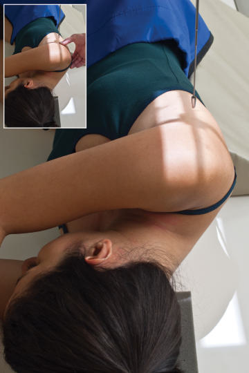
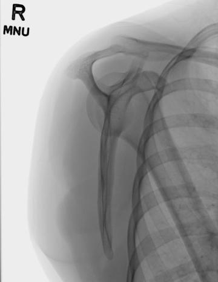

# Rx omoplat (scapulă) — profil (lateral) — pacient în decubit

  📷 Radiografie Convențională (Rx)
  <strong>Actualizat:</strong> 2026-09-15
  <strong>Autor:</strong> Departamentul de Radiologie / Referință Bontrager

---

-   __1. Rezumat Clinic & Indicații__

    ---

    === "Indicații Clinice"

        - Suspiciune de fractură a omoplatului (scapulei)

    === "Ghid Național IRIS"

        !!! info "Referință Primară: Ghidul Național IRIS (Ordinul MS 1342/2012)"
            - **Capitol Ghid IRIS:** *Aparat locomotor & Membru superior*
            - **Grad de Recomandare:** **Grad A**
            - **Nivel de Iradiere Estimată:** `Clasa 1 (Minimă < 0.05 mSv)`

            [:octicons-search-16: Deschide Ghidul IRIS](../../iris.md){ .md-button .md-button--primary } [:material-open-in-new: Aplicația Oficială PWA](https://radiologie-pediatrica.ro/iris/){ .md-button target="_blank" rel="noopener" }

-   __2. Poziționare & Centrare Fascicul__

    ---

    - **Poziție Pacient:** Pacient: Se efectuează radiografia cu pacientul în decubit dorsal și se plasează brațul afectat peste torace. Se palpează articulația acromioclaviculară și marginea superioară a omoplatului (scapulei) și se rotește pacientul până când linia imaginară dintre aceste două puncte este perpendiculară pe receptorul de imagine (RI); astfel se ridică umărul afectat până când corpul omoplatului (scapulei) se află în adevărata incidență de profil (lateral). Se flectează genunchiul de partea afectată pentru a ajuta pacientul să mențină această poziție oblică a corpului.; Regiune anatomică: Se aliniază pacientul pe masa de examinare astfel încât centrul marginii midlaterale (axilare) a omoplatului (scapulei) să fie centrat pe raza centrală și pe receptorul de imagine (Fig. 5.106). Se palpează marginile omoplatului (scapulei), prin apucarea marginilor medială și laterală ale corpului omoplatului (scapulei) cu degetele și policele mâinii (vezi Fig. 5.106, imaginea inserată). Se ajustează cu atenție rotația corpului, după cum este necesar, pentru a aduce planul corpului scapular perpendicular pe receptorul de imagine (RI).
    - **Punct de Centrare Fascicul:** La marginea laterală a mijlocului scapulei
    - **Distanță Focar-Film (DFF / SID):** 100 cm
    - **Comandă Respiratorie:** Apnee pe durata expunerii. Omoplat (scapulă), de rutină, AP lateral. Fig. 5.106 Poziția în decubit lateral pentru omoplat (scapulă). Imaginea inserată prezintă palparea marginilor omoplatului (scapulei).

-   __3. Parametri Tehnici Expunere__

    ---

    | Parametru Tehnic | Valoare Configurare Generator / Tub |
    |:-----------------|:-------------------------------------|
    | **Tensiune Tub (kV)** | 70-85 kV |
    | **Sarcină / Produs Curent-Timp (mAs)** | DE CONFIGURAT PE APARAT |
    | **Distanță Focar-Film (DFF / SID)** | 100 cm |
    | **Grilă Antidifuzoare (Bucky)** | Cu grilă antidifuzoare Bucky |
    | **Dimensiune Focar** | Focar Mic (0.6 mm) |
    | **Camere de Ionizare AEC** | Camerele laterale (sau camera centrală, în funcție de regiune) |
    | **Colimare Fascicul** | Dimensiunea câmpului: se efectuează colimarea strânsă la aria omoplatului (scapulei). |
    | **Filtrare Tub** | Totală ≥ 2.5 mm Al echivalent |

-   __4. Criterii de Calitate & Reușită Imagine__

    ---

    - Întregul omoplat (scapulă) trebuie vizualizat în incidență de profil (lateral). Poziție:
    - Profilul adevărat este vizualizat prin suprapunerea directă a marginilor vertebrală și laterală (Fig. 5.107).
    - Corpul omoplatului (scapulei) trebuie văzut de profil, liber de suprapunerea coastelor (grilajului costal).
    - Pe cât posibil, humerusul nu trebuie să se suprapună peste aria de interes diagnostic a omoplatului (scapulei).
    - Dimensiunea câmpului de colimare până la aria de interes diagnostic. Expunere:
    - Expunerea optimă, fără mișcare, evidențiază clar marginile osoase și desenul trabecular.
    - Întregul omoplat (scapulă) trebuie vizualizat fără scăderea calității imaginii în regiunea unghiului inferior.
    - Marginile osoase ale acromionului și procesului coracoid trebuie să fie vizibile prin capul humerusului. Fig. 5.107 Omoplat (scapulă) lateral în ortostatism. (Cu amabilitatea lui Joss Wertz, DO.)

-   __5. Protecție Radiologică (ALARA)__

    ---

    - Ecranare gonadică și a organelor radiosensibile conform procedurilor locale de radioprotecție ALARA.
    - Colimare strictă la aria de interes pentru limitarea radiației difuze.
    - Verificarea posibilității unei sarcini la pacientele de vârstă fertilă înainte de expunere.

!!! note "Observații Clinice & Tehnice"
    Această poziție determină o imagine mărită din cauza creșterii OID.

### 🖼️ Imagini

<figure class="protocol-image-card" markdown>

<figcaption><strong>Fig. 5.106 Poziția omoplatului (scapulei) în decubit lateral. Imaginea inserată prezintă palparea</strong> — Poziționarea pacientului conform Ghidului Bontrager (Fig. 5.106 Poziția omoplatului în decubit lateral. Imaginea inserată prezintă palparea)</figcaption>

</figure>

<figure class="protocol-image-card" markdown>

<figcaption><strong>Fig. 5.107 Omoplat (scapulă) lateral în ortostatism. (Cu amabilitatea lui Joss Wertz, DO.)</strong> — Aspect radiografic de referință conform Ghidului Bontrager (Fig. 5.107 omoplat în incidență laterală în ortostatism. (Cu amabilitatea lui Joss Wertz, DO.))</figcaption>

</figure>

=== "Ghid Rapid de Execuție"

    1. **Identificarea și verificarea pacientului:** verificare identitate, zonă de examinat, consimțământ conform procedurii și evaluarea posibilității unei sarcini, când este relevantă.
    2. **Pregătire:** îndepărtarea oricăror obiecte radiopace (bijuterii, agrafe, fermoare, proteze, pansamente dense).
    3. **Poziționare precisă:** alinierea receptorului de imagine și a tubului la distanța prescrisă (100 cm).
    4. **Colimare strictă:** adaptarea fasciculului strict la regiunea de diagnostic pentru scăderea iradierii și reducerea radiației difuze.
    5. **Radioprotecție:** verificarea [politicii RX](../radioprotectie.md), cu măsuri distincte pentru pacient, personal și însoțitor.

## Surse de documentare

- [Bontrager's Textbook of Radiographic Positioning (Ed. 9/10), Pagina 222](https://www.elsevier.com/books/textbook-of-radiographic-positioning-and-related-anatomy/lampignano/978-0-323-65367-1)
